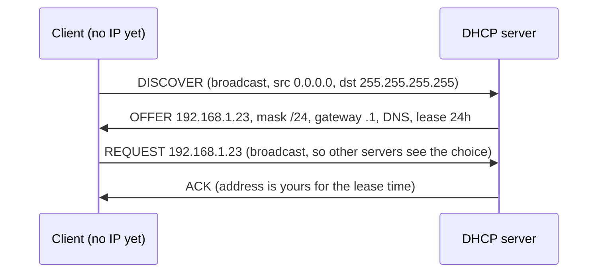

## Mental Model

You walk into a new office building:

- **DHCP** is the front desk: "I'm new, can someone assign me a desk?" — you shout, because you don't know anyone's name yet. The desk replies with a desk number (**IP address**), where the exit to the outside world is (**default gateway**), who answers questions about names (**DNS servers**), and how long you may keep the desk (**lease**).
- **ARP** is asking the room: "Whoever has desk 192.168.1.1, what's your name tag?" — you need the gateway's **MAC address** to hand it a frame, because on the local link frames are delivered by MAC, not IP.

Both work by **broadcasting** to the local network, and both trust whoever answers — which is exactly their security weakness.

## Definition

- **DHCP (Dynamic Host Configuration Protocol)**: assigns IP configuration (address, subnet mask, default gateway, DNS servers, lease time, and more) to hosts automatically. Runs over UDP (client port 68, server port 67).
- **ARP (Address Resolution Protocol)**: maps an IPv4 address to a MAC address on the local link, using broadcast requests and unicast replies, cached in the **ARP table**.
- **IPv6 equivalents**: **NDP** (Neighbor Discovery Protocol, over ICMPv6) replaces ARP; **SLAAC** and **DHCPv6** handle address configuration.

## Why It Exists

- A host plugged into a new network knows nothing — not even its own IP address. Manual configuration doesn't scale to laptops and phones that move between networks.
- IP routing decides *which next hop* (an IP address) to use, but a frame on Ethernet/Wi-Fi must be addressed to a *MAC*. Something must translate.

## How It Works

### DHCP: DORA



- **Discover**: client broadcasts looking for servers.
- **Offer**: server(s) propose an address and options.
- **Request**: client picks one offer (broadcast, so other servers withdraw theirs).
- **Acknowledge**: server confirms; the client configures its interface.

Leases expire: the client renews at ~50% of the lease (T1) directly with its server, and at ~87.5% (T2) with any server. Routers can act as **DHCP relays** (forwarding broadcasts to a central server on another subnet), since broadcasts don't cross routers.

### ARP: resolving the next hop

When the host sends a packet to `93.184.215.14`, its routing table says "not local → via gateway 192.168.1.1". To build the frame it needs the gateway's MAC:

1. Check the ARP cache. Hit → use it.
2. Miss → broadcast **ARP request**: "Who has 192.168.1.1? Tell 192.168.1.23" (to `ff:ff:ff:ff:ff:ff`).
3. The gateway replies **unicast**: "192.168.1.1 is at 00:1a:2b:3c:4d:5e".
4. Cache the mapping (entries age out after tens of seconds to minutes) and send the queued packet.

Note: the host ARPs for the **gateway**, never for the remote server — remote IPs aren't on the link.

```bash
$ ip neigh show
192.168.1.1 dev wlan0 lladdr 00:1a:2b:3c:4d:5e REACHABLE
192.168.1.40 dev wlan0 lladdr 9c:b6:d0:12:aa:01 STALE
```

### Gratuitous ARP

A host can announce its own IP→MAC mapping unsolicited ("192.168.1.10 is at X") — used to detect duplicate IPs at startup and to **fail over** a virtual IP: when a standby server takes over a floating IP (keepalived/VRRP), it sends gratuitous ARP so switches and neighbors update their tables immediately.

## Internal Mechanism

### Trust problems

Neither protocol authenticates responses by default:

- **ARP spoofing/poisoning**: an attacker on the LAN replies "192.168.1.1 is at *my* MAC", so victims send their traffic through the attacker (man-in-the-middle). Mitigations: Dynamic ARP Inspection on managed switches, static ARP for critical hosts, and — most importantly — end-to-end encryption (TLS), which makes interception useless.
- **Rogue DHCP servers**: an attacker answers DISCOVERs first, handing out itself as the gateway or DNS server. Mitigation: DHCP snooping on switches (only trusted ports may send offers).

:::depth{level=advanced}
### IPv6 does it differently

IPv6 hosts use **Neighbor Solicitation/Advertisement** (ICMPv6) to multicast groups instead of broadcasts (IPv6 has no broadcast), and can configure addresses themselves with **SLAAC**: routers send **Router Advertisements** with the network prefix; the host forms its address (with random/privacy interface IDs) and runs **duplicate address detection**. DHCPv6 is optional or supplies extra options like DNS servers. The same trust issues exist (rogue RAs), mitigated by RA Guard and SEND.
:::

## Example

What a laptop does in its first second on Wi-Fi:

1. Associates with the access point (802.11 link-layer).
2. DHCP DORA → gets `192.168.1.23/24`, gateway `192.168.1.1`, DNS `192.168.1.1`.
3. Gratuitous ARP / duplicate address probe for `.23`.
4. ARP for the gateway's MAC.
5. DNS query to resolve a name → TCP → TLS → HTTP.

On a busy conference Wi-Fi, a slow or exhausted DHCP server is the classic "connected but no internet" failure: the device falls back to a **169.254.x.x** link-local address.

## Complexity & Performance

- ARP adds one round trip only on cache misses; caches make it negligible in steady state.
- Broadcast-based protocols scale poorly in very large L2 domains (ARP storms after failover, thousands of hosts re-ARPing).

## Trade-offs

- Dynamic addressing (DHCP) → zero-config, mobility vs dependency on a server and leases; servers often get **static reservations**.
- Broadcast discovery → simple vs scalability and security limits.

## Failure Modes

- DHCP pool exhaustion → new clients get no address (169.254.x.x fallback).
- Duplicate IPs (static assignment inside the DHCP range) → intermittent connectivity for both hosts.
- Stale ARP entries after hardware swaps or failover without gratuitous ARP → traffic sent to a dead MAC until the entry expires.
- ARP spoofing on untrusted networks.

## In Production

- Cloud VPCs usually implement DHCP and ARP in the hypervisor/virtual switch (AWS answers ARP on behalf of instances), so spoofing between tenants isn't possible.
- High-availability virtual IPs (keepalived/VRRP) depend on gratuitous ARP; in clouds where that doesn't work, you use provider APIs to move IPs or load balancers instead.
- Kubernetes MetalLB in L2 mode announces service IPs via ARP/NDP.

## Deeper Connections

- The subnet mask from DHCP determines whether a destination is local (ARP for it) or remote (ARP for the gateway) — [IPv4 Addressing](lesson:cn-ipv4-addressing), [Routing](lesson:cn-routing).
- DNS servers handed out by DHCP are the first link in every name lookup ([DNS](lesson:cn-dns-fundamentals)).

## Common Misconceptions

- **"My laptop ARPs for google.com's IP."** It ARPs only for IPs on its own subnet — usually the default gateway.
- **"DHCP assigns permanent addresses."** Addresses are leased and renewed; reservations make them stable.
- **"TLS doesn't matter on a trusted LAN."** ARP/DHCP spoofing makes LANs untrustworthy; encryption is the real defense.

## Interview Questions

### [L1 · how] How does a computer get an IP address when it joins a network?

Via DHCP: it broadcasts a DISCOVER; a DHCP server replies with an OFFER (IP, subnet mask, gateway, DNS, lease time); the client broadcasts a REQUEST for that offer; the server sends an ACK. The client configures the address and renews the lease before it expires.

### [L1 · conceptual] What does ARP do?

It resolves an IPv4 address on the local link to a MAC address: the host broadcasts "who has IP X?", the owner replies with its MAC, and the host caches the mapping so it can build Ethernet frames addressed to that neighbor.

### [L2 · trace] Your laptop sends a packet to a server on the internet. Whose MAC address goes in the Ethernet destination field?

The default gateway's (router's) MAC. The laptop determines the destination isn't on its subnet, looks up the next hop in the routing table (the gateway's IP), resolves that IP via ARP, and sends the frame to the gateway, which routes it onward.

### [L3 · what-if] What is ARP spoofing and how do you defend against it?

An attacker sends forged ARP replies associating the gateway's (or another host's) IP with the attacker's MAC; victims then send traffic to the attacker, enabling interception or tampering. Defenses: Dynamic ARP Inspection and DHCP snooping on managed switches, static ARP entries for critical hosts, network segmentation, and encrypting traffic end to end (TLS, VPN) so interception yields nothing useful.

### [L3 · debugging] After a server failover to a standby that took over the virtual IP, clients can't reach the service for several minutes, then it recovers on its own. Why?

Clients and routers still have the old server's MAC cached for the virtual IP in their ARP tables. Until those entries expire, frames go to the dead machine. The new owner should send gratuitous ARP on takeover to update neighbors immediately (keepalived/VRRP do this); verify it isn't being blocked.

## Practice

### [mcq] In DHCP's DORA sequence, why is the REQUEST message broadcast rather than unicast?

- [ ] Because the client doesn't know the server's IP
- [x] So that all DHCP servers learn which offer was accepted and can release the others
- [ ] Because unicast is not allowed in UDP
- [ ] To notify the default gateway

Other servers that made offers withdraw them.

### [mcq] A host on 192.168.1.0/24 wants to send to 192.168.1.40. Whose MAC does it ARP for?

- [x] 192.168.1.40's
- [ ] The default gateway's
- [ ] The DNS server's
- [ ] It doesn't use ARP for local hosts

Same subnet → deliver directly on the link.

## Quick Revision

- DHCP DORA: Discover (broadcast) → Offer → Request (broadcast) → Ack. Provides IP, mask, gateway, DNS, lease. Relays cross routers.
- ARP: broadcast "who has IP?" → unicast reply → cache. Hosts ARP for local IPs or the gateway, never remote IPs.
- Gratuitous ARP: announce own mapping (duplicate detection, failover of virtual IPs).
- No authentication → ARP spoofing, rogue DHCP → switch protections + TLS.
- IPv6: NDP (ICMPv6, multicast) + SLAAC/DHCPv6.
