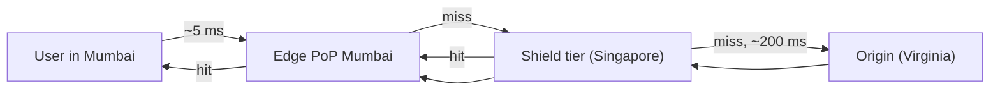

## Mental Model

Physics sets a floor on latency: a round trip from Mumbai to a server in Virginia takes ~200 ms no matter how fast the server is. A **CDN** puts **copies of your content (and a TLS endpoint) in hundreds of cities**. Users talk to the nearest **point of presence (PoP)**, which answers from its cache or fetches once from your **origin** and remembers.

The handshake and the bytes travel a few milliseconds instead of hundreds, and your origin serves a small fraction of the traffic.

## Definition

- **CDN (content delivery network)**: a globally distributed network of reverse-proxy caches (edge servers) in PoPs, fronting one or more origins.
- **Origin**: your authoritative server/storage.
- **Cache hit ratio**: fraction of requests (or bytes) served from edge caches.
- **Cache key**: what the edge uses to identify cached objects (default: scheme + host + path + query; configurable to include headers, cookies, device class).
- **Origin shield / tiered caching**: an intermediate cache layer so that edge misses go to a regional tier rather than all hitting the origin.
- **Purge / invalidation**: removing cached content before it expires.

## Why It Exists

- **Latency**: shorter RTTs for TCP/TLS handshakes and every request (see [Latency & Bandwidth](lesson:cn-latency-bandwidth)).
- **Offload**: absorb read traffic (often 90%+ of bytes for static-heavy sites).
- **Resilience and security**: absorb traffic spikes and DDoS attacks at a network far larger than yours; WAF rules at the edge.

## How It Works

### Getting the user to a nearby edge

- **Anycast**: the same IP is announced from every PoP via BGP; the internet's routing delivers users to a nearby PoP ([BGP & Anycast](lesson:cn-bgp-anycast)).
- **DNS steering**: your `www` CNAMEs to the CDN, whose GeoDNS returns a nearby PoP's IPs based on the resolver's location ([DNS Records](lesson:cn-dns-records)).

### Request flow



1. TLS terminates at the edge (fast handshake — short RTT).
2. The edge looks up the cache key: **hit** → respond immediately; **miss** → forward to the shield or origin (over a warm, reused connection), store if cacheable per headers, respond.
3. Many concurrent misses for the same object are **coalesced** into one origin fetch (request collapsing), avoiding stampedes.

### What controls caching

The origin's headers ([HTTP Caching](lesson:cn-http-caching)): `Cache-Control: public, s-maxage=…`, `stale-while-revalidate`, `Vary`, validators — plus CDN configuration overrides (cache rules, TTLs by path, ignoring query strings, cookie handling). Typical split:

- Fingerprinted static assets: cached for a year, never purged.
- HTML: short TTL or revalidated; purged on deploy.
- API GETs that are the same for everyone (product catalog, prices updated every minute): short `s-maxage` + `stale-while-revalidate`.
- Personalized/authenticated responses: **bypass** (or carefully keyed).

### Invalidation

- **Versioned URLs** (best): new content → new URL, nothing to purge.
- **Purge by URL/prefix**: propagates across PoPs in seconds.
- **Surrogate keys / cache tags**: tag responses (`Surrogate-Key: product-123 category-9`) and purge everything tagged at once when a product changes.

### Beyond static caching

TLS termination and HTTP/3, image/video optimization, WAF and bot mitigation, rate limiting, DDoS absorption, and **edge compute** (running small functions at PoPs: auth checks, redirects, A/B routing, personalization of cached pages).

## Internal Mechanism

:::depth{level=advanced}
### Hit ratio economics

A small drop in hit ratio can multiply origin load: at 99% hits, origin sees 1% of requests; at 95%, 5× more. Cache-key fragmentation (random query parameters like tracking IDs, `Vary: User-Agent`, cookies in the key) is the usual culprit — normalize keys (strip irrelevant params, sort query strings). Long-tail content (millions of rarely requested objects) naturally misses at individual edges; tiered caching concentrates those misses into shield caches with larger effective capacity.

### Consistency

A CDN is an eventually consistent cache: after an update, different PoPs may serve different versions until TTLs expire or purges propagate. Design for it: versioned assets, short TTLs where freshness matters, and never rely on the CDN for strongly consistent reads.
:::

## Example

Response headers revealing CDN behavior (names vary by provider):

```http
HTTP/2 200
cache-control: public, max-age=31536000, immutable
age: 48213                 ← seconds this copy has been in a cache
x-cache: HIT
cf-cache-status: HIT       ← (Cloudflare) / x-served-by, x-amz-cf-pop (other CDNs)
```

## Visualization

The HTTP caching lab models how an edge decides between a fresh hit, a revalidation and a miss:

::lab{id=http-cache}

## Complexity & Performance

- Edge hit: ~RTT to the nearest PoP (single-digit to tens of ms). Miss: + edge→origin RTT (warm connections help).
- Offload: origin capacity sized for misses, not total traffic — but must survive cache flushes and cold starts.

## Trade-offs

- Long TTLs: offload and speed vs staleness (solve with versioning/purges).
- Edge compute: latency and offload vs debugging complexity and vendor lock-in.
- Single CDN simplicity vs multi-CDN resilience (CDN outages happen and take large parts of the web down).

## Failure Modes

- Caching private/personalized content in shared caches → data leaks.
- Cache-key fragmentation → low hit ratio → origin overload.
- Global purge or cold cache (new CDN config) → origin stampede.
- CDN outage → your site down with it (mitigate with multi-CDN or origin failover).
- Stale content after deploys from forgotten non-versioned assets.

## In Production

- Monitor hit ratio (requests and bytes), origin request rate, edge error rates (5xx from origin vs edge), and TTFB by region.
- Protect origins: allow only CDN IP ranges or authenticated origin pulls, so attackers can't bypass the edge.

## Deeper Connections

- Anycast routing: [BGP & Anycast](lesson:cn-bgp-anycast). Edge TLS and HTTP/3: [TLS Handshake](lesson:cn-tls-handshake), [HTTP/3 & QUIC](lesson:cn-http3-quic). The general caching trade-offs: [Caching Everywhere](lesson:x-caching-everywhere).

## Common Misconceptions

- **"CDNs are only for static files."** They also accelerate dynamic traffic (TLS near users, warm origin connections, route optimization) and cache many API responses.
- **"Purging is instant everywhere."** It propagates quickly but not atomically; design for eventual consistency.

## Interview Questions

### [L1 · conceptual] What is a CDN and why use one?

A globally distributed network of edge servers that cache and serve content close to users. It reduces latency (shorter round trips for handshakes and data), offloads traffic from origin servers, absorbs spikes and DDoS attacks, and provides edge features like TLS termination, WAF and image optimization.

### [L2 · how] How does a user get routed to a nearby CDN edge?

Typically via DNS (the site CNAMEs to the CDN, whose authoritative DNS returns IPs of a nearby PoP based on the resolver's location) and/or anycast (the same IP announced from all PoPs, so BGP routing delivers packets to a nearby one).

### [L2 · how] How do you update content that's cached at a CDN?

Prefer versioned (fingerprinted) URLs so new content has new URLs and old caches don't matter. Otherwise, purge by URL/prefix or by surrogate keys/cache tags, or rely on short TTLs with revalidation for content that changes often.

### [L3 · debugging] After a marketing campaign launch, the origin is overloaded even though the CDN is in front. What would you check?

Cache hit ratio and why requests miss: campaign URLs with unique tracking query parameters fragmenting the cache key, responses marked uncacheable (Set-Cookie, `private`, no-store), `Vary` on high-cardinality headers, very short TTLs, a recent purge, or uncached API endpoints the landing page calls. Fix with cache-key normalization, correct cache headers, origin shielding and request coalescing.

## Practice

### [mcq] Which technique reduces the number of requests reaching the origin when many edge PoPs miss on the same object?

- [ ] Shorter TTLs
- [x] Tiered caching / origin shield (plus request coalescing)
- [ ] Vary: User-Agent
- [ ] Disabling HTTP/2

A shield layer consolidates misses before the origin.

### [mcq] What is the most robust way to deploy new versions of JS/CSS behind a CDN?

- [ ] Purge everything on each deploy
- [x] Content-hashed filenames with long-lived immutable caching
- [ ] Set max-age=0 on assets
- [ ] Disable the CDN during deploys

New content → new URL; nothing stale can be served.

## Quick Revision

- Edge PoPs near users; reached via anycast and/or GeoDNS.
- Hit → serve locally; miss → shield → origin; request coalescing prevents stampedes.
- Controlled by Cache-Control (s-maxage, stale-while-revalidate), Vary, CDN rules; cache key normalization drives hit ratio.
- Invalidate via versioned URLs (best), purges, surrogate keys.
- Also: TLS/HTTP3 at edge, WAF, DDoS absorption, edge compute. Eventually consistent; never cache private data.
