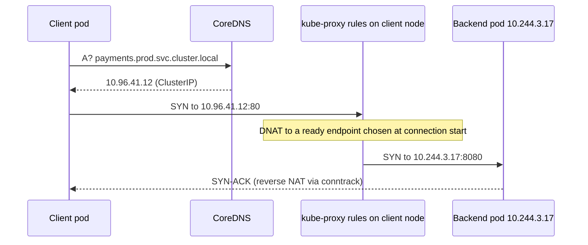

## Mental Model

A container's **network namespace** is a **private network stack in a box**: its own interfaces, routing table, iptables rules and `localhost`. To connect the box to the world, you run a **virtual cable** (a **veth pair**) from inside the box to the host, plug the host end into a **virtual switch** (a Linux bridge) or route it directly, and use **NAT** when leaving the host.

Kubernetes adds one rule that shapes everything: **every pod gets its own IP, and every pod can reach every other pod without NAT**, on any node. How the underlying network achieves that (routing, overlays, eBPF) is the CNI plugin's job. On top, **Services** give stable virtual IPs and DNS names to changing sets of pods.

## Definition

- **Network namespace**: a Linux kernel feature giving processes an isolated network stack ([VMs & Containers](lesson:os-virtualization-containers)).
- **veth pair**: two virtual interfaces connected back-to-back; packets entering one exit the other.
- **Linux bridge**: a software Layer-2 switch (e.g., `docker0`, `cni0`).
- **Overlay network**: encapsulating pod traffic inside host-to-host packets (VXLAN, Geneve, IP-in-IP) so pod IPs don't need to be routable on the physical network.
- **CNI (Container Network Interface)**: the plugin standard Kubernetes uses to wire pod networking (Calico, Cilium, Flannel, cloud VPC CNIs).
- **Service types**: ClusterIP (internal VIP), NodePort (port on every node), LoadBalancer (cloud LB), plus **Ingress/Gateway API** for L7 HTTP routing.

## Why It Exists

Containers need isolation (their own ports and IPs, no port conflicts) and connectivity (to each other, to the host, to the internet), at high density and with constantly changing membership. Kubernetes' flat pod network makes service-to-service communication simple for applications.

## How It Works

### Single host: Docker bridge networking

```text
 container A netns            container B netns
 eth0 172.17.0.2              eth0 172.17.0.3
     │ veth                        │ veth
     └──────────┬──────────────────┘
            docker0 bridge 172.17.0.1  (host)
                │ routing + iptables MASQUERADE
              eth0 (host, 192.168.1.50) → internet
```

- Container-to-container on the same bridge: L2 switching.
- Container → internet: routed via the bridge, **SNAT/masquerade** to the host IP ([NAT](lesson:cn-nat)).
- Internet → container: **port publishing** `-p 8080:80` = a **DNAT** rule from host:8080 to 172.17.0.2:80.

### Multi-node: pod-to-pod across nodes

Two main approaches:

| | Routed (no encapsulation) | Overlay (encapsulation) |
|---|---|---|
| How | Each node owns a pod CIDR; routes for other nodes' pod CIDRs installed (BGP with Calico, cloud route tables, or cloud VPC-native pod IPs) | Pod packet wrapped in VXLAN/Geneve (UDP) between node IPs |
| MTU | Full | Reduced (e.g., 1,450 with VXLAN) ([MTU](lesson:cn-mtu-congestion)) |
| Performance | Better (no encap/decap) | Encapsulation CPU cost (offloads help) |
| Requirements | Underlay must route pod CIDRs | Works over any IP network |

Cloud "VPC-native" CNIs (AWS VPC CNI, GKE VPC-native) give pods real VPC IPs — no overlay, but pods consume subnet addresses ([Subnetting](lesson:cn-subnetting)).

### Services: stable virtual IPs



- The ClusterIP isn't assigned to any interface — it only exists as NAT rules (iptables/IPVS) or eBPF maps on every node.
- Balancing happens **per connection** at SYN time.
- **NodePort** exposes the service on a port of every node; **LoadBalancer** provisions a cloud LB pointing at node ports (or directly at pod IPs).
- **Ingress / Gateway API** controllers (Nginx, Envoy-based) do L7 routing by host/path into Services.

### Cluster DNS

CoreDNS answers `service.namespace.svc.cluster.local`. Pods' `/etc/resolv.conf` includes search domains and `options ndots:5`: any name with fewer than 5 dots is first tried with each search suffix — so resolving `api.stripe.com` may generate several NXDOMAIN lookups first (`api.stripe.com.default.svc.cluster.local`, …), multiplying DNS load and latency. Fixes: fully qualified names with a trailing dot, lower `ndots`, NodeLocal DNSCache ([DNS](lesson:cn-dns-fundamentals)).

## Internal Mechanism

:::depth{level=senior}
### iptables vs IPVS vs eBPF

kube-proxy in **iptables** mode creates chains per service and endpoint; with tens of thousands of services, rule updates and per-packet chain traversal become slow (sequential probability-based matching). **IPVS** uses in-kernel hash tables — O(1) lookups and more algorithms. **eBPF** data planes (Cilium) replace kube-proxy entirely with hash-map lookups at the socket or TC layer, enabling socket-level load balancing (translate at `connect()` time, no per-packet NAT), better observability and network policy enforcement.

### Conntrack pressure

Every Service connection creates conntrack entries on the node; high connection churn (short-lived HTTP/1.0-style calls, DNS over UDP) can fill `nf_conntrack_max` → dropped packets. UDP DNS through DNAT has also suffered races (conntrack insertion conflicts) causing sporadic 5-second DNS timeouts — a famous Kubernetes issue mitigated by NodeLocal DNSCache and kernel fixes.

### NetworkPolicy

By default all pods can talk to all pods. **NetworkPolicy** objects (enforced by the CNI) restrict ingress/egress by labels, namespaces and ports — the Kubernetes firewall. Start with default-deny per namespace and explicit allows.
:::

## Example

Inspecting the plumbing on a node:

```bash
$ ip netns list                      # (docker/containerd namespaces may need nsenter)
$ nsenter -t <pid> -n ip addr        # the container's interfaces
3: eth0@if27: <...> mtu 1450 inet 10.244.2.9/24
$ ip link | grep -A1 "^27:"          # host side of the veth pair
27: vethc3a1@if3: <...> master cni0
$ iptables -t nat -L KUBE-SERVICES | grep payments
KUBE-SVC-XYZ  tcp -- 0.0.0.0/0  10.96.41.12  /* prod/payments cluster IP */ tcp dpt:80
$ conntrack -S                       # insert_failed / drop counters
```

## Complexity & Performance

- Same-node pod traffic: veth + bridge — microseconds.
- Cross-node: + routing or encapsulation; overlay costs CPU and MTU.
- Service translation cost: iptables O(rules) per new connection vs IPVS/eBPF O(1).

## Trade-offs

- Overlays: work anywhere, simpler underlay vs MTU and encap overhead.
- VPC-native IPs: performance and direct routability vs IP address consumption.
- kube-proxy iptables: simple, default vs scaling limits; eBPF: performance/features vs newer kernels and complexity.

## Failure Modes

- MTU mismatches in overlays (large responses hang).
- Conntrack table exhaustion and UDP DNS races.
- DNS latency from `ndots` search expansion; CoreDNS overload.
- Pod IP exhaustion in VPC-native setups.
- Uneven balancing for long-lived connections through ClusterIPs.
- Missing NetworkPolicies (flat, fully open cluster network).

## In Production

- Choose the CNI deliberately (performance, policy, observability, IP planning); size pod CIDRs and subnets for growth.
- Monitor CoreDNS latency/errors, conntrack usage, and per-node network drops.

## Deeper Connections

- Namespaces and cgroups: [VMs & Containers](lesson:os-virtualization-containers). NAT and conntrack: [NAT](lesson:cn-nat). L2 bridges: [Ethernet & Switching](lesson:cn-ethernet-switching). Mesh on top: [Service Networking](lesson:cn-service-networking).

## Common Misconceptions

- **"A ClusterIP is a real interface or load balancer."** It's NAT rules/eBPF maps on every node.
- **"Services load-balance each request."** kube-proxy balances connections.
- **"Containers get network isolation automatically from other containers."** They get separate stacks, but connectivity is open unless NetworkPolicies/firewalls restrict it.

## Interview Questions

### [L2 · how] How does a Docker container reach the internet, and how does port publishing work?

The container's network namespace has one end of a veth pair; the other end is attached to the docker0 bridge on the host. Outbound packets are routed through the bridge and SNAT'ed (masqueraded) to the host's IP. Publishing `-p 8080:80` adds a DNAT rule mapping host port 8080 to the container's IP and port 80.

### [L3 · how] How does traffic to a Kubernetes ClusterIP reach a pod?

The client resolves the Service name via CoreDNS to the ClusterIP. When the client opens a connection, kube-proxy's iptables/IPVS rules (or an eBPF program) on the client's node DNAT the destination to one ready endpoint pod IP, recording the mapping in conntrack for return traffic. The packet then travels over the pod network (routed or overlay) to the pod's node and into its namespace via a veth pair.

### [L3 · compare] Overlay vs routed pod networking?

Overlays encapsulate pod packets (e.g., VXLAN) between node IPs, so pod IPs needn't be routable on the physical network — easy to deploy anywhere, but with encapsulation overhead and reduced MTU. Routed approaches make pod CIDRs routable (BGP, cloud routes, VPC-native IPs) — better performance and full MTU, but they depend on underlay routing and IP capacity.

### [L4 · debugging] Pods intermittently see 5-second delays resolving external hostnames. What would you investigate?

Known causes: UDP DNS packets dropped due to conntrack insertion races or table pressure when parallel A/AAAA queries share a socket through DNAT (resolver retries after a 5 s timeout), ndots search expansion multiplying queries, CoreDNS overload or upstream resolver slowness. Check conntrack `insert_failed` counters, CoreDNS metrics, packet captures; mitigate with NodeLocal DNSCache, `single-request-reopen`/TCP for DNS, lower ndots/FQDNs, and scaling CoreDNS.

## Practice

### [mcq] What connects a container's network namespace to the host?

- [ ] A TUN device
- [x] A veth pair
- [ ] A VLAN tag
- [ ] An ARP entry

One end inside the namespace, the other on the host (often attached to a bridge).

### [mcq] With ndots:5 and search domains, why can resolving "api.example.com" from a pod be slow?

- [ ] CoreDNS doesn't support external names
- [x] The resolver first tries the name with each cluster search suffix, generating extra failing queries
- [ ] Pods can't use UDP
- [ ] External DNS requires a NodePort

Names with fewer than 5 dots are treated as relative first.

## Quick Revision

- Network namespace = private stack; veth pair = virtual cable; bridge = virtual switch; NAT out, DNAT for published ports.
- K8s model: every pod has an IP, pod-to-pod without NAT; CNI implements (routed/BGP, VPC-native, or overlay VXLAN with smaller MTU).
- Services: ClusterIP = NAT rules/eBPF (per-connection balancing), NodePort, LoadBalancer, Ingress/Gateway for L7.
- CoreDNS + ndots search expansion pitfalls; conntrack limits; NetworkPolicy for isolation.
- kube-proxy iptables → IPVS → eBPF (Cilium) for scale.
