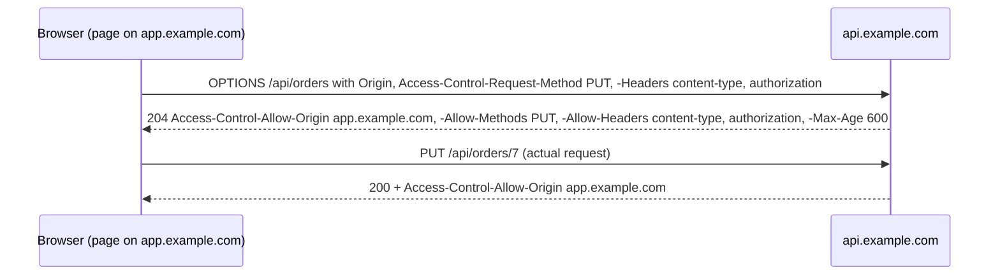

## Mental Model

Your browser is logged into many sites at once, and any web page you open can run code and make requests. Two rules keep that from being a disaster:

- **Same-origin policy (SOP)**: a page from `evil.com` can *send* requests to `bank.com`, but it **cannot read** the responses. **CORS** is the bank's way of saying "these specific other origins may read my responses".
- **CSRF** is the gap SOP leaves open: `evil.com` can't read your bank balance, but it can make your browser **send** a "transfer money" request to `bank.com` — with your bank cookies attached automatically. Defenses make the server able to tell a genuine request from a forged one.

## Definition

- **Origin** = scheme + host + port (`https://app.example.com:443`). `http://` vs `https://`, `api.example.com` vs `app.example.com`, and port differences are all **different origins**.
- **Same-origin policy**: scripts can read responses (and DOM, storage) only from their own origin.
- **CORS (Cross-Origin Resource Sharing)**: a protocol of HTTP headers by which a server allows specific cross-origin reads.
- **CSRF (Cross-Site Request Forgery)**: tricking a user's browser into making an authenticated, state-changing request to a site where the user is logged in.

## Why It Exists

**The problem.** A browser runs code from any site you visit, while also holding your logged-in cookies for every other site. Without rules, a random page could act *as you* everywhere.

**Without it.** Without SOP, any page could read your email, bank account and internal company tools using your cookies and network position. SOP is the web's core isolation boundary; CORS exists because legitimate apps (an SPA on `app.example.com` calling `api.example.com`) need controlled exceptions.

**The gap that remains.** SOP blocks *reading* other sites' responses, but for compatibility with the early web it still lets pages *send* requests (forms, images) — with cookies attached. CSRF exploits that gap, so it needs its own defenses.

:::callout[That's all it is]{type=insight}
Browsers let any page *send* requests to other sites but not *read* their responses — CORS is how a server opts specific origins into reading. CSRF abuses the "send" half, and SameSite cookies or CSRF tokens stop it.
:::

## How It Works

### CORS: simple requests

A cross-origin `GET`/`HEAD`/`POST` with only "simple" headers and content types (`application/x-www-form-urlencoded`, `multipart/form-data`, `text/plain`) is **sent directly**; the browser then checks the response:

```http
GET /api/products HTTP/1.1
Origin: https://app.example.com

HTTP/1.1 200 OK
Access-Control-Allow-Origin: https://app.example.com
Vary: Origin
```

If `Access-Control-Allow-Origin` doesn't match, the browser **hides the response from the script** — but note: **the request was still sent and processed by the server**.

### CORS: preflighted requests

Why a preflight: old servers were written assuming browsers could never send a cross-site `DELETE` or a JSON body with custom headers. To avoid surprising them, the browser first *asks permission* before sending anything "non-simple". Requests with other methods (`PUT`, `DELETE`, `PATCH`), custom headers (`Authorization`, `X-Request-ID`) or `Content-Type: application/json` trigger a **preflight** `OPTIONS` request first:



`Access-Control-Max-Age` lets the browser cache the preflight result, avoiding an extra round trip on every call.

### Credentials

Cookies are sent cross-origin only if the script opts in (`fetch(url, {credentials: "include"})`) and the server responds with `Access-Control-Allow-Credentials: true` **and** a specific origin — **`*` is not allowed with credentials**. Reflecting any `Origin` back with credentials allowed is a critical misconfiguration (any site can read authenticated data).

### CSRF

```html
<!-- on evil.example -->
<form action="https://bank.example/transfer" method="POST">
  <input name="to" value="attacker"><input name="amount" value="5000">
</form>
<script>document.forms[0].submit()</script>
```

A simple form POST needs no preflight; historically the browser attached `bank.example` cookies, so the bank saw an authenticated request. Defenses:

| Defense | How it works |
|---|---|
| **SameSite cookies** (`Lax`, the modern browser default; or `Strict`) | Cookies aren't sent on cross-site subrequests/POSTs, so the forged request is unauthenticated |
| **CSRF tokens** (synchronizer token) | Server puts a random token in forms/headers tied to the session; forged requests can't know it (SOP prevents reading it) |
| **Double-submit cookie** | Token in a cookie and in a header/body; server checks they match |
| **Custom request headers / JSON-only APIs** | Cross-site forms can't set custom headers; `fetch` with them triggers a preflight the server rejects |
| **Origin / Referer checks** | Reject state-changing requests from unexpected origins |
| **Idempotent GETs** | Never change state on GET (links and images can trigger GETs) |

Defense in depth: SameSite cookies + CSRF tokens (or custom headers) + Origin checks.

## Internal Mechanism

:::depth{level=advanced}
### "Site" vs "origin"

SameSite uses **site** (registrable domain + scheme: `https://example.com` covers `app.example.com` and `api.example.com`), while SOP/CORS use **origin**. So requests between your own subdomains are same-site (cookies with SameSite=Lax flow) but cross-origin (CORS applies). A vulnerable sibling subdomain (e.g., an old marketing site with XSS) is "same-site" and can mount CSRF-like attacks — subdomains aren't isolation boundaries for cookies.

### CORS is not a server-side access control

CORS only tells *browsers* whether to expose responses. curl, servers and attackers' scripts outside a browser ignore it. APIs must still authenticate and authorize every request.
:::

## Example

The classic SPA error:

```text
Access to fetch at 'https://api.example.com/orders' from origin 'https://app.example.com'
has been blocked by CORS policy: Response to preflight request doesn't pass access control
check: No 'Access-Control-Allow-Origin' header is present on the requested resource.
```

Fix on the API (allow-list the app origin for the needed methods/headers, answer OPTIONS without requiring auth), not in the frontend. Or avoid cross-origin entirely by serving the API under the same origin via a reverse proxy (`app.example.com/api/*`).

## Complexity & Performance

- Preflights add a round trip per uncached request — set `Access-Control-Max-Age`, or use same-origin routing.

## Trade-offs

- Permissive CORS: developer convenience vs data exposure. Strict allow-lists: safe vs configuration effort per environment.
- SameSite=Strict: strongest CSRF protection vs breaking legitimate cross-site navigations (users arriving logged-out from links).

## Failure Modes

- Reflecting arbitrary `Origin` with credentials → cross-site data theft.
- Auth middleware rejecting preflight OPTIONS (preflights carry no credentials) → all cross-origin calls fail.
- State-changing GET endpoints → CSRF via ``.
- Missing `Vary: Origin` → CDNs caching one origin's CORS headers for all.

## In Production

- Configure CORS at the API gateway with explicit origin allow-lists per environment.
- Frameworks (Django, Rails, Spring Security) provide CSRF tokens; enable them for cookie-authenticated endpoints.

## Deeper Connections

- Cookie attributes: [Cookies & Sessions](lesson:cn-cookies-sessions). Same-origin API routing via reverse proxies: [Proxies & Load Balancers](lesson:cn-proxies-load-balancers).

## Common Misconceptions

- **"CORS protects my API from other servers."** It only governs browsers reading responses.
- **"A CORS error means the request wasn't sent."** Simple requests are sent and processed; only the response is hidden.
- **"CSRF tokens are needed for APIs using Authorization headers."** Bearer tokens aren't sent automatically, so classic CSRF doesn't apply — cookie-based auth is the CSRF risk.

## Interview Questions

### [L1 · conceptual] What is the same-origin policy?

A browser security rule that lets scripts from one origin (scheme + host + port) read data — responses, DOM, storage — only from the same origin. Cross-origin requests can often be sent, but their responses aren't readable unless the server permits it via CORS.

### [L2 · how] What is a CORS preflight request and when does it happen?

An OPTIONS request the browser sends before a "non-simple" cross-origin request (methods like PUT/DELETE, custom headers such as Authorization, or JSON content type), asking whether the actual request is allowed. The server answers with Access-Control-Allow-Origin/Methods/Headers (and optionally Max-Age); only then does the browser send the real request.

### [L2 · conceptual] What is CSRF and how do you prevent it?

Cross-site request forgery tricks a logged-in user's browser into sending a state-changing request to a site, with the user's cookies attached automatically. Prevent it with SameSite cookies, anti-CSRF tokens (synchronizer or double-submit), requiring custom headers or JSON with preflight, checking Origin/Referer, and never changing state on GET.

### [L3 · what-if] An API responds with Access-Control-Allow-Origin set to whatever Origin the request had, plus Allow-Credentials: true. What's the risk?

Any website can make credentialed requests on behalf of a logged-in user and read the responses — exfiltrating personal data or tokens. Credentialed CORS must use an explicit allow-list of trusted origins.

## Practice

### [mcq] Which pair of URLs is same-origin?

- [ ] http://example.com and https://example.com
- [ ] https://app.example.com and https://api.example.com
- [x] https://example.com/a and https://example.com:443/b
- [ ] https://example.com:8443 and https://example.com

Same scheme, host and (default) port 443.

### [mcq] Which request triggers a CORS preflight?

- [ ] GET with only Accept headers
- [ ] POST with Content-Type application/x-www-form-urlencoded
- [x] PUT with Content-Type application/json and an Authorization header
- [ ] HEAD request

Non-simple method, content type and header.

## Quick Revision

- Origin = scheme + host + port. SOP: read only same-origin responses.
- CORS: server opts in via Access-Control-Allow-*; simple requests sent then filtered; preflight OPTIONS for non-simple; `*` not allowed with credentials; `Vary: Origin`.
- CORS isn't server-side security.
- CSRF abuses auto-sent cookies → SameSite, CSRF tokens, custom headers, Origin checks, no state-changing GETs.
- Site (SameSite) ≠ origin (CORS).
