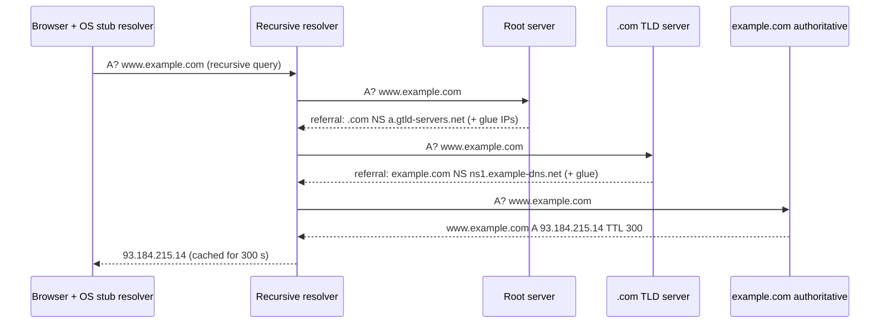

## Mental Model

DNS is a **hierarchy of phone books with a helpful librarian in front**.

- Your laptop asks one librarian — the **recursive resolver** (your ISP's, `8.8.8.8`, `1.1.1.1`, or the one in your VPC) — "what's the address of `www.example.com`?"
- If the librarian doesn't already know, they walk the hierarchy: ask a **root** server ("who handles `.com`?"), then a **`.com` TLD** server ("who handles `example.com`?"), then `example.com`'s **authoritative** server ("what is `www.example.com`?").
- Every answer comes with a **TTL** — how long it may be remembered. The librarian caches everything, so the next person asking gets an instant answer.

Most lookups never touch the root: caching at every layer is what makes DNS fast and able to scale to the whole internet.

## Definition

- **DNS (Domain Name System)**: a hierarchical, distributed database mapping domain names to records (addresses, mail servers, aliases, text).
- **Stub resolver**: the minimal resolver in your OS/libc; sends queries to a configured recursive resolver (`/etc/resolv.conf`).
- **Recursive resolver**: does the full lookup on the client's behalf and caches results.
- **Authoritative server**: holds the actual records for a zone (e.g., `example.com`) and answers definitively.
- **Root servers**: 13 named root server identities (`a`–`m.root-servers.net`) served by 1,000+ anycast instances; they know the TLD servers.
- **TLD servers**: authoritative for top-level domains (`.com`, `.org`, `.io`, country codes).
- **Zone**: a portion of the namespace managed as a unit, delegated from its parent via **NS** records.

## Why It Exists

Humans use names; IP routing uses addresses; and the addresses behind a name change (servers move, CDNs pick nearby edges, failovers happen). A single central directory (the original `HOSTS.TXT` file maintained at SRI) couldn't scale. DNS distributes authority (each organization runs its own zone) and relies on caching for performance.

## How It Works

### Resolving `www.example.com` from a cold cache



- **Recursive query** (client → resolver): "give me the final answer".
- **Iterative queries** (resolver → servers): each server answers with what it knows — often a **referral** to a more specific server.
- **Glue records**: IP addresses of name servers included in referrals when the name server's own name is inside the zone it serves (otherwise you'd need `example.com` to find `ns1.example.com`).

### Caching layers

A lookup may be answered by any of these, in order:

1. The **application** (JVM's InetAddress cache, browser DNS cache — `chrome://net-internals/#dns`).
2. The **OS** (systemd-resolved, nscd, macOS mDNSResponder; many Linux containers have no OS cache at all).
3. The **recursive resolver** (shared by all its users — the most important cache).
4. Authoritative servers (the source of truth).

Each cached record lives until its **TTL** expires. **Negative answers** (NXDOMAIN — "no such name") are cached too, for the duration set by the zone's SOA record — so a typo'd or not-yet-created record can stay "missing" for minutes after you create it.

### Over the wire

- Queries/answers are small, usually over **UDP port 53**; if a response is too large, the server sets the TC (truncated) flag and the client retries over **TCP**. EDNS(0) allows larger UDP responses (commonly limited to ~1,232 bytes to avoid fragmentation).
- Clients time out and retry (and switch between configured resolvers) — a lost DNS packet typically costs **1–5 seconds**, a common hidden latency spike.
- Encrypted variants: **DoT** (DNS over TLS, port 853) and **DoH** (DNS over HTTPS) hide queries from on-path observers.

::viz{id=dns-resolver}

## Internal Mechanism

### What happens when I type google.com? (the DNS part)

The browser checks its own cache → asks the OS stub resolver → which may check `/etc/hosts` and its cache → sends a query to the recursive resolver → which answers from cache (most likely, for a popular name) or walks root → `.com` → `google.com`'s authoritative servers. For large services the authoritative answer is **dynamic**: GeoDNS/latency-based routing may return an IP of a nearby data center or CDN edge, based on the resolver's location or the EDNS Client Subnet hint. Only then can TCP/QUIC and TLS start ([Opening a Website](lesson:x-website-journey)).

:::depth{level=advanced}
### DNSSEC

DNS answers were originally unauthenticated, so an attacker able to inject a forged response (**cache poisoning**, e.g., the 2008 Kaminsky attack exploiting predictable transaction IDs) could redirect a whole resolver's users. Mitigations: randomized source ports and query IDs, 0x20 case randomization, and **DNSSEC**, which signs records with a chain of keys from the root down (DS records in the parent, DNSKEY/RRSIG in the zone) so validating resolvers can verify authenticity. DNSSEC provides integrity, not confidentiality (that's DoT/DoH), and misconfigured signatures cause validation failures that look like outages.
:::

## Example

```bash
$ dig +trace www.example.com          # walk the hierarchy yourself
.                     518400 IN NS a.root-servers.net.
com.                  172800 IN NS a.gtld-servers.net.
example.com.          172800 IN NS a.iana-servers.net.
www.example.com.         300 IN A  93.184.215.14

$ dig www.example.com @1.1.1.1 +noall +answer +stats
www.example.com.  287 IN A 93.184.215.14      # TTL counting down: served from cache
;; Query time: 3 msec
```

A query time of a few ms means a cache hit at the resolver; a cold resolution through three levels takes tens to hundreds of ms.

## Complexity & Performance

- Cache hit at a nearby resolver: ~1–10 ms. Cold resolution: one round trip per level (often 3–4), minus cached delegations (`.com` NS is almost always cached).
- Popular names stay cached; long-tail names pay full resolution.
- DNS is on the critical path of every new connection — a slow resolver slows everything.

## Trade-offs

- **Long TTLs**: fewer queries, faster lookups, resilience if authoritative servers are down vs slow propagation of changes (failovers, migrations).
- **Short TTLs** (30–60 s): agile traffic steering vs more queries, more dependence on DNS availability, and some resolvers/clients ignoring very low TTLs.

## Failure Modes

- **Authoritative outage**: once cached records expire, names stop resolving (the 2016 Dyn DDoS took down many major sites). Mitigate with multiple DNS providers.
- **Resolver outage or overload**: every lookup fails or times out — "the internet is down".
- **Stale caches after changes**: users hit the old IP until TTLs expire (plus clients that cache longer than TTL, e.g., old JVM defaults caching forever).
- **Negative caching** delaying new records.
- **Kubernetes ndots/search domains**: a lookup for `api.example.com` may first try `api.example.com.default.svc.cluster.local` etc., multiplying queries and latency ([Service Networking](lesson:cn-service-networking)).

## In Production

- Plan migrations by lowering TTLs well ahead (at least one old-TTL period before the change).
- Monitor resolution latency and failure rates from clients; cache DNS inside applications carefully (respect TTLs).
- Case study: [DNS Outage](case:dns-outage).

## Deeper Connections

- Record types, CNAMEs, DNS-based load balancing: [DNS Records & Operations](lesson:cn-dns-records).
- Root and large resolvers are **anycast** ([BGP & Anycast](lesson:cn-bgp-anycast)); CDNs steer users via DNS ([CDN](lesson:cn-cdn)).
- Caching with TTL-based invalidation is the same trade-off as HTTP caching and application caches ([Caching Everywhere](lesson:x-caching-everywhere)).

## Common Misconceptions

- **"DNS is a single lookup to one server."** It's a chain across resolvers and authoritative servers, heavily cached.
- **"Changing a DNS record takes effect immediately."** Old answers persist until TTLs (and misbehaving caches) expire.
- **"There are 13 root servers."** There are 13 root server *identities*, served by over a thousand anycast instances worldwide.
- **"DNS always uses UDP."** It falls back to TCP for large responses and zone transfers; DoH/DoT use TCP/TLS or QUIC.

## Interview Questions

### [L1 · trace] What happens when you type www.example.com into a browser (DNS part)?

The browser checks its DNS cache, then asks the OS resolver (which checks /etc/hosts and its cache). If unresolved, the stub resolver sends a recursive query to the configured recursive resolver. The resolver returns a cached answer or iteratively queries a root server (referral to .com), a .com TLD server (referral to example.com's name servers) and example.com's authoritative server, which returns the A/AAAA record with a TTL. The resolver caches and returns it; the browser connects to that IP.

### [L1 · compare] Recursive vs iterative DNS queries?

In a recursive query the client asks the resolver for a complete answer, and the resolver does all the work. In an iterative query the server replies with the best information it has — often a referral to another name server — and the querier continues itself. Stub resolvers use recursive queries to recursive resolvers; recursive resolvers use iterative queries to root, TLD and authoritative servers.

### [L2 · conceptual] What is a DNS TTL and what trade-off does it control?

The time-to-live on a record tells caches how long they may reuse the answer. Long TTLs reduce query load and latency and ride out authoritative outages, but slow down changes (failover, migrations). Short TTLs allow agile changes but increase query volume and dependence on DNS availability.

### [L2 · why] Why does DNS use UDP, and when does it use TCP?

Most queries and answers fit in a single small packet, so UDP avoids a handshake and connection state on busy servers. TCP is used when responses are too large for UDP (truncated flag set), for zone transfers between servers, and by encrypted transports like DNS over TLS/HTTPS.

### [L3 · incident] You changed an A record to point to a new server, but some users still hit the old one hours later. Why, and how should the migration have been done?

Resolvers and clients cached the old answer until its TTL expired; some caches (applications like older JVMs, OS caches, or resolvers that clamp TTLs) hold longer. Negative caching can also delay new records. The right approach: lower the TTL (e.g., to 60 s) at least one full old-TTL period before the change, keep the old server serving (or proxying) during the transition, then raise the TTL afterward.

### [L4 · design] How would you make DNS resolution resilient for a critical service?

Use multiple authoritative DNS providers (secondary DNS) with independent infrastructure, sensible TTLs (long enough to survive short provider outages, short enough for failover), health-checked DNS failover or anycast front doors, monitoring of resolution from many vantage points, and for internal clients: local caching resolvers, multiple upstream resolvers, retry/timeout tuning, and applications that respect TTLs without failing hard on transient DNS errors (serve stale where acceptable).

## Practice

### [mcq] Which server gives the final answer for www.example.com's A record?

- [ ] The root server
- [ ] The .com TLD server
- [x] example.com's authoritative name server
- [ ] The client's stub resolver

Root and TLD servers only return referrals.

### [mcq] A record was cached with TTL 3600 at 10:00. The authoritative record changes at 10:10. Until when might a resolver keep returning the old value?

- [ ] 10:10
- [ ] 10:20
- [x] 11:00
- [ ] Forever

Caches keep the answer for its TTL from when it was cached.

## Quick Revision

- Stub resolver → recursive resolver (cache) → root → TLD → authoritative (iterative referrals).
- Caches at app, OS, resolver; TTL controls lifetime; negative answers cached (SOA).
- UDP 53, TCP fallback for large responses; DoT/DoH encrypt.
- 13 root identities, 1,000+ anycast instances; glue records avoid circular lookups.
- Lower TTLs before migrations; multiple providers for resilience; lost DNS packets cost seconds.
- DNSSEC = authenticity; DoH/DoT = privacy.
