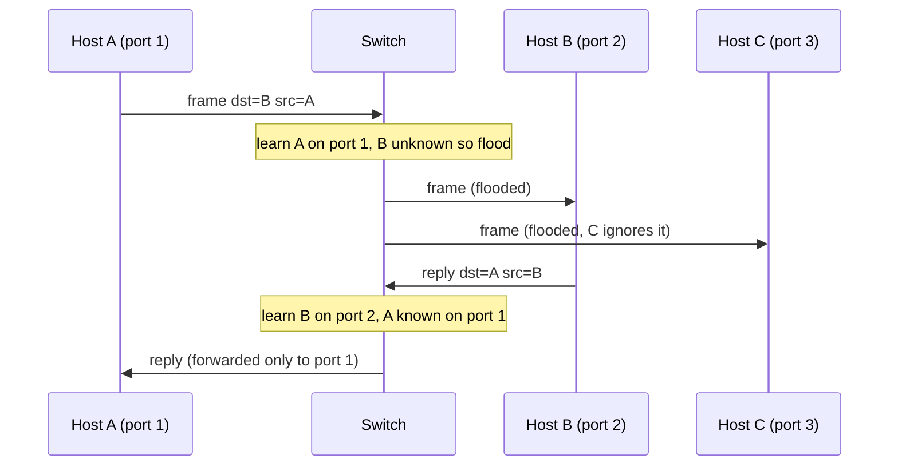

## Mental Model

A switch is a **mail room clerk who learns where everyone sits**. At first, when a letter arrives for someone the clerk doesn't know, they photocopy it and put it in every mailbox (**flooding**). But every letter also shows the sender, so the clerk writes down "Alice sits at desk 3". After a while, the clerk delivers each letter straight to the right desk.

Some letters are addressed "to everyone" (**broadcast**) — the clerk always copies those to every desk. The set of desks that receive each other's broadcasts is a **broadcast domain**. Too many desks in one domain and everyone drowns in "to everyone" mail — so large networks are divided, by routers or by **VLANs**.

## Definition

- **Ethernet**: the dominant family of wired LAN technologies (IEEE 802.3), defining frames, MAC addressing and physical signaling from 10 Mb/s to 400+ Gb/s.
- **MAC address**: 48-bit link-layer address, written as `3c:22:fb:9a:10:4e`. The first 3 bytes are the vendor's OUI; `ff:ff:ff:ff:ff:ff` is the broadcast address.
- **Switch**: a Layer-2 device forwarding frames between ports using a learned **MAC address table** (CAM table).
- **Broadcast domain**: the set of devices that receive each other's Layer-2 broadcasts (bounded by routers/VLANs).
- **Collision domain**: devices sharing a medium where simultaneous transmissions collide (historic hubs and half-duplex links).
- **VLAN (802.1Q)**: a logical Layer-2 network carved out of a physical switch infrastructure, identified by a 12-bit VLAN ID in a 4-byte tag.

## Why It Exists

**The problem.** Several machines in one room or rack need to send frames to each other over wires.

**The first answer.** Early Ethernet was a **shared cable**: every frame reached every host, and hosts transmitting at the same time collided. That works for 5 machines and collapses at 500: everyone hears everything and waits for everyone else.

**The idea.** Give every machine its own cable to a central box, and make the box smart enough to send each frame only to the one cable it's for. It doesn't need a configured map — it can *learn* where everyone is just by noticing which port each sender's frames come in on. Switches made each port its own dedicated link (full-duplex, no collisions) and learned to send frames only where needed, making LANs scale in speed and size. VLANs let organizations isolate groups (e.g., servers vs guests) without separate cabling.

:::callout[That's all it is]{type=insight}
A switch remembers "MAC address X was last seen on port 3" and sends frames for X out port 3. If it doesn't know yet, it sends to every port. That's the entire learning algorithm.
:::

## How It Works

### The Ethernet frame

```text
| Preamble | Dst MAC (6) | Src MAC (6) | [802.1Q tag (4)] | EtherType (2) | Payload (46–1500) | FCS (4) |
```

- Minimum frame 64 bytes (short payloads are padded), maximum 1,518 (1,522 with a VLAN tag), jumbo frames up to ~9,000 bytes of payload where supported.
- FCS (CRC-32) detects corruption; bad frames are dropped silently.

### How a switch learns and forwards

For each incoming frame:

1. **Learn**: record `source MAC → incoming port` (with an aging timer, typically 300 s).
2. **Forward**:
   - destination MAC known → send out only that port (**filtering**: if it's the same port it came from, drop it);
   - destination unknown → **flood** to all other ports in the VLAN;
   - broadcast (`ff:ff:…`) or most multicast → flood.



### Broadcast vs collision domains

| Device | Splits collision domains? | Splits broadcast domains? |
|---|---|---|
| Hub (repeater) | No — one big collision domain | No |
| Switch | Yes — each port is its own (and full-duplex removes collisions entirely) | No (unless VLANs) |
| Router | Yes | **Yes** |

**CSMA/CD** (carrier sense multiple access with collision detection) was half-duplex Ethernet's rule: listen before sending, detect collisions, back off randomly (exponential backoff). Modern full-duplex switched Ethernet doesn't need it — but the idea of randomized exponential backoff lives on in Wi-Fi (CSMA/CA) and in retry logic everywhere.

### VLANs

The problem: you want guests and servers on separate networks (so broadcasts and attacks don't cross), but you don't want to buy separate switches and cables for each. So mark each frame with which "virtual" network it belongs to, and let one switch behave like several. A VLAN tag (4 bytes: TPID 0x8100 + 12-bit VLAN ID) marks which virtual LAN a frame belongs to:

- **Access ports** belong to one VLAN; hosts send untagged frames.
- **Trunk ports** carry many VLANs between switches, with tags.
- Traffic between VLANs must go through a **router** (or Layer-3 switch) — so VLANs are separate broadcast domains and separate IP subnets.

## Internal Mechanism

:::depth{level=advanced}
### Loops and the Spanning Tree Protocol

Redundant links between switches create loops. Ethernet frames have no TTL, so a broadcast in a loop circulates forever and multiplies (**broadcast storm**) until the network collapses. **Spanning Tree Protocol** (STP/RSTP) elects a root bridge and blocks redundant ports to form a loop-free tree, unblocking them if a link fails. Data centers increasingly avoid STP entirely by routing at Layer 3 down to the top-of-rack switch (leaf-spine with ECMP), keeping Layer-2 domains tiny.

### MAC table overflow

A switch's CAM table is finite. An attacker flooding frames with random source MACs can fill it, after which the switch floods unknown-destination traffic to all ports — enabling sniffing. Port security limits MACs per port.
:::

## Example

```bash
$ ip link show eth0
2: eth0: <BROADCAST,MULTICAST,UP,LOWER_UP> mtu 1500 ... link/ether 3c:22:fb:9a:10:4e brd ff:ff:ff:ff:ff:ff
$ bridge fdb show br docker0        # the learned MAC table of a Linux bridge (a software switch)
02:42:ac:11:00:02 dev veth3a1f master docker0
```

A Linux bridge (used by Docker and many VM setups) is a software switch that learns MACs exactly like a hardware one ([Container Networking](lesson:cn-container-networking)).

## Complexity & Performance

- Hardware switches forward at line rate using CAM/TCAM lookups — nanoseconds per frame; cut-through switches start forwarding before the whole frame arrives.
- Broadcast traffic scales with the number of hosts in the domain; large flat L2 networks waste bandwidth and CPU on ARP broadcasts.

## Trade-offs

- Big flat L2 networks: simple addressing, easy VM mobility vs broadcast storms, STP complexity and blast radius.
- Many small L3-routed segments: containment and scalability vs more routing configuration.

## Failure Modes

- Broadcast storms from loops (misconnected cables without STP).
- MAC flapping (the same MAC seen on two ports) from loops or duplicated VMs.
- VLAN misconfiguration isolating hosts or leaking traffic between segments.

## In Production

- Cloud VPCs expose no real Layer 2: your VM's "switch" is a virtual construct and broadcasts/ARP are often answered by the hypervisor.
- In Kubernetes, pods on one node may connect via a Linux bridge (L2), while cross-node traffic is routed or tunneled.

## Deeper Connections

- ARP relies on broadcast to discover MACs ([ARP & DHCP](lesson:cn-arp-dhcp)).
- Exponential backoff with jitter from CSMA/CD reappears in client retries and in TCP retransmission timers.

## Common Misconceptions

- **"Switches use IP addresses."** Layer-2 switches forward by MAC address (Layer-3 switches also route).
- **"MAC addresses are globally meaningful for routing."** They're only used on the local link.
- **"Collisions are a modern problem."** Full-duplex switched Ethernet has no collisions; Wi-Fi still manages shared-medium contention.

## Interview Questions

### [L1 · how] How does a switch learn MAC addresses?

It inspects the source MAC of every incoming frame and records which port it arrived on in its MAC table (with an aging timer). For forwarding, it looks up the destination MAC: if known, it sends the frame only to that port; if unknown or broadcast, it floods the frame to all other ports in the VLAN.

### [L1 · compare] Broadcast domain vs collision domain?

A collision domain is a segment where simultaneous transmissions can collide (a hub or shared cable); each switch port is its own collision domain. A broadcast domain is the set of hosts receiving each other's Layer-2 broadcasts; switches don't split it (unless using VLANs), routers do.

### [L2 · conceptual] What is a VLAN and why use one?

A VLAN logically partitions a switched network into separate broadcast domains using 802.1Q tags, so hosts on the same physical switches can be isolated (e.g., servers, office, guests). Communication between VLANs requires routing, which enables filtering and limits broadcast traffic and the blast radius of problems.

### [L3 · what-if] What happens if two switches are connected by two cables without Spanning Tree?

A Layer-2 loop: broadcast and unknown-unicast frames are flooded around the loop endlessly (Ethernet has no TTL), multiplying each time — a broadcast storm that saturates links and switch CPUs, and MAC tables flap as the same source appears on different ports. The network becomes unusable until the loop is broken.

## Practice

### [mcq] A switch receives a frame whose destination MAC is not in its table. What does it do?

- [ ] Drops it
- [ ] Sends it to the default gateway
- [x] Floods it out all ports in the VLAN except the incoming one
- [ ] Sends an ARP request

Unknown unicast is flooded; the reply teaches the switch where the host is.

### [mcq] Which device separates broadcast domains?

- [ ] Hub
- [ ] Unmanaged switch
- [x] Router
- [ ] Repeater

Broadcasts don't cross routers.

## Quick Revision

- Ethernet frame: dst MAC, src MAC, (VLAN tag), EtherType, payload 46–1,500, FCS.
- Switch: **learn** source MAC→port; **forward** known, **flood** unknown/broadcast.
- Collision domain (hubs, half-duplex) vs **broadcast domain** (bounded by routers/VLANs).
- VLAN (802.1Q, 12-bit ID): separate broadcast domain; inter-VLAN traffic needs routing.
- Loops → broadcast storms → STP (or avoid L2 sprawl).
