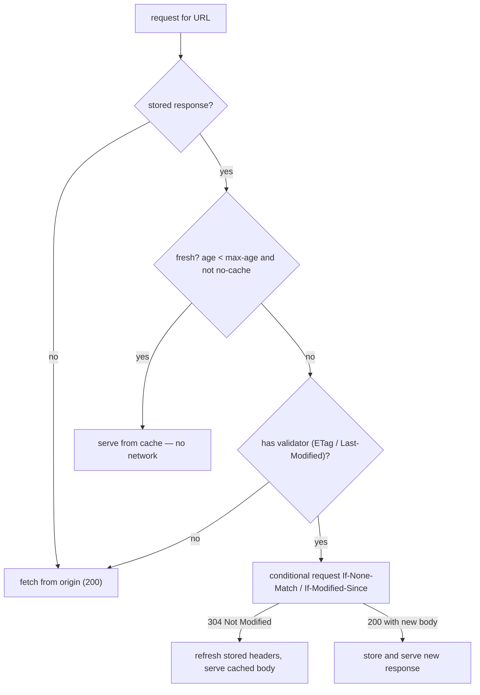

## Mental Model

A cache holds a copy of a response and must answer two questions each time the resource is requested:

1. **Is my copy still fresh?** If yes, serve it instantly — no network at all.
2. **If it's stale, is it still correct?** Ask the origin cheaply: "I have version `"abc"` — has it changed?" If not, the origin replies **304 Not Modified** (no body) and the cache refreshes its copy's lifetime. If it changed, the origin sends the new version.

The origin controls both answers with headers: **`Cache-Control`** sets freshness, **validators** (`ETag`, `Last-Modified`) enable cheap revalidation.

## Definition

- **Freshness lifetime**: how long a stored response may be used without contacting the origin (`max-age`, `s-maxage`, or heuristics).
- **Validator**: `ETag` (an opaque version identifier) or `Last-Modified` (a timestamp).
- **Conditional request**: a request carrying `If-None-Match: <etag>` or `If-Modified-Since: <date>`; the server replies 304 if unchanged.
- **Private cache**: a single user's browser cache. **Shared cache**: proxies and CDNs serving many users.

## Why It Exists

The fastest request is the one never sent. Caching cuts latency (no round trip), bandwidth, and origin load — often by orders of magnitude for static assets. Revalidation keeps correctness when content may change.

## How It Works

### Cache-Control directives (response)

| Directive | Meaning |
|---|---|
| `max-age=N` | Fresh for N seconds |
| `s-maxage=N` | Freshness for **shared** caches (overrides max-age there) |
| `public` | Any cache may store it (even if the request had Authorization) |
| `private` | Only the user's browser may store it (contains user-specific data) |
| **`no-cache`** | May be stored, but **must be revalidated** before every use |
| **`no-store`** | Must not be stored anywhere (sensitive data) |
| `must-revalidate` | Once stale, never serve without successful revalidation |
| `immutable` | Won't change during its lifetime — don't even revalidate on reload |
| `stale-while-revalidate=N` | May serve stale for N s while refreshing in the background |
| `stale-if-error=N` | May serve stale for N s if the origin errors |

The most common confusion: **`no-cache` does not mean "don't cache"** — it means "always check first". `no-store` means don't cache.

### The decision flow



### Worked example

```http
GET /app.css
→ 200 OK
  Cache-Control: max-age=60
  ETag: "v17"
```

- t = 30 s: request → **fresh hit** (served locally).
- t = 90 s: stale → `GET /app.css` with `If-None-Match: "v17"` → unchanged → **304** (a few hundred bytes instead of the whole file) → fresh again until t = 150 s.
- Origin deploys `"v18"` at t = 100 s: the request at t = 160 s revalidates → **200** with the new body and `ETag: "v18"`. Between t = 100 and 150 s users still saw v17 — **freshness means accepting staleness**.

::lab{id=http-cache}

### Vary

A cache key is normally the URL. If the response depends on request headers (e.g., `Accept-Encoding`, `Accept-Language`), the server must send `Vary: Accept-Encoding` so caches store separate variants. `Vary: Cookie` or `Vary: User-Agent` effectively disables shared caching (too many variants).

### Cache busting: the standard pattern for static assets

- **Fingerprinted asset URLs** (`/static/app.3f9a1c.js`) with `Cache-Control: public, max-age=31536000, immutable` — cache "forever"; a new deploy produces a new URL.
- **HTML** (which references those URLs) with `Cache-Control: no-cache` (revalidate every time, cheap 304s) or a short max-age.

This gives both instant repeat loads and instant deploys.

## Internal Mechanism

:::depth{level=advanced}
### Strong vs weak ETags

A strong ETag (`"v17"`) promises byte-for-byte identity; a weak ETag (`W/"v17"`) only semantic equivalence (e.g., the same content compressed differently). Range requests require strong validators. ETags generated from inode/mtime per server differ across a server fleet, causing needless 200s — generate them from content hashes or versions.

### Conditional requests beyond caching

Validators also prevent **lost updates** in APIs: a client sends `PUT /doc/42` with `If-Match: "v17"`; if another client updated the document first (now `"v18"`), the server responds **412 Precondition Failed** instead of overwriting. That's HTTP's optimistic concurrency control — the same compare-and-swap idea as CAS instructions and database version columns ([Atomic Instructions](lesson:os-atomic-instructions)).
:::

## Example

A typical production header set:

```http
# /index.html
Cache-Control: no-cache
ETag: "b91f3"

# /assets/main.8d2e4f.js
Cache-Control: public, max-age=31536000, immutable

# /api/me (user-specific)
Cache-Control: private, no-store

# /api/products?page=1 (shared, frequently read)
Cache-Control: public, s-maxage=30, stale-while-revalidate=60
```

## Complexity & Performance

- Fresh hit: zero network. 304 revalidation: one round trip, tiny body. Miss: full fetch.
- CDN hit ratios of 90%+ for static content are common; API responses are cacheable far more often than teams assume (per-user data aside).

## Trade-offs

- Long freshness: speed and origin offload vs staleness after changes (solve with fingerprinted URLs or purges).
- Revalidate always (`no-cache`): correctness vs a round trip per use.
- Shared caching of API responses: huge scaling wins vs risk of leaking user-specific data if headers are wrong.

## Failure Modes

- **Caching private data in a shared cache** (missing `private`/`no-store` on authenticated responses) — one user sees another's data. A serious, recurring incident class.
- **Deploys that don't show up**: non-fingerprinted assets with long max-age.
- **Missing Vary** → wrong encoding/language served.
- **Cache stampede** when a popular item expires and thousands of requests hit the origin at once — mitigate with `stale-while-revalidate`, request coalescing at the CDN, jittered TTLs ([Redis & Caching](lesson:db-redis-caching)).

## In Production

- CDNs honor `s-maxage` and offer purge APIs and surrogate keys for targeted invalidation ([CDN](lesson:cn-cdn)).
- Browser DevTools shows "(disk cache)", "(memory cache)" and 304s — the quickest way to audit caching.

## Deeper Connections

- Caching is a universal pattern with universal problems: freshness vs consistency, invalidation, stampedes ([Caching Everywhere](lesson:x-caching-everywhere)).
- DNS TTLs are the same freshness model at another layer ([DNS](lesson:cn-dns-fundamentals)).

## Common Misconceptions

- **"no-cache means don't cache."** It means revalidate before each use; `no-store` means don't store.
- **"A 304 means the request was free."** It still costs a round trip — only the body is saved.
- **"HTTPS responses can't be cached."** They can be cached by browsers and by CDNs that terminate TLS.

## Interview Questions

### [L1 · compare] What's the difference between Cache-Control: no-cache and no-store?

`no-cache` allows storing the response but requires revalidation with the origin (e.g., via ETag) before every reuse. `no-store` forbids storing the response in any cache at all — for sensitive data.

### [L2 · how] How do ETags and conditional requests work?

The server sends an ETag identifying the version of a resource. When the cached copy is stale, the client/cache sends `If-None-Match` with that ETag. If the resource hasn't changed, the server replies 304 Not Modified with no body and the cache reuses its copy (with refreshed freshness); otherwise it returns 200 with the new content and ETag.

### [L2 · design] How should you configure caching for a single-page app's HTML and its JS/CSS bundles?

Build bundles with content-hashed filenames and serve them with `Cache-Control: public, max-age=31536000, immutable`. Serve index.html with `no-cache` (revalidate each time, cheap 304) or a very short max-age, so new deploys reference new bundle URLs immediately.

### [L3 · incident] After enabling CDN caching on an API, users occasionally see other users' account details. What went wrong and how do you fix it?

Personalized responses were cached in a shared cache — likely the API returned cacheable headers (or none, with the CDN configured to cache by default) and the cache key ignored the user's identity. Immediately: purge the CDN and stop caching those routes. Fix: mark user-specific responses `Cache-Control: private, no-store`, configure the CDN to bypass caching when Authorization/cookies are present, cache only explicitly public endpoints, and add tests asserting cache headers per route.

### [L3 · how] How can HTTP validators prevent lost updates in a REST API?

Clients read a resource with its ETag and send updates with `If-Match: <etag>`. If the resource changed in between (different ETag), the server rejects the update with 412 Precondition Failed; the client re-reads, merges, and retries — optimistic concurrency control.

## Practice

### [mcq] A response has Cache-Control: max-age=120 and ETag "a1". A browser requests it again 200 seconds later. What does it do?

- [ ] Serves it from cache without contacting the server
- [x] Sends a conditional request with If-None-Match: "a1"
- [ ] Deletes it and fetches unconditionally
- [ ] Serves it and revalidates in the background only if stale-while-revalidate is present

The copy is stale (age 200 > 120) and has a validator, so it revalidates. (With stale-while-revalidate it could serve stale while refreshing.)

### [mcq] Which directive tells a CDN (shared cache) a different freshness lifetime than the browser?

- [ ] max-age
- [x] s-maxage
- [ ] private
- [ ] must-revalidate

s-maxage applies only to shared caches.

## Quick Revision

- Fresh → serve locally; stale + validator → conditional request → 304 (reuse) or 200 (replace).
- `max-age`, `s-maxage` (shared), `public`/`private`, **`no-cache` = revalidate**, **`no-store` = don't store**, `immutable`, `stale-while-revalidate`.
- Validators: ETag (`If-None-Match`), Last-Modified (`If-Modified-Since`); `If-Match` + 412 for optimistic concurrency.
- `Vary` for header-dependent responses.
- Fingerprinted assets cached forever; HTML `no-cache`. Never cache private data in shared caches.
