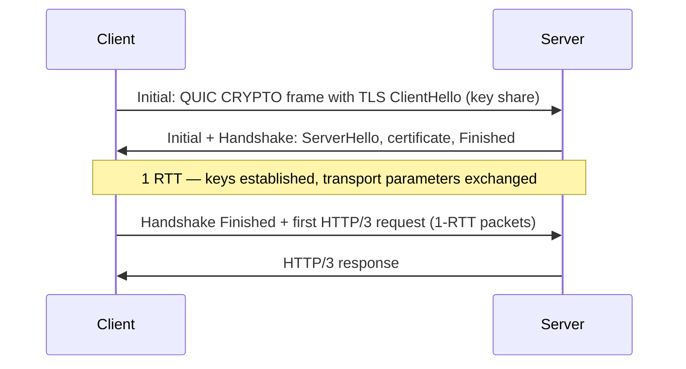

## Mental Model

TCP was hard to change: it lives in operating system kernels, and middleboxes across the internet inspect and mangle its headers. So QUIC's designers **moved the transport into user space, on top of UDP, and encrypted almost everything** so middleboxes can't ossify it again.

Inside, QUIC re-implements what TCP does (reliability, congestion control, flow control), fuses in TLS 1.3, and fixes TCP's biggest limitations:

- **Independent streams**: a lost packet only stalls the stream(s) whose data it carried.
- **Fewer round trips**: transport + crypto handshake in one RTT (0-RTT on resumption).
- **Connection IDs**: a connection survives your phone switching from Wi-Fi to cellular (the 4-tuple changes; the connection doesn't).

HTTP/3 is simply HTTP's semantics mapped onto QUIC streams.

## Definition

- **QUIC (RFC 9000)**: a general-purpose, secure, multiplexed transport protocol over UDP, with TLS 1.3 integrated (RFC 9001) and loss detection/congestion control (RFC 9002).
- **HTTP/3 (RFC 9114)**: HTTP over QUIC; header compression via **QPACK** (RFC 9204), a variant of HPACK designed for out-of-order delivery.

## Why It Exists

**The problems that remained after HTTP/2:**

- HTTP/2 removed HTTP-level head-of-line blocking but not **TCP's** ([HTTP/2](lesson:cn-http2)).
- TCP + TLS needs 2–3 RTTs before the first request; on mobile networks with 100+ ms RTTs, that's visible.
- Mobile clients change networks constantly, breaking TCP connections (identified by IP/port).
- Evolving TCP took a decade per feature because of kernels and middleboxes.

**Why not just fix TCP?** Because TCP lives in every OS kernel and every middlebox expects its exact header layout. A new TCP feature needs the whole internet's kernels and boxes to cooperate.

**The idea.** Build a new transport *on top of UDP* (which every network already passes), run it in the application rather than the kernel (so it can ship as fast as a browser update), and encrypt its headers (so middleboxes can't freeze it in place again). Then fix TCP's limitations inside it.

:::callout[That's all it is]{type=insight}
QUIC is TCP's job (reliability, congestion control) plus TLS, rebuilt on UDP in user space — with separate streams so one lost packet doesn't block the others. HTTP/3 is HTTP running over it.
:::

## How It Works

### Handshake: one round trip (zero with resumption)



Compared with TCP + TLS 1.3 (1 RTT for TCP + 1 RTT for TLS = 2 RTTs before the request), QUIC saves a full round trip. With **0-RTT** resumption, a returning client sends its request in the very first flight — but see the replay caveat below.

### Streams without head-of-line blocking

QUIC packets carry frames from multiple streams, each with its own offsets. When a packet is lost, only the streams with data in that packet wait for retransmission; other streams' data is delivered to the application immediately.

::viz{id=hol-blocking}

QUIC also improves loss recovery: packet numbers are **never reused** (retransmitted data goes in new packets with new numbers), removing TCP's retransmission ambiguity, and ACK frames report many ranges (like SACK but richer).

### Connection migration

The root cause of dropped mobile connections: TCP names a connection by addresses, and addresses change when you walk out of Wi-Fi range. TCP connections are identified by the 4-tuple; change your IP and the connection dies. QUIC connections are identified by **connection IDs** chosen by the endpoints. When a client's address changes (Wi-Fi → LTE, or a NAT rebinding), it keeps sending with the same connection ID; after **path validation** the server continues the connection. Downloads and calls survive network switches.

### Encryption everywhere

All payload and most header fields (including packet numbers) are encrypted or protected; only a few invariant fields (version, connection IDs) are visible. Middleboxes can't inspect or modify transport behavior — preventing ossification, but also making traditional network monitoring and load balancing harder (load balancers route by connection ID with coordinated ID schemes).

## Internal Mechanism

### Congestion control in user space

QUIC implementations (in browsers, CDNs, libraries like quiche, msquic, ngtcp2) ship their own congestion control (CUBIC, BBR) and can update it with the application, not the OS kernel ([Congestion Control](lesson:cn-tcp-congestion-control)).

:::depth{level=advanced}
### 0-RTT and replay

0-RTT data is encrypted with keys from a previous session, and the server can't guarantee it isn't a **replay** — an attacker can capture and resend the first flight. So 0-RTT must only carry **idempotent, safe** requests (GET without side effects); servers may reject 0-RTT or apply anti-replay mechanisms. It's the same trade-off as TLS 1.3 0-RTT ([TLS Handshake](lesson:cn-tls-handshake)).

### Anti-amplification

Since UDP source addresses can be spoofed, a QUIC server may send at most **3× the bytes it has received** from an unvalidated client address. Clients pad their Initial packets to at least 1,200 bytes; servers can use Retry tokens to validate addresses under attack.

### Cost

QUIC in user space costs more CPU per byte than kernel TCP with hardware offloads (encryption per packet, no TSO equivalents historically); UDP GSO/GRO and batching (`sendmmsg`) have narrowed the gap.
:::

## Example

Browsers learn a server supports HTTP/3 from an `Alt-Svc` header (or an HTTPS DNS record) on an HTTP/2 response, then race a QUIC connection on subsequent requests:

```http
HTTP/2 200
alt-svc: h3=":443"; ma=86400
```

```bash
$ curl --http3 -sI https://cloudflare.com | head -1     # curl built with HTTP/3 support
HTTP/3 200
```

If UDP is blocked (some corporate networks), browsers fall back to HTTP/2 over TCP transparently.

## Complexity & Performance

- Saves 1 RTT on new connections (more with 0-RTT); big wins on high-latency, lossy mobile networks and for the tail.
- More CPU per byte than kernel TCP; UDP may be rate-limited by some networks.

## Trade-offs

| | TCP + TLS + HTTP/2 | QUIC + HTTP/3 |
|---|---|---|
| Handshake | 2 RTT (TLS 1.3) | 1 RTT, 0-RTT resumption |
| HOL blocking | TCP-level across all streams | Per stream only |
| Network change | Connection breaks | Connection migration |
| Implementation | Kernel, offloads | User space, faster evolution, more CPU |
| Middlebox visibility | High | Minimal (encrypted) |
| UDP blocking risk | None | Needs TCP fallback |

## Failure Modes

- UDP blocked or throttled → fallback delay (clients race/cache results to minimize).
- Load balancers that don't understand QUIC connection IDs breaking migration or routing.
- 0-RTT replay of non-idempotent requests if misconfigured.
- Higher server CPU usage at scale.

## In Production

- Major CDNs and browsers support HTTP/3 widely; it carries a large share of web traffic from big providers.
- Internal service-to-service traffic still mostly uses TCP (HTTP/2, gRPC) — data-center networks have low loss and kernel TCP is efficient.

## Deeper Connections

- Built on UDP ([UDP](lesson:cn-udp)); fixes TCP HOL blocking ([TCP Reliability](lesson:cn-tcp-reliability)); integrates TLS 1.3 ([TLS Handshake](lesson:cn-tls-handshake)); often served from anycast edges ([BGP & Anycast](lesson:cn-bgp-anycast)).

## Common Misconceptions

- **"HTTP/3 uses UDP, so it's unreliable."** QUIC implements reliable, ordered streams on top of UDP.
- **"QUIC is just TCP over UDP."** It changes stream independence, handshakes, connection identity and encryption scope.
- **"0-RTT is always safe to enable."** It's replayable; only for idempotent requests.

## Interview Questions

### [L2 · compare] What problems does HTTP/3 (QUIC) solve compared to HTTP/2?

TCP-level head-of-line blocking (QUIC streams are delivered independently), handshake latency (combined transport + TLS 1.3 handshake in 1 RTT, 0-RTT on resumption), connection breakage on network changes (connection IDs enable migration), and protocol ossification (user-space implementation with encrypted headers allows rapid evolution).

### [L2 · why] Why is QUIC built on UDP instead of being a new IP protocol?

New transport protocols (a new IP protocol number) are blocked by most NATs and firewalls, which only understand TCP and UDP. UDP passes through middleboxes and lets QUIC be implemented in user space, deployable without OS or network upgrades.

### [L3 · how] How does QUIC connection migration work?

Connections are identified by connection IDs rather than the IP/port 4-tuple. When the client's address changes, it continues sending packets with a valid connection ID from the new address; the server performs path validation (a challenge/response to prevent spoofing) and continues the same connection, including its streams and congestion state (reset or adjusted for the new path).

### [L3 · what-if] What's the risk of 0-RTT data, and how should services handle it?

0-RTT data can be replayed by an attacker who captured it, since the server can't distinguish a replay without state. Services should accept 0-RTT only for safe, idempotent requests (e.g., GETs without side effects), reject or defer non-idempotent ones (e.g., respond 425 Too Early), and use anti-replay measures where available.

## Practice

### [mcq] With TLS 1.3, how many round trips does a new QUIC connection need before the client can send its HTTP request (no 0-RTT)?

- [ ] 0
- [x] 1
- [ ] 2
- [ ] 3

Transport and cryptographic handshakes are combined.

### [mcq] What identifies a QUIC connection, allowing it to survive IP address changes?

- [ ] The 4-tuple
- [ ] The TLS session ID
- [x] Connection IDs
- [ ] The stream ID

Endpoints choose connection IDs independent of addresses.

## Quick Revision

- QUIC = user-space transport over UDP with TLS 1.3 built in; HTTP/3 = HTTP over QUIC (QPACK headers).
- 1-RTT handshake (0-RTT resumption — replayable, idempotent only).
- Independent streams → no cross-stream HOL blocking; non-reused packet numbers, rich ACKs.
- Connection IDs → migration across networks (with path validation).
- Encrypted headers resist ossification; anti-amplification 3× limit.
- Discovered via Alt-Svc/HTTPS records; TCP fallback when UDP is blocked; more CPU than kernel TCP.
