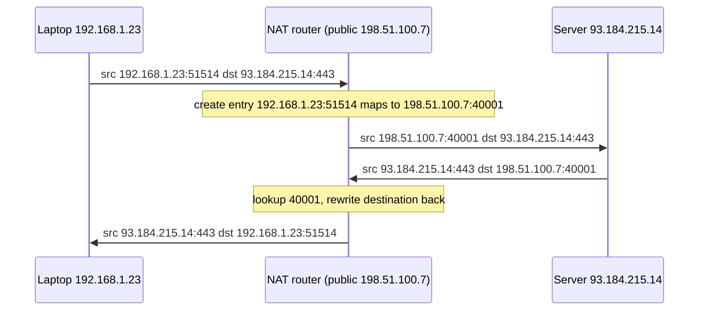

## Mental Model

NAT is a **receptionist for a company with one public phone number**. When an employee calls out, the receptionist notes "extension 214 is calling 555-0100 — I'll use outside line 47". When 555-0100 calls back on line 47, the receptionist knows to route it to extension 214. But if a stranger calls the public number unprompted, the receptionist has no note — the call goes nowhere.

That notebook is the **connection-tracking table**. It's why NAT lets thousands of private devices share one public IP, and why they can't be reached from outside unless someone configures a rule.

## Definition

- **NAT (Network Address Translation)**: rewriting IP addresses (and usually ports) in packet headers as they cross a boundary.
- **SNAT / masquerade**: rewrite the **source** of outgoing packets (private → public).
- **DNAT / port forwarding**: rewrite the **destination** of incoming packets (public IP:port → private IP:port).
- **PAT / NAPT (port address translation)**: many private hosts share one public IP, distinguished by translated **source ports**. This is what home routers and cloud NAT gateways do.
- **Conntrack table**: the per-flow state `(private IP, private port, remote IP, remote port, proto) ↔ (public IP, public port)`.

## Why It Exists

IPv4 addresses ran out. NAT lets a household, an office or an entire mobile carrier's customers reach the internet through a few public addresses. It also hides internal topology and, as a side effect, blocks unsolicited inbound connections.

## How It Works



Every packet in both directions is rewritten (addresses, ports, and checksums recomputed). Entries expire after inactivity: TCP entries after a long timeout for established connections (hours on Linux by default, often minutes on consumer routers and cloud NAT gateways), UDP entries after tens of seconds to minutes.

### Port exhaustion

One public IP has ~64K ports per protocol **per destination** (entries are distinguished by the full 5-tuple, but many NATs allocate ports more conservatively). When many internal clients open many connections to the **same** destination IP:port — e.g., hundreds of pods all calling one external API — the NAT can run out of source ports for that destination, and new connections fail or time out. Cloud NAT gateways document per-destination connection limits for exactly this reason. Remedies: more NAT IPs, connection reuse/pooling, keep-alive, shorter idle timeouts.

### Types of NAT behavior (why P2P is hard)

- **Endpoint-independent mapping** ("full cone"-ish): the same internal socket gets the same public port regardless of destination — friendliest for peer-to-peer.
- **Address/port-dependent mapping** ("symmetric"): a new public port per destination — defeats simple hole punching, requiring relays ([VPN & NAT Traversal](lesson:cn-vpn-nat-traversal)).

## Internal Mechanism

:::depth{level=advanced}
### Linux: iptables/nftables + conntrack

Linux NAT is implemented in netfilter:

```bash
# Masquerade traffic from a private subnet leaving eth0 (SNAT to eth0's address)
iptables -t nat -A POSTROUTING -s 10.0.0.0/24 -o eth0 -j MASQUERADE
# Port-forward public :8080 to an internal service (DNAT)
iptables -t nat -A PREROUTING -p tcp --dport 8080 -j DNAT --to-destination 10.0.0.5:80
conntrack -L | head            # inspect tracked flows
sysctl net.netfilter.nf_conntrack_max   # table size limit
```

A full conntrack table (`nf_conntrack: table full, dropping packet` in `dmesg`) drops new connections — a classic outage on busy NAT boxes and Kubernetes nodes (kube-proxy in iptables mode uses DNAT for Service IPs). Docker's port publishing (`-p 8080:80`) is DNAT; containers reaching the internet use masquerade.

### Carrier-grade NAT (CGNAT)

Mobile and many residential ISPs place customers behind a second NAT using the `100.64.0.0/10` shared range. Consequences: thousands of customers share one public IP (IP-based rate limiting and bans hit innocent users), port allocations per customer are limited, and inbound connections are impossible without ISP support.
:::

## Example

A Kubernetes cluster's pods call a payment API. All egress goes through a cloud NAT gateway with 2 public IPs. At peak, 3,000 pods each hold ~40 connections to the same API IP:443 → 120,000 flows to one destination, beyond 2 × ~64K ports → connection timeouts at peak. Fixes: add NAT IPs, reuse HTTP keep-alive connections (fewer, longer-lived flows), and use connection pooling.

## Visualization

The routing simulator's edge router performs NAT — watch the source address and port change:

::viz{id=routing}

## Complexity & Performance

- Per-packet rewrite cost is small (hash lookup in conntrack + header rewrite + checksum update).
- State scales with concurrent flows — memory and table limits matter on busy gateways.

## Trade-offs

- Conserves IPv4 addresses and blocks unsolicited inbound traffic vs breaks end-to-end connectivity, complicates P2P, VoIP and gaming, and adds stateful single points of failure.
- NAT is **not** a firewall: it blocks unsolicited inbound as a side effect, but security should come from explicit filtering.

## Failure Modes

- Port/conntrack exhaustion under many connections to one destination.
- Idle timeouts killing long-lived idle TCP connections (database connections, WebSockets) silently — the NAT forgets the mapping, the next packet gets dropped or RST ([TCP Termination & Keep-Alive](lesson:cn-tcp-termination)).
- Protocols embedding IP addresses in payloads (FTP active mode, SIP) break without application-level gateways.
- Asymmetric routing around a stateful NAT drops return traffic.

## In Production

- Cloud "private subnets" reach the internet through managed NAT gateways; know their per-destination limits and idle timeouts.
- Set TCP keep-alive intervals shorter than NAT/load-balancer idle timeouts for long-lived connections.
- Logging NAT translations is required in some jurisdictions to trace abuse back to a customer behind CGNAT.

## Deeper Connections

- IPv6's large address space removes the need for NAT for address conservation ([IPv6](lesson:cn-ipv6)).
- NAT traversal (STUN/TURN/ICE) exists because of NAT ([VPN & NAT Traversal](lesson:cn-vpn-nat-traversal)).
- Kubernetes Services are DNAT rules ([Container Networking](lesson:cn-container-networking)).

## Common Misconceptions

- **"NAT is a security feature."** It's an addressing hack that incidentally blocks unsolicited inbound connections; use real firewalls.
- **"Only the IP changes."** With PAT, the source port changes too.
- **"A public IP has 65,535 connections total."** Limits are per 5-tuple; the real constraint is ports per destination and the NAT's implementation.

## Interview Questions

### [L1 · conceptual] What is NAT and why is it used?

Network Address Translation rewrites IP addresses (and usually ports) at a network boundary. It lets many devices with private addresses share one or a few public IPv4 addresses to access the internet, conserving scarce IPv4 space and hiding internal addressing.

### [L2 · how] How does a home router know which internal device should receive a response packet?

It keeps a connection-tracking table: when an internal host opens a connection, the router records the mapping from (private IP, private port) to (public IP, allocated public port) for that remote endpoint. Incoming packets addressed to the public IP and that port are looked up and rewritten to the internal host's address and port.

### [L2 · why] Why can't a server on the internet initiate a connection to a laptop behind a home NAT?

There's no mapping in the NAT's table for unsolicited inbound traffic, so the router doesn't know which internal host (if any) should receive it and drops it. Inbound access requires explicit port forwarding (DNAT), UPnP, or NAT traversal techniques using a third party.

### [L3 · incident] Services behind a cloud NAT gateway see intermittent connection timeouts to one external API at peak traffic. Diagnose.

Likely port exhaustion toward a single destination: many concurrent connections to the same IP:port consume the NAT's available source ports (per-destination limits). Evidence: NAT gateway metrics for dropped/failed allocations, errors correlating with connection counts. Fixes: reuse connections (keep-alive, pooling, HTTP/2), add NAT IPs, spread across destinations, lower idle timeouts, or use private connectivity to the provider.

### [L3 · debugging] Long-lived idle database connections through a firewall/NAT fail after about 5 minutes with "connection reset" on the next query. Why, and how do you fix it?

The middlebox's idle timeout expired and it dropped the flow's state; the next packet is dropped or rejected with RST. Fix: TCP keep-alive (or application-level pings) with an interval shorter than the timeout, pool settings that validate or retire idle connections (maxLifetime/idle timeout below the NAT timeout), or increase the middlebox timeout.

## Practice

### [mcq] Which NAT operation does a home router perform for outbound web browsing?

- [x] Source NAT with port translation (PAT/masquerade)
- [ ] Destination NAT
- [ ] No translation
- [ ] Static one-to-one NAT for each device

Many private hosts share one public IP using different ports.

### [mcq] What does the kernel message "nf_conntrack: table full, dropping packet" indicate?

- [ ] ARP cache overflow
- [x] The connection-tracking table used for NAT/stateful filtering has reached its limit
- [ ] The routing table is full
- [ ] A TCP window of zero

New flows can't be tracked, so their packets are dropped.

## Quick Revision

- NAT rewrites addresses; **PAT** also rewrites ports so many hosts share one IP.
- SNAT/masquerade (outbound) vs DNAT/port forwarding (inbound).
- Conntrack table maps (private IP:port, remote) ↔ (public IP:port); entries time out.
- Port exhaustion toward one destination; conntrack table full; idle timeouts killing long connections → keep-alives.
- NAT blocks unsolicited inbound (not a real firewall); CGNAT = NAT at the ISP.
- Kubernetes Services & Docker `-p` are DNAT.
