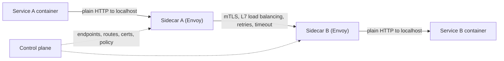

## Mental Model

In a microservices platform, instances come and go every minute (autoscaling, deploys, failures). Hard-coded IPs are hopeless. Services need a **phone directory that updates itself** (service discovery) and a consistent way to **dial safely**: encrypt, authenticate, retry sensibly, time out, and report what happened.

A **service mesh** puts a small proxy (a **sidecar**) next to every service instance, so all that "dialing etiquette" lives in the platform instead of every team's code.

## Definition

- **Service discovery**: mapping a logical service name to the current set of healthy instance addresses — via DNS, a registry (Consul, etcd, ZooKeeper, Eureka), or the orchestrator (Kubernetes Endpoints/EndpointSlices).
- **North-south traffic**: in and out of the platform (clients → edge LB/ingress → services).
- **East-west traffic**: service-to-service inside the platform — often 10× or more the north-south volume.
- **Client-side load balancing**: the caller fetches the instance list and picks an instance itself (gRPC load balancing, Finagle, Netflix Ribbon).
- **Server-side load balancing**: the caller sends to a stable virtual address; an intermediary picks the instance (Kubernetes Service via kube-proxy, internal LBs).
- **Service mesh**: a data plane of proxies (Envoy, linkerd2-proxy, or eBPF/ambient node proxies) plus a control plane (Istio, Linkerd) that configures them.

## Why It Exists

Moving from a monolith to many services turns in-process function calls into network calls — each can fail, be slow, or be intercepted. Every service needs discovery, load balancing, timeouts, retries, circuit breaking, mTLS, and telemetry. Implementing those consistently in every language and team is expensive; platforms centralize them.

## How It Works

### Discovery options

| Approach | How | Pros | Cons |
|---|---|---|---|
| DNS | Service name resolves to instance IPs or a VIP | Universal | TTL caching → stale endpoints; clients may not re-resolve |
| Registry + client library | Instances register/heartbeat; clients watch the registry | Real-time updates, smart balancing | Language-specific libraries |
| Orchestrator VIP (Kubernetes Service) | Stable ClusterIP; kube-proxy/eBPF translates to a pod | Transparent to apps | L4 (connection-level) balancing |
| Mesh | Control plane pushes endpoints to sidecars | Uniform, L7-aware | Operational complexity, extra hops |

### Kubernetes in one paragraph

A **Service** gets a stable virtual IP and a DNS name (`payments.prod.svc.cluster.local`). EndpointSlices list ready pod IPs (pods failing readiness probes are removed). On each node, kube-proxy (iptables/IPVS) or an eBPF data plane (Cilium) DNATs connections to the virtual IP onto one pod IP. It's **connection-level** balancing — long-lived HTTP/2/gRPC connections stick to one pod ([HTTP/2](lesson:cn-http2), [Container Networking](lesson:cn-container-networking)).

### What a mesh sidecar does per request



- **Traffic interception**: iptables rules redirect the pod's traffic through the sidecar transparently.
- **mTLS**: sidecars present short-lived workload certificates from the mesh CA; every call is encrypted and both identities verified ([Certificates & PKI](lesson:cn-certificates-pki)).
- **Authorization policy**: "only `orders` may call `payments` on `POST /charge`".
- **Resilience**: per-request load balancing (least requests, locality-aware), timeouts, retries with budgets, outlier detection, circuit breaking.
- **Traffic management**: canaries (1% to v2), header-based routing, mirroring, fault injection.
- **Telemetry**: golden metrics per service pair, access logs, trace spans — without code changes (apps must still propagate trace headers).

## Internal Mechanism

:::depth{level=senior}
### Costs and evolutions

Each sidecar adds CPU and memory per pod and two extra proxy hops per call (typically sub-millisecond each, but visible at p99 in chatty call graphs). The mesh control plane becomes critical infrastructure; misconfigurations can break all traffic. Newer designs reduce per-pod cost: **sidecarless/ambient** modes with per-node L4 proxies plus optional per-namespace L7 "waypoint" proxies, and **eBPF**-based data planes. Proxyless gRPC (xDS directly in client libraries) removes the extra hops for gRPC services.

### Resilience semantics that matter

- **Retries** only for idempotent requests, bounded by budgets; otherwise a slow dependency triggers retry storms that multiply load ([Overloaded Servers](lesson:x-overloaded-server)).
- **Timeouts** should shrink along the call path (deadline propagation) — a 30 s timeout at every hop means a user request can wait minutes.
- **Circuit breakers** fail fast when a dependency is unhealthy, preserving the caller's threads/pools and giving the dependency room to recover.
:::

## Example

A canary release with a mesh (Istio-style):

```yaml
apiVersion: networking.istio.io/v1
kind: VirtualService
metadata: { name: payments }
spec:
  hosts: [payments]
  http:
    - route:
        - destination: { host: payments, subset: v1 }
          weight: 95
        - destination: { host: payments, subset: v2 }
          weight: 5
      timeout: 2s
      retries: { attempts: 2, perTryTimeout: 800ms, retryOn: "5xx,reset,connect-failure" }
```

## Complexity & Performance

- Extra hops: ~0.2–1 ms each with sidecars; CPU per sidecar scales with request rate and mTLS.
- Discovery freshness: registry watches propagate in seconds; DNS TTLs can leave clients calling dead instances.

## Trade-offs

- Mesh: uniform security/observability/traffic control vs complexity, latency, resource overhead.
- Client-side LB: no extra hop, request-level balancing vs per-language libraries and client complexity.
- Server-side VIPs: transparent vs connection-level balancing and an extra translation layer.

## Failure Modes

- Stale discovery → calls to terminated instances (connection refused/timeouts during deploys).
- Retry amplification across layers during partial outages.
- Mesh control plane or certificate authority outages → new pods can't get certs/config.
- Misconfigured policies blocking legitimate traffic.
- Long-lived connections not rebalanced after scale-out.

## In Production

- Kubernetes Services + readiness probes as baseline; add a mesh when mTLS, fine-grained policy and uniform telemetry across many teams justify it.
- Model east-west capacity: fan-out multiplies internal traffic.

## Deeper Connections

- L4/L7 balancing fundamentals: [Proxies & Load Balancers](lesson:cn-proxies-load-balancers). Pod networking and Service DNAT: [Container Networking](lesson:cn-container-networking). gRPC specifics: [API Styles](lesson:cn-api-styles).

## Common Misconceptions

- **"A service mesh is required for microservices."** It's one way to centralize cross-cutting concerns; many systems use libraries or plain Kubernetes Services.
- **"mTLS inside the cluster is unnecessary."** Flat networks let any compromised pod talk to anything; mTLS + policy gives identity-based zero-trust.
- **"Retries improve reliability."** Unbounded retries turn partial failures into total overload.

## Interview Questions

### [L2 · compare] Client-side vs server-side service discovery/load balancing?

Client-side: clients query a registry (or DNS with multiple records) for instance addresses and choose one themselves — no extra hop and request-level balancing, but logic lives in every client. Server-side: clients call a stable address (LB or virtual IP) and the intermediary picks an instance — simpler clients and language-agnostic, but an extra hop and often only connection-level balancing.

### [L2 · compare] North-south vs east-west traffic?

North-south traffic crosses the platform boundary: external clients to services (via edge load balancers, ingress, CDNs) and outbound calls. East-west traffic flows between services inside the platform. In microservice architectures east-west usually dominates volume and needs its own discovery, load balancing, security (mTLS) and observability.

### [L3 · conceptual] What does a service mesh sidecar do?

It transparently intercepts a service's inbound and outbound traffic and applies platform policy: service discovery and L7 load balancing, mTLS with workload identities, authorization, timeouts, retries, circuit breaking, traffic splitting, and telemetry (metrics, logs, traces) — configured centrally by the mesh control plane rather than implemented in application code.

### [L4 · design] Your company has 300 microservices in 5 languages with inconsistent retries and no encryption between services. How would you roll out a service mesh safely?

Start with observability-only mode on a few non-critical namespaces to measure latency/CPU overhead; enable permissive mTLS (accept both plain and mTLS) cluster-wide, then migrate to strict per namespace once all clients have sidecars; introduce default timeouts and conservative retry budgets centrally and remove conflicting library retries; add authorization policies incrementally with audit mode first; keep the control plane highly available and version-pinned; plan for certificate rotation and CA resilience; and provide a fast opt-out for incidents. Measure p99 impact per hop.

## Practice

### [mcq] Kubernetes ClusterIP Services balance traffic at which granularity by default?

- [ ] Per HTTP request
- [x] Per TCP connection
- [ ] Per DNS query only
- [ ] Per pod restart

kube-proxy DNATs connections; long-lived connections stick to one pod.

### [mcq] What gives service mesh workloads their cryptographic identity for mTLS?

- [ ] Their pod IP addresses
- [x] Short-lived certificates issued by the mesh's certificate authority
- [ ] Kubernetes labels
- [ ] DNS names only

Identities (e.g., SPIFFE IDs) are embedded in certificates.

## Quick Revision

- Discovery: DNS, registries, orchestrator VIPs, mesh control planes.
- Client-side LB (no hop, per request) vs server-side (VIP/LB, often per connection).
- North-south (edge) vs east-west (service-to-service, dominant).
- Mesh sidecar: interception, mTLS identity, authz, L7 LB, timeouts, retries (budgeted), circuit breaking, canaries, telemetry; costs latency/CPU/complexity; ambient/eBPF/proxyless reduce it.
- Deadline propagation and retry budgets prevent storms.
