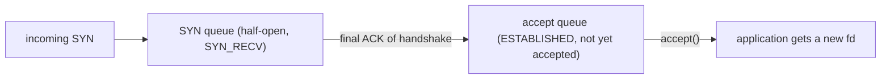

## Mental Model

A socket is a **file descriptor with a network endpoint behind it**. To your program it's just an fd you `read` and `write`. Inside the kernel it's a bundle of state: addresses and ports, TCP state (sequence numbers, windows, timers), a **send buffer** holding bytes not yet acknowledged by the peer, and a **receive buffer** holding bytes that arrived but your program hasn't read yet.

`write()` doesn't send data onto the network — it copies bytes into the send buffer and returns. `read()` doesn't fetch from the network — it copies from the receive buffer (or waits until something is there). The kernel's TCP stack moves bytes between the buffers and the wire on its own schedule.

## Definition

A **socket** is an endpoint for communication created by `socket(domain, type, protocol)`: e.g., `AF_INET`/`AF_INET6` + `SOCK_STREAM` (TCP) or `SOCK_DGRAM` (UDP); `AF_UNIX` for local IPC. It is identified by a file descriptor in the process and, once connected, by the 4-tuple in the kernel.

## Why It Exists

**The problem.** TCP lives in the kernel; applications live in user space. Programs need a way to say "connect me to that host", "send these bytes", "give me what arrived" — without knowing anything about segments, retransmissions or windows.

**The idea.** Reuse the interface programs already know: files. The Berkeley sockets API (1983) gave Unix programs a uniform way to use networks: the same file-descriptor model as files and pipes, with a few extra calls for addressing. Nearly every language's networking library wraps it.

**Why buffers sit in the middle.** The application and the network run at different speeds and at different times — the app may be busy when a packet arrives, and the network may be slow when the app wants to write. Buffers in the kernel let each side work at its own pace.

:::callout[That's all it is]{type=insight}
A socket is a file descriptor backed by two kernel buffers. `write` puts bytes in the send buffer, `read` takes bytes from the receive buffer, and TCP moves data between those buffers and the network on its own.
:::

## How It Works

### Server and client call sequences

```text
Server                                   Client
socket()                                 socket()
bind(0.0.0.0:8080)
listen(backlog)
                                          connect(server:8080)  ── SYN ──▶
                                          (handshake handled by the kernel)
accept()  ◀── returns a NEW socket fd for this connection
read()/write() on the new fd  ◀══════ data ══════▶  write()/read()
close()                                   close()
```

- `bind` assigns the local address/port. Binding to `0.0.0.0` means "all interfaces"; `127.0.0.1` means "only local connections" (a common reason a containerized service is unreachable from outside).
- `listen` marks the socket passive and sets the backlog.
- `accept` returns a **new connected socket** for each client; the listening socket keeps listening. A server with 10,000 clients has 10,001 sockets.
- The client usually doesn't `bind`: the kernel assigns an **ephemeral port** at `connect`.

### The two queues behind listen()

The kernel finishes handshakes on its own so that a busy application doesn't make clients wait for the SYN-ACK. That means finished-but-not-yet-claimed connections need a place to wait:



The kernel completes handshakes **without the application**. Completed connections wait in the **accept queue** until `accept()` takes them; its size is `min(backlog, net.core.somaxconn)`. If the application accepts too slowly (overloaded event loop, too few acceptor threads), the accept queue fills; new handshakes then stall or are dropped — clients see connection timeouts even though the port is "open". Visible as `ListenOverflows`/`ListenDrops` in `netstat -s` / `nstat`, and `Recv-Q` on listening sockets in `ss -lnt`.

### Socket buffers and what blocking means

- **Receive buffer**: incoming data waits here. `read()` blocks if it's empty (unless non-blocking). If the app doesn't read, the buffer fills, the advertised TCP window shrinks to zero, and the sender stops — **flow control reaching all the way to the application** ([Flow Control](lesson:cn-tcp-flow-control)).
- **Send buffer**: `write()` copies into it and returns. It blocks (or returns `EAGAIN`) only when the buffer is full — i.e., when the peer or network isn't keeping up. **A successful write means "queued locally", not "delivered".**

For epoll: a socket is **readable** when the receive buffer has data (or EOF/FIN arrived, or an error occurred); **writable** when there's space in the send buffer; a listening socket is readable when the accept queue is non-empty.

```bash
$ ss -tnp state established '( dport = :5432 )'
Recv-Q Send-Q  Local Address:Port   Peer Address:Port
0      0       10.0.1.5:44212       10.0.2.9:5432    users:(("java",pid=812,fd=97))
```

A persistently non-zero `Recv-Q` on an established socket means the app isn't reading fast enough; a growing `Send-Q` means the peer/network isn't taking data.

## Internal Mechanism

### Ephemeral ports

A connection is identified by its 4-tuple, so two connections to the same server must differ somewhere — in practice, in the client's local port. Outgoing connections get a local port from `net.ipv4.ip_local_port_range` (Linux default 32768–60999, ~28K ports). The 4-tuple must be unique, so a single client IP can hold ~28K concurrent connections **to the same destination IP:port**. Combined with `TIME_WAIT` lingering after closes, high-rate short-lived connections to one backend can exhaust ephemeral ports (`EADDRNOTAVAIL: Cannot assign requested address`). See [TCP Termination](lesson:cn-tcp-termination) and case study [Connection Exhaustion](case:connection-exhaustion).

### Useful socket options

| Option | Effect | When |
|---|---|---|
| `SO_REUSEADDR` | Allow bind while old connections on the port are in TIME_WAIT | Servers restarting quickly |
| `SO_REUSEPORT` | Multiple sockets bind the same port; kernel load-balances connections | Multi-process/thread servers |
| `TCP_NODELAY` | Disable Nagle's algorithm (send small segments immediately) | Latency-sensitive request/response protocols |
| `SO_KEEPALIVE` (+ `TCP_KEEPIDLE/INTVL/CNT`) | Probe idle connections to detect dead peers | Long-lived connections through NATs/LBs |
| `SO_RCVBUF` / `SO_SNDBUF` | Buffer sizes (often autotuned) | High bandwidth-delay paths |
| `SO_LINGER` | Control close behavior (0 = abortive close with RST) | Rarely; avoid unless you understand RST semantics |
| `TCP_USER_TIMEOUT` | Max time unacknowledged data may remain before failing the connection | Faster failure detection |

:::depth{level=advanced}
### Zero-copy and kernel bypass

`sendfile()`/`splice()` send file data to sockets from the page cache without user-space copies; `MSG_ZEROCOPY` avoids copying user buffers on send for large writes; io_uring batches socket operations; kernel-bypass stacks (DPDK, user-space TCP) skip the kernel entirely for extreme packet rates at the cost of reimplementing TCP.
:::

## Example

A minimal TCP echo server (Python, blocking, one connection at a time — for clarity):

```python
import socket

srv = socket.socket(socket.AF_INET, socket.SOCK_STREAM)
srv.setsockopt(socket.SOL_SOCKET, socket.SO_REUSEADDR, 1)
srv.bind(("0.0.0.0", 9000))
srv.listen(128)                    # backlog
while True:
    conn, addr = srv.accept()      # new socket per client
    with conn:
        while data := conn.recv(4096):   # b"" means the peer closed (FIN)
            conn.sendall(data)           # sendall loops until everything is queued
```

`sendall` exists because `send` may queue only part of the data when the send buffer is nearly full.

## Complexity & Performance

- Each connection costs an fd, kernel memory for buffers (autotuned, KBs to MBs) and TCP control state.
- `accept` rate and accept-queue depth limit connection-establishment throughput under bursts.
- Syscalls per message matter at high rates → batching, larger buffers, epoll/io_uring ([I/O Models](lesson:os-io-models)).

## Trade-offs

- Large socket buffers: higher throughput on long fat networks vs memory per connection and "bufferbloat" latency.
- `TCP_NODELAY`: lower latency for small messages vs more packets.
- Many short connections: simple vs handshake cost, TIME_WAIT, ephemeral port pressure → prefer pooled persistent connections.

## Failure Modes

- **Accept queue overflow**: slow `accept()` → connection timeouts under load.
- **Binding to 127.0.0.1 inside containers** → unreachable service.
- **"Address already in use"** on restart without `SO_REUSEADDR`.
- **Ephemeral port exhaustion** for high-rate short connections to one destination.
- **Partial writes** mishandled in non-blocking code (data silently dropped).
- **fd leaks** from unclosed sockets ([File Descriptors](lesson:os-file-descriptors)).

## In Production

- Tune `net.core.somaxconn` and application backlog together; watch `ListenOverflows`.
- Health-check with `ss -s`, `ss -tan state time-wait | wc -l`, `ss -lnt` (Recv-Q on listeners = accept queue depth).
- Case studies: [Connection Exhaustion](case:connection-exhaustion), [Connection Pool Exhaustion](case:pool-exhaustion).

## Deeper Connections

- Readiness semantics drive event loops ([epoll & Event Loops](lesson:os-epoll-event-loops)).
- The handshake that fills the SYN and accept queues: [TCP Handshake](lesson:cn-tcp-handshake).
- Connection pools across app ↔ DB ↔ kernel: [Connection Management](lesson:x-connection-management).

## Common Misconceptions

- **"write() returning success means the peer received the data."** It was copied to the local send buffer.
- **"accept() performs the handshake."** The kernel completes it; accept just dequeues finished connections.
- **"A server port can only have 65,535 connections."** Connections are distinguished by the 4-tuple; a server port can have many more (limited by memory/fds). The ~28K–64K limit applies to a *client IP* connecting to the *same* destination IP:port.

## Interview Questions

### [L1 · trace] What system calls does a TCP server make to accept connections?

`socket()` to create the socket, `bind()` to an address/port, `listen()` to make it passive with a backlog, then `accept()` in a loop, each returning a new connected socket for one client, which it uses with `read`/`write` (or `recv`/`send`) and finally `close()`.

### [L2 · how] What is the listen backlog?

The size of the queue of connections that have completed the TCP handshake but haven't yet been returned by `accept()` (capped by `net.core.somaxconn` on Linux). Half-open connections waiting for the final ACK sit in a separate SYN queue. If the accept queue is full, new connections are dropped or stalled until the application accepts.

### [L2 · conceptual] What does it mean when write() on a TCP socket returns successfully?

That the kernel copied the bytes into the socket's send buffer. They may not have been transmitted yet, let alone acknowledged by the peer or read by the peer application. Write blocks (or returns EAGAIN) only when the send buffer is full.

### [L3 · debugging] Under a traffic spike, clients get connection timeouts, but the server's CPU is at 40% and the port is open. ss -lnt shows Recv-Q equal to the backlog on the listener. What's happening?

The accept queue is full: handshakes complete in the kernel but the application isn't calling `accept()` fast enough (a blocked or busy event loop, too few acceptor threads, or a backlog set too low). New SYNs are dropped, so clients retransmit and eventually time out. Fix: accept faster (dedicated acceptor, SO_REUSEPORT across workers, don't block the loop), raise backlog and somaxconn, and check ListenOverflows counters.

### [L3 · why] Why can a load-testing client fail with "Cannot assign requested address" when opening many connections to one server?

It exhausted its ephemeral ports: each connection to the same destination IP:port needs a unique local port, and closed connections linger in TIME_WAIT for the client (the active closer), keeping ports unavailable. Fix: reuse connections (keep-alive/pooling), widen `ip_local_port_range`, use multiple source IPs or destinations, and enable `tcp_tw_reuse` for outgoing connections if appropriate.

## Practice

### [mcq] A socket in an epoll set is reported readable, and read() returns 0. What does it mean?

- [ ] No data yet; try again
- [x] The peer closed its side of the connection (FIN received / EOF)
- [ ] The receive buffer is full
- [ ] A timeout occurred

A zero-byte read on a stream socket is EOF.

### [mcq] Why might a service in a Docker container be unreachable from the host even though it's listening on port 8080?

- [ ] Containers can't use TCP
- [x] It's bound to 127.0.0.1 inside the container instead of 0.0.0.0
- [ ] The backlog is too large
- [ ] TCP_NODELAY is disabled

127.0.0.1 inside the container is the container's own loopback, not reachable via port publishing.

## Quick Revision

- Socket = fd + kernel state (4-tuple, TCP state, send/receive buffers).
- Server: socket → bind → listen → accept (new fd per connection). Client: socket → connect (ephemeral port).
- Kernel does the handshake; SYN queue → **accept queue** (size min(backlog, somaxconn)).
- write() = copy to send buffer; read() = copy from receive buffer; full buffers → backpressure.
- Readable = data/EOF/error; writable = send-buffer space.
- Ephemeral ports (~28K default) per destination + TIME_WAIT → exhaustion.
- Options: SO_REUSEADDR/PORT, TCP_NODELAY, SO_KEEPALIVE, buffers, TCP_USER_TIMEOUT.
