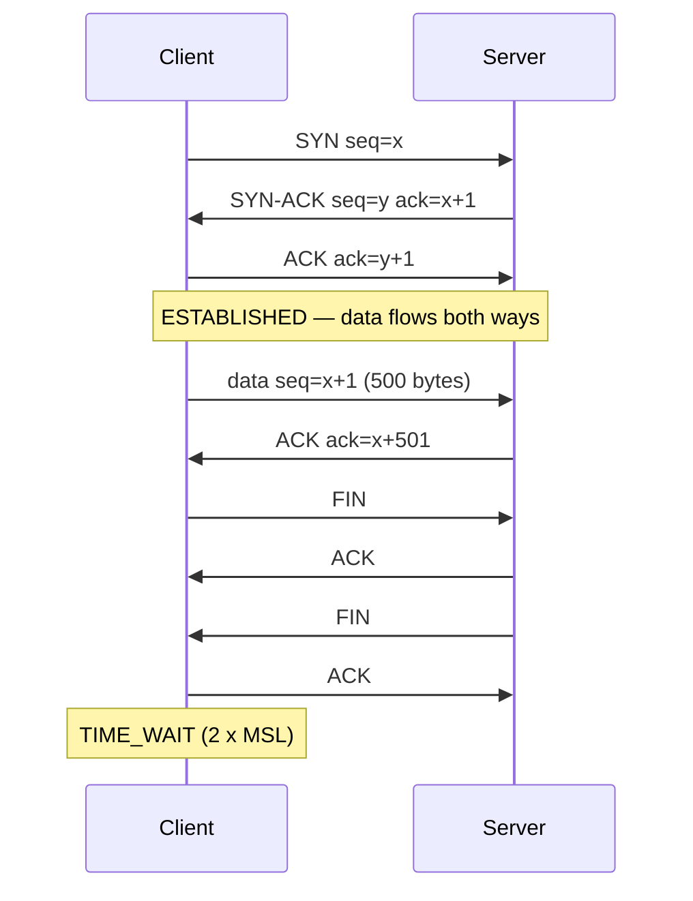

## Mental Model

IP delivers postcards that can be lost, duplicated, reordered or delayed. TCP builds on top of it the illusion of a **pipe**: bytes written at one end come out at the other end **in order, exactly once, without gaps** — or the connection breaks and both ends learn about it.

TCP achieves this with a handful of mechanisms, each solving one problem:

| Problem with IP | TCP mechanism |
|---|---|
| Packets lost | Acknowledgments + retransmission |
| Packets reordered / duplicated | Sequence numbers + reassembly buffer |
| Corruption | Checksum |
| Receiver overwhelmed | Flow control (receive window) |
| Network overwhelmed | Congestion control (congestion window) |
| Two endpoints must agree on starting state | Three-way handshake |
| Need to know when the other side is done | FIN / RST connection teardown |

## Definition

**TCP (Transmission Control Protocol, RFC 9293)** is a connection-oriented, reliable, ordered, full-duplex **byte-stream** transport protocol with flow and congestion control. A connection is identified by the **4-tuple** (source IP, source port, destination IP, destination port).

## Why It Exists

**The problem.** Most applications — web, databases, email, file transfer, RPC — need their data to arrive intact and in order. IP gives no such promise.

**Without it.** Every application would have to number its messages, detect losses, resend, reorder, and slow down when the network is congested. Implementing reliability in every application would be error-prone and wasteful; TCP does it once, in the kernel, for everyone.

**The idea.** Number every byte. The receiver says which bytes it has; the sender resends what's missing. With numbered bytes, all the other problems become bookkeeping: reorder by number, discard duplicates by number, and limit how many unacknowledged bytes are in flight (flow and congestion control).

:::callout[That's all it is]{type=insight}
TCP numbers every byte, the receiver acknowledges what arrived, and the sender retransmits what didn't. Everything else in TCP — windows, handshakes, timers — is built on those numbers.
:::

## How It Works

### The header

```text
 0                   1                   2                   3
 0 1 2 3 4 5 6 7 8 9 0 1 2 3 4 5 6 7 8 9 0 1 2 3 4 5 6 7 8 9 0 1
+---------------------------------------------------------------+
|          Source Port          |       Destination Port        |
+---------------------------------------------------------------+
|                        Sequence Number                        |
+---------------------------------------------------------------+
|                    Acknowledgment Number                      |
+---------------------------------------------------------------+
| Offset|  Rsvd |C|E|U|A|P|R|S|F|            Window             |
+---------------------------------------------------------------+
|           Checksum            |         Urgent Pointer        |
+---------------------------------------------------------------+
|                    Options (MSS, SACK, timestamps, wscale)    |
+---------------------------------------------------------------+
```

| Field | Meaning |
|---|---|
| Ports | Which socket on each host |
| **Sequence number** | Byte offset of the first data byte in this segment (starting from a random initial sequence number, ISN) |
| **Acknowledgment number** | The **next byte expected** from the peer — cumulative: "I have everything before this" |
| Flags | **SYN** (synchronize, open), **ACK** (ack field valid), **FIN** (no more data from me), **RST** (abort), **PSH** (push to app), URG, ECE/CWR (ECN) |
| **Window** | How many more bytes the receiver can accept (flow control), scaled by the window-scale option |
| Checksum | Covers header, data and a pseudo-header with IPs |
| Options | MSS, SACK permitted/blocks, timestamps, window scale |

### Sequence numbers count bytes, not packets

Why bytes: TCP may re-cut data into different-sized segments on a retransmit, so packet numbers would be ambiguous; byte numbers never are. If the ISN is 1000 and the sender transmits 500 bytes, then 300 bytes:

- segment 1: `seq=1001, len=500` (the SYN consumed sequence number 1000)
- segment 2: `seq=1501, len=300`
- the receiver acknowledges `ack=1801` meaning "I have every byte up to 1800; send 1801 next".

### Connection lifecycle in one picture



Details: [Handshake](lesson:cn-tcp-handshake), [Reliability](lesson:cn-tcp-reliability), [Flow Control](lesson:cn-tcp-flow-control), [Congestion Control](lesson:cn-tcp-congestion-control), [Termination](lesson:cn-tcp-termination).

## Internal Mechanism

### The byte-stream trap

A direct consequence of "number bytes, not messages": TCP has **no message boundaries**. Two `send()` calls of 100 bytes may arrive as one `recv()` of 200 bytes, or as 150 + 50. Every application protocol over TCP must therefore do its own **framing**:

- delimiters (HTTP/1.1 headers end with `\r\n\r\n`; Redis RESP uses `\r\n`),
- length prefixes (HTTP `Content-Length`, HTTP/2 frames, Kafka and PostgreSQL wire protocols: a length field then the payload),
- chunked encoding.

```python
# WRONG: assumes one recv() == one message
msg = sock.recv(4096)

# RIGHT: read a 4-byte length prefix, then exactly that many bytes
def recv_exact(sock, n):
    buf = b""
    while len(buf) < n:
        chunk = sock.recv(n - len(buf))
        if not chunk:
            raise ConnectionError("peer closed")
        buf += chunk
    return buf

length = int.from_bytes(recv_exact(sock, 4), "big")
msg = recv_exact(sock, length)
```

### What "reliable" does and does not mean

TCP guarantees that bytes the receiving **kernel** acknowledged were received intact and in order. It does **not** guarantee:

- that the receiving **application** read or processed them (the app may crash after the kernel ACKed);
- delivery if the connection breaks — you just learn about failure (eventually);
- timeliness — retransmissions can add seconds of delay;
- exactly-once semantics for your *requests*: if a connection breaks after you sent a request, you don't know whether the server executed it. Retrying may execute it twice → **idempotency** is the application's job ([Distributed Transactions](lesson:db-distributed-transactions)).

## Example

Watching sequence and acknowledgment numbers with tcpdump (relative numbering):

```text
C > S: Flags [S], seq 0, win 64240, options [mss 1460,sackOK,TS,wscale 7]
S > C: Flags [S.], seq 0, ack 1, win 65160, options [mss 1460,sackOK,TS,wscale 7]
C > S: Flags [.], ack 1
C > S: Flags [P.], seq 1:79, ack 1, length 78        # HTTP request
S > C: Flags [.], ack 79
S > C: Flags [P.], seq 1:1449, ack 79, length 1448   # response part 1
```

`[.]` = ACK, `[S.]` = SYN+ACK, `[P.]` = PSH+ACK. `seq 1:79` means bytes 1–78.

## Visualization

::viz{id=tcp-handshake}

## Complexity & Performance

- Setup costs one round trip before data (plus TLS). Long-lived connections amortize it; short ones pay it every time → connection reuse and pooling ([HTTP Connections](lesson:cn-http-connections)).
- Throughput is bounded by `window / RTT` and by congestion control's response to loss.
- Per-connection kernel state: send/receive buffers (tunable, often tens of KB to MB) plus a few KB of control state.

## Trade-offs

| TCP gives | At the cost of |
|---|---|
| Reliability, ordering | Head-of-line blocking: one lost segment stalls delivery of all later bytes ([HTTP/2](lesson:cn-http2)) |
| Congestion control | Conservative ramp-up (slow start) |
| Connection state | Handshake latency, per-connection memory, TIME_WAIT |
| Kernel implementation | Hard to evolve (middleboxes, OS upgrades) → QUIC in user space |

## Failure Modes

- Message framing bugs (assuming recv boundaries).
- Half-open connections: one side crashed or was cut off, the other keeps a dead connection until a write fails or keep-alive detects it.
- Silent hangs when a middlebox drops packets without RST (timeouts matter).
- Duplicate processing when clients retry non-idempotent requests after ambiguous failures.

## In Production

- Always set **timeouts** (connect, read, write) — TCP retransmission can keep a stuck connection alive for many minutes by default.
- Measure retransmissions (`ss -ti`, `netstat -s`, `nstat`) when latency is unexplained ([Tail Latency](lesson:cn-tail-latency)).
- Database and HTTP clients use connection pools precisely because TCP (and TLS) setup is expensive ([Connection Management](lesson:x-connection-management)).

## Deeper Connections

- The kernel's socket buffers and the sockets API: [Sockets](lesson:cn-sockets).
- UDP: what you get without these guarantees ([UDP](lesson:cn-udp)); QUIC: these guarantees rebuilt in user space ([HTTP/3 & QUIC](lesson:cn-http3-quic)).
- "Reliable transport ≠ reliable application" is the same lesson as "COMMIT acknowledged ≠ durable everywhere" ([Durability Chain](lesson:x-durability-chain)).

## Common Misconceptions

- **"TCP preserves message boundaries."** It's a byte stream.
- **"TCP guarantees delivery."** It guarantees in-order delivery *or* an error; it can't deliver over a dead path.
- **"An ACK means the application processed my data."** It means the peer's kernel received it.
- **"Sequence numbers start at 0."** They start at a random ISN (tools show relative numbers).

## Interview Questions

### [L1 · conceptual] What is TCP and what guarantees does it provide?

A connection-oriented transport protocol that provides a reliable, ordered, full-duplex byte stream between two sockets, with error detection (checksums), retransmission of lost data, duplicate elimination, flow control (so the sender doesn't overwhelm the receiver) and congestion control (so senders don't overwhelm the network).

### [L1 · compare] TCP vs UDP in one sentence each?

TCP: connection-oriented, reliable, ordered byte stream with flow and congestion control, at the cost of handshake latency and head-of-line blocking. UDP: connectionless, unreliable, unordered datagrams with message boundaries and minimal overhead — reliability, if needed, is up to the application.

### [L2 · why] Why does TCP need sequence numbers and acknowledgements?

IP can lose, duplicate, reorder and delay packets. Sequence numbers label every byte so the receiver can put data back in order, detect and discard duplicates, and identify gaps. Acknowledgments tell the sender what has arrived, so it knows what to retransmit and when it can free its buffer; the ACK number also drives flow and congestion control.

### [L2 · debugging] A client sends two 100-byte messages with two send() calls, but the server's first recv() returns 200 bytes. Is that a bug in TCP?

No. TCP is a byte stream without message boundaries; the kernel may coalesce (e.g., Nagle's algorithm or simply both arriving before recv). The application protocol must frame messages (length prefixes or delimiters) and loop on recv until a full message is assembled.

### [L3 · what-if] A client sends a payment request over TCP; the connection resets before any response arrives. Did the payment happen?

Unknown. The request may have been received and processed before the reset, or lost. TCP's reliability doesn't extend to "the application executed it". The client must be able to retry safely — using an idempotency key the server deduplicates — or query the payment status before retrying.

### [L4 · design] You're designing a binary protocol over TCP for a low-latency trading gateway. What TCP-related decisions matter?

Framing (length-prefixed messages), disabling Nagle (`TCP_NODELAY`) to avoid batching delays, long-lived persistent connections (no per-request handshakes), heartbeats to detect dead peers faster than TCP keep-alive defaults, application-level sequence numbers and idempotent resend/replay semantics for reconnects, tuned socket buffers, and monitoring retransmissions. Consider whether TCP's head-of-line blocking is acceptable versus UDP-based protocols with custom recovery.

## Practice

### [numeric 1801] Client ISN = 1000. After the handshake it sends 500 bytes, then 300 bytes, and all arrive. What acknowledgment number does the server send?

:::answer
The SYN consumes 1000, so data starts at 1001. Bytes 1001–1800 received → ACK = **1801** (next byte expected).
:::

### [mcq] Which TCP mechanism prevents a fast sender from overwhelming a slow receiver?

- [ ] Congestion control
- [x] Flow control (receive window)
- [ ] Checksum
- [ ] Three-way handshake

The receiver advertises how much buffer space it has.

## Quick Revision

- TCP = reliable, ordered, full-duplex **byte stream** over IP; connection = 4-tuple.
- Mechanisms: seq numbers (bytes), cumulative ACK (next byte expected), retransmission, checksum, receive window (flow control), cwnd (congestion control), handshake, FIN/RST.
- No message boundaries → application framing.
- Reliable ≠ processed by the app ≠ exactly-once requests → idempotency.
- Costs: handshake RTT, head-of-line blocking, per-connection state → pools, QUIC.
