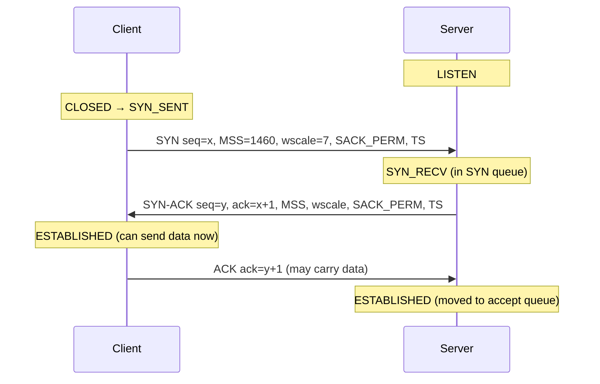

## Mental Model

Two people starting a phone call on a bad line want to be sure *both directions* work and agree on where to start counting:

1. **A**: "Can you hear me? I'll number my sentences starting at 5000." (SYN, seq = 5000)
2. **B**: "I hear you — I'm expecting your sentence 5001 next. Can *you* hear *me*? I'll start my numbering at 9000." (SYN-ACK, seq = 9000, ack = 5001)
3. **A**: "I hear you — expecting your 9001 next." (ACK, ack = 9001)

After three messages, each side knows: the other side is alive, messages get through in *both* directions, and each side's starting sequence number.

## Definition

The **three-way handshake** establishes a TCP connection:

1. Client → server: **SYN**, `seq = x` (client's ISN).
2. Server → client: **SYN-ACK**, `seq = y` (server's ISN), `ack = x + 1`.
3. Client → server: **ACK**, `ack = y + 1`.

The SYN (and FIN) flag **consumes one sequence number**, hence `+1`. Options are negotiated in the SYN/SYN-ACK: MSS, window scaling, SACK permitted, timestamps.

## Why It Exists

**The problem.** TCP's reliability depends on sequence numbers, and both sides pick their own starting number. Before any data moves, each side must learn the other's starting number and confirm the path works *both ways*. The handshake does exactly three jobs:

- **Synchronize sequence numbers** in both directions — each side must learn the other's ISN before reliability can work.
- **Confirm bidirectional reachability**: the SYN-ACK proves client→server works; the final ACK proves server→client works.
- **Reject stale or duplicate connection attempts**: an old delayed SYN from a previous connection could otherwise create a bogus connection.

:::callout[That's all it is]{type=insight}
SYN: "here's my starting number". SYN-ACK: "got yours, here's mine". ACK: "got yours". Three messages is the minimum for both sides to hear the other's number *and* know they were heard.
:::

### Why not two messages?

With only SYN and SYN-ACK, the server would consider the connection established without knowing whether its own SYN (and ISN) reached the client. Worse, an old duplicate SYN arriving late would make the server allocate a connection the client never wanted, and the server could not distinguish it. The third message confirms the client really wants *this* connection with *this* server ISN.

## How It Works

### States (client and server)



The client can send data with its third segment; the server's application sees the connection after `accept()` ([Sockets](lesson:cn-sockets)).

### Cost: one round trip before any data

The client can't send the request until the SYN-ACK arrives → **1 RTT** of setup. With TLS 1.3 add another RTT (TLS 1.2: two) before the first HTTP byte. On a 100 ms RTT link, a new HTTPS connection costs ≥ 200 ms before the request even leaves — the reason for connection reuse, TLS session resumption, TCP Fast Open, 0-RTT and QUIC ([Latency & Bandwidth](lesson:cn-latency-bandwidth)).

### Why the ISN is random

- **Old duplicates**: a delayed segment from a previous connection with the same 4-tuple shouldn't fall inside the new connection's window. Different ISNs make that unlikely.
- **Security**: predictable ISNs allowed off-path attackers to inject segments or spoof connections (the 1990s Mitnick attack). Modern stacks derive ISNs from a clock plus a keyed hash of the 4-tuple (RFC 6528).

::viz{id=tcp-handshake}

## Internal Mechanism

### Lost handshake segments

- **SYN lost**: the client retransmits after the initial RTO (1 s on Linux), doubling each time (1, 2, 4, 8… s, `tcp_syn_retries` = 6 → ~2 minutes before `connect()` fails). That's why an unreachable server makes clients hang unless you set a **connect timeout**.
- **SYN-ACK lost**: the server retransmits SYN-ACK (`tcp_synack_retries`); the client also retransmits its SYN.
- **Final ACK lost**: the server retransmits SYN-ACK; any data from the client carries the ACK anyway.

### SYN floods and SYN cookies

The handshake has a built-in weakness: the server must *remember* every half-open connection while waiting for the final ACK, and remembering costs memory. An attacker sends many SYNs from spoofed addresses and never completes the handshake, filling the server's **SYN queue** so legitimate clients can't connect. **SYN cookies** defend without state: when the queue is full, the server encodes the connection's essential info (MSS, a timestamp, a keyed hash of the 4-tuple) **into its ISN** and keeps nothing. If the final ACK arrives with `ack = cookie + 1`, the server validates the hash and reconstructs the connection. Trade-off: some options (e.g., large window scaling in older implementations) are limited when cookies are used. Large-scale floods are absorbed by DDoS protection at the edge (SYN proxies at load balancers, anycast scrubbing).

:::depth{level=advanced}
### TCP Fast Open and simultaneous open

- **TFO** (RFC 7413): after a first connection, the server gives the client a cookie; later connections carry data in the SYN, saving a round trip for idempotent requests. Deployment is limited by middleboxes and replay concerns (data in the SYN can be replayed), and in practice TLS 1.3 0-RTT and QUIC captured most of this benefit.
- **Simultaneous open**: two endpoints send SYNs to each other at the same time; both go SYN_SENT → SYN_RECV → ESTABLISHED with four segments. Rare, but it's what TCP hole punching relies on ([NAT Traversal](lesson:cn-vpn-nat-traversal)).
:::

## Example

```text
10:00:00.000 C > S: [S]  seq 2837461000, win 64240, opts [mss 1460,sackOK,TS val 1 ecr 0,nop,wscale 7]
10:00:00.041 S > C: [S.] seq 4011332000, ack 2837461001, win 65160, opts [mss 1460,sackOK,TS val 9 ecr 1,nop,wscale 7]
10:00:00.041 C > S: [.]  ack 4011332001, win 502
10:00:00.041 C > S: [P.] seq 2837461001:2837461079, ack 4011332001, length 78
```

RTT ≈ 41 ms: the time between SYN and SYN-ACK. The client sends its request immediately after the ACK.

## Complexity & Performance

- 1 RTT per new connection (plus TLS). Connection reuse turns this into a one-time cost.
- SYN queue and accept queue sizes bound the rate of new connections under bursts.

## Trade-offs

- Three messages: robust synchronization and protection against old duplicates vs one RTT of latency.
- Stateful SYN queue: supports all options vs vulnerable to floods; SYN cookies: stateless vs limited option support.

## Failure Modes

- Connect hangs for minutes without connect timeouts when the server is unreachable (SYN retransmissions).
- "Connection refused" (immediate RST) when nothing listens on the port — vs timeout when a firewall silently drops.
- SYN floods exhausting the SYN queue.
- Accept queue overflow making handshakes appear to succeed from the client's view (it got SYN-ACK) while the server drops the final ACK — clients may then see resets or stalls.

## In Production

- Distinguish failure signatures: **refused** (RST: host up, port closed), **timeout** (packets dropped: firewall, routing, host down), **reset later** (server overloaded/aborted).
- Set connect timeouts in every client (e.g., 1–3 s inside a data center).
- Enable SYN cookies (default on Linux: `net.ipv4.tcp_syncookies=1`) and front public services with DDoS-protected load balancers.

## Deeper Connections

- The handshake's latency is why HTTP keep-alive, HTTP/2 multiplexing and connection pools exist ([HTTP Connections](lesson:cn-http-connections)).
- TLS adds its own handshake on top ([TLS Handshake](lesson:cn-tls-handshake)); QUIC merges transport and TLS handshakes ([HTTP/3 & QUIC](lesson:cn-http3-quic)).
- Teardown is a separate four-message dance ([Termination](lesson:cn-tcp-termination)).

## Common Misconceptions

- **"The handshake exchanges data."** It can (the third ACK may carry data; TFO puts data in the SYN), but its purpose is synchronization.
- **"The ACK number is the last byte received."** It's the next byte expected (ISN + 1 after a SYN).
- **"accept() does the handshake."** The kernel does it.

## Interview Questions

### [L1 · trace] Explain the TCP three-way handshake.

The client sends SYN with its initial sequence number x. The server replies with SYN-ACK: its own ISN y and ack = x+1, acknowledging the client's SYN. The client replies with ACK = y+1. Both sides then consider the connection ESTABLISHED, having synchronized sequence numbers in both directions and negotiated options like MSS, window scaling and SACK.

### [L2 · why] Why is a two-way handshake not sufficient?

The server wouldn't know whether its SYN (and initial sequence number) reached the client, so it couldn't be sure the server→client direction works or that the client has its ISN. It also couldn't reject old duplicate SYNs from previous connections, which would create bogus half-open connections. The third message confirms the client received the server's ISN and wants this connection.

### [L2 · why] Why are initial sequence numbers randomized?

To avoid confusing segments from an old connection (same 4-tuple) with the new one, and to prevent off-path attackers from predicting sequence numbers to inject data or spoof connections. Modern stacks generate ISNs from a clock and a keyed hash of the connection 4-tuple.

### [L3 · how] What is a SYN flood and how do SYN cookies mitigate it?

An attacker sends many SYNs (often with spoofed sources) and never completes the handshakes, exhausting the server's SYN queue so legitimate connections fail. With SYN cookies, when the queue is full the server keeps no state: it encodes the connection parameters and a keyed hash into its initial sequence number. A legitimate client's final ACK (ack = cookie + 1) lets the server verify the hash and reconstruct the connection; spoofed SYNs cost the server nothing.

### [L3 · debugging] A client's connect() to a service sometimes takes exactly 1 second longer than usual, sometimes 3 seconds. What does that pattern suggest?

SYN (or SYN-ACK) packet loss triggering retransmission with exponential backoff: the initial SYN retransmission timeout is 1 s on Linux, then 2 s (cumulative 3 s). Causes: packet loss on the path, a full SYN or accept queue dropping SYNs on the server, or conntrack/firewall drops. Check server ListenOverflows/SYN drops, network loss, and connection-rate spikes.

### [L4 · design] Your API's median latency is dominated by connection setup for mobile clients on 150 ms RTT networks. What would you do?

Reduce round trips: keep connections alive and multiplex requests (HTTP/2 or HTTP/3), use TLS 1.3 (1-RTT) with session resumption and, for safe idempotent requests, 0-RTT; consider HTTP/3/QUIC to merge transport and crypto handshakes and survive network changes via connection migration; terminate TLS close to users (CDN/edge PoPs) so handshakes travel short RTTs; and reduce the number of distinct origins a client must connect to.

## Practice

### [numeric 9001] A server's ISN is 9000. What acknowledgment number does the client send in the third message of the handshake?

:::answer
The server's SYN consumes sequence number 9000, so the client acknowledges **9001**.
:::

### [mcq] A client connects to a port where no process is listening on a reachable host. What does it typically receive?

- [ ] Nothing — the connection times out
- [x] A RST, reported as "connection refused"
- [ ] A SYN-ACK followed by FIN
- [ ] An ICMP time exceeded

The host's TCP stack responds to SYN on a closed port with RST (unless a firewall drops it).

## Quick Revision

- SYN (seq=x) → SYN-ACK (seq=y, ack=x+1) → ACK (ack=y+1). SYN and FIN consume one sequence number.
- Purpose: sync ISNs both ways, prove bidirectional reachability, reject old duplicates; negotiate MSS/wscale/SACK/TS.
- Two messages aren't enough (server unsure its ISN arrived; old duplicate SYNs).
- ISNs random (clock + keyed hash) against old duplicates and spoofing.
- Costs 1 RTT; lost SYN retransmits at 1, 2, 4… s → set connect timeouts.
- SYN flood → SYN cookies. Refused (RST) vs timeout (dropped).
