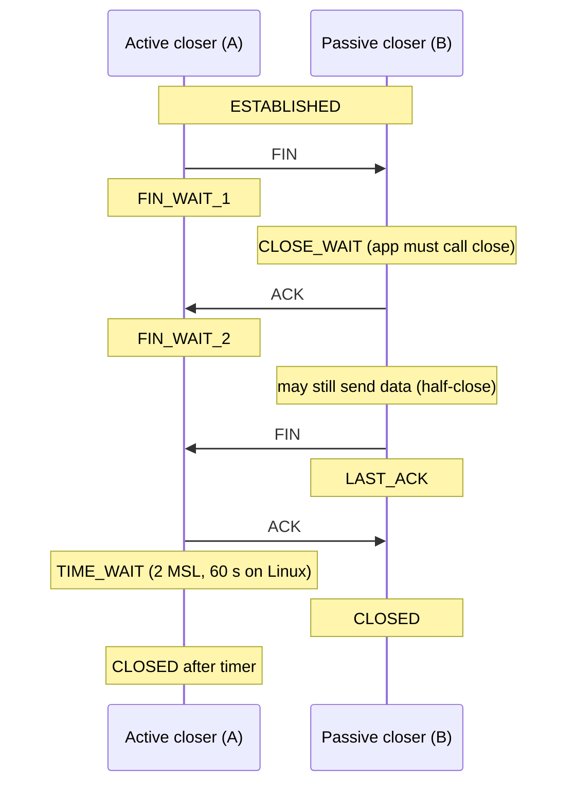

## Mental Model

Ending a TCP conversation politely takes both sides saying goodbye **separately**, because each direction of the connection is an independent stream:

- A: "I'm done talking." (FIN) — B: "Noted." (ACK)
- …B may keep talking for a while (**half-close**)…
- B: "I'm done too." (FIN) — A: "Noted." (ACK)

Then A, who hung up first, **waits around for a while** (TIME_WAIT) in case its last "Noted" got lost and B repeats its goodbye, and to make sure stray old packets die before anyone reuses the same line.

A **RST** is hanging up abruptly: "This connection doesn't exist / is aborted" — no waiting, no graceful drain.

## Definition

- **FIN**: "I have no more data to send" (closes one direction). Consumes one sequence number.
- **RST (reset)**: abort the connection immediately; the peer discards state. Sent when a segment arrives for a non-existent connection, on abortive close, or by middleboxes.
- **TIME_WAIT**: state entered by the side that **actively closes** (sends the first FIN) after the final ACK; lasts **2 × MSL** (maximum segment lifetime) — 60 s on Linux.
- **CLOSE_WAIT**: state of the side that **received** a FIN but whose application hasn't called `close()` yet.
- **Keep-alive**: optional probes on idle connections to detect dead peers or refresh middlebox state.

## Why It Exists

- Graceful close guarantees all data in both directions is delivered before the connection disappears.
- TIME_WAIT prevents two real problems: a lost final ACK (the peer would retransmit its FIN and get an RST, reporting an error instead of a clean close) and **old delayed segments** from this connection being accepted by a new connection with the same 4-tuple.

## How It Works

### The four-way close



B often sends its ACK and FIN together (three segments). `shutdown(fd, SHUT_WR)` sends a FIN while keeping the read side open — used, for example, to signal end-of-request while still reading the response.

### TIME_WAIT — who pays and how much

- It sits on the **active closer**. If clients close, clients hold TIME_WAIT; if servers close (common for HTTP/1.0-style "close after response"), servers accumulate it.
- Cost per socket: small kernel memory — cheap. The real problem is the **4-tuple being unavailable** for 60 s. A client making thousands of **short-lived connections per second to the same server IP:port** burns ephemeral ports: ~28,000 ports / 60 s ≈ **~470 new connections/s sustained** before exhaustion (`connect: Cannot assign requested address`).
- Fixes, in order of preference: **reuse connections** (HTTP keep-alive, pooling), let the other side close, `net.ipv4.tcp_tw_reuse=1` (allows reusing TIME_WAIT sockets for new *outgoing* connections when timestamps make it safe), widen `ip_local_port_range`, spread across more destination IPs/ports. (Never use the removed `tcp_tw_recycle`, which broke clients behind NAT.)

### CLOSE_WAIT — almost always an application bug

A socket in CLOSE_WAIT means: the peer closed, the kernel ACKed, and **your application never called `close()`**. Thousands of CLOSE_WAIT sockets = a leak: connections not returned to a pool, not closed on an error path, or a thread stuck before it can close. They hold file descriptors until the process exits ([File Descriptors](lesson:os-file-descriptors)).

```bash
$ ss -tan state close-wait | wc -l
18422                          # leak — find the code path that doesn't close
$ ss -tan state time-wait | wc -l
9310                           # normal-ish for busy clients; worry only if ports run out
```

### When RST happens

- SYN to a closed port → RST ("connection refused").
- Data arrives for a connection the host doesn't know (after a crash/restart, or after a NAT/load balancer dropped its state) → RST ("connection reset by peer").
- Closing a socket with unread data in its receive buffer → Linux sends RST instead of FIN (data loss signal to the peer).
- `SO_LINGER` with timeout 0 → abortive close (RST, skips TIME_WAIT) — sometimes used to avoid TIME_WAIT, but it discards unsent data and can confuse peers; avoid unless you understand the consequences.
- Middleboxes (firewalls, LBs) enforcing idle timeouts often RST both sides.

### Keep-alive

TCP itself sends nothing on an idle connection, so a peer that vanished (power loss, cable cut, NAT timeout) goes unnoticed until you write. **TCP keep-alive** sends probes after an idle period:

- Linux defaults: `tcp_keepalive_time` = 7,200 s (2 hours!), `intvl` = 75 s, `probes` = 9 → dead peers detected after ~2 h 11 min.
- Applications set per-socket values (`TCP_KEEPIDLE`, `TCP_KEEPINTVL`, `TCP_KEEPCNT`), e.g., 60 s / 10 s / 3.
- Keep-alive probes also refresh NAT and load-balancer idle timers ([NAT](lesson:cn-nat)).
- Many protocols add **application-level heartbeats** (WebSocket ping/pong, HTTP/2 PING, gRPC keepalive, database pool validation) for faster, end-to-end liveness checks.

Don't confuse with **HTTP keep-alive**, which means reusing a TCP connection for multiple HTTP requests ([HTTP Connections](lesson:cn-http-connections)).

## Internal Mechanism

:::depth{level=advanced}
### Half-open connections and TCP_USER_TIMEOUT

If a peer disappears while you have unacknowledged data, TCP retransmits with exponential backoff up to `tcp_retries2` (default 15 → roughly 15–30 minutes) before erroring. Keep-alive doesn't help while data is outstanding. `TCP_USER_TIMEOUT` bounds how long transmitted data may stay unacknowledged before the connection is aborted — valuable for databases and message brokers that must fail over quickly.
:::

## Example

Load-test symptom: a client benchmark opens a new connection per request at 1,000 requests/s to one server and closes each connection itself after reading the response. The client is the active closer, so every connection leaves a client-side TIME_WAIT entry for 60 s: 1,000/s × 60 s = 60,000 entries — more than the ~28,000 ephemeral ports. After about 28 seconds, `connect()` starts failing with "Cannot assign requested address". Enabling keep-alive (reusing a few connections for all requests) drops connection churn, and TIME_WAIT, to near zero.

::viz{id=tcp-handshake}

## Complexity & Performance

- TIME_WAIT sockets: cheap in memory; expensive in 4-tuple availability for high connection churn.
- Connection churn also costs handshakes (1–3 RTTs with TLS) and CPU → reuse connections.

## Trade-offs

- Long TIME_WAIT: protection against stale segments vs port availability.
- Aggressive keep-alive: fast dead-peer detection vs extra packets and battery on mobile.
- Abortive close (RST): immediate resource release vs data loss and error reports on the peer.

## Failure Modes

- **CLOSE_WAIT accumulation** → fd exhaustion (application bug).
- **Ephemeral port exhaustion** from TIME_WAIT with high-churn short connections.
- **"Connection reset by peer"** after idle periods: a middlebox dropped state; the next write gets RST.
- **Stale pooled connections**: pools handing out connections the server or LB already closed → first request fails; mitigate with validation, max lifetime shorter than server/LB idle timeouts, and retry-safe requests.

## In Production

- Pool settings: max lifetime and idle timeout below the server's and load balancer's idle timeouts (e.g., AWS ALB 60 s default, many DBs and proxies have their own).
- Alert on CLOSE_WAIT counts; investigate TIME_WAIT only if you see port-exhaustion errors.
- Case study: [TCP Connection Exhaustion](case:connection-exhaustion).

## Deeper Connections

- Ephemeral ports and socket states: [Sockets](lesson:cn-sockets). NAT timeouts: [NAT](lesson:cn-nat).
- Pools across app ↔ proxy ↔ database, and why connection lifetime settings matter: [Connection Management](lesson:x-connection-management).

## Common Misconceptions

- **"TIME_WAIT is a problem that should be eliminated."** It's a safety mechanism; the fix for churn is connection reuse.
- **"TIME_WAIT happens on the server."** It happens on whichever side closes first.
- **"CLOSE_WAIT is a kernel issue."** It's the application not closing sockets.
- **"TCP keep-alive and HTTP keep-alive are the same."** One probes idle connections; the other reuses connections for multiple requests.

## Interview Questions

### [L1 · trace] Describe how a TCP connection is closed.

The side closing first sends FIN; the other side ACKs it (entering CLOSE_WAIT, and may continue sending data). When that side's application closes, it sends its own FIN (LAST_ACK); the first side ACKs it and enters TIME_WAIT for 2×MSL before fully closing. Four segments in total (the middle ACK and FIN are often combined).

### [L2 · why] Why does TIME_WAIT exist and why does it last 2×MSL?

To ensure the final ACK can be retransmitted if lost (the peer would resend its FIN), and to let any delayed segments from the old connection expire so they can't be mistaken for data in a new connection with the same 4-tuple. 2×MSL covers a segment's maximum lifetime in each direction.

### [L2 · compare] What's the difference between FIN and RST?

FIN gracefully signals that a side has finished sending; the connection closes after both sides exchange FIN/ACK, and all data is delivered. RST aborts immediately: the receiver discards the connection state and any unread data, and applications see "connection reset". RST is sent for unknown connections, abortive closes, or by middleboxes.

### [L3 · debugging] A service has 20,000 sockets in CLOSE_WAIT and eventually fails with "too many open files". Diagnose.

The peers closed their ends, but the application never called close() on these sockets — typically connections not closed on error or timeout paths, responses not fully consumed so pooled connections are never released, or threads stuck before cleanup. Find the owning code with `ss -tanp state close-wait` (process and peer addresses), thread dumps, and review connection handling (try-with-resources/defer/with). Restarting only buys time.

### [L3 · numerical] A client opens and closes short-lived connections to one backend IP:port. With 28,000 ephemeral ports and a 60 s TIME_WAIT on the client, what sustained connection rate exhausts the ports?

28,000 / 60 ≈ **~467 connections per second**. Beyond that, new connections fail with EADDRNOTAVAIL until TIME_WAIT entries expire. Fix with connection reuse, tcp_tw_reuse, a wider port range, or more destination addresses.

### [L4 · design] Your service keeps long-lived gRPC connections to a database proxy through a cloud load balancer with a 350 s idle timeout. Occasionally the first request after a quiet period fails. What would you configure?

The LB silently drops idle flows after 350 s; the next request hits a dead connection (RST or timeout). Configure keep-alive pings below the timeout (gRPC keepalive time e.g. 60 s, or TCP keep-alive idle < 350 s), set client connection max-age/idle limits below the LB timeout so connections are recycled proactively, and make the first request retry-safe (idempotent or retried once on connection errors).

## Practice

### [numeric 467 ±10] Ephemeral ports: 28,000. TIME_WAIT: 60 s. Approximate maximum sustained new connections per second to one destination IP:port?

:::answer
28,000 / 60 ≈ **467** per second.
:::

### [mcq] Which socket state indicates the local application has not closed a connection that the peer already closed?

- [ ] TIME_WAIT
- [ ] FIN_WAIT_2
- [x] CLOSE_WAIT
- [ ] SYN_RECV

CLOSE_WAIT persists until the local app calls close().

## Quick Revision

- Close: FIN → ACK → (half-close) → FIN → ACK. Active closer → **TIME_WAIT** (2×MSL, 60 s Linux).
- TIME_WAIT protects against lost final ACK and stale segments; costs 4-tuples → port exhaustion at ~28K/60 s ≈ 470 conn/s to one destination → reuse connections, tcp_tw_reuse.
- **CLOSE_WAIT** pile-up = app not closing sockets.
- RST: closed port, unknown connection, unread data on close, SO_LINGER 0, middlebox timeouts.
- TCP keep-alive default 2 h → tune or use app heartbeats; refresh NAT/LB timers. ≠ HTTP keep-alive.
- `TCP_USER_TIMEOUT` bounds hangs with unacknowledged data.
