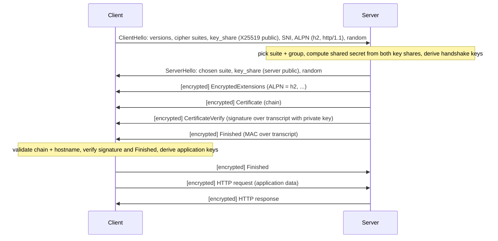

## Mental Model

The TLS handshake answers three questions in as few round trips as possible:

1. **Which algorithms will we use?** (negotiate version, cipher suite, key-exchange group)
2. **What secret keys do we share?** (ephemeral Diffie–Hellman: each side sends a *key share*)
3. **Are you really who you claim?** (the server shows a certificate and **signs** the conversation so far with its private key)

TLS 1.3 overlaps these cleverly: the client *guesses* the key-exchange group and sends its key share immediately, so after **one round trip** both sides have keys and the server is authenticated. Everything after the ServerHello — including the certificate — is already encrypted.

## Definition

**TLS (Transport Layer Security)** provides confidentiality, integrity and server (optionally client) authentication for a reliable byte stream. **HTTPS** is HTTP carried inside TLS (TCP port 443; HTTP/3 uses TLS 1.3 inside QUIC). TLS 1.3 (RFC 8446, 2018) is the current version; TLS 1.2 remains common; 1.0/1.1 are deprecated.

## Why It Exists

**The problem.** To stop eavesdropping, tampering and impersonation on untrusted networks — and, with HTTPS everywhere, to protect cookies, credentials and content integrity (no ISP ad injection, no tampered downloads).

**What the handshake must achieve.** Before the first encrypted byte, two strangers must (1) agree on algorithms, (2) agree on a secret key nobody else can compute, and (3) prove the server is who it claims. The previous two lessons supply the tools — Diffie–Hellman for (2), certificates and signatures for (3). The handshake is the choreography that uses them.

**The design goal of TLS 1.3.** Every round trip costs latency, so do as much as possible in the first message: the client *guesses* which key-exchange method the server will accept and sends its half immediately.

:::callout[That's all it is]{type=insight}
Client: "here are my options and my half of a key exchange". Server: "here's my half, my certificate, and a signature proving I own it". Both now compute the same key and everything after is encrypted. One round trip.
:::

## How It Works

### TLS 1.3 full handshake (after the TCP handshake)



Message by message:

| Message | Purpose |
|---|---|
| **ClientHello** | Supported versions/suites/groups, the client's **ephemeral key share**, **SNI** (which hostname — lets one IP host many certificates), **ALPN** (which application protocol: `h2`, `http/1.1`) |
| **ServerHello** | Chosen parameters and the server's key share. Now both sides compute the (EC)DHE shared secret. |
| **EncryptedExtensions** | Remaining negotiated extensions (e.g., ALPN result) — already encrypted |
| **Certificate** | Server's certificate chain — **encrypted in TLS 1.3** (plaintext in 1.2) |
| **CertificateVerify** | Server **signs a hash of the entire handshake transcript** with its private key — proves it owns the certificate *and* that nobody tampered with the negotiation |
| **Finished** (both) | MAC over the transcript with keys derived from the handshake secret — confirms both sides derived the same keys and saw the same messages |

**Round trips**: TCP (1 RTT) + TLS 1.3 (1 RTT) → the request leaves after **2 RTTs**; the response arrives after 3. TLS 1.2 needs 2 RTTs of TLS (3 before the request).

::viz{id=tls-handshake}

### Where the keys come from

The (EC)DHE shared secret goes through **HKDF** together with transcript hashes to produce: client and server **handshake traffic keys** (encrypting the rest of the handshake), then **application traffic keys** (one per direction), plus a resumption secret. Records are then protected with an AEAD cipher (AES-GCM or ChaCha20-Poly1305) and per-record nonces from sequence numbers ([Crypto Foundations](lesson:cn-crypto-foundations)).

### TLS 1.2 vs 1.3

| | TLS 1.2 | TLS 1.3 |
|---|---|---|
| Round trips (full) | 2 | 1 |
| Key exchange | RSA key transport or (EC)DHE | (EC)DHE only → always forward secret |
| Certificate | Plaintext | Encrypted |
| Cipher suites | Many, incl. weak (CBC, RC4, SHA-1) | Five AEAD suites |
| Resumption | Session IDs / tickets | PSK tickets, optional 0-RTT |
| Renegotiation | Yes (source of bugs) | Removed |

### Resumption and 0-RTT

Most connections are from clients that visited recently. Re-doing certificate checks and signatures each time wastes CPU and bytes, so let them reuse what they established. After a full handshake, the server issues a **session ticket** (an encrypted pre-shared key). A returning client presents it:

- **1-RTT resumption** skips certificate transfer/verification (cheaper CPU, smaller messages; still 1 RTT, with a fresh DH exchange for forward secrecy).
- **0-RTT**: the client sends "early data" (e.g., a GET) in its first flight, encrypted with the PSK. Saves a round trip but is **replayable** — only idempotent requests belong in it; servers reply `425 Too Early` to reject.

## Internal Mechanism

### What HTTPS adds beyond encryption

"HTTPS = HTTP + encryption" misses most of the value:

- **Authentication** of the server (certificates + CertificateVerify) — the whole point against MITM.
- **Integrity** — any modification is detected (AEAD tags).
- **Downgrade protection** — the signed transcript prevents attackers from forcing weaker parameters; TLS 1.3 also embeds downgrade sentinels in ServerHello.random.
- **A platform for modern features**: browsers only enable HTTP/2, HTTP/3, service workers, geolocation, secure cookies and many APIs on secure origins.
- **HSTS** (`Strict-Transport-Security: max-age=31536000; includeSubDomains; preload`): tells browsers to **never** use plain HTTP for this site again, defeating SSL-stripping attacks where a MITM intercepts the initial `http://` request. The HSTS **preload list** protects even the very first visit.

What HTTPS does **not** hide: the destination IP, the connection's timing and sizes, and (unless ECH is used) the SNI hostname in the ClientHello. **Encrypted Client Hello (ECH)** addresses the last one.

:::depth{level=advanced}
### Termination points

In production, TLS usually terminates at a CDN or load balancer; traffic to the origin may be re-encrypted (end-to-end TLS) or not. Every termination point holds private keys and sees plaintext — a trust and compliance consideration. mTLS between services (service meshes) re-establishes end-to-end authenticity inside the network ([Service Networking](lesson:cn-service-networking)).

### Handshake CPU at scale

The server's signature (CertificateVerify) is the expensive per-handshake operation (ECDSA is far cheaper than RSA-2048 signing). A burst of new connections (after a deploy, a failover, or a reconnect storm) can saturate CPU on TLS terminators — resumption, connection reuse, and ECDSA certificates mitigate it.
:::

## Example

```bash
$ curl -sv https://example.com -o /dev/null 2>&1 | grep -E "SSL connection|ALPN|subject|expire date|issuer"
* ALPN: curl offers h2,http/1.1
* SSL connection using TLSv1.3 / TLS_AES_256_GCM_SHA384 / X25519 / ECDSA
* ALPN: server accepted h2
*  subject: CN=example.com
*  expire date: Jan 15 23:59:59 2027 GMT
*  issuer: C=US; O=DigiCert Inc; CN=DigiCert Global G3 TLS ECC SHA384 2020 CA1
```

## Complexity & Performance

- New connection latency: +1 RTT (TLS 1.3), +2 RTT (TLS 1.2); 0 with 0-RTT resumption.
- CPU: asymmetric operations per handshake (signing dominates); bulk AEAD encryption is cheap with hardware support.
- Bytes: certificate chains add a few KB per full handshake.

## Trade-offs

- 0-RTT: lower latency vs replay risk.
- Long session-ticket lifetimes: more resumptions vs weaker forward secrecy for ticket-encrypted state (rotate ticket keys).
- Terminating TLS at the edge: performance and features vs plaintext inside your network (re-encrypt or mTLS).

## Failure Modes

The usual suspects:

| Symptom | Likely cause |
|---|---|
| `certificate has expired` | Expired leaf/intermediate; client clock wrong |
| `unable to get local issuer certificate` | Missing intermediate in server chain; private CA not in client trust store |
| `hostname mismatch` | SAN doesn't include the requested name (or wrong SNI) |
| `handshake failure` / `no shared cipher` / `protocol version` | Client and server share no version/suite (old clients vs TLS 1.3-only servers, disabled TLS 1.2) |
| Works in browser, fails in app | App doesn't fetch missing intermediates; different trust store; no SNI |
| Intermittent failures after deploy | Some load balancer nodes serving the old certificate |

## In Production

- Standard config: TLS 1.2 + 1.3 only, AEAD suites, ECDSA certs (with RSA fallback if needed), OCSP stapling, HSTS, automated renewal.
- Monitor handshake error rates and certificate expiry at every endpoint; test with `openssl s_client` and SSL Labs.
- Case study: [TLS Certificate Expiry](case:tls-expiry).

## Deeper Connections

- Building blocks: [Crypto Foundations](lesson:cn-crypto-foundations), [Certificates & PKI](lesson:cn-certificates-pki).
- QUIC merges this handshake with the transport's ([HTTP/3 & QUIC](lesson:cn-http3-quic)); ALPN picks HTTP/2 ([HTTP/2](lesson:cn-http2)).
- The full picture of a page load: [Opening a Website, End to End](lesson:x-website-journey).

## Common Misconceptions

- **"The server encrypts data with its public key."** TLS 1.3 uses the certificate key only to sign; data keys come from ephemeral DH.
- **"HTTPS hides which site I visit."** IPs are visible and SNI is plaintext unless ECH is used; DNS may leak too (unless DoH/DoT).
- **"TLS adds huge overhead."** Handshakes cost 1 RTT and some CPU; bulk encryption is cheap with AES-NI.

## Interview Questions

### [L1 · trace] What happens during a TLS handshake?

The client sends ClientHello with supported versions, cipher suites, an ephemeral key share, SNI and ALPN. The server replies with ServerHello and its key share; both compute a shared secret via ECDHE and derive handshake keys. The server sends (encrypted) its certificate chain, a CertificateVerify signature over the handshake transcript proving it owns the private key, and Finished. The client validates the certificate and signature, sends Finished, and both switch to application keys to encrypt HTTP traffic. In TLS 1.3 this takes one round trip.

### [L2 · compare] How is TLS 1.3 different from TLS 1.2?

1-RTT handshakes instead of 2 (and optional 0-RTT resumption); only ephemeral (EC)DHE key exchange, so forward secrecy is mandatory (RSA key transport removed); only AEAD cipher suites; the certificate and most of the handshake are encrypted; renegotiation and many legacy features removed; built-in downgrade protection.

### [L2 · why] Why does the server send CertificateVerify, and what does it sign?

Sending a certificate proves nothing by itself (certificates are public). CertificateVerify is a signature, with the certificate's private key, over a hash of the entire handshake transcript — proving the server possesses the private key and binding the authentication to this specific handshake (including both key shares and negotiated parameters), which prevents MITM and downgrade attacks.

### [L3 · what-if] What is HSTS and what attack does it prevent?

HSTS is a response header instructing browsers to only use HTTPS for the domain (optionally subdomains) for a period. It prevents SSL-stripping: an attacker intercepting a user's initial plain-HTTP request and keeping them on HTTP while proxying to the real HTTPS site. With HSTS (and the preload list for first visits), the browser never makes the HTTP request.

### [L3 · debugging] curl works against your API but a Java client fails with "PKIX path building failed". What's going on?

The Java client can't build a chain to a trusted root: typically the server doesn't send the intermediate certificate (curl/browsers may compensate; Java doesn't fetch it), or the certificate is issued by a private/internal CA not in the JVM's truststore. Fix the server to send the full chain, or add the private CA to the client's truststore.

### [L4 · incident] After a region failover, thousands of clients reconnect at once and your TLS-terminating load balancers hit 100% CPU. Why, and what mitigations exist?

Every reconnect requires a full TLS handshake with an asymmetric signature on the server (and certificate transfer); a reconnect storm turns into a CPU spike. Mitigations: session resumption (tickets shared across the LB fleet so resumed handshakes skip signing), ECDSA certificates (much cheaper signing than RSA), jittered client reconnect backoff, connection reuse (HTTP/2) to minimize handshakes, autoscaling/overprovisioning TLS terminators, and offloading to CDN edges.

## Practice

### [numeric 2] With TCP and TLS 1.3 (no resumption), how many round trips elapse before the client can send its first HTTP request?

:::answer
1 RTT for the TCP handshake + 1 RTT for the TLS 1.3 handshake = **2**.
:::

### [mcq] Which TLS extension lets a single IP address serve certificates for many hostnames?

- [ ] ALPN
- [x] SNI (Server Name Indication)
- [ ] OCSP stapling
- [ ] Session tickets

The client names the host it wants in the ClientHello.

### [mcq] Which TLS 1.3 message is the first one sent encrypted by the server?

- [ ] ServerHello
- [x] EncryptedExtensions
- [ ] Certificate
- [ ] Finished

Everything after ServerHello is encrypted with handshake keys.

## Quick Revision

- ClientHello (suites, key_share, SNI, ALPN) → ServerHello (key_share) → [enc] EncryptedExtensions, Certificate, **CertificateVerify** (signs transcript), Finished → client Finished → data. **1 RTT**.
- Keys: ECDHE secret + transcript → HKDF → handshake keys → application keys; AEAD records.
- TLS 1.3 vs 1.2: 1 vs 2 RTT, mandatory forward secrecy, encrypted cert, AEAD-only.
- Resumption via PSK tickets; 0-RTT is replayable → idempotent only.
- HTTPS = authentication + integrity + confidentiality + downgrade protection; HSTS defeats SSL stripping; SNI visible unless ECH.
- Failures: expiry, missing intermediate, hostname mismatch, version/suite mismatch, clock skew.
