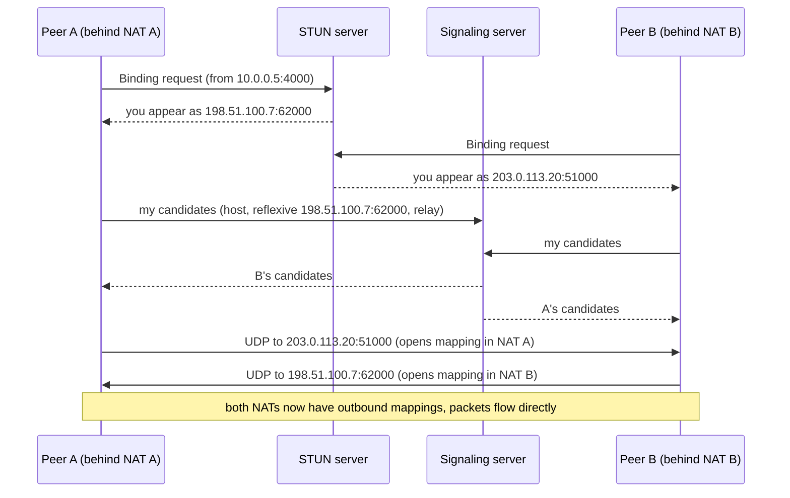

## Mental Model

- A **VPN** is a **sealed pipe through a public building**: packets for a private network are encrypted and wrapped inside ordinary packets addressed to a VPN gateway, which unwraps them on the other side. To the private network, your laptop looks locally attached.
- **NAT traversal** solves a different problem: two people each behind a receptionist (NAT) who blocks unexpected calls. They both call a **mutual friend** (a STUN server) to learn their public phone numbers, then **call each other simultaneously**, so each receptionist sees an "outgoing call" and lets the other's call through (**hole punching**). If the receptionists are too strict, they talk through the friend instead (a **TURN relay**).

## Definition

- **VPN (virtual private network)**: an encrypted tunnel carrying private traffic over a shared network. **Site-to-site** (connect networks) or **remote access** (connect devices).
- **IPsec**: IP-layer encryption/authentication suite (IKEv2 key exchange, ESP data), common for site-to-site and cloud VPNs.
- **WireGuard**: a modern, minimal UDP-based VPN using fixed modern cryptography (Noise protocol framework, Curve25519, ChaCha20-Poly1305), in the Linux kernel since 5.6.
- **TLS VPNs** (OpenVPN, many corporate SSL VPNs): tunnels built on TLS, over UDP or TCP.
- **STUN**: a protocol for a client to discover its public (NAT-mapped) address and port.
- **TURN**: a relay server forwarding traffic when direct connectivity fails.
- **ICE**: the framework (used by WebRTC) that gathers candidate addresses (local, STUN-reflexive, TURN-relayed), exchanges them via signaling, and tests pairs to pick the best working path.

## Why It Exists

Two different problems, both caused by the public internet not being shaped the way we want:

- Organizations need private connectivity between offices, clouds and remote workers without leased lines.
- Peer-to-peer apps (video calls, games, file sharing, mesh VPNs like Tailscale) want direct low-latency paths between devices, but NAT blocks unsolicited inbound traffic ([NAT](lesson:cn-nat)).

**The ideas.** For VPNs: if you can't have a private cable, make a private *envelope* — encrypt private packets and send them inside ordinary public packets. For NAT traversal: since NATs only let in replies to outbound traffic, have both sides send outbound packets to each other at the same moment, so each NAT thinks the other's packets are replies.

:::callout[That's all it is]{type=insight}
A VPN wraps private packets in encrypted public packets. Hole punching gets two devices behind NATs talking by having both "call out" at once; when that fails, a relay in the middle forwards their traffic.
:::

## How It Works

### A tunnel packet

```text
Original:  [IP 10.0.1.5 → 10.8.2.9][TCP][data]                      (private addresses)
Tunnelled: [IP 198.51.100.7 → 203.0.113.20][UDP 51820][WireGuard hdr][ encrypted original packet ][tag]
```

Encapsulation adds overhead → a smaller effective MTU (WireGuard default 1,420) → MSS clamping or correct MTUs required ([MTU](lesson:cn-mtu-congestion)).

### VPN designs compared

| | IPsec (IKEv2) | WireGuard | TLS VPN (OpenVPN) |
|---|---|---|---|
| Layer | IP | IP over UDP | Over TLS (UDP or TCP) |
| Complexity | High (many options, negotiation) | Minimal (~4K lines kernel code) | Moderate |
| Performance | High (kernel, hardware offload) | High (kernel) | Lower (user space, TCP-over-TCP issues) |
| NAT friendliness | Needs NAT-T (UDP 4500) | Native (UDP), keepalives | Good (TCP 443 passes firewalls) |
| Typical use | Cloud/site-to-site, enterprise | Modern remote access, mesh VPNs | Legacy remote access |

**TCP-over-TCP meltdown**: tunneling TCP inside a TCP-based VPN stacks two retransmission/congestion loops; under loss, inner and outer TCP both back off and retransmit, collapsing throughput — why UDP transports are preferred for tunnels.

### Zero trust vs VPN

Traditional VPNs grant network-level access ("once inside, you can reach everything"). **Zero-trust** access (identity-aware proxies, BeyondCorp-style) authenticates and authorizes each request to each application, reducing lateral movement. Mesh VPNs with per-device ACLs sit in between.

### NAT traversal step by step

The two obstacles: neither peer knows its own public address, and neither NAT will accept an unexpected packet. STUN solves the first; simultaneous sending solves the second.



- Works when NATs use **endpoint-independent mapping** (the same public port for all destinations).
- With **address/port-dependent ("symmetric") NATs**, the port seen by STUN differs from the one used toward the peer → hole punching fails → **TURN relay** (more latency and relay bandwidth cost). Roughly, most connections succeed directly and a minority need relays, depending on networks.
- TCP hole punching exists (simultaneous open) but is less reliable; UDP (and QUIC over UDP) is the norm.

## Internal Mechanism

:::depth{level=advanced}
### Keepalives and mapping lifetimes

NAT UDP mappings expire quickly (often 30–120 s idle). Both VPNs (WireGuard's `PersistentKeepalive = 25`) and WebRTC send periodic keepalives to keep mappings open. Mobile networks with CGNAT may rebind mappings; protocols that identify sessions by cryptographic keys (WireGuard) or connection IDs (QUIC) survive address changes gracefully ([HTTP/3 & QUIC](lesson:cn-http3-quic)).

### Split tunneling and DNS

Full-tunnel VPNs send all traffic through the gateway (control, inspection) at the cost of latency and bandwidth; split tunneling sends only private prefixes through the tunnel. DNS must be split too (private names to internal resolvers) — misconfiguration leaks internal queries or breaks internal names.
:::

## Example

A minimal WireGuard peer configuration:

```ini
[Interface]
PrivateKey = <client private key>
Address = 10.8.0.2/32
DNS = 10.8.0.1
MTU = 1420

[Peer]
PublicKey = <server public key>
Endpoint = vpn.example.com:51820
AllowedIPs = 10.0.0.0/8          # split tunnel: only private ranges via VPN
PersistentKeepalive = 25
```

## Complexity & Performance

- Encryption overhead is small with modern ciphers; the bigger costs are extra hops (hairpinning through a gateway), MTU reduction and TURN relays.
- Direct P2P paths give the lowest latency; relays add a detour.

## Trade-offs

- Site-to-site VPNs: cheap and flexible vs internet-path variability (dedicated interconnects for predictable performance).
- Full vs split tunnel: control vs performance.
- P2P direct vs relayed: latency and cost vs guaranteed connectivity.

## Failure Modes

- MTU black holes over tunnels.
- Overlapping private address ranges between connected networks ([IPv4 Addressing](lesson:cn-ipv4-addressing)).
- NAT mapping timeouts dropping idle tunnels without keepalives.
- Symmetric NATs forcing expensive relays; TURN capacity shortfalls.
- DNS leaks or broken internal resolution with split tunnels.

## In Production

- Cloud: managed site-to-site IPsec VPNs with redundant tunnels (often BGP over the tunnels for failover); private interconnects for bandwidth.
- WebRTC apps run STUN/TURN infrastructure (coturn) sized for relay traffic.
- Mesh VPNs (Tailscale, Netbird) automate WireGuard keys, NAT traversal and relays (DERP).

## Deeper Connections

- NAT behaviors: [NAT](lesson:cn-nat). UDP as the substrate: [UDP](lesson:cn-udp). Tunnel MTU: [MTU & Bottlenecks](lesson:cn-mtu-congestion). Keys and ciphers: [Crypto Foundations](lesson:cn-crypto-foundations).

## Common Misconceptions

- **"A VPN makes you anonymous and secure."** It shifts trust to the VPN provider/gateway and protects the path to it; end-to-end TLS still matters.
- **"Peer-to-peer means no servers are involved."** Signaling, STUN and often TURN servers are required.
- **"Any two NATed devices can connect directly."** Symmetric NATs often require relays.

## Interview Questions

### [L2 · conceptual] What is a VPN and how does it work?

A virtual private network creates an encrypted tunnel over a public network: packets destined for the private network are encrypted and encapsulated inside packets addressed to a VPN gateway, which decrypts and forwards them. It provides confidentiality and integrity over untrusted networks and makes remote devices or sites appear directly connected to the private network.

### [L3 · how] How do two devices behind NATs establish a direct connection?

Each learns its public address/port mapping from a STUN server, they exchange candidate addresses through a signaling server, and then both send UDP packets to each other's public mappings at about the same time. Each outgoing packet creates a NAT mapping that allows the peer's packets through (hole punching). ICE tests candidate pairs and falls back to a TURN relay when NATs (e.g., symmetric) prevent a direct path.

### [L3 · why] Why do VPNs prefer UDP transports over TCP?

Tunneling TCP inside TCP stacks two reliability and congestion-control loops: under loss, both layers retransmit and back off, causing severe throughput collapse and latency spikes ("TCP meltdown"). A UDP-based tunnel lets the inner transport handle reliability alone, and UDP traverses NATs well.

## Practice

### [mcq] Which server type relays media between peers when direct NAT traversal fails?

- [ ] STUN
- [x] TURN
- [ ] DNS
- [ ] DHCP

TURN relays traffic; STUN only discovers addresses.

### [numeric 1420] WireGuard's default interface MTU on a 1,500-byte IPv4 path (reserving 80 bytes for IPv6 underlay compatibility)?

:::answer
WireGuard's default is **1,420** bytes (1,500 − 80), which fits both IPv4 (60 B overhead) and IPv6 (80 B) underlays.
:::

## Quick Revision

- VPN = encrypted encapsulation to a gateway; site-to-site vs remote access; IPsec, WireGuard (UDP, minimal), TLS VPNs; avoid TCP-over-TCP.
- Overhead → smaller MTU → MSS clamping; keepalives for NAT mappings; split vs full tunnel (+ split DNS).
- Zero trust = per-request, per-app authorization vs network-level VPN access.
- NAT traversal: STUN (discover mapping) + signaling + simultaneous UDP (hole punching); ICE picks paths; TURN relays when symmetric NATs block.
