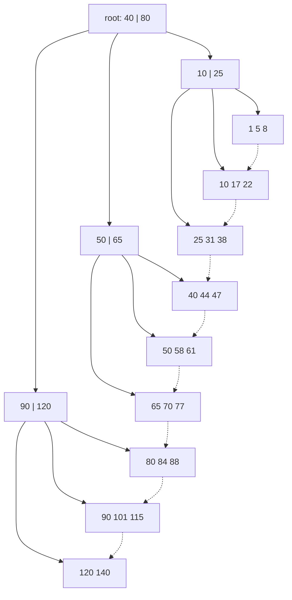

## Mental Model

A B+ tree is a **sorted list of keys chopped into pages, plus a small multi-level table of contents** above it. The leaves hold every key in order (and pointers to rows, or the rows themselves), linked left to right. Internal pages hold only separator keys that route a search to the right child.

Because each page holds hundreds of keys, the tree is **very wide and very shallow**: three or four levels index billions of rows. Finding a key means reading one page per level — and the top levels are always in the buffer pool — so a lookup is typically **one or two actual disk reads**.

## Definition

- **Order / fanout (m)**: the maximum number of children of an internal node (hundreds, determined by page size ÷ entry size).
- **Internal node**: up to m − 1 separator keys and m child pointers; routes searches.
- **Leaf node**: keys with their payload (a row pointer/TID, the primary key, or the whole row in a clustered index); leaves are linked in key order.
- **Invariants**: all leaves at the same depth; every node except the root at least half full; keys sorted within and across nodes.
- **B-tree vs B+ tree**: in a classic B-tree, internal nodes also carry data; in a B+ tree, **data lives only in leaves** and internal nodes are pure routing — higher fanout, and range scans simply walk the leaf chain. Databases use B+ trees (often still calling them "B-trees").

## Why It Exists

A binary search tree over 1 billion keys is ~30 levels deep. If each level is a random disk read, a lookup takes 30 I/Os. Storage reads whole pages anyway ([Pages & Records](lesson:db-pages-records)), so it's wasteful to use a page for one key and two children. A B+ tree fills each page with hundreds of keys: `log_500(10⁹) ≈ 3.3` levels. Same O(log n) complexity, a ~10× smaller constant in I/Os — the only cost that matters on disk.

Hash tables give O(1) point lookups but no ordering — no ranges, no prefix search, no ORDER BY support. B+ trees give O(log n) lookups **and** ordered access.

## How It Works

### Search

Find 58: root (40 ≤ 58 < 80 → middle child) → internal (50 ≤ 58 < 65 → middle) → leaf → found. One page per level: 3 page reads.

### Range scan

`WHERE key BETWEEN 44 AND 70`: search for 44, then walk right along the leaf chain until a key exceeds 70. Cost: tree height + number of leaf pages covering the range. This is why B+ trees serve `ORDER BY … LIMIT`, `BETWEEN`, prefix `LIKE 'abc%'` and `>` / `<` predicates.

### Insert and page splits

1. Search for the leaf where the key belongs; insert it in sorted position.
2. If the leaf overflows, **split** it: keep the lower half, move the upper half to a new leaf, and insert the new leaf's first key as a separator into the parent.
3. If the parent overflows, split it too — possibly up to the root. A root split creates a new root: **the only way the tree gets taller**, which is why all leaves stay at the same depth.

::viz{id=btree}

### Delete

Remove the key from its leaf. If the leaf falls below half full, **borrow** a key from a sibling (updating the parent's separator) or **merge** with a sibling (removing a separator from the parent, which may cascade upward). Many real systems relax this: they tolerate under-full pages and reclaim them lazily, because merges followed by re-splits are wasted work.

### Height arithmetic

With fanout f and n keys, height ≈ ⌈log_f(n)⌉ levels (plus the leaves' own page reads counted in).

| Keys | Fanout 100 | Fanout 500 |
|---|---|---|
| 1 million | 3 | 3 |
| 1 billion | 5 | 4 |
| 1 trillion | 6 | 5 |

Internal levels are small: with fanout 500 and 1 billion keys, everything above the leaves is about 4,000 pages (~32 MB with 8 KB pages) — the hottest pages in the buffer pool — so most lookups cost **one leaf read** from storage.

## Internal Mechanism

:::depth{level=advanced}
### Keys, payloads and fanout

Fanout = page size ÷ (separator key size + child pointer size). Wide keys (long strings, composite keys, UUIDs) reduce fanout and increase height. Techniques: **prefix/suffix truncation** of separators (PostgreSQL 12+ truncates suffix columns of composite separators), key **deduplication** in leaves (PostgreSQL 13+ stores duplicate keys once with a list of TIDs).

### Sequential vs random inserts

Monotonically increasing keys (identity columns, timestamps, UUIDv7) always insert into the rightmost leaf: splits happen only there and databases split it unevenly (e.g., 90/10) so pages stay nearly full. Random keys (UUIDv4, hashes) hit random leaves, split at 50/50, and leave pages ~70% full on average, with far more pages to cache ([Schema Design](lesson:db-schema-design)).

### Concurrency: latch crabbing and B-link trees

Many threads search and modify the tree concurrently. **Latch crabbing**: take a latch on a child before releasing the parent, and release ancestors early once a node is "safe" (won't split/merge). Optimistic variants take read latches all the way down and restart with write latches only if a split is needed. **B-link trees** (Lehman–Yao, used by PostgreSQL) add a right-link and a high key to every node, so a reader that lands on a node mid-split can move right to find its key — readers need almost no latching.

### Write amplification

Changing one 100-byte row rewrites a whole 8 KB page (and logs the change, plus a full-page image after checkpoints). Every secondary index adds its own page write. This read-optimized, update-in-place design is what LSM trees trade away to favor writes ([LSM Trees](lesson:db-lsm-trees)).

### Bulk loading

Building an index on existing data sorts all keys and builds leaves left to right, full, then builds internal levels bottom-up — far faster than inserting keys one by one and producing compact pages. That's what `CREATE INDEX` does.
:::

## Example

A table of 200 million orders, index on `(customer_id)` with 8-byte keys + 6-byte TIDs + overhead ≈ 20 bytes per leaf entry:

- Leaf entries per 8 KB page ≈ 400 → 200M / 400 = 500,000 leaf pages ≈ 4 GB.
- Internal fanout ≈ 400 → level above leaves: 1,250 pages; next: 4 pages; root: 1. Height = 4 levels.
- The top three levels ≈ 1,255 pages ≈ 10 MB: always cached. A lookup reads ~1 leaf page from storage (if cold) plus the heap pages for matching rows.

Try inserting keys in order vs randomly in the [B+ tree lab](lab:btree) and compare the number of splits and page fill.

## Complexity & Performance

| Operation | Page reads |
|---|---|
| Point lookup | height (≈ 3–4), mostly cached |
| Range scan of k keys | height + k / (entries per leaf) |
| Insert | height + occasional split (O(height) pages in the worst case) |
| Delete | height + occasional merge |
| Build from scratch | sort + one sequential pass |

## Trade-offs

- **B+ tree vs hash index**: hash is O(1) for equality but no ranges/ordering; B+ trees do both, at O(log n) with tiny height.
- **B+ tree vs LSM tree**: B+ trees favor reads (one place to look) and update in place (random writes, write amplification per page); LSM trees turn writes into sequential appends but reads may check several levels ([LSM Trees](lesson:db-lsm-trees)).
- **Fill factor**: fuller pages = fewer pages to read; emptier pages = fewer splits on inserts into the middle of the key space.

## Failure Modes

- **Index bloat**: after heavy updates/deletes, pages are sparsely filled — more pages to scan and cache. `REINDEX CONCURRENTLY` rebuilds compactly.
- **Hot rightmost leaf**: very high insert rates on a monotonic key contend on the same page's latch.
- **Wide keys** (long text, many columns) → low fanout, taller trees, bigger indexes.

## In Production

- Index size and bloat are monitored like table size; unused indexes are dropped because every index is maintained on every write ([Index Design](lesson:db-index-design-practice)).
- `amcheck` (PostgreSQL) verifies B-tree invariants — used when corruption is suspected.

## Deeper Connections

- The page-at-a-time design follows directly from storage behavior ([Storage Devices](lesson:os-storage-devices)); on SSDs random reads are cheap, but the page granularity still dominates.
- Filesystems (Btrfs, XFS directories, NTFS) use B-trees for the same reasons.
- The leaf chain is what makes index-only range scans and merge joins cheap ([Scans & Joins](lesson:db-scans-joins)).

## Common Misconceptions

- **"B-tree lookups cost log₂(n) disk reads."** They cost log_fanout(n) — about 3–4 — and the upper levels are cached.
- **"B+ trees rebalance with rotations like AVL trees."** They grow at the root via splits and shrink via merges; no rotations.
- **"An index makes every query on that column fast."** Only queries that can use its order (see [Index Fundamentals](lesson:db-index-fundamentals)).

## Interview Questions

### [L1 · why] Why do databases use B+ trees instead of binary search trees?

Disk and SSD I/O happens in pages, and each I/O dominates cost. A B+ tree stores hundreds of keys per page, so its height is log base ~hundreds of n — 3–4 levels for billions of keys — versus ~30 levels for a binary tree, each potentially a separate I/O. B+ trees also keep leaves linked in order for efficient range scans.

### [L2 · compare] B-tree vs B+ tree?

In a B-tree, keys and their data can live in internal nodes, and each key appears once. In a B+ tree, internal nodes contain only routing keys and all data is in the leaves, which are linked in key order. B+ trees have higher fanout (smaller internal nodes), identical-depth lookups, and efficient range scans along the leaf chain, which is why databases use them.

### [L2 · how] What happens when you insert into a full leaf page?

The leaf splits: half of its entries move to a new page, the new page is linked into the leaf chain, and a separator key pointing to it is inserted into the parent. If the parent is full it splits too, possibly up to the root; splitting the root adds a new root and increases the tree's height by one.

### [L3 · numerical] An index has 1 billion entries; each page holds 500 entries at every level. How many levels, and how many pages must be read from disk for a lookup if everything above the leaves is cached?

:::answer
Leaves: 10⁹ / 500 = 2,000,000 pages. Next level: 4,000 pages. Next: 8 pages. Root: 1. So **4 levels** (root, two internal levels, leaves). With the three upper levels cached (~4,009 pages ≈ 32 MB), a lookup needs **one** leaf page read — plus the table page(s) for the row if the index isn't covering.
:::

## Practice

### [numeric 3] How many levels does a B+ tree need for 1,000,000 keys if every node holds up to 200 entries (root included)?

:::answer
200 leaf entries per page → 5,000 leaves; 5,000 / 200 = 25 internal pages; 25 fit in one root. Levels: root → internal → leaves = **3**. (Equivalently ⌈log₂₀₀(10⁶)⌉ = ⌈2.6⌉ = 3.)
:::

### [mcq] Which operation is the ONLY way a B+ tree's height increases?

- [ ] Inserting into a full leaf
- [ ] Rebalancing by rotation
- [x] Splitting the root
- [ ] Deleting from a half-full node

Leaf splits add a separator to the parent; only a root split adds a level.

## Quick Revision

- Wide, shallow, sorted: fanout in the hundreds → 3–4 levels for billions of keys; upper levels cached.
- Data only in leaves; leaves linked → range scans, ORDER BY, prefix search.
- Insert → split on overflow, separator to parent; root split = height + 1. Delete → borrow/merge (often lazy).
- Sequential keys: right-edge appends, full pages. Random keys: splits everywhere, ~70% fill.
- Write amplification: whole-page writes per change, per index. Concurrency: latch crabbing, B-link right-links.
