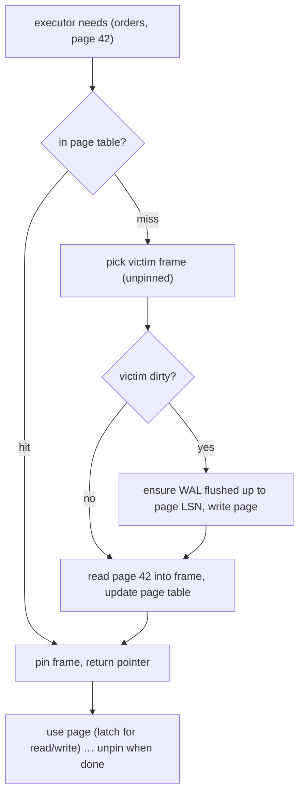

## Mental Model

The buffer pool is **a fixed array of page-sized slots in RAM** plus a hash table mapping "which disk page is in which slot". Every page the database touches — table, index, even the free-space map — goes through it. A query asking for page 42 of `orders` either finds it there (a hit: ~100 ns) or must evict something and read it from storage (a miss: ~100 µs on SSD, ~10 ms on disk).

It's the OS page-replacement problem ([Page Replacement](lesson:os-page-replacement)), solved again by the database, because the database knows things the OS doesn't: which pages are index roots, which reads are one-off scans, and — crucially — **when a dirty page is allowed to be written**.

## Definition

- **Frame**: one page-sized slot in the pool.
- **Page table** (buffer mapping table): hash map page id → frame.
- **Pin count**: number of active users of a frame; a pinned page can't be evicted.
- **Dirty flag**: the in-memory page differs from disk and must be written before its frame is reused.
- **Replacement policy**: chooses a victim frame among unpinned pages.
- **Background writer / page cleaner**: writes dirty pages ahead of time so evictions rarely wait on I/O.
- **Checkpoint**: periodically flushes all dirty pages so recovery can start from a recent point ([Crash Recovery](lesson:db-crash-recovery)).

Sizes: PostgreSQL `shared_buffers` (often ~25% of RAM, relying on the OS cache for the rest); InnoDB `innodb_buffer_pool_size` (often 50–75% of RAM, bypassing the OS cache with O_DIRECT).

## Why It Exists

Memory is ~1,000× faster than SSD. A database whose hot pages (index roots and inner nodes, recent rows) stay in memory serves most requests without I/O. But the OS page cache can't be relied on alone:

1. **Write ordering**: the WAL rule requires that a dirty page not reach disk before the log records describing its change ([WAL](lesson:db-wal-durability)). The OS flushes dirty pages whenever it likes.
2. **Access knowledge**: a sequential scan of a 500 GB table would flush everything useful out of a naive LRU cache.
3. **Concurrency control**: pages must be latched while being modified; the database manages that on its own memory.

## How It Works

### Reading a page



### Replacement policies that survive scans

Pure LRU fails on **sequential flooding**: one big scan touches millions of pages once each and evicts the entire working set. Databases counter it:

- **PostgreSQL clock-sweep**: each frame has a usage count (0–5), incremented on access. A "clock hand" sweeps frames, decrementing counts, and evicts the first unpinned frame with count 0 — an approximation of LRU/LFU ([Page Replacement](lesson:os-page-replacement) CLOCK). Large sequential scans and VACUUM use a small **ring buffer** of frames instead of the main pool, so they can't flush it.
- **InnoDB midpoint insertion LRU**: new pages enter at the 3/8 point of the list (the "old" sublist) and are promoted to the "young" head only if accessed again after a delay (`innodb_old_blocks_time`). A one-time scan cycles through the old sublist without touching hot pages.

### Writing dirty pages

Updates modify pages in memory and generate WAL; the WAL is flushed at commit, **the data page isn't**. Dirty pages are written later by:

- the **background writer** (keeps clean frames available),
- **checkpoints** (flush everything dirty up to a point, spreading I/O over time),
- a **backend itself** when it needs a frame and finds only dirty victims — slow, and a sign the writers can't keep up.

This is the **no-force** policy: commit doesn't force data pages to disk, making commits fast. Combined with **steal** (a dirty page of an *uncommitted* transaction may be written to disk to free a frame), recovery needs both redo and undo information ([Crash Recovery](lesson:db-crash-recovery)).

## Internal Mechanism

:::depth{level=advanced}
### Latches vs locks

Frames are protected by **latches** — short-term, in-memory reader/writer locks held for microseconds while a page is read or modified. They're different from transaction **locks** on rows, held until commit ([Locking](lesson:db-locking)). Hot pages (the rightmost leaf of a sequential index, a counter row's page) cause latch contention visible as `LWLock:BufferContent` waits in PostgreSQL.

### Double buffering

PostgreSQL reads through the OS: a page can be cached both in `shared_buffers` and in the OS page cache — wasted memory, but the OS cache acts as a second tier and simplifies I/O. InnoDB uses `O_DIRECT` to avoid it and sizes its pool to most of RAM. Either way, sizing must leave memory for connections, sorts/hashes (`work_mem`) and the OS.

### Huge pages and NUMA

A 64 GB buffer pool mapped with 4 KB pages needs 16 million page-table entries per process mapping it — TLB misses and page-table memory become significant. Huge pages (2 MB) cut that dramatically ([Huge Pages & NUMA](lesson:os-hugepages-numa)). On multi-socket machines, interleaving the pool across NUMA nodes avoids one node's memory filling up.

### Warm-up

After a restart the pool is empty: latency is high until hot pages are re-read. `pg_prewarm` and InnoDB's buffer-pool dump/restore reload the previous working set.
:::

## Example

EXPLAIN shows buffer activity directly:

```text
EXPLAIN (ANALYZE, BUFFERS) SELECT * FROM orders WHERE customer_id = 42;

Index Scan using orders_customer_id_idx on orders  (actual time=0.03..0.21 rows=37 loops=1)
  Buffers: shared hit=40 read=3
```

40 pages came from the buffer pool (hits), 3 had to be read (from the OS cache or disk). Run it again: likely `hit=43 read=0`. Latency differences between a "cold" and "warm" run of the same query are buffer-pool effects ([EXPLAIN](lesson:db-explain)).

## Complexity & Performance

- Hit: a hash lookup + pin: sub-microsecond. Miss: an I/O (≈ 0.1 ms SSD random read; far more on network storage).
- Hit ratio is only meaningful relative to the working set: 99% hits with 1,000 page reads per query is still 10 misses per query.
- If the working set exceeds RAM, performance falls off a cliff — the database analogue of thrashing ([Thrashing](lesson:os-thrashing-working-set)).

## Trade-offs

- Larger pool → more hits, but less memory for sorts/hashes/connections and, in PostgreSQL, less for the OS cache.
- Aggressive background writing → evictions never wait, but more total writes (a page modified 10 times might be written 10 times instead of once).
- Frequent checkpoints → faster recovery but more I/O and more full-page writes.

## Failure Modes

- **Working set outgrows memory** after data growth — latency jumps without any code change.
- **Cache pollution** from analytical queries or backups on the primary.
- **Backends writing dirty pages themselves** (checkpoints too slow) → latency spikes on unrelated queries.
- **Cold cache after failover/restart** → a thundering herd of slow queries; replicas that served no reads are cold too.

## In Production

- Watch: hit ratio per table/index, reads per second from storage, dirty-page flush rate, checkpoint duration (`pg_stat_bgwriter`, `pg_stat_io`, InnoDB status).
- Capacity rule of thumb: keep the hot working set (active indexes + recent rows) in memory; buy RAM before faster disks for OLTP.

## Deeper Connections

- It's CLOCK and LRU again, from the OS lessons, with database-specific twists ([Page Replacement](lesson:os-page-replacement)).
- The same "cache with write-back and ordering constraints" pattern appears in filesystems, CPUs and CDNs ([Caching Everywhere](lesson:x-caching-everywhere)).
- The WAL rule constrains when frames can be written ([WAL & Durability](lesson:db-wal-durability)).

## Common Misconceptions

- **"COMMIT writes the changed pages to disk."** Commit flushes the WAL; pages are written later.
- **"A 99% hit ratio means the cache is fine."** It depends on how many pages each query touches and on the latency of the 1%.
- **"Give the buffer pool all the RAM."** Sorts, hashes, connections and the OS need memory too; PostgreSQL relies on the OS cache as well.

## Interview Questions

### [L2 · why] Why doesn't a database simply rely on the operating system's page cache?

It must control when dirty pages are written (the WAL must be durable before a page describing a change reaches disk), it knows access patterns the OS doesn't (scans vs hot index pages), and it needs latching and pinning of pages it's modifying. Some databases bypass the OS cache entirely (O_DIRECT) to avoid double caching; PostgreSQL uses both.

### [L2 · how] How do databases prevent a large sequential scan from evicting the whole cache?

PostgreSQL uses small ring buffers for large sequential scans, VACUUM and bulk writes, so they recycle a few frames instead of the main pool, and its clock-sweep favors frequently used pages. InnoDB inserts newly read pages at a midpoint of its LRU list and promotes them only if re-accessed after a delay, so one-time scans churn only the "old" sublist.

### [L3 · incident] After a failover, p99 latency is 10× higher for 20 minutes, then recovers. What happened and how would you prevent it?

The new primary's buffer pool was cold (it served few reads as a replica), so most page accesses were misses going to storage until the working set was re-read. Mitigate by sending read traffic to replicas so they stay warm, prewarming (`pg_prewarm`, InnoDB buffer-pool dump/load), gradual traffic ramp-up, and having enough headroom in storage IOPS.

## Practice

### [mcq] What does the "steal" policy allow?

- [ ] Committed transactions to skip the WAL
- [x] A dirty page modified by an uncommitted transaction to be written to disk
- [ ] Reads to take pages from other connections' private memory
- [ ] A transaction to commit before its WAL is flushed

Steal requires undo information at recovery; no-force (not flushing pages at commit) requires redo.

### [numeric 1000 unit=µs] A query touches 1,000 pages with a 99% buffer hit ratio. A hit costs 1 µs and a miss costs 100 µs. How many microseconds does the query spend on the misses?

:::answer
1% of 1,000 pages = 10 misses; 10 × 100 µs = **1,000 µs**. The 990 hits cost only 990 µs in total, so the 1% of misses account for about half the page-access time — which is why "99% hit ratio" alone says little.
:::

## Quick Revision

- Buffer pool = fixed frames + page table (page id → frame); pin counts; dirty flags.
- Miss → pick an unpinned victim → if dirty, flush WAL up to its LSN, write it → read the new page.
- Scan resistance: PostgreSQL clock-sweep + ring buffers; InnoDB midpoint-insertion LRU.
- No-force (pages written later by background writer/checkpoints) + steal → recovery needs redo and undo.
- Latches (µs, pages) ≠ locks (transactions, rows). Size the pool to the hot working set; watch cold starts after failover.
