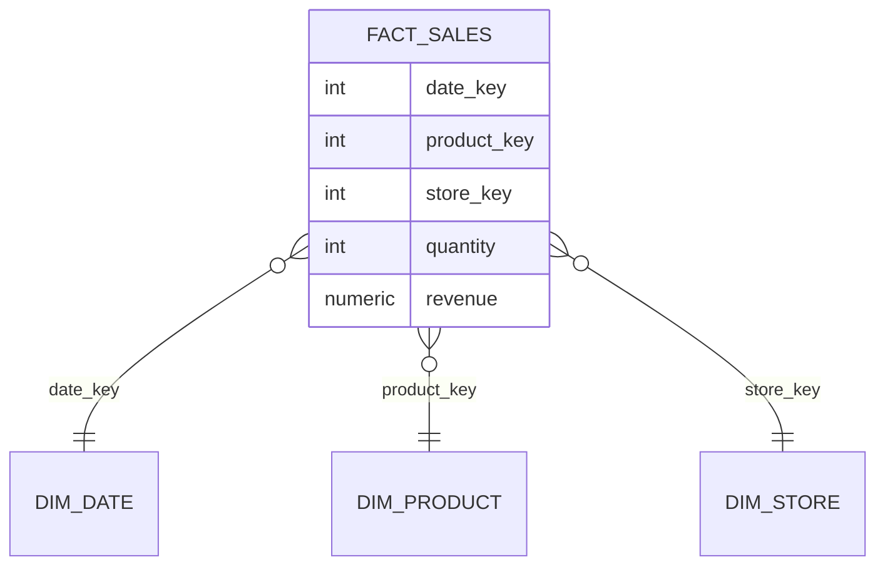

## Mental Model

A row store keeps each row's values together: great for "fetch or update order 42". An analytical query like "total revenue by month over 3 years" touches **two columns of a billion rows**. In a row store it must read every byte of every row — including the 20 columns it doesn't need.

A **column store** keeps each column's values together. That query reads just `order_date` and `total`: perhaps 5% of the data, and that 5% compresses extremely well because similar values sit next to each other.

## Definition

- **Row-oriented (NSM)**: page = several complete rows.
- **Column-oriented (DSM)**: each column stored separately (often in chunks/segments), rows reconstructed by position.
- **Hybrid (PAX, row groups)**: a block holds a group of rows stored column by column inside the block — Parquet and ORC files, many warehouses.
- **OLTP** (online transaction processing): many short transactions touching few rows by key. **OLAP** (online analytical processing): fewer, large queries scanning and aggregating many rows.

## Why It Exists

Analytical workloads are dominated by **scanning and aggregating** a few columns of huge tables. I/O and memory bandwidth are the bottlenecks, so reading less data — and processing it in CPU-friendly batches — is the whole game.

## How It Works

### Only the needed columns

```sql
SELECT date_trunc('month', order_date), sum(total)
FROM orders_fact
WHERE order_date >= '2022-01-01'
GROUP BY 1;
```

A table with 30 columns averaging 8 bytes: a row store reads 240 bytes per row; the column store reads ~16 (two columns) before compression — 15× less I/O.

### Compression works much better per column

A column holds values of one type and often low variety:

| Encoding | Idea | Great for |
|---|---|---|
| Dictionary | Replace strings with small integer codes (`'Pune' → 3`) | Low-cardinality text (city, status) |
| Run-length (RLE) | Store (value, count) runs | Sorted or repetitive columns |
| Delta / delta-of-delta | Store differences from the previous value | Timestamps, sequential ids |
| Bit packing / frame of reference | Store small ints in minimal bits | Codes, small ranges |
| General-purpose (LZ4, ZSTD) | On top of the above | Everything |

Compression ratios of 5–20× are common, which multiplies the I/O savings — and many operations (filters, group-by on dictionary codes) run **directly on compressed data**.

### Vectorized execution

Instead of one row at a time through the operator tree (the classic Volcano model), operators process **batches of ~1,000 values** of one column in tight loops: fewer function calls, SIMD instructions, CPU caches used well ([CPU Caches](lesson:os-cpu-caches-contention)).

### Skipping data: zone maps and sort order

Each chunk stores min/max per column (**zone maps** / min-max indexes). A filter `order_date >= '2024-01-01'` skips every chunk whose max is earlier. If the table is **sorted** (or clustered) by date, whole ranges are skipped — the columnar equivalent of an index. ClickHouse's `ORDER BY` key and Snowflake's micro-partition pruning work this way.

## Internal Mechanism

:::depth{level=advanced}
### Writes are the weak spot

Inserting one row means appending to 30 separate column files; updating one value means rewriting a compressed block. Column stores therefore:

- Batch writes: buffer incoming rows (a row-oriented delta store or in-memory part) and periodically convert them into compressed column segments — structurally an LSM tree ([LSM Trees](lesson:db-lsm-trees)). ClickHouse "parts" are merged in the background exactly like SSTables.
- Implement updates/deletes as delete markers (bitmaps) plus rewrites during merges.

That's why you load warehouses in batches or micro-batches, not with millions of single-row `INSERT`s.

### Late materialization

Operators pass around column vectors and row positions (selection vectors) and only assemble full rows at the end, for the rows that survive filters — avoiding reconstruction of rows that will be discarded.

### HTAP

Some systems keep both formats: a row store for transactions and a columnar replica for analytics (SQL Server columnstore indexes, Oracle In-Memory, TiDB with TiFlash, SingleStore). The columnar copy is maintained asynchronously from the log.
:::

## Example

Star schema in a warehouse:



The fact table (billions of rows, narrow numeric columns) is scanned column-wise; dimension tables are small and **denormalized** (product name, category, brand in one table) to minimize joins — the deliberate opposite of OLTP normalization ([Normalization](lesson:db-normalization)).

## Complexity & Performance

- Full-column scan: bytes read ≈ (selected columns' compressed size), not table size.
- Point lookup by key: poor — must touch every column's segment containing that row (no B+ tree to jump to it in most engines).
- Single-row insert/update: expensive; batched loads: very fast.

## Trade-offs

| | Row store (OLTP) | Column store (OLAP) |
|---|---|---|
| Point read/write by key | excellent | poor |
| Scan/aggregate few columns of many rows | slow | 10–100× faster |
| Compression | modest | high |
| Transactions / concurrency | strong, row-level | batch-oriented, coarser |
| Typical systems | PostgreSQL, MySQL | ClickHouse, BigQuery, Snowflake, Redshift, DuckDB, Druid |

The usual architecture uses both: OLTP database → change data capture/ETL → warehouse for analytics.

## Failure Modes

- **Using a warehouse as an OLTP store** (row-at-a-time inserts, point updates) → tiny parts, merge storms, slow everything.
- **Running heavy analytics on the OLTP primary** → cache pollution and lock/IO contention for user traffic.
- **`SELECT *` in a column store** — reconstructing all columns throws away the main advantage.
- **Poor sort/partition keys** → zone maps can't prune; every query scans everything.

## In Production

- Analytics pipelines copy data from OLTP databases via CDC (Debezium, logical replication) into columnar storage (Parquet on object storage, a warehouse).
- Cost in cloud warehouses is often "bytes scanned" — column pruning and partition pruning directly reduce the bill.

## Deeper Connections

- It's the same memory-hierarchy argument as the buffer pool and CPU caches: move less data, keep the processor busy ([CPU Caches](lesson:os-cpu-caches-contention)).
- Columnar ingestion via buffered parts and background merges is an LSM design ([LSM Trees](lesson:db-lsm-trees)).

## Common Misconceptions

- **"Column stores are just faster databases."** They're faster for scans and aggregations, slower for point operations and small writes.
- **"NoSQL wide-column stores (Cassandra) are column stores."** Wide-column stores group data by row key and column families; they're not columnar analytics engines ([Wide-Column Stores](lesson:db-wide-column)).

## Interview Questions

### [L2 · compare] Row store vs column store — when would you use each?

Row stores keep complete rows together, making single-row reads, inserts and updates cheap — ideal for OLTP. Column stores keep each column together, so analytical queries read only needed columns, compress them heavily and process them in vectorized batches — ideal for OLAP scans and aggregations. Most systems use a row store for the application and replicate into a column store for analytics.

### [L2 · why] Why do column stores compress so much better than row stores?

A column contains values of a single type and often low cardinality or sorted order, so dictionary encoding, run-length encoding, delta encoding and bit packing are highly effective. A row store interleaves different types and value distributions in each page, which compresses poorly.

## Practice

### [mcq] A query sums one numeric column over 1 billion rows of a 40-column table. Why does a column store read far less data?

- [ ] It caches the whole table in memory
- [x] It reads only that column's (compressed) data instead of every row's full width
- [ ] It uses a B+ tree on every column
- [ ] It samples the rows

Column pruning plus compression shrink I/O by orders of magnitude.

### [mcq] Why are single-row inserts into a column store expensive?

- [ ] Column stores don't support transactions
- [x] One row must be appended to every column's storage and compressed segments can't be updated in place
- [ ] Each insert rebuilds all indexes
- [ ] Rows must be sorted globally before insert

Hence batched loading and background merges.

## Quick Revision

- Column store = each column stored separately → read only needed columns.
- Compression (dictionary, RLE, delta, bit packing) is far better per column; operate on compressed data.
- Vectorized execution + zone maps/sort-key pruning.
- Weak at point lookups and single-row writes → batch loads, delta stores, background merges (LSM-like).
- OLTP row store → CDC → OLAP column store; star schemas denormalize dimensions.
