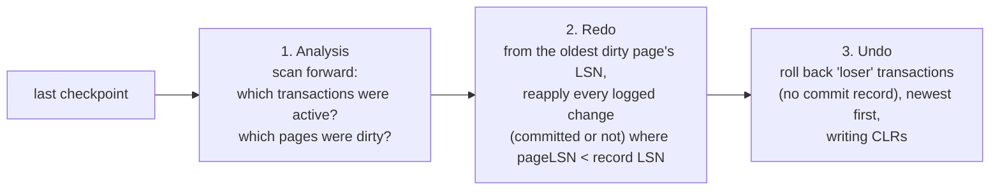

## Mental Model

After a crash, the data files are a **mixture**: some committed changes never reached disk (they were only in the buffer pool), and some uncommitted changes did (a dirty page was evicted early). The WAL has the full story. Recovery reads the log and makes the files match exactly one rule:

> **Every committed transaction's effects are present; no uncommitted transaction's effects are visible.**

Redo brings back what committed work lost; undo (or invisibility) removes what uncommitted work left behind.

## Definition

- **Steal**: the buffer manager may write a page containing uncommitted changes to disk (to free a frame). ⇒ recovery needs **undo** information.
- **No-force**: commit doesn't force the transaction's pages to disk (only the log). ⇒ recovery needs **redo**.
- Steal + no-force is what fast databases use — and it's why the log must support both.
- **Checkpoint**: a log record + flushed state that bounds how far back redo must start.
- **LSN**: log sequence number; each page stores the LSN of the last applied change (`pageLSN`).
- **CLR (compensation log record)**: a log record describing an undo action, so undo itself is crash-safe.
- **RPO / RTO**: recovery point objective (how much data you can lose) / recovery time objective (how long recovery may take).

## Why It Exists

Forcing pages at commit and never stealing would make recovery trivial but performance terrible (random writes at every commit, buffer pool stuck holding every uncommitted page). Logging lets databases write pages whenever convenient and still recover exactly.

## How It Works

### ARIES: three passes

ARIES (IBM, 1992) is the classic algorithm, used in spirit by DB2, SQL Server and InnoDB.



1. **Analysis**: from the last checkpoint, rebuild the table of active transactions and dirty pages at crash time. Transactions without a commit/abort record are **losers**.
2. **Redo ("repeating history")**: reapply *all* logged changes — even losers' — to bring the database to its exact state at the crash. A change is applied only if the page's LSN is older than the record's LSN, so redo is **idempotent** (safe if we crash during recovery and start again).
3. **Undo**: roll back losers' changes in reverse order, logging each undo step as a CLR. If recovery crashes mid-undo, the CLRs record what has already been undone, so it isn't undone twice.

### PostgreSQL: redo-only

PostgreSQL never needs a physical undo pass: uncommitted changes are new tuple versions stamped with the loser's xid, and since that xid never committed, the versions are simply **invisible** (and later vacuumed) ([MVCC](lesson:db-mvcc)). Recovery = replay WAL from the last checkpoint's redo point to the end. InnoDB performs redo from its redo log, then rolls back uncommitted transactions using undo logs (in the background, so the server opens sooner).

### Backups and point-in-time recovery

Crash recovery handles "the process died"; it doesn't handle "the disk died" or "someone ran `DELETE FROM orders` without a WHERE". For that:

- **Base backup**: a physical copy of the data files (taken online; consistent when combined with the WAL generated during the copy).
- **WAL archive**: every WAL segment copied to durable storage (object storage).
- **PITR**: restore the base backup, replay archived WAL up to a target time/LSN/transaction — e.g., one second before the bad DELETE.
- **Logical backups** (`pg_dump`): portable SQL/data snapshots; slower to restore for big databases, no PITR.

## Internal Mechanism

:::depth{level=advanced}
### Fuzzy checkpoints

Stopping all activity to flush everything would freeze the database. ARIES-style **fuzzy checkpoints** record the dirty page table and active transaction table at checkpoint time while activity continues; redo starts from the minimum recLSN (oldest change not yet on disk) among dirty pages, which may be before the checkpoint record. PostgreSQL's checkpoint spreads page writes and records a redo pointer taken at its start.

### Why "repeat history" then undo?

Redoing losers' changes before undoing them seems wasteful, but it restores the exact pre-crash state, which makes page-level (physiological) undo records valid, supports fine-grained locking and logical undo, and keeps redo simple (no need to know transaction outcomes while redoing).

### Recovery time

RTO ≈ time to replay WAL since the redo point: proportional to WAL volume between checkpoints. `checkpoint_timeout`/`max_wal_size` bound it; heavy write workloads with rare checkpoints can take many minutes to recover. HA setups avoid waiting for crash recovery by failing over to a replica that's already caught up ([Failover](lesson:db-failover)).
:::

## Example

Log after the last checkpoint (P = page, values in brackets):

```text
LSN 10  T1 update P1  [a: 1 → 2]
LSN 20  T2 update P2  [b: 5 → 6]
LSN 30  T1 COMMIT
LSN 40  T2 update P1  [c: 7 → 8]
LSN 50  T3 update P3  [d: 0 → 9]
LSN 60  T3 COMMIT
-- crash. On disk: P1 has pageLSN 10, P2 has pageLSN 20, P3 has pageLSN 0.
```

- Analysis: T1 and T3 committed; **T2 is a loser**.
- Redo: LSN 10 on P1 → skip (pageLSN 10 ≥ 10). LSN 20 on P2 → skip. LSN 40 on P1 → apply (10 < 40). LSN 50 on P3 → apply (0 < 50).
- Undo T2 (newest first): undo LSN 40 (c back to 7) → CLR; undo LSN 20 (b back to 5) → CLR.
- Result: a = 2, b = 5, c = 7, d = 9 — exactly T1 and T3's effects.

Step through variations (crash during undo, different flush states) in the [WAL & Recovery lab](lab:wal-recovery).

## Complexity & Performance

- Analysis and redo are sequential log reads plus random page reads for pages needing redo.
- Undo cost ∝ losers' work — a huge uncommitted batch update takes long to roll back in InnoDB (and not at all in PostgreSQL).

## Trade-offs

- Checkpoint frequency trades recovery time against steady-state I/O.
- Undo-log designs (InnoDB) keep tables compact but make rollbacks and recovery of large transactions slow; version-in-heap designs (PostgreSQL) make rollback instant but need vacuum.
- Backups: physical + WAL for fast restore and PITR; logical dumps for portability and selective restore.

## Failure Modes

- **Untested backups**: archives silently failing, restores never rehearsed — discovered during a disaster.
- **Long recovery** after crashes on write-heavy systems with rare checkpoints.
- **Giant transactions** whose rollback takes hours (InnoDB), during which the table is effectively unusable.
- **Storage lying about flushes** → recovery can't repair what the log never durably recorded.

## In Production

- Define RPO/RTO per system; design backups and replication to meet them (e.g., continuous WAL archiving → RPO of seconds; replicas → RTO of seconds to minutes).
- Rehearse PITR restores regularly and measure how long they take; tools like pgBackRest, Barman, WAL-G automate base backups and archiving.

## Deeper Connections

- Journaling filesystems perform a simpler redo-only recovery for metadata ([Journaling](lesson:os-journaling)).
- Replicas are recovery that never stops: continuous redo of the primary's WAL ([Replication](lesson:db-replication)).

## Common Misconceptions

- **"Recovery restores the last backup."** Crash recovery uses the WAL on local disk; backups are for media failure and human error.
- **"Redo only replays committed transactions."** ARIES repeats all history, then undoes losers.
- **"Replication replaces backups."** A `DROP TABLE` replicates instantly; only backups + PITR recover from it.

## Interview Questions

### [L2 · how] What happens when a database restarts after a crash?

It reads the WAL from the last checkpoint: determines which transactions were in progress (analysis), reapplies logged changes that may not have reached the data files, using page LSNs to skip already-applied ones (redo), and removes the effects of transactions that never committed — by undo records (ARIES/InnoDB) or by treating their row versions as invisible (PostgreSQL). Afterwards the database contains exactly the committed transactions.

### [L2 · why] Why do steal and no-force policies require both undo and redo?

Steal lets dirty pages with uncommitted changes reach disk, so after a crash those changes must be undone. No-force lets transactions commit without their pages on disk, so committed changes may be missing and must be redone. Both policies are needed for performance, hence logs with redo and undo information.

### [L3 · scenario] At 14:32 someone runs `DELETE FROM orders;` in production. Replicas deleted everything too. How do you recover?

Replication propagated the delete, so recover from backups: restore the latest base backup to a new instance and replay archived WAL up to just before the DELETE (recovery_target_time 14:31:59 or the xid/LSN before it). Then either promote that instance or copy the missing orders back into production, reconciling with orders created after 14:32. Afterwards: restrict direct production write access, require transactions and row-count checks for manual changes, and consider delayed replicas as an extra safety net.

## Practice

### [mcq] During redo, a log record has LSN 500 and the page on disk has pageLSN 520. What happens?

- [ ] The change is applied
- [x] The change is skipped — the page already reflects it
- [ ] Recovery fails
- [ ] The transaction is undone

pageLSN ≥ record LSN means the page already contains this change; redo is idempotent.

### [mcq] Why does PostgreSQL not need an undo pass during crash recovery?

- [ ] It forces all pages to disk at commit
- [ ] It never writes uncommitted data to disk
- [x] Uncommitted transactions' row versions are simply invisible because their xid never committed
- [ ] It restores from the last backup

MVCC visibility makes rollback a status flag rather than a data change.

## Quick Revision

- Crash leaves files with missing committed changes (no-force) and present uncommitted ones (steal).
- ARIES: analysis (losers, dirty pages) → redo all history (pageLSN check = idempotent) → undo losers with CLRs.
- PostgreSQL: redo-only; uncommitted versions invisible. InnoDB: redo then background undo.
- Checkpoints bound recovery time. Backups + WAL archive = PITR for disk loss and human error.
- Replication is not a backup. Test restores.
