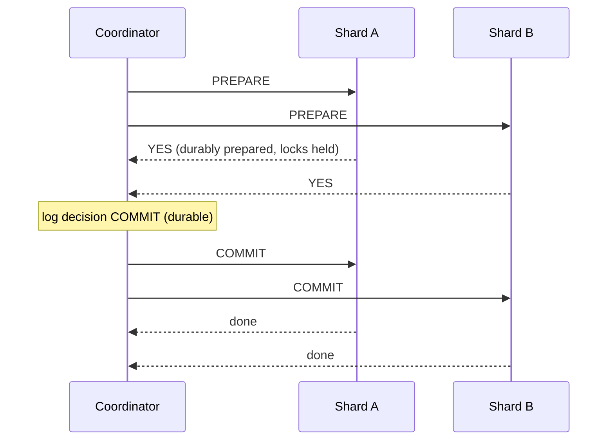

## Mental Model

A single database makes a multi-step change atomic with one commit record in one log. Spread the change over two databases (two shards, or two services each owning its data) and there is **no single log**: each side can commit or fail independently, and the network between them can lose the message that says "the other side committed".

Two families of answers:

- **Atomic commitment (2PC)**: make all participants agree to commit or abort — strong, but blocking and coupled.
- **Sagas + reliable messaging**: commit locally step by step, and if a later step fails, run **compensating actions** — available and decoupled, but only **eventually** consistent, with intermediate states visible.

## Definition

- **Two-phase commit (2PC)**: a coordinator asks all participants to **prepare** (make the change durable but not visible, promise to commit if asked); if all vote yes, it tells them to **commit**; otherwise to abort.
- **In-doubt (prepared) transaction**: a participant that voted yes and hasn't heard the decision — it must hold locks and wait.
- **Saga**: a sequence of local transactions T1…Tn with compensations C1…Cn−1; if Tk fails, run Ck−1…C1.
- **Orchestration** (a central saga coordinator) vs **choreography** (services react to each other's events).
- **Dual write**: writing to a database and a second system (message broker, cache, search) without a shared transaction.
- **Transactional outbox**: write the business change and an "event to publish" row in the same local transaction; a relay publishes outbox rows to the broker.
- **Idempotent consumer**: processing the same message twice has the same effect as once.

## Why It Exists

**The problem.** Sharded databases and microservices split data that business operations touch together: an order service, a payment service and an inventory service; or two customers' wallets on different shards. Without a strategy, partial failures leave money charged without an order, inventory reserved forever, or events published for changes that rolled back.

**Why it's hard.** Atomicity in one database comes from one commit record in one log. With two databases there are two logs, and the message linking them can be lost — so neither side can know for certain what the other did.

**The two ideas.** Either *make everyone promise first, then decide once* (2PC: strong, but participants must wait for the decision), or *commit each step on its own and undo with a compensating step if a later one fails* (sagas: never blocks, but others can see in-between states).

:::callout[That's all it is]{type=insight}
2PC: ask every database "can you commit?", then tell all of them the single answer. Saga: do each step as its own transaction and, if one fails, run "undo" steps for the earlier ones. The outbox makes "change data + send event" one local transaction.
:::

## How It Works

### Two-phase commit



- Any NO or timeout during prepare → abort everywhere.
- **The blocking problem**: if the coordinator crashes after participants voted YES but before they learn the decision, they must **wait** (holding locks) — they can't safely commit or abort alone. Other transactions touching those rows block too.
- Mitigations: make the coordinator highly available by replicating its decision log with consensus (Spanner, CockroachDB) — then 2PC over consensus groups is both atomic and non-blocking in practice ([Distributed SQL](lesson:db-distributed-sql)).
- XA transactions across heterogeneous systems (database + message broker) exist but are operationally painful and rarely used in modern stacks. PostgreSQL supports `PREPARE TRANSACTION` / `COMMIT PREPARED` as a participant.

### Sagas

"Place order" across services:

| Step | Local transaction | Compensation |
|---|---|---|
| 1 | Order service: create order `PENDING` | cancel order |
| 2 | Payment service: charge card | refund |
| 3 | Inventory service: reserve items | release reservation |
| 4 | Order service: mark `CONFIRMED` | — |

If step 3 fails (out of stock): refund (C2), cancel order (C1). Properties:

- **No isolation**: between steps, other requests see intermediate states (a pending order, a charge without confirmation). Design states explicitly (`PENDING`, `CANCELLED`), use semantic locks (e.g., "reserved" flags), and make reads aware.
- **Compensations are business actions**, not rollbacks: a refund, a cancellation email. Some actions can't be compensated (an email sent), so order steps with irreversible ones last.
- Every step and compensation must be **idempotent** and retried until it succeeds.

### The dual-write problem and the outbox

The smallest distributed transaction — "update my database and publish an event" — already has the problem: two systems, no shared commit.

```python
db.execute("UPDATE orders SET status='PAID' WHERE id=%s", oid)
db.commit()
kafka.publish("order_paid", {"order_id": oid})   # crash here → event never sent
```

Reversing the order (publish, then commit) sends events for changes that may roll back. Fix with a **transactional outbox**:

```sql
BEGIN;
UPDATE orders SET status = 'PAID' WHERE id = $1;
INSERT INTO outbox (aggregate_id, event_type, payload) VALUES ($1, 'order_paid', $2);
COMMIT;
```

A relay (polling the outbox, or CDC reading the WAL — Debezium) publishes rows to the broker and marks them sent. The event is published **at least once** if and only if the change committed.

### Exactly-once effects

Networks force a choice between at-most-once (may lose) and at-least-once (may duplicate) delivery. "Exactly once" is achieved as an **effect**: at-least-once delivery + idempotent processing — e.g., an `inbox`/`processed_messages` table with a unique message id checked in the same transaction as the side effect, or naturally idempotent operations (`SET status = 'PAID'` rather than `balance = balance - 100`).

## Internal Mechanism

:::depth{level=advanced}
### Why 2PC blocks, fundamentally

After voting YES, a participant has given up its right to decide. Only the coordinator knows the outcome. If it's unreachable, any unilateral decision could contradict what other participants were told. Three-phase commit reduces blocking only under synchrony assumptions that don't hold in real networks; the practical fix is making the coordinator's decision fault-tolerant through consensus.

### Deterministic and single-shard designs

The cheapest distributed transaction is the one you avoid: choose shard keys so that most transactions are single-shard ([Sharding](lesson:db-sharding)); co-locate data that must change atomically; turn cross-entity invariants into single-row operations (e.g., a ledger of immutable entries per account and asynchronous settlement).

### Saga orchestration engines

Workflow engines (Temporal, AWS Step Functions, Camunda) persist saga state, retry steps with backoff, and run compensations — replacing ad-hoc event chains that are hard to observe and debug.
:::

## Example

Money transfer between wallets on two shards:

- **With 2PC over consensus** (distributed SQL): one `BEGIN … COMMIT` touching both rows; the database coordinates atomically. Simple code, higher latency.
- **With a ledger + saga**: debit wallet A (local transaction, writes an outbox event `transfer_debited`), credit wallet B on consumption (idempotent by transfer id), and on failure credit A back. Money is "in flight" briefly; a reconciliation job checks that debits and credits match.

Banks run on the second model far more often than people assume — with careful ledgers and reconciliation.

## Complexity & Performance

- 2PC: at least two round trips plus durable writes at each participant and the coordinator; locks held across the whole protocol.
- Sagas: each step is a fast local transaction; end-to-end completion is asynchronous; throughput scales with services.

## Trade-offs

| | 2PC | Saga |
|---|---|---|
| Atomicity | all-or-nothing | eventual, via compensations |
| Isolation | yes (locks) | none between steps |
| Availability | blocks on coordinator/participant failure | each service independent |
| Coupling | tight (all participants online) | loose (async) |
| Complexity | in the infrastructure | in the business logic (states, compensations) |

## Failure Modes

- Dual writes without an outbox → lost or phantom events, caches/search out of sync.
- Non-idempotent consumers processing redelivered messages twice (double emails, double charges).
- Sagas without timeouts → orders stuck in `PENDING` forever.
- Orphaned prepared transactions in PostgreSQL holding locks and blocking vacuum after a coordinator crash (`pg_prepared_xacts`).
- Compensation that fails and isn't retried.

## In Production

- Standard toolkit: outbox + CDC, idempotency keys with unique constraints, saga/workflow engines, reconciliation jobs, dead-letter queues with alerting.
- Monitor stuck states (orders pending > N minutes), outbox lag, consumer lag, DLQ size.

## Deeper Connections

- 2PC's coordinator problem is a consensus problem ([Quorums & Consensus](lesson:db-quorums-consensus)).
- Idempotency keys are unique constraints doing distributed-systems work ([Keys & Constraints](lesson:db-keys-constraints), [Optimistic vs Pessimistic](lesson:db-optimistic-pessimistic)).
- The outbox leans on the WAL-based durability of a single local transaction ([Transactions](lesson:db-transactions-acid)).

## Common Misconceptions

- **"Kafka gives exactly-once, so my consumer is safe."** Broker-level exactly-once doesn't cover your database side effects; consumers must be idempotent.
- **"Sagas are distributed transactions."** They're sequences of local transactions without isolation.
- **"2PC guarantees availability."** It guarantees atomicity and can block.

## Interview Questions

### [L2 · how] How does two-phase commit work, and what is its main weakness?

A coordinator sends prepare to all participants; each makes the transaction durable and votes yes/no. If all vote yes, the coordinator durably records commit and tells everyone to commit; otherwise abort. Weakness: participants that voted yes are blocked, holding locks, until they learn the decision — if the coordinator crashes, they can't proceed alone. Also latency and tight coupling of all participants.

### [L2 · design] How do you reliably update the database and publish an event?

Use the transactional outbox: in the same local transaction as the business change, insert an event row into an outbox table. A separate relay (poller or CDC on the WAL) publishes outbox rows to the message broker and marks them sent, retrying until successful. Consumers must be idempotent because the event may be delivered more than once.

### [L3 · design] Design order placement across order, payment and inventory services.

Orchestrated saga: the order service creates a PENDING order and drives steps — reserve inventory (idempotent by order id), charge payment with an idempotency key, then confirm the order. On failure, compensate in reverse (release reservation, refund, cancel order). Each step publishes/consumes events via outboxes; all handlers are idempotent; timeouts move stuck sagas to compensation; the UI shows pending states; reconciliation jobs compare payments, reservations and orders.

## Practice

### [mcq] What problem does the transactional outbox solve?

- [ ] Slow queries on the orders table
- [x] Atomically recording a state change and the fact that an event must be published (avoiding dual writes)
- [ ] Deadlocks between services
- [ ] Exactly-once delivery by the broker

The event row commits or rolls back with the business change; publishing happens afterwards, at least once.

### [mcq] In 2PC, a participant voted YES and then lost contact with the coordinator. What must it do?

- [ ] Commit, since it voted yes
- [ ] Abort after a timeout
- [x] Wait (holding its locks) until it learns the decision
- [ ] Ask another participant to decide

Unilateral action could contradict the coordinator's decision; that's the blocking problem.

## Quick Revision

- No shared log across databases → atomic commit needs coordination.
- 2PC: prepare/vote, then commit/abort; blocking on coordinator failure; fixed by consensus-replicated coordinators.
- Sagas: local transactions + compensations; no isolation; explicit states; idempotent steps; irreversible steps last.
- Dual writes → transactional outbox + CDC/relay; consumers idempotent (inbox/dedupe table).
- Exactly-once = at-least-once delivery + idempotent effects. Best: design so most transactions are single-shard.
