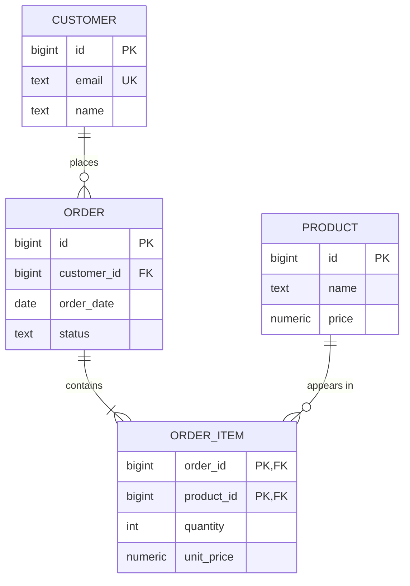

## Mental Model

An ER model is a **picture of the nouns and verbs of a domain**, drawn before thinking about tables. Nouns with identity become **entities** (Customer, Product); verbs that connect them become **relationships** (Customer *places* Order); the numbers on each relationship (**cardinality**: one or many) decide where the foreign keys go.

Get the cardinalities right and the tables almost write themselves.

## Definition

- **Entity**: a thing with independent identity you store facts about (Customer, Order).
- **Attribute**: a property of an entity. Kinds: simple vs composite (address → street, city), single- vs multi-valued (phone numbers), stored vs derived (age from birth date).
- **Relationship**: an association between entities, possibly with its own attributes (Enrollment has a *grade*).
- **Cardinality**: maximum participation — one-to-one (1:1), one-to-many (1:N), many-to-many (M:N).
- **Participation (optionality)**: minimum — total/mandatory (every order *must* have a customer) or partial/optional (a customer *may* have orders).
- **Weak entity**: an entity whose identity depends on an owner (an order line is identified by *(order, line number)*).
- **Associative entity**: a many-to-many relationship promoted to an entity because it has attributes or identity of its own (Enrollment, Booking).

Crow's-foot notation, used by most tools:



`||` = exactly one, `o{` = zero or more, `|{` = one or more.

## Why It Exists

Jumping straight to tables mixes two decisions: *what the domain is* and *how to store it*. ER modeling makes the domain explicit and reviewable with non-engineers ("can an order have no items?"), then a mechanical mapping produces a correct first schema.

## How It Works

### Mapping rules: ER → tables

| ER construct | Tables |
|---|---|
| Strong entity | Table; chosen key becomes the primary key |
| 1:N relationship | FK column on the **N side** (`orders.customer_id`) |
| 1:1 relationship | FK with a UNIQUE constraint on either side (usually the optional side), or merge the tables |
| M:N relationship | **Junction table** with FKs to both sides; PK = (both FKs) or surrogate + UNIQUE |
| Relationship attributes | Columns on the junction table (M:N) or on the FK side (1:N) |
| Weak entity | Table whose PK includes the owner's key: `(order_id, line_no)` |
| Multi-valued attribute | Separate table: `customer_phones(customer_id, phone)` |
| Composite attribute | Flatten into columns (`street`, `city`, `postal_code`) |
| Derived attribute | Usually not stored — compute (or store deliberately, and keep in sync) |
| Mandatory participation | `NOT NULL` on the FK |

### Why the FK goes on the "many" side

Each order has exactly one customer → one `customer_id` value per order row fits. A customer has many orders → a column on `customers` would need a list, violating atomic values ([Relational Model](lesson:db-relational-model)).

### Many-to-many needs a table

Students ↔ Courses: neither side can hold the other's key (both would need lists), so the relationship itself becomes a table:

```sql
CREATE TABLE enrollments (
  student_id bigint NOT NULL REFERENCES students(id),
  course_id  bigint NOT NULL REFERENCES courses(id),
  semester   text   NOT NULL,
  grade      text,
  PRIMARY KEY (student_id, course_id, semester)
);
CREATE INDEX ON enrollments (course_id);   -- the PK index serves lookups by student_id
```

### Recursive (unary) relationships

Employee *manages* Employee → `employees.manager_id REFERENCES employees(id)` (1:N on itself). Friendships (M:N on itself) → `friendships(user_id, friend_id)` with a rule for symmetry (store both directions, or store `user_id < friend_id` with a CHECK).

## Internal Mechanism

:::depth{level=advanced}
### Specialization / inheritance

"Payment is either a CardPayment or a UpiPayment, with different attributes." Three mappings:

1. **Single table** with a `type` column and nullable type-specific columns — simple queries, weak constraints (use CHECKs per type).
2. **Table per subtype** plus a shared parent table (`payments` + `card_payments(payment_id PK FK)`) — clean constraints, joins to reassemble.
3. **Table per concrete type** with duplicated common columns — no joins per type, awkward cross-type queries and uniqueness.

### Ternary relationships

"Supplier supplies Part to Project" is not always equivalent to three binary relationships — decomposing it can lose information (which supplier supplied which part *to which project*). Model genuinely ternary facts as one associative table with three FKs.

### Polymorphic associations

`comments(commentable_type, commentable_id)` pointing to posts *or* photos can't have a real foreign key. Alternatives: one nullable FK column per target with a CHECK that exactly one is set, or a shared parent "commentable" table ([Schema Design](lesson:db-schema-design)).
:::

## Example

Requirements: *"A library has members and books. A book can have several copies. Members borrow copies; each loan has a borrow date, due date and return date. A book can have several authors, and authors write several books."*

- Entities: Member, Book, Copy (weak, depends on Book), Author, Loan (associative: Member × Copy with attributes).
- Book–Author: M:N → `book_authors(book_id, author_id)`.
- Book–Copy: 1:N → `copies.book_id NOT NULL`.
- Loan: `loans(id, member_id, copy_id, borrowed_at, due_at, returned_at)`; one active loan per copy → partial unique index `ON loans(copy_id) WHERE returned_at IS NULL`.

Notice the modeling questions the requirements left open — "can a member borrow the same copy twice over time?" (yes → loans need their own id, not PK (member, copy)). Asking them is what interviewers want to see.

## Complexity & Performance

ER modeling has no runtime cost, but its decisions set query shapes: every M:N traversal is two joins through a junction table, so junction tables need indexes in **both** directions (the composite PK covers one).

## Trade-offs

- Modeling granularity: making Address an entity enables sharing and history; an attribute set is simpler.
- Identifying (composite) keys for weak entities vs surrogate ids: composite keys encode ownership and cluster child rows together; surrogates are simpler for ORMs and external references.

## Failure Modes

- **M:N stored as a list column** (`course_ids = '3,7,9'`) — can't join, index or constrain.
- **Missing the relationship's own identity** — using `(member_id, copy_id)` as a loan's PK forbids borrowing the same copy again later.
- **Optionality ignored** — FKs left nullable when participation is mandatory, or vice versa.
- **Polymorphic FKs without integrity** — orphaned references accumulate.

## In Production

- ER diagrams are generated from live schemas (DBeaver, dbdiagram, SchemaSpy) for onboarding and reviews.
- Schema changes are cheapest at modeling time; a wrong cardinality in production means data migrations.

## Deeper Connections

- The mapping produces tables that are usually already in 3NF — normalization then checks the result formally ([Normalization](lesson:db-normalization)).
- OOP class diagrams and ER diagrams share ideas (associations, inheritance), but objects relate by references and tables by values — the "object-relational impedance mismatch" that ORMs manage.

## Common Misconceptions

- **"Every entity needs a surrogate id."** Weak entities and junction tables often have natural composite keys.
- **"1:1 relationships should always be one table."** Separate tables make sense for optional, large or differently-secured data (user vs user_credentials).
- **"The FK goes on the 'one' side."** It goes on the many side.

## Interview Questions

### [L1 · how] How do you represent a many-to-many relationship in a relational schema?

With a junction (associative) table containing foreign keys to both entities; its primary key is the pair of FKs (or a surrogate key plus a UNIQUE constraint on the pair). Relationship attributes (e.g., enrollment grade, quantity) are columns of the junction table. Index both directions.

### [L2 · design] Design tables for: users can follow other users; you need followers and following lists.

:::answer
```sql
CREATE TABLE follows (
  follower_id bigint NOT NULL REFERENCES users(id),
  followee_id bigint NOT NULL REFERENCES users(id),
  created_at  timestamptz NOT NULL DEFAULT now(),
  PRIMARY KEY (follower_id, followee_id),
  CHECK (follower_id <> followee_id)
);
CREATE INDEX ON follows (followee_id, follower_id);
```

It's a recursive M:N relationship. The PK index answers "whom does X follow?"; the second index answers "who follows X?". At very large scale, celebrity accounts create skew — follower lists are often sharded or fanned out separately.
:::

### [L2 · design] Where do you put the foreign key in a one-to-one relationship between users and passports (not every user has a passport)?

On the optional side: `passports.user_id NOT NULL UNIQUE REFERENCES users(id)`. UNIQUE makes it 1:1 rather than 1:N; putting it on `passports` avoids a nullable FK on every user. Merging into one table is also valid if the data is small, always read together and has the same access rules.

## Practice

### [mcq] Students and courses have a many-to-many relationship with a grade per enrollment. Where is `grade` stored?

- [ ] students
- [ ] courses
- [x] The junction table (enrollments)
- [ ] A separate grades table with only a grade column

A relationship attribute belongs to the relationship's table.

### [mcq] Each order has many items; each item belongs to exactly one order. Where does the foreign key go?

- [ ] orders.item_id
- [x] order_items.order_id, NOT NULL
- [ ] A junction table orders_items
- [ ] Both tables

1:N → FK on the many side; mandatory participation → NOT NULL.

## Quick Revision

- Entities (nouns with identity), attributes, relationships (verbs), cardinality (max), participation (min).
- 1:N → FK on the many side; M:N → junction table; 1:1 → FK + UNIQUE (or merge).
- Weak entity → PK includes the owner's key. Multi-valued attribute → its own table.
- Relationship attributes live on the relationship's table.
- Ask about cardinalities, optionality and history — that's the design conversation.
