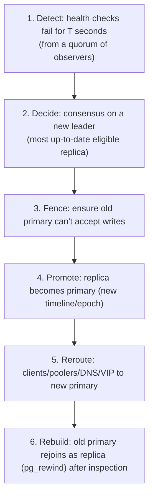

## Mental Model

Failover sounds simple: the primary died, promote a replica. The difficulty is that from outside, **"dead" and "slow or unreachable from here" look identical**. If you promote a replica while the old primary is actually alive and still accepting writes, you have **two primaries** — split brain — and two diverging histories of the same data.

Safe failover therefore needs three things: a trustworthy decision about who is leader (consensus), a way to make sure the old leader **stops** (fencing), and a way to move clients to the new leader.

## Definition

- **Failover**: unplanned promotion of a replica after the primary fails. **Switchover**: planned, graceful role change (maintenance, upgrades).
- **Promotion**: a replica stops replaying and starts accepting writes, starting a new **timeline** (PostgreSQL).
- **Split brain**: two nodes simultaneously act as primary.
- **Fencing**: preventing the old primary from accepting writes or touching shared resources — revoke its access, power it off (**STONITH**: "shoot the other node in the head"), or reject its requests using **fencing tokens** (monotonic epoch numbers).
- **RPO / RTO**: how much data you can lose / how long you can be down.

## Why It Exists

**The problem.** Replicas provide availability only if someone reliably turns one into a primary when needed. Manual failover takes minutes to hours (someone must be paged, diagnose, act); automated failover takes seconds — but automation that gets it wrong can cause worse outages and data corruption than the original failure.

**Why it's hard.** Over a network you can never be sure a server is dead — only that it hasn't answered. Promoting a new leader while the old one is merely slow creates two leaders accepting different writes.

**The idea.** Don't trust any single observer. Let a majority agree on who leads (consensus), make sure the old leader *cannot* keep writing (fencing), and only then redirect clients.

:::callout[That's all it is]{type=insight}
Notice the primary is gone, agree (by majority) on the most up-to-date replica, stop the old primary for certain, promote the replica, and point clients at it. Skipping "stop the old one" is how split brain happens.
:::

## How It Works

### The failover sequence



### 1. Detection: the timeout dilemma

"Dead" can only be inferred from silence, so the only knob is how long to wait. Short timeouts → fast recovery but false positives (GC pauses, network blips, overload — a busy primary looks dead, and failing it over under load often makes things worse ([Overloaded Server](lesson:x-overloaded-server))). Long timeouts → longer outages. Typical: 10–30 s, with checks from several vantage points so one network partition doesn't trigger failover.

### 2. Choosing the new leader

Pick the replica with the most WAL received/replayed (minimize lost writes). With synchronous replication, a synchronous replica has every acknowledged commit, so RPO = 0. With async, compare how far each replica got; writes acknowledged by the old primary but not received anywhere are lost.

### 3. Fencing: the step people skip

Consensus decides who *should* be leader; it doesn't stop the old leader from *acting* like one. The old primary might only be partitioned from the monitor, still serving clients on its side. Options:

- **STONITH**: power off / kill the node via out-of-band control (IPMI, cloud API).
- **Resource fencing**: revoke its storage access, remove it from the load balancer/VIP, shut its network port.
- **Self-fencing**: a primary that loses contact with the consensus store (its lease expires) demotes itself — Patroni's leader key has a TTL; a primary that can't renew it stops accepting writes.
- **Fencing tokens**: every leader term has a higher epoch number; storage or downstream services reject writes carrying an older epoch.

### 4–5. Promotion and rerouting

Clients must find the new primary: update DNS (subject to TTL caching — [DNS](lesson:cn-dns-fundamentals)), move a virtual IP, reconfigure a proxy/pooler (HAProxy, PgBouncer, cloud endpoint), or use smart drivers that try hosts and check which one is writable (`target_session_attrs=read-write`). Existing connections to the old primary break; applications must reconnect and **retry idempotently**.

### 6. After failover

The old primary may have WAL that never reached the new primary (divergent history). It can't simply rejoin; `pg_rewind` rewinds it to the fork point (discarding its divergent changes — which may be lost acknowledged writes worth auditing), then it follows the new primary.

## Internal Mechanism

:::depth{level=advanced}
### Why you need consensus

"The monitor decides" makes the monitor a single point of failure; two monitors can disagree during a partition. Failover managers (Patroni, Stolon, Orchestrator with Raft, cloud control planes) store leadership in a consensus system (etcd, Consul, ZooKeeper, or their own Raft) so that **at most one leader key exists per term**, even under partitions — only the side with a majority can elect ([Quorums & Consensus](lesson:db-quorums-consensus)).

### Leases and clocks

A lease ("I'm leader until T") only fences safely if the old leader stops acting before the new one starts — which assumes bounded clock drift and process pauses. A process paused for 40 s (GC, VM migration) can wake up believing its lease is valid. Fencing tokens checked by the resource itself don't depend on the old leader's clock — the robust pattern.

### Cascading failures

After failover, the new primary starts with a cold cache ([Buffer Pool](lesson:db-buffer-pool)), clients reconnect in a thundering herd, and replicas must re-point to it. Capacity must absorb this, and connection retry with jitter prevents synchronized storms.
:::

## Example

Timeline of a split-brain incident (async replication, no fencing):

```text
10:00:00  network partition isolates primary P from the monitor and replica R, but NOT from app servers in P's zone
10:00:20  monitor: P unreachable → promotes R
10:00:25  DNS updated; apps in R's zone write to R; apps in P's zone keep writing to P (cached DNS, open connections)
10:07:00  partition heals: two primaries with different orders, payments, id sequences
```

Cleanup means reconciling conflicting rows by hand — duplicate ids, double-spent balances. With proper setup: P loses its leader lease at ~10:00:30 and demotes itself (self-fencing), and connection routing only admits the lease holder, so P's zone apps fail fast and retry against R.

## Complexity & Performance

- RTO = detection time + election + promotion + client rerouting (+ cache warm-up): typically 15–60 s automated.
- RPO = 0 with a synchronous replica; otherwise the async lag at failure time.

## Trade-offs

- Fast automatic failover vs false positives; manual failover vs long outages.
- Synchronous replication (RPO 0) vs write latency and availability risk if sync replicas fail.
- Aggressive fencing (STONITH) vs complexity and the risk of killing a healthy node.

## Failure Modes

- **Split brain** from missing fencing.
- **Flapping**: repeated failovers from overly sensitive detection.
- **Promoting a lagging replica** → large silent data loss.
- **Clients stuck on the old primary** (DNS caching, long-lived connections, hard-coded IPs).
- **Failing over an overloaded (not dead) primary** → the new primary receives the same overload plus reconnect storms.

## In Production

- Rehearse switchovers regularly (they're also how you do maintenance); measure real RTO.
- Test failure modes deliberately (kill -9 the primary, partition the network) — chaos drills reveal missing fencing and client retry bugs.
- Log and alert on every role change; review lost-write windows afterwards.

## Deeper Connections

- Leader election and fencing are consensus problems ([Quorums & Consensus](lesson:db-quorums-consensus)); during a partition, you choose between availability and consistency ([CAP & PACELC](lesson:db-cap-pacelc)).
- Client rerouting relies on DNS TTLs, load balancers and connection pools ([Proxies & Load Balancers](lesson:cn-proxies-load-balancers)).

## Common Misconceptions

- **"Failover is just promoting a replica."** Detection, fencing and rerouting are where outages and data loss happen.
- **"A heartbeat timeout proves the primary is dead."** It proves you couldn't hear it.
- **"Automated failover means zero data loss."** Only with synchronous replication to the promoted replica.

## Interview Questions

### [L2 · conceptual] What is split brain and how do you prevent it?

Two nodes both believe they're the primary and accept writes, producing divergent data. It arises when a primary is unreachable from the failure detector but still reachable by clients. Prevention: elect leaders through a consensus store so only a majority partition can have a leader, fence the old primary (STONITH, revoking network/storage, self-demotion when its lease expires), and use fencing tokens so resources reject writes from stale leaders.

### [L3 · design] Design automated failover for a PostgreSQL cluster with RPO ≈ 0 and RTO under a minute.

Three nodes across zones: one primary, one synchronous replica (quorum sync "ANY 1" of two replicas to tolerate one replica failure), and a failover manager (e.g., Patroni) using etcd/Consul for leader leases. Clients connect through a proxy or pooler that routes to the current leader key holder (or drivers with read-write target checks). The primary self-demotes if it can't renew its lease; promotion picks a synchronous replica (no acknowledged-write loss); old primaries rejoin via pg_rewind. Detection ~10–20 s, promotion seconds; the application retries idempotently on connection errors. Rehearse with regular switchovers and chaos tests.

### [L3 · incident] After an automatic failover, some orders placed in the last 5 seconds before the crash are missing. Why?

Replication was asynchronous: those commits were acknowledged by the old primary after its local flush but hadn't reached the replica that got promoted. They exist only in the old primary's WAL (divergent history). Recover them by inspecting the old primary's data/WAL before rewinding it, reconcile manually, and decide whether synchronous replication (RPO 0 at higher latency) is required for this data.

## Practice

### [mcq] Which mechanism prevents a paused old leader that wakes up from corrupting data, even if its clock is wrong?

- [ ] A longer heartbeat timeout
- [ ] DNS with a short TTL
- [x] Fencing tokens (monotonic epochs) checked by the storage/resource
- [ ] Asynchronous replication

The resource rejects any request carrying an epoch lower than the latest it has seen.

### [mcq] In a 3-node cluster split into {A} and {B, C} by a partition, where can a new leader be elected with majority-based consensus?

- [ ] Only in {A}
- [x] Only in {B, C}
- [ ] In both partitions
- [ ] In neither

A majority (2 of 3) exists only on the B–C side; A must stop acting as leader.

## Quick Revision

- Failover = detect → decide (consensus) → fence → promote → reroute → rebuild old primary.
- "Unreachable" ≠ "dead": false positives cause split brain without fencing.
- Fencing: STONITH, resource revocation, lease-based self-demotion, fencing tokens.
- RPO 0 needs a synchronous replica; async failover loses the lag.
- Clients must reconnect and retry idempotently; beware DNS caching and cold caches.
