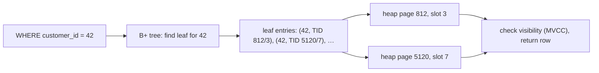

## Mental Model

An index is **a separate, sorted copy of one or more columns, each entry pointing back to its row** — like the index at the back of a book: sorted terms, each with page numbers. To find "Pune" you don't read the whole book; you jump to P in the index and follow the pointers.

Two consequences shape everything:

1. An index helps only if the query can **use its sort order** — to jump to a starting point and read a contiguous range.
2. Every index is **another structure to update on every write** and to keep in memory.

## Definition

- **Index key**: the indexed column(s), in order.
- **Secondary index**: a separate structure pointing to rows (PostgreSQL: to heap TIDs; InnoDB: to the primary key).
- **Primary/clustered index**: the table itself organized by the key (InnoDB, SQL Server clustered) — see [Clustered Indexes](lesson:db-clustered-indexes).
- **Unique index**: also enforces uniqueness ([Keys & Constraints](lesson:db-keys-constraints)).
- **Selectivity**: the fraction of rows a predicate matches. Low fraction = highly selective = good for an index.
- **Cardinality**: number of distinct values in a column.

## Why It Exists

**The problem.** Tables are stored in no useful order (heaps) or in one order only (clustered). Without an index, `WHERE email = 'a@x.com'` on 100 million rows reads every page — seconds to minutes.

**The idea.** Keep a second copy of just the column you search by, *sorted*, with a pointer back to each row. Sorted data can be searched by jumping instead of scanning. With a B+ tree index, it's ~3–4 page reads, microseconds to a millisecond ([B+ Trees](lesson:db-btree)). Indexes are the single biggest lever on read performance.

**The bill.** That second copy must be updated on every write and kept in memory — and following its pointers to scattered rows is only cheap when there are few of them.

:::callout[That's all it is]{type=insight}
An index is a sorted copy of some columns with pointers to the rows. It helps when the query can jump to a spot in that sorted order and read a small range; it costs extra work on every write.
:::

## How It Works

### What an index can do for a query

| Query shape | Uses a B+ tree index on `col`? |
|---|---|
| `col = 5` | ✔ jump to 5 |
| `col > 5`, `col BETWEEN 5 AND 9` | ✔ range scan |
| `col IN (1, 5, 9)` | ✔ several jumps |
| `ORDER BY col LIMIT 10` | ✔ read the first 10 entries in order — no sort |
| `col LIKE 'abc%'` | ✔ prefix range (with suitable collation/opclass) |
| `col LIKE '%abc'` | ✘ no fixed prefix (use trigram/full-text indexes) |
| `lower(col) = 'x'`, `col + 1 = 5`, `date(col) = …` | ✘ unless there's an expression index on exactly that expression |
| `col_text = 42` (type mismatch/implicit cast on the column) | ✘ often |
| `col IS NULL` | ✔ in PostgreSQL |
| `col <> 5` | usually ✘ (matches most rows) |

### Index scan: two steps

For a secondary index in PostgreSQL:



1. Walk the tree to the first matching key, then read matching leaf entries in order.
2. For each entry, fetch the row from the table (a **random page read** per row unless cached or clustered).

Step 2 is why an index isn't always a win.

### Why the planner sometimes ignores your index

The index makes *finding* matches cheap, but each match still needs its row fetched — and each fetch can be a random page read. If a predicate matches many rows, following thousands of pointers to random table pages costs more than reading the whole table sequentially. Rough rule: when a query needs more than a few percent of a table's rows (the exact threshold depends on row width, caching and storage), a **sequential scan** is cheaper.

| Query on 10M-row `orders` | Rows matched | Likely plan |
|---|---|---|
| `WHERE id = 123` | 1 | Index scan |
| `WHERE customer_id = 42` | 40 | Index scan |
| `WHERE status = 'shipped'` | 7M (70%) | Sequential scan |
| `WHERE order_date >= now() - interval '1 day'` | 20k | Index or **bitmap** scan |

A **bitmap index scan** is the middle ground: collect all matching TIDs from the index, sort them by page, then read each needed page once in physical order — avoiding repeated random reads of the same page ([Scans & Joins](lesson:db-scans-joins)).

This is also why indexing a low-cardinality column like `is_active` (two values) rarely helps — except with a **partial index** on the rare value ([Specialized Indexes](lesson:db-specialized-indexes)).

### The costs

| Cost | Why |
|---|---|
| Slower writes | Every INSERT adds an entry to every index; UPDATEs touching indexed columns (in PostgreSQL, any non-HOT update) add entries; DELETEs leave entries to clean up |
| Storage and memory | Indexes are often as large as the table; they compete for buffer-pool space |
| Maintenance | Bloat after churn; rebuilds (`REINDEX CONCURRENTLY`) |
| Planning | More options for the optimizer to consider (minor) |

A table with 10 indexes turns one logical insert into 11 structure modifications and 11 sets of WAL records.

## Internal Mechanism

:::depth{level=advanced}
### Building an index on a live table

`CREATE INDEX` in PostgreSQL blocks writes to the table for the whole build. `CREATE INDEX CONCURRENTLY` builds without blocking writes: it scans the table, then does a second pass for rows changed during the first, waiting for concurrent transactions at each phase. It takes longer and can fail, leaving an `INVALID` index to drop and retry. MySQL/InnoDB performs most index builds online.

### Visibility and index entries

PostgreSQL indexes don't store visibility information: after finding an entry, the executor must check the heap tuple's `xmin/xmax` against its snapshot ([MVCC](lesson:db-mvcc)). The **visibility map** lets index-only scans skip the heap for pages known to be all-visible ([Covering Indexes](lesson:db-composite-covering-indexes)).

### Correlation

If the table's physical order matches the index order (e.g., an append-only table indexed by `created_at`), matching rows sit on few adjacent pages and an index scan of many rows is cheap. The planner tracks this as the column's **correlation** statistic — one reason the same query plans differently on two tables with the same row counts.
:::

## Example

```sql
EXPLAIN ANALYZE SELECT * FROM orders WHERE customer_id = 42;
-- Seq Scan on orders  (actual time=0.02..812.33 rows=38 loops=1)
--   Filter: (customer_id = 42)
--   Rows Removed by Filter: 9999962

CREATE INDEX CONCURRENTLY orders_customer_id_idx ON orders (customer_id);

EXPLAIN ANALYZE SELECT * FROM orders WHERE customer_id = 42;
-- Index Scan using orders_customer_id_idx on orders  (actual time=0.03..0.19 rows=38 loops=1)
--   Index Cond: (customer_id = 42)
```

812 ms → 0.19 ms: reading ~10 million rows to keep 38, versus ~4 index pages plus up to 38 table pages. See the plan change yourself in the [Query Plan lab](lab:query-plan).

## Complexity & Performance

| Access | Cost |
|---|---|
| Sequential scan | all pages (sequential I/O, fast per page) |
| Index point lookup | O(log n) index pages + 1 table page |
| Index range scan returning k rows | O(log n) + k/entries-per-leaf leaf pages + up to k table pages (random) |
| Bitmap scan | index pages + each needed table page once, in order |

## Trade-offs

- Read speed vs write speed and memory: index what queries need, no more.
- One composite index often replaces several single-column ones ([Composite Indexes](lesson:db-composite-covering-indexes)).
- OLTP tables: a handful of well-chosen indexes. Write-heavy ingest tables: as few as possible (or an LSM engine).

## Failure Modes

- **Missing index** on a filter or join column → sequential scans that grow with the table; the classic slow-query incident ([Slow Query](lesson:x-slow-query)).
- **Unusable index**: function on the column, implicit cast, leading wildcard, wrong column order in a composite index.
- **Over-indexing**: writes slow down, buffer pool thrashes, replication lag grows.
- **Duplicate/unused indexes** silently costing every write.
- **Non-concurrent index builds** on busy tables blocking writes during deploys.

## In Production

- Find unused indexes: `pg_stat_user_indexes.idx_scan = 0` over a representative period (check replicas too). Find missing ones from slow-query logs and `pg_stat_statements`.
- Every new query path in code review should come with the question: "which index serves this?"

## Deeper Connections

- The index is a B+ tree; its costs are B+ tree costs ([B+ Trees](lesson:db-btree)).
- The seq-scan-vs-index choice is a cost model based on statistics — covered in [Query Optimization](lesson:db-query-optimization).
- Indexes are caches of sorted order — with the classic cache trade-off of faster reads for costlier writes ([Caching Everywhere](lesson:x-caching-everywhere)).

## Common Misconceptions

- **"If a column is in WHERE, it should be indexed."** Only if the predicate is selective and index-friendly.
- **"The database always uses an index if one exists."** The planner picks the cheapest plan; for non-selective predicates that's a sequential scan.
- **"More indexes = faster database."** More indexes = faster *some* reads, slower all writes.

## Interview Questions

### [L1 · conceptual] What is a database index and what does it cost?

A separate data structure (usually a B+ tree) holding the indexed column values in sorted order with pointers to the rows, letting the database find matching rows in O(log n) instead of scanning. Costs: extra storage and memory, slower inserts/updates/deletes (each index must be maintained), and maintenance such as bloat and rebuilds.

### [L2 · why] Why might the database not use an index on a column you filter by?

The predicate may not be selective (matching a large fraction of rows makes random table lookups more expensive than a sequential scan); the predicate may not be sargable (a function or cast on the column, a leading wildcard); statistics may be stale, misleading the cost model; or a different index or plan is estimated cheaper. EXPLAIN shows the planner's estimates.

### [L2 · compare] Index scan vs bitmap index scan vs sequential scan?

An index scan walks the index and fetches each matching row immediately — best for few rows or when order matters. A bitmap scan collects all matching row locations first, sorts them by page, and reads each page once — best for medium selectivity or combining several indexes with AND/OR. A sequential scan reads all pages in order — best when a large fraction of rows is needed.

### [L3 · scenario] A table receives 20,000 inserts/second and has 12 indexes. Write latency is rising and replication lags. What do you do?

Each insert modifies 13 structures, multiplying WAL volume, random page writes and buffer-pool pressure. Audit index usage (idx_scan statistics on primary and replicas), drop unused and redundant ones (e.g., an index on (a) when (a, b) exists), merge single-column indexes into composites that serve the actual queries, consider partial indexes, and move analytical query needs to a replica or warehouse with its own indexes. Measure WAL generation and replica lag before and after.

## Practice

### [mcq] Which predicate can use a B+ tree index on `email`?

- [ ] `WHERE lower(email) = 'a@x.com'`
- [ ] `WHERE email LIKE '%@gmail.com'`
- [x] `WHERE email LIKE 'asha%'`
- [ ] `WHERE email <> 'a@x.com'`

A fixed prefix maps to a range in sorted order (given a compatible collation or `text_pattern_ops`); the others need expression or trigram indexes, or match most rows.

### [mcq] A query matches 60% of a 50-million-row table. Which plan is most likely?

- [ ] Index scan
- [x] Sequential scan
- [ ] Index-only scan on an unrelated index
- [ ] Nested loop join

Fetching 30 million rows via random lookups costs far more than reading the table sequentially.

## Quick Revision

- Index = sorted copy of key columns + pointers to rows (B+ tree).
- Helps: =, ranges, IN, prefix LIKE, ORDER BY … LIMIT. Doesn't: functions/casts on the column, leading %, non-selective predicates.
- Index scan = tree walk + random table fetches → loses to seq scan beyond a few % of rows; bitmap scan in between.
- Every index slows every write and uses memory. Build with CONCURRENTLY on live tables.
- Find missing (slow logs) and unused (idx_scan = 0) indexes.
