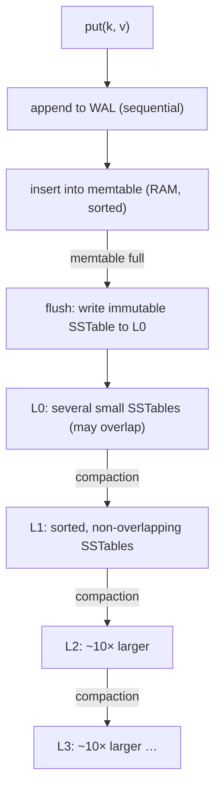

## Mental Model

A B+ tree keeps one sorted structure and **updates it in place** — every write finds its page and modifies it (a random write). An LSM tree never modifies data files. It:

1. Collects writes in a sorted **in-memory table** (the memtable), after appending them to a log for durability.
2. When the memtable fills, writes it out **once, sequentially**, as an immutable sorted file (an SSTable).
3. In the background, **merges** (compacts) SSTables into larger sorted files, discarding overwritten and deleted values.

Writes become cheap sequential appends. The price is paid at read time (a key might be in the memtable or any of several files) and in background compaction work.

## Definition

- **Memtable**: in-memory sorted structure (skip list / balanced tree) holding recent writes.
- **WAL / commit log**: append-only log of writes, replayed after a crash to rebuild the memtable.
- **SSTable (sorted string table)**: immutable file of sorted key–value pairs with a block index and a Bloom filter.
- **Compaction**: merging SSTables into new ones (a merge sort), keeping only the newest version of each key.
- **Tombstone**: a delete marker; the key's older values are removed during compaction once the tombstone reaches the bottom.
- **Bloom filter**: a compact probabilistic set that answers "definitely not in this file" or "maybe".

## Why It Exists

**The problem.** A B+ tree updates data in place: every write must find its page and rewrite it — a random read plus a random write. For write-heavy workloads, that random I/O is the bottleneck. On spinning disks, sequential writes were ~100× faster than random ones; on SSDs, random small writes cause internal write amplification and wear. Workloads like event logging, metrics, messaging and time series are **write-heavy**. An LSM tree converts random writes into large sequential ones, sustaining much higher ingest than an in-place B+ tree on the same hardware ([Storage Devices](lesson:os-storage-devices)).

**The idea.** Never update anything on disk. Collect writes in memory, sorted; when there are enough, write them out as one new sorted file. Old values are simply superseded by newer files, and a background job merges files to throw the old values away.

**The bill.** A key may now be in several files, so reads must check more places — hence Bloom filters (skip files cheaply) and compaction (keep the number of files small).

:::callout[That's all it is]{type=insight}
Buffer writes in a sorted in-memory table, dump it to an immutable sorted file when full, and merge files in the background. Reads check newest to oldest. Bloom filters and compaction exist only to keep those reads cheap.
:::

## How It Works

### Write path

1. Append to the WAL (durability — [WAL](lesson:db-wal-durability)).
2. Insert into the memtable. Done — no disk read, no random write.
3. Full memtable becomes immutable; a new one takes writes; the old one is flushed to an L0 SSTable and its WAL segment can be discarded.

Updates and deletes are just newer entries (a new value or a tombstone) — the old value remains in an older file until compaction.

### Read path

The cost of never updating in place: a key's latest value could be in any of several places. To `get(k)`, check the newest data first and stop at the first hit:

1. Memtable (and immutable memtables awaiting flush).
2. L0 SSTables, newest to oldest (they may overlap).
3. One SSTable per deeper level (levels are non-overlapping, found via file key ranges).

For each SSTable, first ask its **Bloom filter**: "definitely not here" skips the file without I/O. With ~10 bits per key, the false-positive rate is ~1%, so a point read that misses most files costs roughly one data-block read. Range scans are harder: they must merge iterators from every level (Bloom filters don't help ranges; prefix Bloom filters partially do).

### Compaction strategies

Without merging, files pile up forever, every read checks more of them, and deleted data never goes away. Compaction is the cleanup — and *how* you merge decides which cost you pay.

| Strategy | How | Write amp | Read amp | Space amp | Used by |
|---|---|---|---|---|---|
| **Leveled** | Each level ~10× the previous; a file from Lₙ is merged into the overlapping files of Lₙ₊₁; levels ≥ 1 have no overlap | High (~10× per level) | Low | Low (~10%) | RocksDB/LevelDB default, Cassandra LCS |
| **Size-tiered** | Merge several similar-sized SSTables into one bigger one | Low | Higher (more overlapping files) | High (temporarily ~2×) | Cassandra STCS default, HBase-style |
| Time-window | Group SSTables by time bucket; drop whole buckets on TTL expiry | Low | Low for time-bounded queries | Low | Time-series (Cassandra TWCS) |

::viz{id=lsm}

## Internal Mechanism

:::depth{level=advanced}
### The amplification triangle

- **Write amplification**: bytes written to storage ÷ bytes written by the application. Leveled compaction rewrites each byte roughly once per level × fanout ⇒ often 10–30×.
- **Read amplification**: storage reads per logical read — number of places to check.
- **Space amplification**: storage used ÷ live data — obsolete versions and tombstones not yet compacted.

You can reduce any one at the expense of the others (the RUM conjecture: Read, Update, Memory). B+ trees sit at a different point: low read amplification, update-in-place write amplification of a page per change, space overhead from partially filled pages.

### Tombstones and deletes

A delete writes a tombstone. It must survive until compaction reaches the level holding the oldest version of the key; dropping it earlier would resurrect the old value. In distributed stores (Cassandra) tombstones must also outlive replica repair windows (`gc_grace_seconds`), or deleted data reappears from a stale replica. Workloads that delete heavily and scan (queues on Cassandra) wade through tombstones — a well-known anti-pattern.

### Write stalls

If compaction can't keep up with ingest, L0 accumulates files; reads slow down, and engines deliberately **throttle or stall writes** to let compaction catch up. Sizing compaction threads and I/O budget is central to operating LSM stores.

### Sequence numbers and snapshots

Each write carries a sequence number; reads at a snapshot ignore newer entries. Compaction keeps old versions still visible to live snapshots — the LSM equivalent of MVCC's dead-tuple retention ([MVCC](lesson:db-mvcc)).
:::

## Example

A metrics service ingests 500,000 points/s of 100 bytes each (50 MB/s):

- **B+ tree**: each insert modifies a leaf page; with random keys (metric id, timestamp), pages are scattered — at 8 KB per page write, the device could face gigabytes/second of random page writes before caching absorbs some.
- **LSM**: 50 MB/s of sequential WAL + memtable flushes, plus compaction (say 10× write amplification → 500 MB/s of large sequential writes). High, but sequential, and it's background work tunable with compaction strategy (time-window compaction nearly eliminates it for append-only time series).

Reads of "the last 5 minutes of metric X" hit the memtable and the newest SSTables — mostly in memory.

## Complexity & Performance

- Write: O(log m) memtable insert + sequential log append — very fast.
- Point read: memtable + (L0 files) + one file per level, mostly skipped by Bloom filters → typically 1–2 block reads.
- Range read: merge across levels → more work than a B+ tree range scan.
- Background: compaction consumes I/O and CPU continuously.

## Trade-offs

| | B+ tree | LSM tree |
|---|---|---|
| Write pattern | random, in place | sequential, append + compaction |
| Write throughput | moderate | high |
| Point reads | 1 path, predictable | several places, Bloom filters help |
| Range scans | excellent (leaf chain) | merge across levels |
| Space | page fill overhead | obsolete versions until compaction |
| Latency predictability | good | compaction can cause spikes/stalls |
| Examples | PostgreSQL, MySQL/InnoDB, SQL Server | RocksDB, LevelDB, Cassandra, ScyllaDB, HBase, (MyRocks, TiKV, CockroachDB's Pebble) |

## Failure Modes

- **Compaction debt**: sustained ingest beyond compaction capacity → growing L0, rising read latency, write stalls.
- **Tombstone-heavy scans** → reads touching millions of deleted entries.
- **Space spikes** during large size-tiered compactions (needing free disk equal to the data being merged).
- **Misconfigured Bloom filters** (or disabled for memory reasons) → reads touching many files.

## In Production

- LSM engines expose compaction and stall metrics (pending compaction bytes, L0 file count, write stall time) — the first things to check when latency degrades.
- Many "new SQL" and distributed databases use an LSM engine underneath (CockroachDB → Pebble, TiDB → RocksDB via TiKV, YugabyteDB → DocDB on RocksDB), with a SQL layer on top ([Distributed SQL](lesson:db-distributed-sql)).

## Deeper Connections

- The WAL + memtable pattern is exactly "log first, apply later" — the durability chain again ([Durability Chain](lesson:x-durability-chain)).
- Wide-column stores are LSM trees with a distributed partitioning layer ([Wide-Column Stores](lesson:db-wide-column)).
- SSD internals (the flash translation layer) are themselves log-structured, which is why LSM and SSD behavior interact ([Storage Devices](lesson:os-storage-devices)).

## Common Misconceptions

- **"LSM trees are just faster than B+ trees."** They're faster for writes; reads, range scans and latency predictability often favor B+ trees.
- **"Deletes free space immediately."** They add a tombstone; space is reclaimed during compaction.
- **"Bloom filters make every read one I/O."** They eliminate most files for point lookups that miss; they don't help range scans and have false positives.

## Interview Questions

### [L2 · compare] Compare B+ trees and LSM trees.

B+ trees update pages in place: one path per read, excellent range scans and predictable latency, but random writes and page-level write amplification. LSM trees buffer writes in memory and flush immutable sorted files, merging them in background compaction: very high write throughput with sequential I/O, but reads may check several levels (mitigated by Bloom filters), range scans merge multiple sources, and compaction costs I/O and can cause stalls. B+ for read-heavy OLTP; LSM for write-heavy ingest.

### [L2 · how] How does an LSM tree serve a point read efficiently?

It checks the memtable, then SSTables from newest to oldest. Each SSTable has a Bloom filter that rules out files not containing the key without disk I/O, and a block index (fence pointers) that locates the single block to read in files that might contain it. Levels beyond L0 are non-overlapping, so at most one file per level is a candidate.

### [L3 · incident] A Cassandra-backed job queue gets slower every day even though the number of pending jobs is constant. Why?

Consumed jobs are deleted, producing tombstones. Reading the queue scans a partition full of tombstones that aren't purged until compaction and `gc_grace_seconds` allow it, so each read wades through ever more deleted entries (and may hit tombstone warning/failure thresholds). Fixes: don't model queues as delete-heavy partitions (use a real queue), use time-bucketed partitions dropped wholesale, or adjust compaction (time-window) and TTLs.

## Practice

### [mcq] What converts an LSM tree's random application writes into sequential disk writes?

- [ ] Bloom filters
- [x] Buffering writes in a memtable and flushing it as a sorted, immutable file
- [ ] Updating SSTables in place
- [ ] Storing all data in the WAL permanently

The memtable absorbs writes in memory; flushes and compactions write large sequential files.

### [mcq] Which compaction strategy minimizes space and read amplification at the cost of higher write amplification?

- [x] Leveled compaction
- [ ] Size-tiered compaction
- [ ] No compaction
- [ ] Time-window compaction for random updates

Leveled keeps each level non-overlapping (few files to check, little obsolete data) but rewrites data repeatedly as it moves down levels.

## Quick Revision

- Write: WAL append + memtable insert; flush memtable → immutable SSTable; compaction merges files.
- Read: memtable → L0 (overlapping) → one file per level; Bloom filters + block index keep point reads ~1 I/O.
- Deletes are tombstones; space returns at compaction.
- Leveled (low read/space amp, high write amp) vs size-tiered (low write amp, higher read/space amp) vs time-window.
- B+ tree = read-optimized, in place; LSM = write-optimized, append + merge. Watch compaction debt and write stalls.
