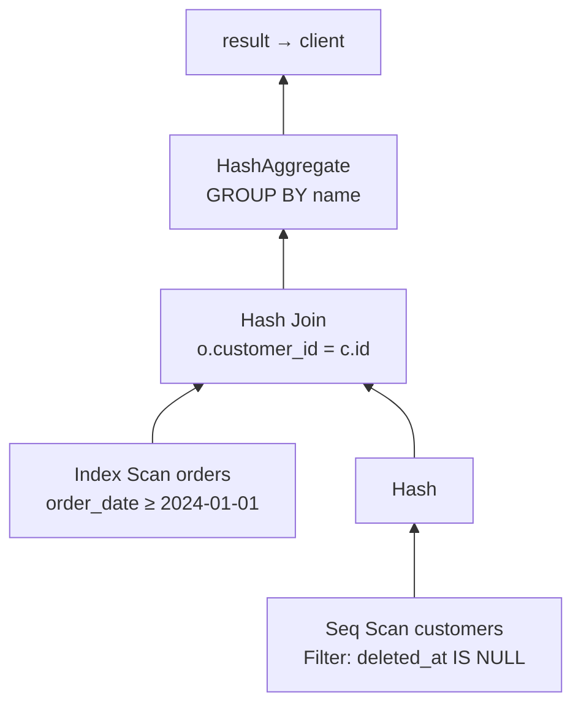

## Mental Model

A SQL string goes through a small compiler pipeline:

```text
text → parse tree → validated query tree → rewritten tree → physical plan → rows
       (parser)     (analyzer)             (rewriter)       (planner)       (executor)
```

The **planner** is the brain: among many equivalent ways to compute the result, it estimates the cost of each and picks the cheapest. The **executor** runs that plan as a tree of operators pulling rows from their children.

## Definition

- **Parser**: checks syntax, builds a parse tree. Knows nothing about tables yet.
- **Analyzer (binder)**: resolves names against the catalog (does `orders.total` exist? what type?), checks permissions and types, produces a query tree.
- **Rewriter**: applies rules — expands views into their definitions, applies row-level security policies ([Views](lesson:sql-views-programmability)).
- **Planner / optimizer**: generates candidate physical plans (access paths, join orders, join algorithms) and chooses the lowest estimated cost using table statistics.
- **Executor**: evaluates the plan tree, typically one row (or batch) at a time.
- **Prepared statement**: a query parsed/planned once and executed many times with different parameters.

## Why It Exists

**The problem.** SQL is declarative: it says *what*, not *how* ([Relational Model](lesson:db-relational-model)). Someone must decide *how* — which index, which join order, which algorithm — and the right answer depends on data sizes and distributions that change over time.

**The idea.** Treat SQL like source code and the database like a compiler: check the text, resolve names, then *choose* a program (the plan) based on what the data currently looks like, and run it. Separating planning from execution lets the database re-decide as data evolves, without application changes.

:::callout[That's all it is]{type=insight}
Parse the text, check names and types, expand views, pick the cheapest plan using statistics, then run that plan as a tree of operators that pass rows upward. The planner's guess about row counts decides almost everything.
:::

## How It Works

### 0. Connection and backend

In PostgreSQL each connection is served by its own **backend process** (MySQL: a thread). The client sends the query over the wire protocol; the backend does all the steps below. Connections are expensive, which is why applications use connection pools ([Connection Management](lesson:x-connection-management)).

### 1–3. Parse, analyze, rewrite

```sql
SELECT c.name, sum(o.total)
FROM active_customers c JOIN orders o ON o.customer_id = c.id
WHERE o.order_date >= '2024-01-01'
GROUP BY c.name;
```

- Parser: syntax OK → parse tree.
- Analyzer: `active_customers` is a view, `orders.order_date` is `date`, the literal is coerced to `date`, `sum(numeric)` returns `numeric`.
- Rewriter: `active_customers` is replaced by its `SELECT … FROM customers WHERE deleted_at IS NULL`.

### 4. Planning

The planner considers, for each table, **access paths** (sequential scan, index scans on applicable indexes, bitmap scans), for each join, **algorithms** (nested loop, hash, merge) and **join orders**, plus where to aggregate and sort. It estimates:

- **cardinality** — how many rows each step produces (from statistics: row counts, distinct values, most-common values, histograms);
- **cost** — I/O and CPU, in abstract units calibrated by settings like `seq_page_cost`, `random_page_cost`, `cpu_tuple_cost`.

The cheapest total cost wins. Cardinality estimation is the weak point — most bad plans trace back to wrong row estimates ([Query Optimization](lesson:db-query-optimization)).

### 5. Execution: the iterator model

The executor needs one uniform way to connect dozens of operator types (scans, joins, sorts) in any shape the planner chooses. The answer is a single interface every operator implements. The plan is a tree; each node implements `next()` — "give me your next row". The root pulls from its children, which pull from theirs:



Rows flow up one at a time (pipelining), so `LIMIT 10` can stop the whole tree after 10 rows. **Blocking** operators (sort, hash build, aggregation) must consume all their input before emitting anything. Analytical engines use vectorized batches instead of single rows ([Column Stores](lesson:db-column-stores)).

### Prepared statements and plan caching

Parsing and planning cost time on every call; for a query run 10,000 times a second with only the parameter changing, that's wasted work.

```sql
PREPARE by_customer(bigint) AS SELECT * FROM orders WHERE customer_id = $1;
EXECUTE by_customer(42);
```

Parsing and analysis happen once. PostgreSQL plans the first executions with the actual parameter values (**custom plans**); after five, it compares against a **generic plan** (parameter-independent) and switches to it if not noticeably worse. Most drivers use prepared statements implicitly; parameters also prevent SQL injection.

## Internal Mechanism

:::depth{level=advanced}
### Search space and join ordering

For n joined tables there are exponentially many join orders. PostgreSQL uses dynamic programming (System R style: best plan for every subset of tables, built bottom-up) up to `geqo_threshold` (12) tables, then a genetic algorithm. It also tracks **interesting orders** — a more expensive subplan that produces sorted output may win if a later merge join or ORDER BY needs that order.

### Parameter-sensitive plans

A generic plan can be terrible for skewed data: `status = $1` is selective for 'failed' (index) but not for 'shipped' (seq scan). SQL Server's version of this is "parameter sniffing". Mitigations: `plan_cache_mode = force_custom_plan` for such queries, separate queries for known-skewed values, or partial indexes.

### JIT and parallelism

PostgreSQL can JIT-compile expressions for long analytical queries and run scans, joins and aggregates with parallel workers (Gather/Gather Merge nodes). Both kick in above cost thresholds; for short OLTP queries they only add overhead.
:::

## Example

```text
EXPLAIN SELECT * FROM orders WHERE customer_id = 42 ORDER BY order_date DESC LIMIT 5;

Limit  (cost=0.43..8.31 rows=5 width=48)
  ->  Index Scan Backward using orders_customer_date_idx on orders  (cost=0.43..63.51 rows=40 width=48)
        Index Cond: (customer_id = 42)
```

Reading it with the lifecycle in mind: the planner chose an index that provides both the filter and the order, so no sort is needed; the Limit node stops pulling after 5 rows — the executor touches ~5 index entries, not 40. More on reading plans in [EXPLAIN](lesson:db-explain); experiment in the [Query Plan lab](lab:query-plan).

## Complexity & Performance

- Parse/analyze/plan: typically 0.05–1 ms; can reach many ms for complex multi-join queries — which is why prepared statements matter for very high QPS.
- Execution dominates for anything non-trivial; the chosen plan can change cost by orders of magnitude.

## Trade-offs

- Planning effort vs plan quality: exhaustive search for many-table joins would cost more than it saves.
- Generic (cached) plans save planning time but can be wrong for skewed parameters.
- Cost models are abstractions: `random_page_cost` defaults assume spinning disks; on SSDs, lowering it (e.g., 1.1) makes index scans relatively more attractive.

## Failure Modes

- **Stale statistics** after bulk loads → bad cardinality estimates → bad plans.
- **Plan flips**: a data change crosses a cost threshold and the same query suddenly uses a different, slower plan.
- **Generic plan regressions** for skewed parameters after the fifth execution.
- **Too many connections**, each a backend with its own memory, exhausting RAM ([Connection Management](lesson:x-connection-management)).

## In Production

- `pg_stat_statements` aggregates execution statistics per normalized query — the starting point of performance work.
- `auto_explain` logs plans of slow queries automatically, capturing plan flips when they happen.

## Deeper Connections

- End-to-end, a query also crosses the network stack, the kernel and the buffer pool ([SQL Query Journey](lesson:x-sql-query-journey)).
- The executor's pull model is like Unix pipes: each stage consumes from the previous, with backpressure for free.

## Common Misconceptions

- **"The database executes SQL clauses in written order."** It executes a plan tree chosen by cost.
- **"Prepared statements are only about security."** They also skip repeated parsing and planning.
- **"The optimizer always finds the best plan."** It finds the best plan *under its estimates*; wrong estimates produce wrong choices.

## Interview Questions

### [L2 · how] Walk through what happens when a database executes a SELECT query.

The backend serving the connection parses the SQL into a parse tree, the analyzer resolves tables/columns/types against the catalog and checks permissions, the rewriter expands views and applies security policies, the planner enumerates physical plans (access paths, join orders and algorithms) and picks the cheapest using statistics-based cost estimates, and the executor runs the plan tree, pulling rows through operators and reading pages via the buffer pool, streaming results back to the client.

### [L2 · why] Why can the same query use different plans on different days?

The planner's choice depends on statistics (row counts, value distributions, correlation), configuration and parameter values. As data grows or skews, or after ANALYZE refreshes statistics, estimated costs change and a different plan may become cheapest — sometimes worse in reality if estimates are off. Prepared statements can also switch from custom to generic plans.

### [L3 · compare] Custom vs generic plans for prepared statements — what's the risk?

Custom plans are made for the actual parameter values (good for skewed data, but planning each time); generic plans are made once for any value (saves planning, but chooses one strategy for all values). If data is skewed, a generic plan optimized for common values can be catastrophically slow for rare ones, or vice versa.

## Practice

### [mcq] Which component replaces a view reference with the view's defining query?

- [ ] Parser
- [x] Rewriter
- [ ] Executor
- [ ] Buffer manager

The rewriter applies rules such as view expansion and row-level security before planning.

### [mcq] Why can `LIMIT 10` make a query over a huge table fast?

- [ ] It tells the planner to sample 10 rows
- [x] The executor pulls rows lazily, so pipelined operators stop after 10 rows reach the top
- [ ] It forces an index scan
- [ ] It caches the first 10 rows

With a pipelined plan (no blocking sort), execution stops early; with a blocking sort, all input must still be processed.

## Quick Revision

- Pipeline: parse → analyze (catalog, types, permissions) → rewrite (views, RLS) → plan (cost-based) → execute.
- Planner: access paths × join orders × algorithms; cost from cardinality estimates (statistics).
- Executor: iterator tree pulling rows; pipelined vs blocking operators; LIMIT stops early.
- Prepared statements skip parse/plan; generic plans can misfire on skewed data.
- Bad plans usually mean bad row estimates.
