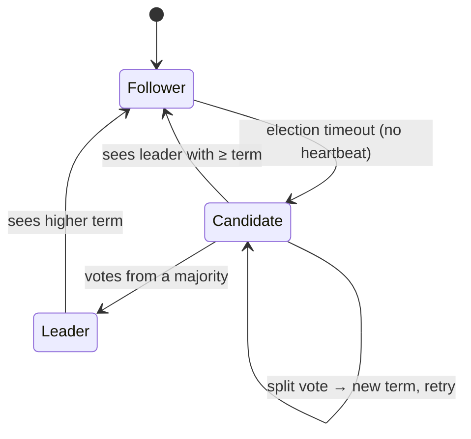

## Mental Model

Two related tools let replicas act like one system:

- **Quorums**: never talk to *all* replicas — talk to *enough* of them that any two groups you might talk to **overlap**. Write to W of N, read from R of N; if W + R > N, every read group contains at least one replica with the latest successful write.
- **Consensus**: get a group of nodes to **agree on a sequence of decisions** (a log) even when some crash or messages are delayed — so they can all apply the same commands in the same order and behave like a single, fault-tolerant machine (state-machine replication).

Majorities are the trick behind both: **any two majorities of the same set intersect.**

## Definition

- **N**: replicas per item; **W**: acks required for a write; **R**: replicas consulted per read.
- **Strict quorum**: W and R counted over the item's designated N replicas.
- **Sloppy quorum + hinted handoff**: if designated replicas are unreachable, write to other nodes temporarily ("hints"), handing data back later — keeps writes available, breaks the overlap guarantee.
- **Read repair / anti-entropy**: fixing stale replicas during reads / in background (Merkle trees).
- **Consensus**: nodes propose values and decide exactly one per slot, with **agreement** (no two decide differently), **validity** (the value was proposed), **termination** (non-faulty nodes eventually decide).
- **Raft**: a consensus algorithm organized around a strong leader, terms, and a replicated log; **Paxos/Multi-Paxos**: the classic family; **ZAB**: ZooKeeper's protocol.

## Why It Exists

Replication needs agreement on *order*: if replicas apply the same writes in different orders, they diverge. Failover needs agreement on *who is leader* — and a wrong answer means split brain ([Failover](lesson:db-failover)). Distributed locks, configuration, membership and unique ID allocation all need one agreed answer despite failures. Consensus provides it with no single point of failure, tolerating f crashed nodes out of 2f + 1.

## How It Works

### Quorum reads and writes

N = 3, W = 2, R = 2:

```text
write v2:  R1 ✓  R2 ✓  R3 ✗ (down)        → success (2 acks)
read:      R2 (v2)  R3 (v1, stale)        → return newest by version: v2; repair R3
```

Any 2 of 3 overlaps any other 2 of 3 in at least one node, which has v2.

| N, W, R | Property |
|---|---|
| 3, 2, 2 | overlap; tolerates 1 failure for both reads and writes |
| 3, 3, 1 | fast reads; writes fail if any replica is down |
| 3, 1, 3 | fast writes; reads need all replicas |
| 3, 1, 1 | fastest, no overlap → eventual consistency |

::viz{id=quorum}

**Limits of quorums** (why W + R > N isn't linearizability):

- A write that reached only 1 replica then "failed" may be seen by some reads and not others.
- Concurrent writes resolved by last-write-wins depend on clocks.
- Sloppy quorums write to nodes outside the designated set — reads of the designated set may miss them.
- Without read repair before returning, two sequential reads can see new-then-old.

### Consensus with Raft

Raft decomposes consensus into leader election, log replication and safety.



**Terms**: logical epochs, incremented at each election; every message carries the sender's term, and stale leaders step down on seeing a higher one (a built-in fencing token).

**Election**: a follower that hears no heartbeat within a randomized timeout (e.g., 150–300 ms) becomes a candidate, votes for itself, and requests votes. Each node votes at most once per term, and only for candidates whose log is **at least as up-to-date** as its own — so a new leader always has every committed entry.

**Log replication**:

1. Clients send commands to the leader; it appends them to its log.
2. The leader sends `AppendEntries` to followers (with the previous entry's index and term for consistency checking).
3. When a **majority** has stored an entry, the leader marks it **committed**, applies it to its state machine, and replies to the client.
4. Followers learn the commit index and apply entries in order.

With 5 nodes, 2 may fail and the cluster still commits (3-node majority). A partitioned minority can't elect a leader or commit anything — CP behavior ([CAP & PACELC](lesson:db-cap-pacelc)).

## Internal Mechanism

:::depth{level=advanced}
### Why majorities guarantee safety

A committed entry is stored on a majority. Any future leader needs votes from a majority, which must include at least one node holding that entry; the up-to-date-log voting rule ensures the winner has it. So committed entries are never lost or overwritten — as long as fewer than half the nodes fail permanently (with disks intact for those that restart).

### FLP impossibility

Fischer, Lynch and Paterson (1985): in a fully asynchronous system where even one process may crash, no deterministic algorithm guarantees consensus terminates. Practical algorithms keep **safety always** and achieve **liveness** under partial synchrony (timeouts eventually work) — Raft may fail to elect a leader during chaotic periods but never decides two different values.

### Reads in Raft

A leader might have been deposed without knowing it. Linearizable reads therefore either go through the log, confirm leadership with a round of heartbeats ("ReadIndex"), or rely on a **leader lease** (time-based, assumes bounded clock drift). etcd offers linearizable reads by default and serializable (possibly stale) reads as an option.

### Where consensus is used

- Coordination services: etcd (Raft; Kubernetes' brain), ZooKeeper (ZAB), Consul (Raft) — leader election, locks, config ([Failover](lesson:db-failover)).
- Distributed databases: CockroachDB, TiKV, YugabyteDB (Raft per range), Spanner (Paxos per split) ([Distributed SQL](lesson:db-distributed-sql)).
- Messaging: Kafka's KRaft metadata quorum.

Consensus is expensive (a majority round trip per commit) — used for metadata and for replication of each shard, while shards themselves scale out.

### Byzantine faults

Raft/Paxos assume nodes fail by crashing, not by lying. Byzantine fault-tolerant protocols (PBFT, blockchain consensus) tolerate malicious nodes but need 3f + 1 nodes and far more messages — rarely used inside a single organization's databases.
:::

## Example

A 5-node Raft cluster, leader L in term 7, network splits {L, A} | {B, C, D}:

- {B, C, D}: no heartbeats → B times out, becomes candidate in term 8, gets votes from C and D (3 of 5, majority) → new leader. Commits continue.
- {L, A}: L still thinks it's leader of term 7, but its `AppendEntries` reach only A → no majority → nothing new commits; clients writing to L time out.
- Partition heals: L sees term 8, steps down, and its uncommitted entries are overwritten by the new leader's log. No committed data is lost; no split brain.

Compare with the quorum visualization: change N, W, R and fail replicas to see which operations can proceed.

## Complexity & Performance

- Commit latency = one round trip to the fastest majority (+ disk fsync on each). In-region: ~1–5 ms; cross-region: 50–200 ms.
- Throughput limited by the leader (batching and pipelining help); scale by running many independent Raft groups (one per shard/range).

## Trade-offs

- Odd cluster sizes: 3 tolerates 1 failure, 5 tolerates 2; larger clusters tolerate more but commit slower (bigger majorities) and elect less predictably.
- Placing replicas across zones/regions: survives zone/region loss vs higher commit latency.
- Quorum systems (leaderless) vs consensus (leader-based): quorum systems avoid leader bottlenecks and failover pauses, but offer weaker guarantees; consensus gives linearizable, ordered logs.

## Failure Modes

- Even-sized clusters (4 nodes tolerate only 1 failure, same as 3).
- Losing a majority permanently (e.g., 2 of 3 disks) → the group can't make progress without unsafe manual recovery.
- Slow disks on followers → commit latency spikes (every commit waits for a majority fsync).
- Treating sloppy-quorum stores as strongly consistent.

## In Production

- etcd/ZooKeeper clusters are small (3–5 nodes), on fast disks, spread across zones; monitor leader changes, fsync latency and proposal failures.
- Never "fix" a stuck consensus group by editing membership by hand unless you understand the safety implications — that's how split brains are made.

## Deeper Connections

- The replicated log is the WAL idea made fault-tolerant ([WAL & Durability](lesson:db-wal-durability), [Durability Chain](lesson:x-durability-chain)).
- Terms are fencing tokens; elections are failover done safely ([Failover](lesson:db-failover)).
- Wide-column stores use quorums; distributed SQL uses consensus per range ([Wide-Column Stores](lesson:db-wide-column), [Distributed SQL](lesson:db-distributed-sql)).

## Common Misconceptions

- **"W + R > N means strong consistency."** It gives read/write overlap for successful operations; failures, sloppy quorums and LWW break linearizability.
- **"Consensus needs all nodes."** It needs a majority; the rest can be down or slow.
- **"More nodes = faster."** Consensus writes get slower as majorities grow; more nodes buy fault tolerance.

## Interview Questions

### [L2 · conceptual] Why does W + R > N help, and what are its limits?

Because any set of W replicas and any set of R replicas out of N must share at least one replica, a read will contact at least one replica that acknowledged the most recent successful write, and can return the newest version. Limits: partially failed writes, concurrent writes resolved by timestamps (clock skew), sloppy quorums writing outside the designated replicas, and reads without repair can all produce non-linearizable results.

### [L3 · how] Explain how Raft elects a leader and commits a log entry.

Followers expect periodic heartbeats; on a randomized timeout a follower increments the term, becomes a candidate and requests votes. Nodes grant at most one vote per term and only to candidates whose log is at least as up-to-date as theirs; a majority makes it leader. The leader appends client commands to its log and replicates them via AppendEntries; once a majority has stored an entry, it's committed, applied to the state machine, and followers learn the commit index. Higher terms make stale leaders step down.

### [L3 · why] Why do consensus clusters use 3 or 5 nodes rather than 4 or 6?

Progress requires a majority. 3 nodes need 2 (tolerate 1 failure); 4 need 3 (still tolerate only 1); 5 need 3 (tolerate 2); 6 need 4 (tolerate 2). Even sizes add cost and latency without extra fault tolerance, and they're more exposed to split votes and to partitions that leave no majority.

## Practice

### [numeric 2] How many node failures can a 5-node Raft cluster tolerate while still committing writes?

:::answer
A majority of 5 is 3, so up to **2** nodes can fail.
:::

### [mcq] N = 5, W = 3. What is the minimum R for read/write quorum overlap?

- [ ] 2
- [x] 3
- [ ] 4
- [ ] 5

W + R > N → R > 2 → R = 3.

## Quick Revision

- Quorums: W + R > N ⇒ overlap; not linearizable under partial failures, LWW, sloppy quorums.
- Repair: read repair, hinted handoff, anti-entropy (Merkle trees).
- Consensus = agree on a log; majorities intersect ⇒ safety; tolerate f failures with 2f + 1 nodes.
- Raft: terms, randomized elections, up-to-date voting rule, AppendEntries, commit at majority.
- FLP: safety always, liveness with timeouts. Use odd cluster sizes; consensus per shard to scale.
