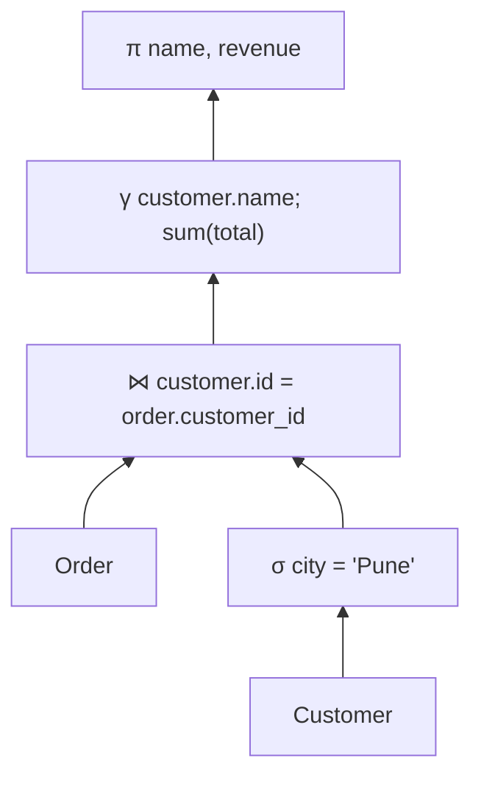

## Mental Model

A **relation** is a table whose rows are facts of the same shape: "customer 7 is named Asha and lives in Pune". The relational model says: store all data as such facts, and answer every question by **combining and filtering sets of facts** with a small set of operators — filter rows, pick columns, join tables, group.

Because queries are expressed as *what* result you want in terms of those operators, the database is free to choose *how* to compute it. That freedom is why a query written in 1995 can run a thousand times faster today on the same schema: new indexes, new join algorithms, new hardware — no query changes.

## Definition

| Relational term | Everyday term | Meaning |
|---|---|---|
| Relation | Table | A set of tuples with the same attributes |
| Tuple | Row | One fact |
| Attribute | Column | A named property with a domain |
| Domain | Type | The set of allowed values (integer, text, date…) |
| Relation schema | Table definition | Name + attributes + constraints: `Customer(id, name, city)` |
| Degree / cardinality | — | Number of attributes / number of tuples |

Two formal properties matter:

- **Tuples are unordered.** A relation is a set; row order has no meaning unless a query asks for `ORDER BY`.
- **Attribute values are atomic** (first normal form): one value per cell, not lists.

:::callout{type=insight}
SQL tables are **bags (multisets)**, not sets: they allow duplicate rows unless a key forbids it, and `SELECT` keeps duplicates unless you write `DISTINCT`. This small deviation from theory explains several SQL surprises (e.g., `UNION` vs `UNION ALL`).
:::

## Why It Exists

Before 1970, databases were **navigational**: hierarchical (IBM IMS) and network (CODASYL) models where programs followed physical pointers from record to record. Every query was a program that knew the storage layout; reorganize the storage and the programs broke.

E. F. Codd's relational model separated the **logical** view (relations) from the **physical** storage, and defined queries mathematically. That gave:

- **Data independence** — storage can change without breaking queries.
- **Ad-hoc queries** — ask new questions without writing new navigation code.
- **Optimizability** — algebraic rules let the system rewrite queries into cheaper equivalent forms.

## How It Works

### Relational algebra: the operators under SQL

| Operator | Symbol | SQL | Example |
|---|---|---|---|
| Selection (filter rows) | σ | `WHERE` | `σ[city='Pune'](Customer)` |
| Projection (pick columns) | π | `SELECT col, …` | `π[name](Customer)` |
| Cartesian product | × | `CROSS JOIN` | `Customer × Order` |
| Join | ⋈ | `JOIN … ON` | `Customer ⋈[id=customer_id] Order` |
| Union / Difference / Intersection | ∪ − ∩ | `UNION`, `EXCEPT`, `INTERSECT` | |
| Rename | ρ | `AS` | |
| Grouping/aggregation | γ | `GROUP BY` + aggregates | `γ[city; count(*)](Customer)` |

Every operator takes relations and returns a relation — so operators compose into trees. A SQL query is compiled into exactly such a tree:



### Equivalences enable optimization

Because the operators are mathematical, the optimizer can apply rewrite rules that are **guaranteed to preserve the result**:

- Push selections down: filter `Customer` to Pune *before* joining, so the join processes fewer rows.
- Reorder joins: A ⋈ B ⋈ C can be computed as (A ⋈ B) ⋈ C or A ⋈ (B ⋈ C) — pick the order with the smallest intermediate results.
- Replace a join + filter with an index lookup.

This is exactly what the planner does ([Query Lifecycle](lesson:db-query-lifecycle)).

### Relationships are values, not pointers

A customer's orders are found by matching values: `orders.customer_id = customers.id`. There is no stored pointer from a customer to its orders. That's what makes relations flexible — you can join on any compatible attributes, including ones nobody planned for.

## Internal Mechanism

:::depth{level=advanced}
### Logical vs physical operators

Relational algebra describes *logical* operations. The executor implements each with *physical* operators chosen per query: selection might become a sequential scan, an index scan or a bitmap scan; a join might become a nested-loop, hash or merge join ([Scans & Joins](lesson:db-scans-joins)). One logical plan has many physical implementations, and the cost model chooses among them.

### Relational calculus and SQL's declarative nature

Codd also defined a **relational calculus** — describing the result with logic ("all tuples t such that …") rather than operators. It has the same expressive power as the algebra (Codd's theorem). SQL is closer to calculus in style (describe the result) and compiles to algebra (compute it).
:::

## Example

Schema (used throughout the SQL track and in the [SQL Playground](lab:sql-playground)):

```sql
customers(id, name, email, city, created_at)
orders(id, customer_id, order_date, status, total)
products(id, name, category, price)
order_items(order_id, product_id, quantity, unit_price)
departments(id, name, location)
employees(id, name, department_id, manager_id, salary, hired_at)
```

"Names of customers in Pune who placed an order over ₹5,000" in algebra:

```text
π[name]( σ[city='Pune'](customers) ⋈[customers.id = orders.customer_id] σ[total>5000](orders) )
```

In SQL:

```sql
SELECT DISTINCT c.name
FROM customers c
JOIN orders o ON o.customer_id = c.id
WHERE c.city = 'Pune' AND o.total > 5000;
```

`DISTINCT` is needed because SQL keeps duplicates — a customer with three large orders would otherwise appear three times.

## Complexity & Performance

The model says nothing about performance — deliberately. Performance comes from the physical layer: indexes, join algorithms, statistics and caching. The cost of the same logical query can differ by 10,000× depending on the chosen physical plan, which is why the [Query Execution](lesson:db-explain) lessons matter.

## Trade-offs

- **Relational vs navigational/document models**: relations excel at ad-hoc queries and many-to-many relationships; document models make "load one aggregate in one read" simple but make cross-document queries harder ([NoSQL Landscape](lesson:db-nosql-landscape)).
- **Normalized relations vs duplication**: storing each fact once avoids inconsistencies but requires joins to reassemble data ([Normalization](lesson:db-normalization)).

## Failure Modes

- **Relying on row order** without `ORDER BY` — results come back in whatever order the plan produced, which can change after an index is added or a table is vacuumed.
- **Non-atomic values** (`tags = 'a,b,c'`) — cannot be indexed or joined properly; queries degrade into string parsing.
- **Forgetting bag semantics** — joins multiply rows, and aggregates over joined rows double-count ([Joins](lesson:sql-joins)).

## In Production

- Nearly every business system — payments, inventory, bookings, identity — is modeled relationally because the questions change faster than the data model.
- Modern relational databases also store JSON, arrays and full-text data, blurring the line with document stores; the relational core (keys, joins, transactions) remains.

## Deeper Connections

- The optimizer's freedom rests on the algebra's equivalence rules — the same idea as a compiler optimizing code while preserving semantics.
- Relations joined by values rather than pointers are why foreign keys need indexes: the database must *search* for matches ([Index Fundamentals](lesson:db-index-fundamentals)).

## Common Misconceptions

- **"Relational means the tables have relationships."** "Relation" is the mathematical term for a table; relationships between tables are modeled with keys.
- **"Rows come back in insertion order."** No order is guaranteed without `ORDER BY`.
- **"SQL tables are sets."** They are bags unless a key or `DISTINCT` removes duplicates.

## Interview Questions

### [L1 · conceptual] What is a relation, and how does it differ from a spreadsheet?

A relation is a set of tuples over a fixed set of typed attributes; each tuple is a fact, order is meaningless, and values are atomic. A spreadsheet has positional rows and columns, mixed types per column, formulas and meaningful ordering; it enforces none of the constraints or typing a relation does.

### [L2 · why] Why does the relational model make query optimization possible?

Queries are declarative and compile to relational-algebra expressions whose equivalences are mathematically proven (selection pushdown, join commutativity/associativity). The optimizer can therefore rewrite a query into any equivalent form and choose physical operators by estimated cost, while guaranteeing the same result.

### [L2 · compare] How is a relational "relationship" different from a pointer in a navigational or object model?

Relationships are represented by matching values (a foreign key equals a primary key), not stored physical pointers. Any attributes with compatible domains can be joined, even in ways not anticipated at design time, and storage can be reorganized without invalidating links. The cost is that the database must search for matches — hence indexes on join columns.

## Practice

### [mcq] Which relational-algebra operator corresponds to SQL's WHERE clause?

- [ ] Projection (π)
- [x] Selection (σ)
- [ ] Rename (ρ)
- [ ] Cartesian product (×)

Selection filters rows; projection picks columns — the naming is a classic trap.

### [numeric 12] Table A has 3 rows and table B has 4 rows. How many rows does A CROSS JOIN B produce?

:::answer
The Cartesian product pairs every row of A with every row of B: 3 × 4 = 12.
:::

## Quick Revision

- Relation = set of tuples with typed attributes; no row order; atomic values. SQL tables are bags.
- Algebra: σ (WHERE), π (SELECT list), × and ⋈ (joins), ∪ − ∩, γ (GROUP BY).
- Declarative queries + algebraic equivalences → the optimizer picks the physical plan.
- Relationships are value matches, not pointers → join columns need indexes.
