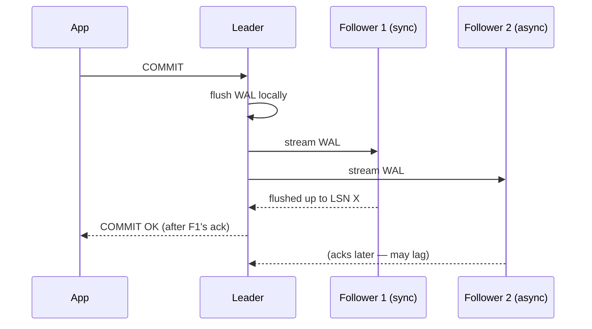

## Mental Model

Replication keeps **copies of the same data on several machines** by shipping the leader's log of changes to followers, which apply it in the same order. It's the WAL again, streamed over the network ([WAL](lesson:db-wal-durability)).

The central tension: the leader can either **wait** for followers to confirm each change (safe, slower, and stuck if a follower is down) or **not wait** (fast, but followers lag behind, and a leader crash can lose recently acknowledged writes).

## Definition

- **Leader (primary)**: accepts writes, produces the change log.
- **Follower (replica, standby)**: applies the leader's log; may serve reads.
- **Synchronous replication**: commit is acknowledged only after (some) replicas have durably received the change.
- **Asynchronous replication**: commit is acknowledged after the leader's local flush; replicas catch up later.
- **Semi-synchronous**: wait for at least one replica to *receive* (not necessarily apply) the change (MySQL semi-sync; PostgreSQL `synchronous_standby_names` with `ANY 1 (…)`).
- **Replication lag**: how far behind a replica is (bytes of log, or seconds).
- **Physical replication**: ships the storage-level log (WAL); replica is a byte-identical copy of the whole cluster.
- **Logical replication**: ships row-level changes (inserts/updates/deletes per table); replicas can differ in version, schema subset or indexes.

## Why It Exists

- **High availability**: if the leader dies, a follower takes over ([Failover](lesson:db-failover)).
- **Read scaling**: spread read queries across replicas.
- **Durability beyond one machine**: a synchronously replicated commit survives the leader's disk being destroyed.
- **Geography**: replicas near users for lower read latency; disaster recovery in another region.
- **Isolation of workloads**: analytics on a replica instead of the primary.

## How It Works

### Single-leader replication



Each follower requests the log from a position (LSN), receives a continuous stream, writes it locally, and replays it — continuous crash recovery ([Crash Recovery](lesson:db-crash-recovery)).

### Sync vs async — the core trade-off

| | Asynchronous | Synchronous |
|---|---|---|
| Commit latency | local flush only | + network round trip to replica + its flush |
| Data loss if leader dies | writes not yet shipped (seconds, or more under lag) | none (for the synchronous replica) |
| Availability | leader unaffected by replica outages | writes **block** if the sync replica is unavailable (unless you have several candidates) |
| Typical use | read replicas, cross-region DR | HA within a region, financial data |

A common setup: one or two synchronous replicas in the same region (quorum: "any 1 of 2"), asynchronous replicas elsewhere.

### Replication lag and its user-visible anomalies

Asynchronous replicas are **eventually consistent**: reads may return stale data. Lag is usually milliseconds, but spikes to seconds or minutes under heavy writes, long replay conflicts, or network trouble.

| Problem | Scenario | Mitigation |
|---|---|---|
| **Read-your-writes** | User updates their profile, reloads, reads from a lagging replica → sees the old profile | Read the user's own recently changed data from the leader (e.g., for N seconds after a write); or wait until the replica has replayed the write's LSN |
| **Monotonic reads** | Two reads hit different replicas; the second is further behind → data "goes back in time" | Pin a user/session to one replica |
| **Consistent prefix** | Reading causally related writes out of order (answer before question) | Single-partition ordering; causal consistency tracking |

These are consistency guarantees you must build on top of async replication ([Consistency Models](lesson:db-consistency-models)).

::lab{id=replication}

### Physical vs logical replication

| | Physical (WAL streaming) | Logical (row changes) |
|---|---|---|
| Unit | pages/WAL records | table rows |
| Replica | identical, read-only copy of the whole cluster | writable, can subset tables, different indexes/versions |
| Uses | HA, read replicas | zero-downtime major upgrades, partial replication, CDC to Kafka/warehouses |
| Caveats | same major version and architecture | DDL not replicated automatically (PostgreSQL); sequences; needs primary keys |

MySQL's binlog supports statement-based (replay SQL — nondeterminism risks), row-based (default, row images) and mixed formats.

## Internal Mechanism

:::depth{level=advanced}
### Replication slots and feedback

PostgreSQL replication slots make the leader retain WAL until the consumer has received it — preventing a lagging replica from falling off the end of the log, and risking disk exhaustion if the consumer disappears ([WAL](lesson:db-wal-durability)). `hot_standby_feedback` tells the leader about the replica's oldest snapshot so vacuum doesn't remove rows a replica query needs — at the cost of bloat on the leader.

### Replay conflicts

A long query on a physical replica may need row versions that the replayed WAL (e.g., a vacuum on the leader) wants to remove. The replica either pauses replay (lag grows, bounded by `max_standby_streaming_delay`) or cancels the query ("canceling statement due to conflict with recovery").

### Multi-leader and leaderless

- **Multi-leader**: several nodes accept writes (multi-region active-active, offline clients). Concurrent writes to the same data conflict → resolution needed: last-write-wins (loses data), merge functions, CRDTs, or application logic. Avoid unless you need it.
- **Leaderless (Dynamo-style)**: clients write to and read from several replicas directly with quorums (W + R > N), repairing stale replicas via read repair and anti-entropy ([Quorums & Consensus](lesson:db-quorums-consensus)). Cassandra, Riak, DynamoDB's heritage.
:::

## Example

Checking lag in PostgreSQL (on the primary):

```sql
SELECT application_name, state, sync_state,
       pg_wal_lsn_diff(pg_current_wal_lsn(), replay_lsn) AS replay_lag_bytes,
       replay_lag
FROM pg_stat_replication;
```

Read-your-writes by LSN: after a write, the app records `pg_current_wal_lsn()`; before reading from a replica, it checks `pg_last_wal_replay_lsn() >= that LSN` (or routes to the primary if not). Simpler rule used by many apps: route a user's reads to the primary for a few seconds after they write. Try injecting lag and failures in the [Replication lab](lab:replication).

## Complexity & Performance

- Synchronous commit latency = local flush + RTT to replica + replica flush (≈ +0.5–2 ms in-region; +50–150 ms cross-region — rarely acceptable).
- Replicas add read capacity roughly linearly — but not write capacity: every replica replays every write.
- Lag grows when replay can't keep up (single-threaded replay in PostgreSQL physical replication), with long replica queries, or with network bandwidth limits.

## Trade-offs

- Durability and consistency (sync) vs latency and availability (async) — the PACELC trade-off in miniature ([CAP & PACELC](lesson:db-cap-pacelc)).
- Read replicas scale reads at the cost of stale-read complexity in the application.
- Logical replication's flexibility vs physical replication's simplicity and completeness.

## Failure Modes

- **Silent data loss on failover** with async replication: acknowledged writes on the old leader never reached the promoted replica.
- **Stale reads** causing user-visible bugs ("I just paid but the order shows unpaid").
- **Lag spikes** from bulk writes, index builds, long-running replica queries, network saturation.
- **WAL accumulation** from dead replication slots → primary disk full.
- **Sync replica down** → all commits hang (if no other sync candidate).

## In Production

- Monitor lag in bytes and seconds, alert on thresholds tied to your staleness budget.
- Route reads explicitly (primary vs replica) by consistency need, not "all SELECTs to replicas".
- Managed services (RDS, Cloud SQL, Aurora) automate replicas and failover — but the consistency trade-offs remain yours.

## Deeper Connections

- Replication = the WAL + a network; failover = deciding who's leader ([Failover](lesson:db-failover)); consensus makes that decision safe ([Quorums & Consensus](lesson:db-quorums-consensus)).
- Stale replica reads are cache staleness under another name ([Caching Everywhere](lesson:x-caching-everywhere)).

## Common Misconceptions

- **"Replicas are backups."** They replicate mistakes instantly; backups + PITR recover from them.
- **"Read replicas scale writes."** Every replica applies every write.
- **"Synchronous replication means replicas are always up to date for reads."** Usually it means the WAL is *flushed* on the replica before commit; it may not be *replayed* (visible) yet unless configured (`remote_apply`).

## Interview Questions

### [L1 · why] Why replicate a database?

For high availability (a replica can take over if the primary fails), read scaling (serve reads from replicas), durability beyond a single machine or region, lower read latency for distant users, and to isolate heavy workloads like analytics and backups from the primary.

### [L2 · compare] Synchronous vs asynchronous replication?

Synchronous: the primary waits for a replica to confirm it has durably received the change before acknowledging the commit — no acknowledged-write loss if the primary dies, but higher commit latency and writes stall if the synchronous replica is unavailable. Asynchronous: the primary acknowledges after its local flush and ships changes later — low latency and independence from replicas, but replicas lag and the most recent acknowledged writes can be lost on failover.

### [L2 · scenario] Users report that right after updating their settings, the page shows old values for a few seconds. Explain and fix.

Writes go to the primary but subsequent reads are served by an asynchronously replicated read replica that hasn't replayed the change yet (replication lag): a read-your-writes violation. Fix: route a user's reads to the primary for a short window after they write, or track the write's LSN and only read from replicas that have replayed past it (else fall back to the primary); for critical paths, always read from the primary.

### [L3 · design] How would you use logical replication to upgrade PostgreSQL across major versions with minimal downtime?

Create the new-version cluster with the schema, set up a publication on the old primary and a subscription on the new cluster to copy existing data and then stream ongoing changes. Once caught up, verify data, stop writes briefly (or cut over via the connection pooler), wait for final changes to apply, sync sequences, repoint the application, and keep the old cluster as a fallback (optionally with reverse replication). DDL must be frozen or applied on both sides during the process.

## Practice

### [mcq] With asynchronous replication, what can be lost when the primary crashes and a replica is promoted?

- [ ] Nothing — replicas always have every committed write
- [x] Recently acknowledged commits that hadn't yet reached the replica
- [ ] Only uncommitted transactions
- [ ] The replica's indexes

Async acknowledges before shipping, so the tail of the log may exist only on the failed primary.

### [numeric 3000 unit=ms] A replica is 30 MB of WAL behind and replays WAL at 10 MB/s while new WAL arrives at 0 MB/s. How many milliseconds until it's caught up?

:::answer
30 MB / 10 MB/s = 3 s = **3000 ms**. With new writes arriving at 8 MB/s, the net catch-up rate would be only 2 MB/s → 15 s.
:::

## Quick Revision

- Leader streams its log; followers replay it (continuous recovery).
- Sync: no acknowledged-write loss, higher latency, blocks without replicas. Async: fast, lag, possible loss on failover. Semi-sync / quorum sync in between.
- Lag anomalies: read-your-writes, monotonic reads, consistent prefix → route reads deliberately.
- Physical (whole cluster, identical) vs logical (row changes, flexible, CDC, upgrades).
- Replicas scale reads, not writes; replicas are not backups; watch slots and lag.
