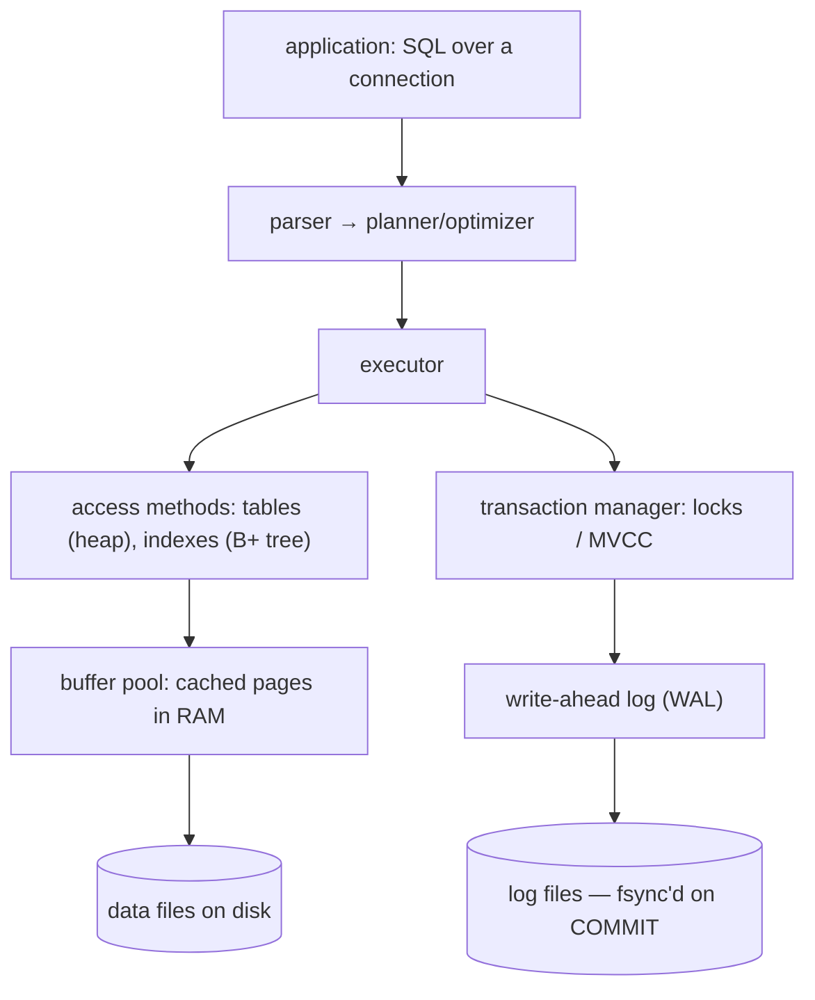

## Mental Model

A database is **a program that owns your data so that your application doesn't have to solve the hard problems of storing it**. You describe *what* you want ("customers in Pune with an unpaid order"); the database decides *how* to find it, keeps it consistent while hundreds of clients change it at once, and makes sure a committed change survives a power cut.

The easiest way to understand every part of a DBMS is to start without one and watch things break.

## Definition

- **Database**: an organized collection of data.
- **DBMS (database management system)**: the software that stores, retrieves, protects and concurrently manages that data — PostgreSQL, MySQL, SQLite, Oracle, SQL Server, MongoDB, Cassandra.
- **Schema**: the declared structure of the data (tables, columns, types, constraints).
- **Query language**: a declarative way to ask for data — SQL for relational databases.

## Why It Exists

**The problem.** Imagine an online store keeping orders in `orders.csv`. Each new requirement breaks the file approach:

| Requirement | What goes wrong with plain files | DBMS mechanism that fixes it |
|---|---|---|
| Find one order among 50 million | Read the whole file every time — O(n) | **Indexes** (B+ trees) — O(log n) |
| Two web servers write at once | Interleaved writes corrupt lines; lost updates | **Concurrency control** (locks, MVCC) |
| Power fails mid-write | Half-written record; file may be unreadable | **Write-ahead log**, crash recovery |
| "Move ₹500 from A to B" | Debit written, crash before credit → money vanishes | **Transactions** (atomicity) |
| Email must be unique; order must reference a real customer | Every program must remember to check — some won't | **Constraints** enforced centrally |
| New question: "revenue per city last month" | Write and debug a new program | **Declarative queries + optimizer** |
| Add a column | Rewrite every file and every parser | **Data independence**: schema changes without rewriting apps |
| Some users may only see their own data | Filesystem permissions are all-or-nothing | **Access control** (roles, grants, row-level security) |
| Data grows beyond one disk / machine | Manual splitting | **Partitioning, replication** |

Every row of that table is a lesson later in this track. A DBMS is the accumulated answer to these problems — solved once, carefully, instead of badly in every application.

**The idea.** Stop letting every program touch the data file directly. Put *one* program in charge of the data, and make everyone else *ask* it. Because all reads and writes go through that one owner, it can index, lock, log and check constraints for everyone at once.

:::callout[That's all it is]{type=insight}
A database is the single program allowed to touch your data files. Everyone else sends it requests. Indexes, transactions, logs and constraints are the tricks it uses to answer fast, stay correct under concurrency, and survive crashes.
:::

## How It Works



1. The client sends SQL over a network connection ([connection management](lesson:x-connection-management)).
2. The **parser** checks syntax; the **planner** chooses an execution strategy (which index, which join algorithm) using statistics about the data.
3. The **executor** runs the plan, reading pages through the **buffer pool** — the database's own cache of disk pages ([Buffer Pool](lesson:db-buffer-pool)).
4. Changes are recorded in the **write-ahead log** first; on `COMMIT` the log is forced to disk, which is what makes the change durable ([WAL](lesson:db-wal-durability)).
5. The **transaction manager** isolates concurrent transactions so each sees a consistent view ([Isolation Levels](lesson:db-isolation-levels)).

## Internal Mechanism

:::depth{level=advanced}
### Why a database doesn't simply trust the filesystem

The OS already provides files, a page cache and journaling ([Filesystems](lesson:os-filesystem-internals)), so why do databases reimplement caching and logging?

- **Journaling protects filesystem metadata, not your application's invariants.** It guarantees the directory tree survives; it knows nothing about "debit and credit must both happen".
- **The OS page cache evicts by its own policy.** A database knows that an index root page is hotter than a sequential-scan page, and it must control *when* dirty pages reach disk relative to log records (the WAL rule). Many engines use `O_DIRECT` to bypass the page cache; PostgreSQL deliberately uses it as a second-level cache ([Page Cache](lesson:os-page-cache)).
- **`write()` returning is not durability.** Data sits in the page cache until `fsync()`. The database decides exactly which bytes must be durable at commit time — only the log — and writes data pages lazily.
:::

## Example

The same question, both ways:

```python
# Without a database: read everything, filter in code, hope nobody is writing.
total = 0
with open("orders.csv") as f:
    for line in f:
        cid, city, amount, status = line.rstrip().split(",")
        if city == "Pune" and status == "unpaid":
            total += float(amount)
```

```sql
-- With a database: say what you want; the planner may use an index on (city, status),
-- and you see a consistent snapshot even while other sessions insert orders.
SELECT sum(amount)
FROM orders
WHERE city = 'Pune' AND status = 'unpaid';
```

The SQL version is shorter, but that is the least important difference. It is **correct under concurrency, fast at scale and survives crashes** — none of which the script provides.

## Complexity & Performance

- Full scan: proportional to table size. Index lookup: O(log n) page reads — typically 3–4 pages even for hundreds of millions of rows, and the top levels are cached.
- A commit costs at least one durable log write (an `fsync`, ~0.05–10 ms depending on the device). Databases batch many commits into one flush ("group commit") to amortize it.

## Trade-offs

- **Database vs files**: a DBMS adds a server process, a network hop, a schema and operational work (backups, upgrades). For write-once logs or blobs, files or object storage are often better — store the file in S3 and its metadata in the database.
- **Embedded vs client-server**: SQLite runs inside your process (no network, one writer at a time) — ideal for mobile apps, tests and small sites. PostgreSQL/MySQL run as servers for many concurrent clients.
- **OLTP vs OLAP**: transactional databases optimize many small reads/writes by key; analytical databases (column stores) optimize scanning billions of rows for aggregates ([Column Stores](lesson:db-column-stores)).

## Failure Modes

- **Reimplementing a database in the application** — ad-hoc locking with files, hand-written uniqueness checks — usually works in testing and fails under concurrency.
- **Treating the database as a dumb store** — no constraints, all logic in the app — leads to invalid data the moment a second application or a manual fix touches it.
- **Assuming "saved" means durable** — e.g., turning off `fsync` or using async commit for speed without understanding what can be lost ([Durability Chain](lesson:x-durability-chain)).

## In Production

- Most backend incidents involving data are about the mechanisms above: slow queries (indexes/plans), lock waits and deadlocks (concurrency), replica lag (replication), running out of connections, or disk filling with WAL.
- "Boring" relational databases are the default for business data because they give transactions, constraints and flexible queries in one place. Specialized stores are added for specific access patterns ([NoSQL Landscape](lesson:db-nosql-landscape)).

## Deeper Connections

- The buffer pool is the OS page-replacement problem again, solved by the database for its own pages ([Page Replacement](lesson:os-page-replacement)).
- WAL, filesystem journaling and Raft logs are the same idea: **write down what you intend before you do it**, so a crash can be repaired ([Durability Chain](lesson:x-durability-chain)).
- Isolation is the database version of synchronizing threads ([Concurrency Everywhere](lesson:x-concurrency-everywhere)).

## Common Misconceptions

- **"A database is just a place to put tables."** The hard parts are concurrency, durability and query planning — tables are the interface.
- **"SQL is slow; code is fast."** The planner often beats hand-written loops because it knows data statistics and can use indexes; moving filtering into application code usually means shipping far more data over the network.
- **"NoSQL means no schema."** The schema still exists — it moves from the database into every piece of code that reads the data.

## Interview Questions

### [L1 · why] Why use a DBMS instead of storing data in files?

A DBMS provides, in one place: efficient access via indexes and a query optimizer, safe concurrent access (locking/MVCC), atomic transactions, durability and crash recovery via a write-ahead log, integrity constraints, access control, and data independence (the schema can evolve without rewriting every program). With files, each application would have to reimplement these — and would get concurrency and crash safety wrong.

### [L1 · conceptual] What is data independence?

The separation between how data is stored and how applications see it. **Physical independence**: you can add an index, change storage or partition a table without changing queries. **Logical independence**: you can change the schema (e.g., add columns, use views) with minimal impact on applications.

### [L2 · compare] When would you choose SQLite over PostgreSQL?

SQLite is an embedded library: zero administration, one file, excellent read performance and no network hop — ideal for mobile/desktop apps, tests, edge devices, and small or read-heavy websites. It allows one writer at a time, so write-heavy multi-user servers, multiple application hosts sharing one database, or needs like replication and fine-grained access control point to PostgreSQL.

### [L2 · why] Why do databases implement their own cache (buffer pool) instead of relying on the OS page cache?

They need control the OS can't provide: choosing eviction with knowledge of access patterns (index roots vs one-off scans), ordering writes so log records reach disk before the data pages they describe (the WAL rule), and avoiding double caching. Some engines bypass the OS cache entirely with O_DIRECT; PostgreSQL uses a buffer pool plus the OS cache.

## Practice

### [mcq] A web app stores orders in a JSON file. Two requests append orders at the same moment and one order disappears. Which DBMS capability addresses this?

- [ ] Indexing
- [x] Concurrency control
- [ ] Query optimization
- [ ] Normalization

Concurrent read-modify-write of the same file lost one update — the classic race condition that concurrency control (locks/MVCC) exists to prevent.

### [mcq] Which component makes a committed transaction survive a power failure?

- [ ] The buffer pool
- [ ] The query planner
- [x] The write-ahead log, forced to disk at commit
- [ ] The index

Data pages may be written much later; durability comes from the log being flushed before COMMIT returns.

## Quick Revision

- A DBMS solves once what every application would otherwise solve badly: fast access, concurrency, atomicity, durability, integrity, security, evolution.
- Pipeline: SQL → parser → planner → executor → access methods → buffer pool → disk; changes go to the WAL first, flushed on COMMIT.
- Filesystem journaling ≠ transactions; `write()` ≠ durable.
- OLTP (many small transactions) vs OLAP (large scans/aggregates); embedded (SQLite) vs client-server (PostgreSQL).
