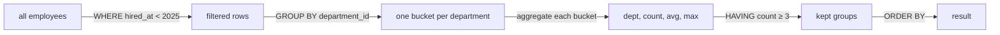

## Mental Model

`GROUP BY` **collapses** many rows into one row per group. After grouping, each output row represents a *bucket* of input rows, so for every column you select you must say either "this is the bucket's label" (it's in `GROUP BY`) or "summarize the bucket's values like this" (an aggregate). Anything else is ambiguous — which of the 40 employees' names should the department row show?

`WHERE` filters **rows before** they are grouped; `HAVING` filters **groups after** aggregation.

## Definition

- **Aggregate function**: computes one value from a set of values — `COUNT`, `SUM`, `AVG`, `MIN`, `MAX`, `string_agg`, `array_agg`, `bool_and`, statistical functions.
- **GROUP BY expr, …**: partitions rows by the values of the expressions.
- **HAVING condition**: filters groups; may use aggregates.
- **Conditional aggregation**: aggregating only rows that meet a condition — `COUNT(*) FILTER (WHERE …)` (PostgreSQL/standard) or `SUM(CASE WHEN … THEN 1 ELSE 0 END)` (portable).

## Why It Exists

Most business questions are summaries: revenue per month, orders per customer, average salary per department. Aggregation lets the database summarize millions of rows where the data lives, instead of shipping them to the application.

## How It Works

```sql
SELECT department_id,
       count(*)            AS headcount,
       avg(salary)         AS avg_salary,
       max(salary)         AS top_salary
FROM employees
WHERE hired_at < DATE '2025-01-01'   -- row filter: before grouping
GROUP BY department_id
HAVING count(*) >= 3                 -- group filter: after aggregation
ORDER BY avg_salary DESC;
```



### The "must appear in GROUP BY" rule

```sql
-- ERROR: column "employees.name" must appear in the GROUP BY clause or be used in an aggregate
SELECT department_id, name, max(salary) FROM employees GROUP BY department_id;
```

The intent — "who earns the max in each department" — is not an aggregation question; it's a **top-N-per-group** question, solved with window functions or `DISTINCT ON` ([Window Functions](lesson:sql-window-functions)).

(PostgreSQL permits selecting other columns of a table when you group by its primary key, since they're functionally dependent on it. Old MySQL modes allowed any column and returned an arbitrary row's value — a notorious source of wrong reports.)

### WHERE vs HAVING

| | WHERE | HAVING |
|---|---|---|
| Filters | rows | groups |
| Runs | before GROUP BY | after aggregation |
| Can use aggregates | no | yes |

A condition that doesn't involve aggregates belongs in `WHERE`: it's clearer and lets the database discard rows (possibly using an index) before doing grouping work.

### Conditional aggregation (pivoting)

One pass, several summaries:

```sql
SELECT customer_id,
       count(*)                                     AS orders,
       count(*) FILTER (WHERE status = 'cancelled') AS cancelled,
       sum(total) FILTER (WHERE status = 'paid')    AS paid_revenue,
       round(100.0 * count(*) FILTER (WHERE status = 'cancelled') / count(*), 1) AS cancel_pct
FROM orders
GROUP BY customer_id;
```

Portable form: `sum(CASE WHEN status = 'cancelled' THEN 1 ELSE 0 END)`.

Note `100.0 *`: in PostgreSQL, integer / integer is **integer division** (`1 / 3 = 0`).

### COUNT DISTINCT and grouping by expressions

```sql
SELECT date_trunc('month', order_date) AS month,
       count(*)                    AS orders,
       count(DISTINCT customer_id) AS active_customers
FROM orders
GROUP BY 1
ORDER BY 1;
```

`GROUP BY 1` refers to the first output column — convenient, but fragile if columns are reordered.

## Internal Mechanism

:::depth{level=advanced}
### Two ways to compute groups

- **HashAggregate**: scan rows once, keep a hash table keyed by group with running state (count, sum, …). O(n) time, memory proportional to the number of groups; spills to disk in batches when it exceeds `work_mem`.
- **GroupAggregate**: sort by the grouping key (or read from an index already in that order), then aggregate consecutive equal keys in a single pass. O(n log n) for the sort, but minimal memory and output arrives sorted.

The planner chooses based on the estimated number of groups and whether sorted input is available ([Scans & Joins](lesson:db-scans-joins)).

### Aggregate state

Each aggregate is a small state machine: an initial state, a transition function per row, and a final function. `AVG` keeps (sum, count) and divides at the end — which is why averages of averages are wrong: combining groups must combine states, not final values. Parallel aggregation relies on this: workers compute partial states, and a combine step merges them.

### COUNT(DISTINCT) is expensive

It must remember every distinct value per group (sort or hash). At analytical scale, systems use approximate sketches such as HyperLogLog, trading ~1% error for tiny memory ([Column Stores](lesson:db-column-stores)).

### GROUPING SETS, ROLLUP, CUBE

Several groupings in one query: `GROUP BY ROLLUP (year, month)` yields per-month rows, per-year subtotals and a grand total. `GROUPING(col)` distinguishes subtotal NULLs from real NULLs.
:::

## Example

"Departments whose average salary exceeds the company average, with headcount":

```sql
SELECT d.name, count(*) AS headcount, round(avg(e.salary)) AS avg_salary
FROM employees e
JOIN departments d ON d.id = e.department_id
GROUP BY d.id, d.name
HAVING avg(e.salary) > (SELECT avg(salary) FROM employees)
ORDER BY avg_salary DESC;
```

## Complexity & Performance

- Hash aggregation: O(n) with O(groups) memory. Sort-based: O(n log n) unless an index supplies order.
- Filtering in `WHERE` reduces work for everything after it; filtering the same condition in `HAVING` aggregates rows only to throw them away.
- Aggregating after a join that multiplies rows multiplies work *and* corrupts results (see Failure Modes).

## Trade-offs

- Aggregating in the database vs the application: the database avoids transferring raw rows; the application can cache or combine sources. For dashboards over huge data, precompute with materialized views or rollup tables ([Views](lesson:sql-views-programmability)).
- Exact vs approximate distinct counts: exactness costs memory and time.

## Failure Modes

- **Join fan-out double counting**: `SUM(orders.total)` after joining orders to order_items counts each order once *per item*. Aggregate at the right grain first (in a subquery), then join ([Joins](lesson:sql-joins)).
- **COUNT(col) vs COUNT(*)** confusion with NULLs; `SUM` of no rows returning NULL instead of 0.
- **Integer division** silently truncating percentages.
- **Averages of averages** instead of weighted averages.

## In Production

- Large `GROUP BY` queries on OLTP databases compete with transactional traffic; heavy analytics usually move to replicas or a warehouse.
- Watch for `HashAggregate` spilling to disk ("Batches: 8, Disk Usage…" in EXPLAIN ANALYZE) — raise `work_mem` for that query or reduce the group count.

## Deeper Connections

- `GROUP BY` collapses rows; window functions compute the same aggregates **without collapsing** ([Window Functions](lesson:sql-window-functions)).
- Aggregation over columns is where column stores are 10–100× faster: they read only the needed columns, compressed ([Column Stores](lesson:db-column-stores)).

## Common Misconceptions

- **"HAVING is just WHERE for GROUP BY queries."** HAVING filters groups after aggregation; row conditions belong in WHERE.
- **"GROUP BY sorts the output."** Hash aggregation returns groups in arbitrary order. Use ORDER BY.
- **"AVG treats NULL as 0."** It ignores NULLs.

## Interview Questions

### [L1 · compare] What's the difference between WHERE and HAVING?

WHERE filters individual rows before grouping and cannot reference aggregates. HAVING filters groups after aggregation and can. Non-aggregate conditions should go in WHERE so rows are discarded early.

### [L2 · why] Why must every selected column be in GROUP BY or inside an aggregate?

After grouping, each output row represents a group of input rows. A non-grouped, non-aggregated column could have many different values within the group, so the result would be ambiguous. (Exception: columns functionally dependent on the grouped primary key.)

### [L2 · sql] Find customers who placed more than 3 orders in 2024 and their total spend.

:::answer
```sql
SELECT customer_id, count(*) AS orders, sum(total) AS spend
FROM orders
WHERE order_date >= DATE '2024-01-01' AND order_date < DATE '2025-01-01'
GROUP BY customer_id
HAVING count(*) > 3
ORDER BY spend DESC;
```

The date range goes in WHERE (row filter, sargable); the count condition in HAVING (group filter).
:::

### [L2 · debugging] Revenue in a report is exactly 3× too high for some orders. What's the likely cause?

A join multiplied rows before aggregation — typically joining `orders` to `order_items` (or another one-to-many table) and then summing `orders.total`. Each order is repeated once per item. Aggregate `order_items` per order in a subquery before joining, or sum at the item grain (`quantity * unit_price`) instead of summing the order total.

### [L3 · how] How does a database execute GROUP BY internally, and when does it choose each strategy?

Either hash aggregation (build a hash table of groups with running aggregate state in one pass; good when groups fit in memory, output unordered) or sort-based group aggregation (sort by the group key or read pre-sorted input from an index, then aggregate runs of equal keys; low memory, ordered output). The planner compares estimated costs using the expected number of groups, available memory (`work_mem`) and whether sorted input is already available.

## Practice

### [mcq] Which query returns departments with an average salary above 80,000?

- [ ] `SELECT department_id FROM employees WHERE avg(salary) > 80000 GROUP BY department_id;`
- [x] `SELECT department_id FROM employees GROUP BY department_id HAVING avg(salary) > 80000;`
- [ ] `SELECT department_id, avg(salary) FROM employees HAVING salary > 80000;`
- [ ] `SELECT department_id FROM employees GROUP BY avg(salary) > 80000;`

Aggregates can't appear in WHERE; group conditions go in HAVING.

### [exercise] For each month of 2024, show the number of orders, number of distinct customers, and the percentage of orders that were cancelled (one decimal place).

:::solution
```sql
SELECT date_trunc('month', order_date)::date AS month,
       count(*)                                  AS orders,
       count(DISTINCT customer_id)               AS customers,
       round(100.0 * count(*) FILTER (WHERE status = 'cancelled') / count(*), 1) AS cancelled_pct
FROM orders
WHERE order_date >= DATE '2024-01-01' AND order_date < DATE '2025-01-01'
GROUP BY 1
ORDER BY 1;
```

`100.0` forces numeric division; `FILTER` does the conditional count in the same pass.
:::

## Quick Revision

- GROUP BY collapses rows; select only group keys or aggregates.
- WHERE → rows (before); HAVING → groups (after).
- `COUNT(*) FILTER (WHERE …)` / `SUM(CASE …)` for pivots in one pass.
- Beware join fan-out, integer division, NULL-skipping aggregates, average of averages.
- Engine: HashAggregate (memory, unordered) vs Sort + GroupAggregate (sorted input).
