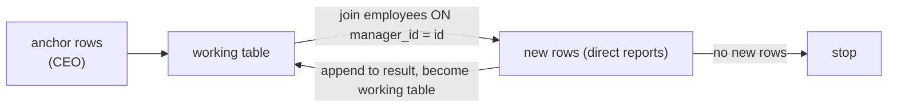

## Mental Model

A subquery is **a query used as a value, a list or a table inside another query**. A CTE (`WITH name AS (…)`) is the same thing given a name and moved to the top, so a complex query reads as a sequence of steps. A **recursive** CTE is a loop: start with some rows, repeatedly derive new rows from the previous ones, stop when nothing new appears — which is how SQL walks trees and graphs.

## Definition

| Kind | Returns | Used where | Example |
|---|---|---|---|
| Scalar subquery | one value (one row, one column) | anywhere a value fits | `salary > (SELECT avg(salary) FROM employees)` |
| Row/list subquery | a column of values | `IN`, `= ANY`, `EXISTS` | `id IN (SELECT customer_id FROM orders)` |
| Table subquery (derived table) | a relation | `FROM (…) AS t` | `FROM (SELECT … GROUP BY …) t` |
| Correlated subquery | depends on the outer row | `WHERE`, `SELECT` | `WHERE salary > (SELECT avg(salary) FROM employees e2 WHERE e2.department_id = e.department_id)` |
| CTE | named relation for this query | `WITH x AS (…) SELECT … FROM x` | |
| Recursive CTE | fixpoint of a recursive definition | `WITH RECURSIVE` | hierarchies, paths |

A scalar subquery that returns more than one row is a runtime error; one that returns no rows yields NULL.

## Why It Exists

**The problem.** Real questions are multi-step: "compute each customer's total, then find those above the average of totals". Without subqueries you'd need temporary tables or application code between steps. CTEs make those steps explicit and readable; recursion covers structures of unknown depth (org charts, category trees, bill of materials) that fixed joins can't.

**The idea.** A query's result is itself a table — so let a query be used anywhere a table or value can go. Naming those inner queries (CTEs) turns one dense statement into a short list of steps. Allowing a step to refer to *itself* (recursion) turns "join once per level" into "repeat until nothing new".

:::callout[That's all it is]{type=insight}
A subquery is a query used as a value, list or table. A CTE is a subquery with a name, written first. A recursive CTE starts with some rows and keeps joining to find the next level until a step adds nothing.
:::

## How It Works

### Correlated subquery: per-row comparison

"Employees paid above their department's average":

```sql
SELECT e.name, e.department_id, e.salary
FROM employees e
WHERE e.salary > (SELECT avg(e2.salary)
                  FROM employees e2
                  WHERE e2.department_id = e.department_id);
```

Logically evaluated per outer row. A good optimizer may decorrelate it into a join with a pre-aggregated table — which you can also write explicitly:

```sql
SELECT e.name, e.department_id, e.salary
FROM employees e
JOIN (SELECT department_id, avg(salary) AS avg_sal
      FROM employees GROUP BY department_id) d
  ON d.department_id = e.department_id
WHERE e.salary > d.avg_sal;
```

(A window function does it in one pass — [Window Functions](lesson:sql-window-functions).)

### CTEs: name the steps

```sql
WITH customer_totals AS (
  SELECT customer_id, sum(total) AS spend
  FROM orders
  WHERE status = 'paid'
  GROUP BY customer_id
),
avg_spend AS (
  SELECT avg(spend) AS a FROM customer_totals
)
SELECT c.name, ct.spend
FROM customer_totals ct
JOIN customers c ON c.id = ct.customer_id
CROSS JOIN avg_spend
WHERE ct.spend > avg_spend.a
ORDER BY ct.spend DESC;
```

Each CTE can reference earlier ones. The final `SELECT` reads like a sentence.

### Recursive CTE: walking a hierarchy

"Everyone under manager 1, with their depth":

```sql
WITH RECURSIVE reports AS (
  -- anchor: the starting rows
  SELECT id, name, manager_id, 0 AS depth
  FROM employees
  WHERE id = 1
  UNION ALL
  -- recursive step: employees whose manager is in the previous iteration's rows
  SELECT e.id, e.name, e.manager_id, r.depth + 1
  FROM employees e
  JOIN reports r ON e.manager_id = r.id
)
SELECT * FROM reports ORDER BY depth, name;
```



Execution: the anchor fills a working table; each iteration joins the working table to `employees` and produces the next level; iteration stops when a step produces no rows.

**Cycles**: in graph data (not trees), recursion can loop forever. Track the path and stop when revisiting (`WHERE NOT e.id = ANY(r.path)`), use `UNION` instead of `UNION ALL` to discard duplicate rows, or use PostgreSQL 14's `CYCLE` clause. Also cap depth as a safety net.

### LATERAL: a subquery per row that can return several rows and columns

A gap the other forms leave: a scalar subquery can depend on the outer row but returns only one value; a derived table can return many rows but can't see the outer row. LATERAL gives you both. "Each customer's 3 most recent orders":

```sql
SELECT c.name, o.id, o.order_date, o.total
FROM customers c
CROSS JOIN LATERAL (
  SELECT id, order_date, total
  FROM orders
  WHERE orders.customer_id = c.id
  ORDER BY order_date DESC
  LIMIT 3
) o;
```

`LATERAL` lets the subquery in `FROM` reference `c`. With an index on `orders(customer_id, order_date DESC)` each customer costs one short index scan. (SQL Server: `CROSS APPLY`.)

## Internal Mechanism

:::depth{level=advanced}
### Are CTEs optimization fences?

- PostgreSQL ≤ 11: every CTE was **materialized** — computed once, stored, and not merged into the outer query. Filters in the outer query couldn't be pushed into it (a frequent performance surprise).
- PostgreSQL 12+: a non-recursive, side-effect-free CTE referenced once is **inlined** like a subquery. Force behavior with `WITH x AS MATERIALIZED (…)` or `NOT MATERIALIZED`.
- MySQL 8 merges or materializes derived tables/CTEs by cost; SQL Server always inlines CTEs (re-evaluating them per reference).

Materialization is useful when an expensive CTE is referenced several times, or to stop the planner from choosing a bad plan by merging.

### Decorrelation

Optimizers transform correlated subqueries into joins (semi joins for `EXISTS`/`IN`, joins with aggregated derived tables for scalar comparisons) when semantics allow. When they can't, the subquery runs as a **SubPlan** per outer row — visible in EXPLAIN and potentially O(n × m).

### Recursive CTE evaluation

Semi-naïve evaluation: each iteration only joins the rows produced by the *previous* iteration (the working table), not the whole accumulated result, avoiding recomputation. That's why the recursive term may reference the CTE only once.
:::

## Example

Category breadcrumbs — from a leaf category up to the root:

```sql
WITH RECURSIVE path AS (
  SELECT id, name, parent_id, 1 AS lvl FROM categories WHERE id = 42
  UNION ALL
  SELECT c.id, c.name, c.parent_id, p.lvl + 1
  FROM categories c JOIN path p ON c.id = p.parent_id
)
SELECT string_agg(name, ' › ' ORDER BY lvl DESC) AS breadcrumb FROM path;
-- Electronics › Computers › Laptops
```

## Complexity & Performance

- Uncorrelated subqueries run once. Correlated ones run per outer row unless decorrelated — check EXPLAIN for `SubPlan`.
- Recursive CTEs: each iteration is a join; index the column used to find children (`employees(manager_id)`), otherwise every level scans the table.
- `LATERAL … LIMIT k` with a matching composite index is often the fastest top-k-per-group plan when groups are few and large.

## Trade-offs

- CTE vs subquery: identical results; CTEs win on readability and reuse. Know your database's materialization rules.
- Recursive CTE vs storing hierarchy helpers: adjacency lists (`parent_id`) are simple to update but need recursion to query; **materialized paths** (`/1/7/42/`), **nested sets** or PostgreSQL's `ltree` make subtree queries cheap but updates expensive. Closure tables (all ancestor–descendant pairs) trade storage for simple joins.
- Deep graph traversals (friends-of-friends-of-friends) are where graph databases shine ([Graph Databases](lesson:db-graph-databases)).

## Failure Modes

- Scalar subquery returning more than one row → runtime error in production when data changes ("more than one row returned by a subquery used as an expression").
- Infinite recursion on cyclic data.
- Old PostgreSQL CTE fences hiding filters — queries that became fast after a version upgrade (or slow, if materialization was accidentally beneficial).
- Correlated subqueries in the `SELECT` list executed per row → N+1 inside the database.

## In Production

- Long analytical queries are usually written as chains of CTEs; they're easy to debug by running each step alone.
- Hierarchies (org charts, comment threads, folder trees) are among the most common recursive-CTE use cases in application code.

## Deeper Connections

- Recursive CTEs compute a **fixpoint** — the same idea as graph BFS level by level, or dataflow analysis in compilers.
- `EXISTS` subqueries become semi joins ([Semi & Anti Joins](lesson:sql-semi-anti-joins)); scalar aggregates per group are often better as window functions.

## Common Misconceptions

- **"Correlated subqueries are always slow."** Often decorrelated by the optimizer; check the plan.
- **"CTEs are always computed once and cached."** Depends on the database and version.
- **"Recursive CTEs are exotic."** They're the standard way to query trees stored with parent pointers.

## Interview Questions

### [L2 · compare] What's the difference between a correlated and a non-correlated subquery?

A non-correlated subquery is independent of the outer query and can be evaluated once. A correlated subquery references columns of the outer row, so logically it's evaluated for each outer row; optimizers often rewrite it into a join (decorrelation), otherwise it runs per row.

### [L2 · sql] Write a query that returns the full reporting chain under a given manager, with each employee's level.

:::answer
```sql
WITH RECURSIVE reports AS (
  SELECT id, name, manager_id, 0 AS level FROM employees WHERE id = $1
  UNION ALL
  SELECT e.id, e.name, e.manager_id, r.level + 1
  FROM employees e JOIN reports r ON e.manager_id = r.id
)
SELECT * FROM reports WHERE level > 0 ORDER BY level, name;
```

Index `employees(manager_id)` so each iteration is an index lookup. Add a depth limit or cycle detection if the data might contain cycles.
:::

### [L2 · why] Why might a query using a CTE be slower than the same query using a subquery?

If the database materializes the CTE (PostgreSQL before 12 always did; later versions do for CTEs referenced multiple times or marked MATERIALIZED), the outer query's filters can't be pushed into it and indexes on the underlying tables can't be used for those filters. The whole CTE is computed and stored first. Inlining (subquery or `NOT MATERIALIZED`) lets the planner optimize across the boundary.

### [L3 · sql] Return each customer's two most recent orders.

:::answer
With LATERAL (efficient with an index on `orders(customer_id, order_date DESC)`):

```sql
SELECT c.id, c.name, o.id AS order_id, o.order_date
FROM customers c
CROSS JOIN LATERAL (
  SELECT id, order_date FROM orders
  WHERE customer_id = c.id
  ORDER BY order_date DESC, id DESC
  LIMIT 2) o;
```

With a window function (portable):

```sql
SELECT customer_id, id, order_date
FROM (SELECT o.*, row_number() OVER (PARTITION BY customer_id ORDER BY order_date DESC, id DESC) AS rn
      FROM orders o) t
WHERE rn <= 2;
```

Use `LEFT JOIN LATERAL … ON true` to keep customers without orders.
:::

## Practice

### [mcq] A scalar subquery in a SELECT list returns zero rows for some outer row. What happens?

- [ ] The query fails
- [x] The value is NULL for that row
- [ ] The outer row is removed
- [ ] The value is 0

An empty scalar subquery yields NULL; returning more than one row is the error case.

### [exercise] Write a recursive CTE that generates the dates of January 2024 (one row per day) without using generate_series.

:::solution
```sql
WITH RECURSIVE days AS (
  SELECT DATE '2024-01-01' AS d
  UNION ALL
  SELECT d + 1 FROM days WHERE d < DATE '2024-01-31'
)
SELECT d FROM days;
```

The anchor emits the first day; each iteration adds one day until the condition fails and the step returns no rows. (PostgreSQL's `generate_series` is the idiomatic way; the recursive form works in most databases.) A calendar like this is useful for filling gaps: LEFT JOIN daily totals onto it so days without orders show 0.
:::

## Quick Revision

- Subquery kinds: scalar (one value; >1 row = error; 0 rows = NULL), list (IN/EXISTS), table (FROM), correlated (per outer row).
- CTEs name steps; inlined or materialized depending on database/version.
- Recursive CTE = anchor UNION ALL recursive step; stops when no new rows; guard against cycles; index the parent column.
- LATERAL = per-row subquery in FROM (top-k per group).
