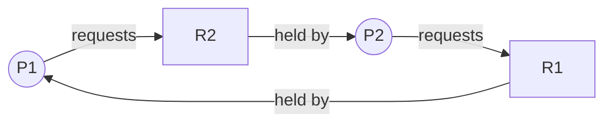

## Mental Model

Four cars arrive at a four-way intersection at once. Each moves halfway in and waits for the car to its right to clear. Nobody can move forward, nobody backs up, and no traffic officer will pull anyone out. They'll wait forever.

That's a deadlock: **a set of parties, each holding something and waiting for something held by another in the set, in a cycle, with no way to take anything away.** Remove *any one* of those ingredients and the deadlock can't happen — that observation is the basis of every prevention strategy.

## Definition

A **deadlock** is a state in which a set of processes (or threads, or transactions) are each blocked waiting for an event — typically the release of a resource — that can only be caused by another process in the same set. None can proceed.

The **Coffman conditions** (1971): a deadlock can occur only if **all four** hold simultaneously:

1. **Mutual exclusion** — at least one resource is non-shareable (only one holder at a time).
2. **Hold and wait** — a process holds at least one resource while waiting to acquire others.
3. **No preemption** — resources can't be forcibly taken away; they're released only voluntarily.
4. **Circular wait** — there's a cycle P₀ → P₁ → … → Pₙ → P₀ where each waits for a resource held by the next.

The first three are *necessary conditions of the system*; circular wait is the actual event.

## Why It Exists

**Nobody designs deadlock in.** It isn't a mechanism; it's an accident that becomes possible once a system has certain properties. Deadlock is the price of two otherwise reasonable things: **exclusive access** (needed for correctness) and **incremental acquisition** (acquiring resources as you discover you need them, e.g., locking account A, then B). Whenever independent actors acquire multiple exclusive resources in different orders, cycles become possible.

**Why the four conditions matter.** If deadlock needs *all four* conditions, you only have to remove *one* to make it impossible. That turns a scary, timing-dependent bug into a design checklist — which is what the [next lesson](lesson:os-deadlock-handling) does.

:::callout[That's all it is]{type=insight}
Deadlock = everyone is holding something and waiting for something someone else in the group holds, in a circle. Break the circle (for example, always take locks in the same order) and it can't happen.
:::

## How It Works

### Minimal code deadlock

```java
// Thread 1                          // Thread 2
synchronized (a) {                   synchronized (b) {
    synchronized (b) { ... }             synchronized (a) { ... }
}                                    }
```

Thread 1 holds `a`, wants `b`; Thread 2 holds `b`, wants `a`. All four conditions hold.

### Resource-allocation graph (RAG)

Why draw a graph: "who holds what, who waits for what" is hard to see in code but obvious as arrows — and "a cycle of waiting" becomes literally a cycle you can look for. Nodes: processes (circles) and resource types (boxes, with dots for instances). Edges:

- **Request edge** P → R: P is waiting for an instance of R.
- **Assignment edge** R → P: an instance of R is allocated to P.



Reading rules:

- **No cycle → no deadlock.** Guaranteed.
- **Cycle, and every resource in it has a single instance → deadlock.** Guaranteed.
- **Cycle with multi-instance resources → deadlock possible but not certain.** Another process outside the cycle may hold an instance and release it, breaking the cycle.

Example of a cycle without deadlock: R1 has 2 instances, held by P1 and P3; P1 → R2 → P2 → R1. P2 waits for R1, but P3 (not in the cycle) will finish and release its instance of R1, P2 proceeds, releases R2, and P1 proceeds.

::viz{id=deadlock-graph}

### Wait-for graph

When every resource has a single instance, collapse the RAG into a **wait-for graph**: an edge Pᵢ → Pⱼ means Pᵢ waits for a resource Pⱼ holds. **A cycle in the wait-for graph = deadlock.** Databases maintain exactly this graph for row locks and run cycle detection ([Locking](lesson:db-locking)).

## Internal Mechanism

### Deadlock vs livelock vs starvation

| | Are processes blocked? | Is any work done? | Example |
|---|---|---|---|
| **Deadlock** | Yes, forever | No (for the set) | Two threads each holding one lock the other needs |
| **Livelock** | No — they keep running | No useful progress | Two people in a corridor both stepping aside in the same direction, repeatedly; two threads that each release and retry their locks in lockstep |
| **Starvation** | One process waits indefinitely | Yes, others progress | A low-priority thread never scheduled; a writer never getting an RW lock |

Livelock often comes from *deadlock avoidance done symmetrically* (everyone backs off and retries at the same moment); randomized backoff fixes it. Starvation comes from unfair policies; aging and FIFO queues fix it.

### Resource types matter

Deadlocks aren't only about mutexes:

- **Locks** in code and database rows.
- **Memory**: two processes each holding half of available memory and waiting for more.
- **Thread pools**: tasks waiting for subtasks queued behind them in the same exhausted pool ([Thread Pools](lesson:os-thread-pools)).
- **Pipes**: parent and child each blocked writing to a full pipe the other should read ([IPC](lesson:os-ipc)).
- **Connection pools**: a request holds one DB connection and waits for a second from an exhausted pool while all other requests do the same.
- **Distributed**: service A calls B synchronously while B calls back into A with bounded worker pools.

## Example

A connection-pool deadlock (very common in production):

```text
Pool size = 10. Each request:
  1. takes connection #1, starts a transaction
  2. calls a helper that (incorrectly) takes a *second* connection for an audit insert
Under load, 10 requests each hold 1 connection and wait for a 2nd.
No connection is ever returned. Every thread waits for the pool timeout — or forever.
```

Hold-and-wait + mutual exclusion + no preemption + circular wait (each waits for resources held by the others collectively). Fixes: never acquire a second connection while holding one (pass the transaction/connection through), or size pools so `pool ≥ threads × (max connections per thread − 1) + 1`.

## Visualization

The resource-allocation graph above is interactive. To see how an OS can *avoid* ever entering an unsafe state, try the Banker's algorithm lab:

::lab{id=bankers}

## Complexity & Performance

- Detecting a cycle in a wait-for graph with n nodes and e edges is O(n + e) (DFS).
- Deadlocks usually don't cost CPU — threads sit idle — so they show up as **throughput dropping to zero** with **low CPU usage** and requests timing out.

## Trade-offs

Handling strategies (next lesson) trade off differently: prevention restricts how programs acquire resources; avoidance needs advance knowledge of maximum needs; detection needs periodic graph checks and a recovery plan (kill/rollback); ignoring deadlocks (the "ostrich algorithm") is cheap until it happens. See [Deadlock Handling](lesson:os-deadlock-handling).

## Failure Modes

- Deadlocks that only occur under load or with specific timing — invisible in tests.
- Deadlocks spanning layers: an application lock held while waiting for a database row lock that another thread holds while waiting for the application lock. Neither the app nor the DB sees the full cycle.
- Distributed deadlocks across services with synchronous calls and bounded pools — no single process sees a cycle.

## In Production

- **Diagnosis**: thread dumps (`jstack` prints "Found one Java-level deadlock"; `go` dumps goroutines; `gdb` for native), `pg_locks` + `pg_stat_activity` in PostgreSQL, `SHOW ENGINE INNODB STATUS` for the latest detected deadlock in MySQL.
- **Databases detect and break deadlocks automatically**: they abort one transaction (the "victim") with an error such as PostgreSQL's `ERROR: deadlock detected` (SQLSTATE 40P01) or MySQL error 1213. Applications must **retry** such transactions.
- **Timeouts everywhere** turn permanent deadlocks into recoverable failures (lock timeouts, pool acquisition timeouts, RPC deadlines).
- Case study: [Deadlock in production](case:db-deadlocks).

## Deeper Connections

- Prevention by breaking Coffman conditions and the Banker's algorithm: [Deadlock Handling](lesson:os-deadlock-handling).
- Two-phase locking in databases guarantees serializability but makes deadlocks possible — hence detectors ([Locking](lesson:db-locking)).
- Distributed lock ordering and timeouts: [Concurrency Everywhere](lesson:x-concurrency-everywhere).

## Common Misconceptions

- **"A cycle in the resource-allocation graph always means deadlock."** Only when each resource in the cycle has a single instance.
- **"Deadlocked threads spin at 100% CPU."** They're blocked; CPU is usually idle. Spinning with no progress is livelock (or a busy-wait bug).
- **"Deadlock only happens with locks."** Any exclusive, non-preemptible resource acquired incrementally can deadlock: pool slots, memory, pipe buffers, threads.
- **"Deadlock and starvation are the same."** In starvation the system progresses; one party doesn't.

## Interview Questions

### [L1 · conceptual] What is a deadlock? State the four necessary conditions.

A situation where a set of processes are all blocked, each waiting for a resource held by another in the set, so none can proceed. Conditions (all four must hold): mutual exclusion, hold and wait, no preemption, circular wait.

### [L1 · compare] Deadlock vs starvation vs livelock?

Deadlock: processes are blocked forever waiting on each other; no progress. Livelock: processes keep changing state in response to each other (e.g., retrying) but make no progress. Starvation: some process waits indefinitely while others make progress, due to unfair scheduling or resource allocation.

### [L2 · diagram] A resource-allocation graph has a cycle. Is the system deadlocked?

If every resource type in the cycle has exactly one instance, yes. If some have multiple instances, not necessarily: a process outside the cycle may hold an instance and eventually release it, breaking the cycle. You'd run a detection algorithm (like Banker's safety check on the current allocation) to decide.

### [L2 · trace] Write code that can deadlock with two threads and two locks, and fix it.

T1: lock(a); lock(b); … T2: lock(b); lock(a); … If T1 holds a and T2 holds b, each waits for the other. Fix: impose a global order — both acquire a before b — or use `tryLock` with timeout and back off.

### [L3 · debugging] A service's throughput drops to zero, CPU usage is near 0%, and requests time out. How do you confirm a deadlock and find the cycle?

Low CPU plus no progress suggests blocked threads. Take thread dumps (several, seconds apart) and look for threads BLOCKED/WAITING on locks held by other blocked threads; JVM dumps detect Java-level cycles automatically. Also check external resources: connection-pool waits (threads waiting on pool acquisition while holding connections), DB lock waits (`pg_locks`, `pg_stat_activity.wait_event`), and pipe/queue waits. Build the wait-for graph from the dumps to find the cycle and the code paths acquiring resources in conflicting orders.

### [L3 · what-if] Can a single thread deadlock by itself?

Yes: acquiring a non-reentrant mutex it already holds (self-deadlock), joining itself, or waiting on a condition that only it could signal. Also a thread blocking on a future whose task is queued behind it in a single-threaded executor.

### [L4 · incident] During a traffic spike, all API pods hang. Each request opens a transaction on connection A and then calls a library that fetches its own connection B for audit logging. Explain the failure and the fixes.

Pool deadlock via hold-and-wait: with pool size N, N concurrent requests each hold one connection and wait for a second; the pool is empty and nobody releases. The cycle is spread across threads via the pool, so no lock-level detector sees it. Immediate mitigation: acquisition timeouts (fail instead of hanging) and restarting pods. Fixes: pass the existing connection/transaction to the audit code, or write audits asynchronously; if two connections are truly needed, use separate pools. Add metrics for pool wait time and pending acquisitions.

## Practice

### [mcq] Which Coffman condition is broken by requiring every thread to acquire locks in a fixed global order?

- [ ] Mutual exclusion
- [ ] Hold and wait
- [ ] No preemption
- [x] Circular wait

A global order makes a cycle impossible.

### [mcq] Two threads repeatedly acquire lock A, fail to get lock B, release A, and retry at the same instants. Neither makes progress but both use CPU. This is:

- [ ] Deadlock
- [x] Livelock
- [ ] Starvation
- [ ] Priority inversion

They keep acting but make no progress; add randomized backoff.

## Quick Revision

- Deadlock = set of processes each waiting for a resource held by another in the set; nobody progresses.
- **Coffman**: mutual exclusion, hold and wait, no preemption, circular wait — **all four** needed.
- RAG: no cycle → no deadlock; cycle + single-instance resources → deadlock; multi-instance → maybe.
- Wait-for graph cycle = deadlock (DBs use this).
- **Livelock** = busy but no progress; **starvation** = others progress, one never does.
- Deadlocks show as zero throughput with low CPU. Diagnose with thread dumps / `pg_locks`. DBs abort a victim → retry.
