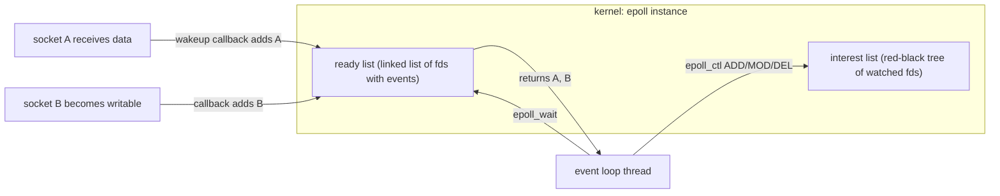

## Mental Model

An event loop is a **dispatcher at a switchboard with thousands of phone lines**. Most lines are silent. The dispatcher doesn't listen to each one in turn; the switchboard lights up the lines that have a caller, and the dispatcher handles only those — quickly, never putting anyone on a long hold, because while they're busy with one call, every other line waits.

**epoll is the switchboard. The event loop is the dispatcher.** The golden rule follows: **never do slow work at the switchboard.**

## Definition

- **epoll**: Linux's scalable I/O event notification facility: `epoll_create1` creates an instance; `epoll_ctl` adds/modifies/removes fds in its **interest list**; `epoll_wait` blocks until fds on the **ready list** have events.
- **Event loop**: a single thread repeatedly waiting for events and dispatching handlers: `while (true) { events = wait(); for e in events: handle(e); run_timers(); }`.
- **Reactor pattern**: demultiplex readiness events and dispatch to handlers that perform non-blocking I/O (epoll, kqueue).
- **Proactor pattern**: initiate asynchronous operations and dispatch completion events (IOCP, io_uring).

## Why It Exists

Thread-per-connection hits walls around tens of thousands of connections: memory for stacks, scheduler overhead, context switches, and lock contention. `select`/`poll` scan every fd on every call — O(n) — so 50,000 mostly idle connections cost 50,000 checks per wakeup. epoll (Linux 2.6, 2002) made per-wait cost proportional to *active* connections, solving the C10K problem and enabling C100K+.

## How It Works

### Inside epoll



When you add an fd, the kernel registers a **callback** on that file's wait queue. When a packet arrives on socket A, the network stack wakes the socket's wait queue, the callback appends A to the ready list and wakes any thread in `epoll_wait`. `epoll_wait` just drains the ready list — no scanning.

### Level-triggered vs edge-triggered

- **Level-triggered (default)**: `epoll_wait` reports an fd as long as the condition holds (unread data remains). Forgiving: if you read only part of the data, you'll be told again.
- **Edge-triggered (`EPOLLET`)**: reported only when the state **changes** (new data arrives). You must read until `EAGAIN` each time, or leftover data will never be reported again — a hang. Fewer wakeups, more discipline.

```c
// Edge-triggered read handler: drain completely
for (;;) {
    ssize_t n = read(fd, buf, sizeof buf);
    if (n > 0) { process(buf, n); continue; }
    if (n == 0) { close_connection(fd); break; }          // peer closed
    if (errno == EAGAIN || errno == EWOULDBLOCK) break;   // drained
    if (errno == EINTR) continue;
    close_connection(fd); break;                           // real error
}
```

`EPOLLONESHOT` disables an fd after one event until re-armed — used when multiple threads share one epoll instance so two threads never handle the same connection concurrently.

### Anatomy of an event loop iteration

1. Compute the timeout from the nearest timer (idle-connection timeouts, retries, scheduled tasks).
2. `epoll_wait(ep, events, max, timeout)`.
3. For each event: accept new connections, read requests into per-connection buffers, parse, generate responses (or hand off CPU/blocking work to a pool), write responses (partial writes → register interest in `EPOLLOUT`).
4. Run expired timers and queued callbacks (e.g., completions from worker threads, microtasks/promises in JavaScript).
5. Repeat.

## Internal Mechanism

### Multi-core event loops

One loop uses one core. Servers scale across cores by:

- **Multiple processes**, each with its own loop (Nginx workers, Node.js cluster), sharing listening sockets. **`SO_REUSEPORT`** gives each worker its own listening socket and lets the kernel load-balance incoming connections by hash, avoiding the **thundering herd** (all workers waking for one new connection; `EPOLLEXCLUSIVE` also addresses it).
- **Multiple threads**, one loop each (Netty's EventLoopGroup, Envoy workers, Redis 6+ I/O threads for reads/writes while command execution stays single-threaded).
- **Runtime schedulers**: Go multiplexes goroutines over OS threads; a goroutine blocking on a socket is parked, and the runtime's **netpoller** (epoll) resumes it when ready — blocking-style code, event-loop efficiency.

### Redis: why single-threaded is fast

Redis executes commands on one thread using an event loop: no locks on data structures, excellent cache locality, and commands are microsecond-scale. It serves 100k+ ops/s per core. The flip side: one slow command (`KEYS *`, a big `SMEMBERS`, a Lua script) blocks every client ([Redis & Caching](lesson:db-redis-caching)).

:::depth{level=advanced}
### Backpressure in event loops

An event loop reading as fast as clients send can buffer unbounded data if downstream is slower — memory blowup. Well-behaved servers stop reading (remove `EPOLLIN` interest) when per-connection output buffers exceed a watermark, which fills the kernel socket buffer, shrinks the TCP receive window, and slows the sender — **backpressure propagated all the way to the client via TCP flow control** ([Flow Control](lesson:cn-tcp-flow-control)). Redis's `client-output-buffer-limit` and Netty's `WRITE_BUFFER_WATER_MARK` implement this.
:::

## Example

Node.js request handling, mapped to the machinery:

```js
http.createServer(async (req, res) => {
  const user = await db.query("SELECT * FROM users WHERE id = $1", [id]); // socket I/O → epoll
  const report = fs.readFileSync("/data/big.json");  // BLOCKS the loop: sync file read!
  res.end(JSON.stringify(transform(report)));       // CPU work on the loop thread
}).listen(8080);
```

The DB call is fine (non-blocking socket, the loop serves others meanwhile). `readFileSync` and a heavy `JSON.stringify` freeze **every** request on this process for their duration. Fix: `await fs.promises.readFile` (libuv thread pool), cache the parsed data, move CPU-heavy transforms to worker threads.

## Visualization

::viz{id=io-models}

## Complexity & Performance

- epoll_wait: O(k) for k ready events; epoll_ctl: O(log n).
- Per-connection memory: kernel socket buffers (tunable, KB–MB) + app state — the real limit for millions of connections.
- A well-written event loop can handle tens of thousands of requests per second per core for small requests; throughput is limited by per-request CPU work.

## Trade-offs

| | Event loop | Thread per connection | Goroutines / virtual threads |
|---|---|---|---|
| Idle connection cost | Tiny | Thread stack + kernel task | Small (KBs) |
| Programming model | Callbacks / async-await | Straight-line blocking | Straight-line blocking |
| CPU-heavy handlers | Must offload | Fine | Fine (preempted by runtime) |
| Fairness | Cooperative: one handler can starve others | Preemptive | Mostly preemptive |
| Debuggability | Stack traces span callbacks | Simple | Simple |

## Failure Modes

- **Loop blocking** by sync I/O or CPU work → latency spikes for all connections.
- **Edge-triggered starvation**: not draining to EAGAIN → connections hang.
- **Unbounded buffers** without backpressure → memory exhaustion.
- **Thundering herd** on accept without `SO_REUSEPORT`/`EPOLLEXCLUSIVE`.
- **Timer leaks** (idle connections never closed) → fd exhaustion.

## In Production

- **Nginx**: master + N worker processes, each an epoll event loop; `worker_connections` per worker; `sendfile` for static files.
- **Netty (Java)**: boss group accepts, worker groups (one loop per thread) handle I/O; blocking work must go to separate executors.
- **Envoy**: one event loop per worker thread; connections pinned to a worker.
- Monitoring: event-loop lag/delay metrics are the single most useful health signal for event-loop services.

## Deeper Connections

- The readiness events come from socket buffers filled by the TCP stack ([Sockets](lesson:cn-sockets)).
- WebSocket and SSE servers holding many idle connections are the classic event-loop workload ([Real-time Communication](lesson:cn-realtime)).
- Overload behavior of event loops vs thread pools: [Overloaded Servers](lesson:x-overloaded-server).

## Common Misconceptions

- **"Event loops mean single-threaded servers."** Production servers run one loop per core (processes or threads).
- **"Edge-triggered is always better."** It reduces wakeups but requires draining and careful state handling; level-triggered is simpler and often fast enough.
- **"Async code can't block."** Any synchronous CPU or I/O work inside a callback blocks the loop.

## Interview Questions

### [L2 · how] How does epoll achieve O(1)-ish scalability compared to select/poll?

fds are registered once in a kernel interest list; the kernel attaches callbacks to each fd's wait queue, and when an fd becomes ready the callback appends it to a ready list. `epoll_wait` returns entries from the ready list without scanning all watched fds, so its cost is proportional to the number of ready fds, not the total.

### [L2 · compare] Level-triggered vs edge-triggered epoll?

Level-triggered reports an fd whenever the condition is true (e.g., unread data remains), so partial reads are safe. Edge-triggered reports only on state transitions (new data arriving), so the handler must read/write until EAGAIN; otherwise remaining data may never trigger another event and the connection stalls. Edge-triggered reduces redundant wakeups.

### [L2 · why] Why is Redis fast despite being single-threaded?

Its data lives in memory, commands are mostly O(1)/O(log n) microsecond operations, and a single-threaded event loop avoids locks, context switches and cache-coherence traffic. Network I/O is multiplexed with epoll. The bottleneck is typically network and syscall overhead, which Redis 6+ can spread with I/O threads while keeping command execution single-threaded.

### [L3 · debugging] An event-loop service's latency p99 jumped after adding a feature that compresses responses. Throughput dropped too. Why?

Compression is CPU work executed on the event-loop thread; while compressing one large response, the loop can't service other connections, so their events queue up (event-loop lag). Move compression to a worker pool, compress in chunks yielding to the loop, cache compressed variants, or scale the number of loops/processes with cores.

### [L3 · what-if] What happens with edge-triggered epoll if your read handler reads only once per event and more data remains?

No new edge occurs because the socket is already readable, so epoll never reports it again; the remaining data sits in the socket buffer until the client sends more (which may never happen, e.g., waiting for a response). The connection appears hung. Always drain to EAGAIN in ET mode.

### [L4 · design] Design the threading/event model for a WebSocket gateway on a 32-core box handling 500k connections with occasional CPU-heavy message transformations.

Run one event loop per core (32 threads or processes) with SO_REUSEPORT to balance accepts; each loop owns its connections (no cross-thread locking on connection state). Use edge-triggered epoll or io_uring, bounded per-connection write buffers with backpressure, and a timing wheel for heartbeats/idle timeouts. Offload CPU-heavy transformations to a separate bounded worker pool with a queue and deadlines; results are posted back to the owning loop. Tune kernel limits (fds, socket buffer memory), monitor per-loop lag and connection counts, and plan for reconnect storms (rate-limit accepts, jittered client reconnects).

## Practice

### [mcq] In edge-triggered mode, when must a read handler stop reading?

- [ ] After one read() call
- [ ] When read() returns fewer bytes than requested
- [x] When read() returns -1 with EAGAIN (or 0 for EOF)
- [ ] After 64 KB

Only EAGAIN proves the buffer is drained.

### [mcq] Which socket option lets multiple worker processes each have their own listening socket on the same port, with kernel load balancing?

- [ ] SO_REUSEADDR
- [x] SO_REUSEPORT
- [ ] SO_KEEPALIVE
- [ ] TCP_NODELAY

SO_REUSEPORT distributes incoming connections across sockets by hash.

## Quick Revision

- epoll: interest list (RB-tree) + ready list fed by wait-queue callbacks → `epoll_wait` cost ∝ ready fds.
- **Level-triggered**: repeated notifications while ready. **Edge-triggered**: on change only → drain to EAGAIN. `EPOLLONESHOT` for multi-threaded handling.
- Event loop: wait → dispatch handlers → timers → repeat. **Never block the loop.**
- Scale: one loop per core (processes/threads), `SO_REUSEPORT`, runtimes (Go netpoller, virtual threads).
- Reactor (readiness) vs proactor (completion).
- Backpressure: stop reading when output buffers are full → TCP window shrinks.
