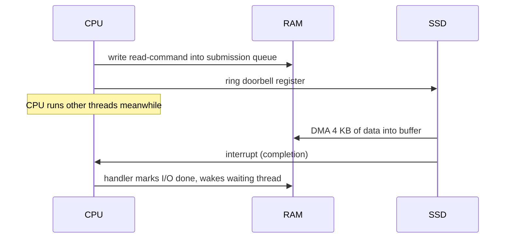

## Mental Model

A computer is a **very fast worker with a tiny desk, a nearby filing cabinet, and a warehouse across town**.

- **Registers** are what the worker holds in their hands — a few dozen values, instantly available.
- **CPU caches** (L1/L2/L3) are the desk — small, very fast, managed automatically by hardware.
- **RAM** is the filing cabinet down the hall — big, but each trip costs ~100× more than reaching the desk.
- **SSD / disk** is the warehouse across town — enormous and persistent, but a trip costs thousands to millions of times more than the desk.
- **Devices** (network cards, disks) are couriers that work independently and ring a bell (**interrupt**) when they finish.

Almost every design decision in operating systems and databases — caching, prefetching, batching, B-trees, buffer pools, async I/O — is an attempt to **avoid trips to slower levels**, or to keep the worker busy while waiting for them.

## Definition

- **CPU (core)**: executes instructions; each core has its own registers, program counter and (usually) private L1/L2 caches.
- **Memory hierarchy**: registers → L1 → L2 → L3 cache → main memory (DRAM) → persistent storage (SSD/HDD) → network/remote storage, each level larger, slower and cheaper per byte.
- **Interrupt**: a hardware signal that makes the CPU pause its current work and run a kernel handler.
- **DMA (Direct Memory Access)**: a device copying data to/from RAM without the CPU moving each byte.

## Why It Exists

**The problem.** We want memory that is fast, huge, cheap and survives power loss — all at once.

**Without it.** No such memory exists. Physics and economics. Fast memory (SRAM) is expensive, power-hungry and must sit physically close to the core; big memory (DRAM, flash) is cheap but farther away and slower. No single technology is fast, large, cheap and persistent at once. Pick one and you get either a tiny machine (all SRAM) or a slow one (every access at DRAM or disk speed).

**The idea.** Programs don't touch all their data evenly — at any moment they hammer a small part of it. So keep a *small fast copy* of the part in use, and most accesses never reach the slow level. That pattern has a name, **locality**, and it comes in two flavours:

- **Temporal locality**: data used recently will likely be used again soon.
- **Spatial locality**: data near recently used data will likely be used soon.

**From idea to mechanism.** Caches exploit both automatically. The OS exploits them with the page cache and read-ahead; databases with buffer pools and pages. Same trick, applied at every level.

:::callout[That's all it is]{type=insight}
Fast memory is small; big memory is slow. Keep what you're using right now in the small fast place. Nearly every performance technique in this course is that sentence applied to a different pair of levels.
:::

## How It Works

### Latency numbers every engineer should know

Approximate orders of magnitude on modern servers (they drift by hardware generation — the *ratios* are what matter):

| Operation | Time | Relative (L1 = 1) |
|---|---|---|
| L1 cache reference | ~1 ns | 1 |
| Branch mispredict | ~3–5 ns | ~4 |
| L2 cache reference | ~4 ns | ~4 |
| L3 cache reference | ~10–20 ns | ~15 |
| Mutex lock/unlock (uncontended) | ~15–25 ns | ~20 |
| Main memory (DRAM) reference | ~80–100 ns | ~100 |
| System call (round trip) | ~100 ns–1 µs | ~100–1,000 |
| Context switch | ~1–5 µs | ~2,000 |
| Read 4 KB randomly from NVMe SSD | ~10–100 µs | ~50,000 |
| Round trip within a datacenter | ~100–500 µs | ~250,000 |
| Read 1 MB sequentially from SSD | ~200 µs–1 ms | ~500,000 |
| HDD seek | ~5–10 ms | ~7,000,000 |
| Round trip US East ↔ Europe | ~70–90 ms | ~80,000,000 |

:::callout{type=insight}
If an L1 hit took **1 second**, a DRAM access would take ~1.5 minutes, an SSD random read ~1 day, and a cross-Atlantic round trip ~2.5 years. This is why a single extra network hop or disk read dominates the cost of thousands of instructions.
:::

### The CPU's view

A core repeatedly **fetches** an instruction from the address in the program counter, **decodes** it, **executes** it, and advances the PC. Modern cores do this out of order, speculatively, and several instructions at a time — but the architectural model is still that loop.

Key registers:

- **Program counter (PC / RIP)** — address of the next instruction.
- **Stack pointer (SP / RSP)** — top of the current stack.
- **General-purpose registers** — working values.
- **Flags/status register** — condition codes, interrupt-enable bit, current privilege level.
- **Page-table base register (CR3 on x86)** — which address space is active.

"Saving a process's context" means saving these.

### Caches and cache lines

Why chunks instead of single bytes: tracking every byte separately would cost more bookkeeping than the data itself, and spatial locality says the neighbours will be wanted next anyway. Caches move data in fixed chunks called **cache lines** (typically 64 bytes). Reading one byte loads its whole line; the next 63 bytes are then almost free. That is why iterating an array sequentially is dramatically faster than chasing linked-list pointers scattered across memory.

A new problem appears with several cores: each has its *own* copy of a line, so if core A writes and core B keeps reading its old copy, B sees a stale value. On multicore machines each core has private caches, and a **cache-coherence protocol** (e.g., MESI) keeps them consistent: when one core writes a line, other cores' copies are invalidated. This invisible traffic is behind **false sharing** and much of the cost of contended locks — see [CPU Caches & Contention](lesson:os-cpu-caches-contention).

### Devices, interrupts and DMA

The problem: devices are slow compared to the CPU (an SSD read is ~50,000 L1 hits). If the CPU had to babysit each request — moving every byte and repeatedly asking "done yet?" — it would spend its life waiting. So the work is split: the device does the slow part on its own, and only taps the CPU on the shoulder when it's finished. A device such as an NVMe SSD or a network card is a small computer of its own. The kernel's driver:

1. writes a **command** into a queue in RAM (e.g., "read 8 blocks at LBA 1000 into physical address X") and pokes a device register ("doorbell");
2. the device performs the work and uses **DMA** to copy data directly into RAM;
3. the device raises an **interrupt**; the CPU pauses, runs the driver's interrupt handler, which marks the request done and wakes the waiting thread.



Without DMA the CPU would copy every byte itself (**programmed I/O**), wasting cycles. Without interrupts it would have to **poll** the device repeatedly. (At very high rates, polling can actually win — NVMe and high-speed NICs use hybrid interrupt/poll modes, e.g. Linux NAPI.)

## Internal Mechanism

### Memory is not one flat thing

- **Virtual vs physical**: programs use virtual addresses; the **MMU** translates them to physical addresses using page tables, with a **TLB** caching translations. See [Paging](lesson:os-paging).
- **NUMA**: on multi-socket servers, each CPU socket has its own local RAM; accessing the other socket's RAM is slower (~1.5–2×). See [Huge Pages & NUMA](lesson:os-hugepages-numa).
- **Write-back caches**: a store instruction completes into the cache (or even a store buffer) long before the data reaches RAM — which is why multithreaded code needs memory barriers to guarantee visibility ([Race Conditions](lesson:os-race-conditions)).

### Persistent storage is block-oriented

Disks and SSDs read and write **blocks** (512 B–4 KB), not bytes — addressing and error-correcting every byte individually would waste most of the device on bookkeeping, and the expensive part of a disk access (seek, command overhead) is the same whether you want 1 byte or 4 KB. SSDs internally read in pages (~4–16 KB) and erase in much larger blocks, which leads to write amplification and garbage collection. That block orientation is why filesystems and databases think in **pages**. See [Storage Devices](lesson:os-storage-devices).

:::depth{level=advanced}
### Endianness and word size

Multi-byte integers are stored in memory either **little-endian** (least significant byte first — x86, most ARM configurations) or **big-endian** (most significant first — the convention for network protocols, "network byte order"). This is why socket code calls `htons()`/`ntohl()`. Word size (64-bit) determines pointer size and the theoretical virtual address space (x86-64 currently uses 48 or 57 bits of it).
:::

## Example

Measure the memory hierarchy yourself — summing an array sequentially vs in a random order:

```c
// Sequential: ~1 ns/element (hardware prefetcher streams cache lines)
for (size_t i = 0; i < N; i++) sum += a[i];

// Random order over a 1 GB array: ~80–100 ns/element (a DRAM miss almost every time)
for (size_t i = 0; i < N; i++) sum += a[idx[i]];
```

Same instruction count, **~50–100× difference** in runtime, purely from where the data lives.

## Complexity & Performance

Big-O hides constant factors that span **six orders of magnitude** in the hierarchy. An O(log n) B+ tree lookup with 3–4 page reads can beat an "O(1)" hash lookup that misses cache and disk more often. Algorithms that are cache-friendly (arrays, sequential scans, B-trees with wide nodes) routinely beat theoretically better but pointer-heavy structures.

## Trade-offs

- **Bigger caches** → higher hit rate, but slower access and more power; hence the multi-level design.
- **Interrupts vs polling** → interrupts save CPU at low event rates; polling wins at very high rates (no per-event interrupt overhead) at the cost of burning a core.
- **Write-back vs write-through caching** (in CPUs, disks, and page caches) → write-back is faster but data can be lost on power failure unless flushed — the root of durability questions in [WAL](lesson:db-wal-durability).

## Failure Modes

- **Cache thrashing**: a working set slightly larger than a cache level causes constant misses — performance falls off a cliff instead of degrading gently.
- **Volatile write caches**: a disk acknowledges a write that is still only in its DRAM cache; power loss loses it. Databases rely on flush commands (`fsync` → FLUSH/FUA) to be honored.
- **Interrupt storms**: a misbehaving device or extreme packet rates keep a core busy handling interrupts (see `si`/softirq time in `top`).

## In Production

- The latency table is the basis for **back-of-the-envelope capacity estimates** in system design interviews: "each request does 3 DB round trips of ~0.5 ms and one Redis lookup of ~0.2 ms, so…".
- `perf stat` exposes cache misses and instructions-per-cycle (IPC); low IPC with high cache-miss rates means a memory-bound workload.
- NIC interrupt distribution (**RSS**, `irqbalance`) spreads packet-processing across cores; misconfiguration pins all network work to one core.

## Deeper Connections

- Page cache ([Page Cache](lesson:os-page-cache)) and DB buffer pools ([Buffer Pool](lesson:db-buffer-pool)) are software caches built on exactly the same locality principles as CPU caches.
- B+ trees are wide and shallow *because* a disk/SSD page read is expensive and reading a whole page costs about the same as reading one key ([B+ Trees](lesson:db-btree)).
- Network latency across regions dominates distributed-database design: it is why cross-region synchronous replication is slow ([Replication](lesson:db-replication)).

## Common Misconceptions

- **"Memory access is O(1), so all memory accesses cost the same."** A cache hit and a DRAM miss differ by ~100×.
- **"SSDs made disk latency irrelevant."** SSD random reads are ~1,000× faster than HDD seeks — and still ~1,000× slower than DRAM.
- **"The CPU waits idle during disk I/O."** With interrupts and DMA, the OS runs other threads while the device works.

## Interview Questions

### [L1 · conceptual] What is the memory hierarchy and why does it exist?

A layered arrangement — registers, L1/L2/L3 caches, RAM, SSD/HDD, remote storage — where each level is larger, slower and cheaper per byte than the one above. It exists because no memory technology is simultaneously fast, large, cheap and persistent. Systems keep hot data in fast levels and exploit temporal and spatial locality so that most accesses hit fast memory.

### [L1 · conceptual] What is an interrupt?

A hardware signal (from a device or timer) that causes the CPU to suspend its current instruction stream, save minimal state, switch to kernel mode and run the kernel's interrupt handler for that source. Interrupts let devices notify the CPU asynchronously (I/O complete, packet arrived) and let the timer give the kernel control for preemptive scheduling.

### [L2 · why] Why is iterating over an array usually much faster than iterating over a linked list with the same number of elements?

Arrays are contiguous: each 64-byte cache line brings several elements, and the hardware prefetcher detects the sequential pattern and loads lines ahead of time. Linked-list nodes are scattered, so each `next` pointer is likely a cache miss costing ~100 ns of DRAM latency, and the prefetcher can't predict the next address until the current node is loaded (a dependent-load chain).

### [L2 · how] What is DMA and why do we need it?

Direct Memory Access lets a device transfer data directly between itself and RAM without the CPU copying each byte. The driver tells the device where in memory to read/write; the device performs the transfer and interrupts when done. Without DMA, high-bandwidth devices (NVMe, 100 Gb NICs) would consume the CPU entirely just moving bytes.

### [L3 · numerical] A request handler does 5 sequential DRAM-missing pointer lookups, 2 SSD random reads and one same-datacenter network round trip. Estimate its latency and identify the dominant cost.

DRAM: 5 × ~100 ns = 0.5 µs. SSD: 2 × ~100 µs = 200 µs. Network: ~250 µs. Total ≈ 450 µs. The CPU/memory work is negligible (~0.1%); I/O and network dominate. Optimizations should target removing a round trip or an SSD read (caching, batching), not micro-optimizing code.

### [L3 · compare] Interrupts vs polling: when is polling the better choice?

At high event rates, the per-interrupt overhead (context save, handler entry, cache pollution) can exceed the useful work, and interrupts can arrive faster than the CPU can handle them (livelock). Polling a completion queue in a tight loop avoids that overhead and gives the lowest latency at the cost of dedicating a core. Linux NAPI switches NICs from interrupt to polling under load; DPDK and SPDK poll exclusively; `io_uring` supports kernel-side polling (SQPOLL).

### [L4 · design] Your service reads a 50 GB dataset with random access patterns and p99 latency matters. The machine has 64 GB RAM. What hardware and OS behaviors would you reason about?

Whether the working set fits in the page cache (50 GB of 64 GB leaves little headroom for the application, other processes and the kernel — expect evictions and SSD reads on the tail), SSD random-read latency and queue depth, NUMA placement (memory on the remote socket costs extra), readahead (harmful for random access — consider `madvise(MADV_RANDOM)` or `posix_fadvise`), huge pages to reduce TLB misses over a large mapping, and whether a purpose-built cache with an explicit eviction policy would beat the kernel's generic LRU. Measure with `perf`, `iostat`, and page-cache hit rates before choosing.

## Practice

### [mcq] Roughly how many L1 cache hits fit in the time of one main-memory (DRAM) access?

- [ ] About 2
- [ ] About 10
- [x] About 100
- [ ] About 100,000

~1 ns vs ~100 ns.

### [numeric 250 ±50 unit=µs] A service makes 2 sequential calls to another service in the same datacenter (≈100 µs round trip each) and 1 random NVMe read (≈50 µs). Estimate the total latency in microseconds.

:::answer
2 × 100 µs + 50 µs = **250 µs**. Round trips dominate; the instructions executed are noise in comparison.
:::

## Quick Revision

- Hierarchy: registers → L1 (~1 ns) → L2 → L3 (~15 ns) → DRAM (~100 ns) → SSD (~10–100 µs) → network (~0.5 ms DC, ~80 ms cross-ocean).
- **Locality** (temporal, spatial) is why caching works; **cache lines** are 64 bytes.
- **Interrupts** notify; **DMA** moves data without the CPU; **polling** wins at extreme rates.
- Context = PC, SP, registers, flags, page-table base.
- Big-O hides a 10⁶ spread of constant factors — cache-friendly beats clever.
- Storage is **block**-oriented → OS and DBs think in **pages**.
