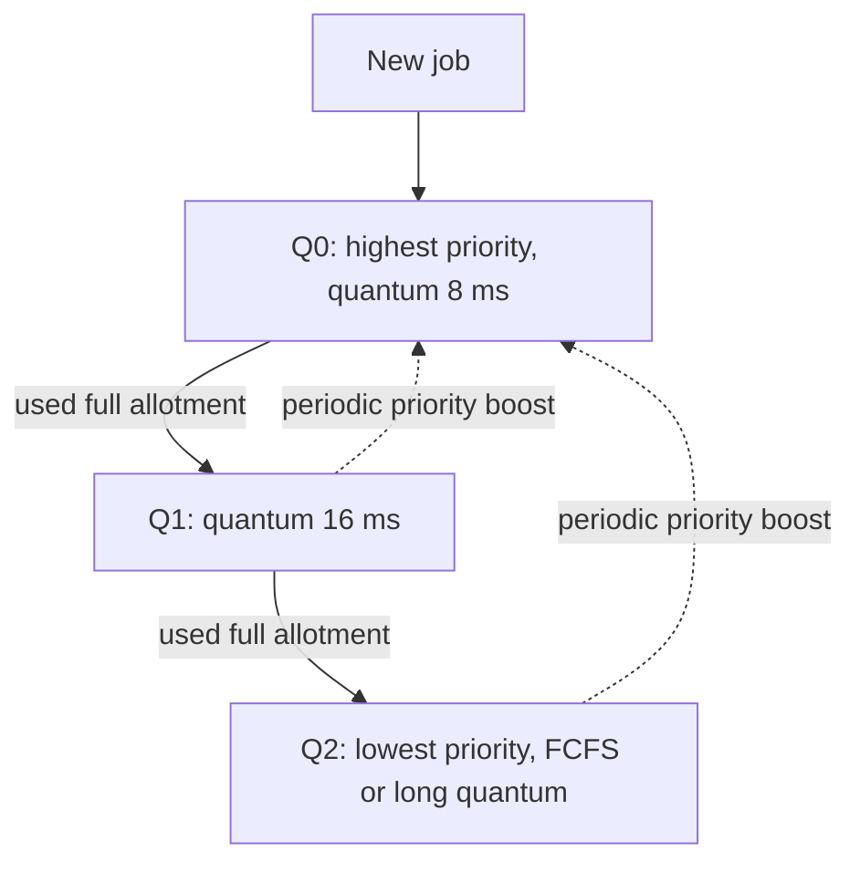

## Mental Model

Classic SJF is optimal but needs to know each job's length in advance. **MLFQ learns it by watching.** Every new job is assumed to be short and interactive and gets top priority. If it uses its whole time slice, it's probably CPU-bound — demote it. If it gives up the CPU quickly (I/O), keep it high. Short jobs finish before they sink; long jobs drift to lower queues where they still run, just less urgently.

Linux takes a different angle: rather than guessing burst lengths, it tracks how much CPU each thread has **received** relative to its fair share, and always runs the one that's most "owed". Interactive threads that sleep a lot naturally become the most owed.

## Definition

- **Multilevel queue**: ready queue split into fixed classes (e.g., system, interactive, batch), each with its own algorithm and a policy between queues (fixed priority or time-sharing among queues). Processes don't move between queues.
- **Multilevel feedback queue (MLFQ)**: multiple priority queues where processes **move** between levels based on observed behavior.
- **CFS (Completely Fair Scheduler)**: Linux's general-purpose scheduler from 2.6.23 to 6.5, which runs the task with the smallest weighted *virtual runtime*.
- **EEVDF (Earliest Eligible Virtual Deadline First)**: CFS's successor since Linux 6.6; keeps weighted fairness but adds explicit per-task virtual deadlines for better latency control.

## Why It Exists

Real workloads mix interactive, server, batch and real-time tasks whose burst lengths are unknown and change over time. A good general-purpose scheduler must:

- keep interactive/I/O-bound tasks responsive,
- give CPU-bound tasks good throughput,
- avoid starvation,
- respect priorities and administrator-defined shares,
- scale to hundreds of cores.

No single classic algorithm does all of this.

## How It Works

### MLFQ rules (the OSTEP formulation)

1. If Priority(A) > Priority(B), A runs.
2. If Priority(A) = Priority(B), they run round-robin (with the quantum for that level).
3. A new job enters at the **highest** priority.
4. Once a job uses up its **time allotment** at a level (regardless of how many times it gave up the CPU), it moves down one level.
5. After some period **S**, move all jobs back to the top (**priority boost**).



Why each rule exists:

- Rule 3 **approximates SJF**: every job gets a chance to prove it's short.
- Rule 4 (allotment accounting, not "gave up the CPU before the slice ended") prevents **gaming**: a job that yields at 99% of its slice would otherwise stay on top forever.
- Rule 5 prevents **starvation** of low-level jobs and lets jobs whose behavior changed (a batch job becoming interactive) climb back.

Lower levels typically get **longer quanta** — CPU-bound jobs benefit from fewer switches.

### Linux CFS: fair share via virtual runtime

Each runnable task accumulates **vruntime** — actual runtime scaled inversely by its weight (derived from the nice value; each nice step ≈ 10% CPU share difference, weight ratio ≈ 1.25 per step):

```text
vruntime += delta_exec × (weight_of_nice_0 / weight_of_task)
```

The scheduler always picks the task with the **smallest vruntime**, stored in a red-black tree (O(log n) insert, leftmost cached for O(1) pick). A task that sleeps doesn't accumulate vruntime, so when it wakes it is near the left of the tree and runs soon — interactivity emerges from fairness. (On wakeup, its vruntime is clamped to roughly the current minimum so long sleepers can't hoard credit.)

The time slice isn't fixed: the scheduler targets a **scheduling latency** period (e.g., a few ms) divided among runnable tasks in proportion to weight, with a minimum granularity to avoid thrashing.

:::depth{level=advanced}
### EEVDF (Linux 6.6+)

EEVDF keeps weighted fair sharing but schedules by **virtual deadline**: each task has a requested slice; a task is *eligible* if it hasn't received more than its fair share (non-negative "lag"), and among eligible tasks the one with the earliest virtual deadline runs. Latency-sensitive tasks can request shorter slices (earlier deadlines) without getting more total CPU. It replaced a pile of CFS heuristics with a principled rule.
:::

### Scheduling classes and real-time

Linux checks classes in strict priority order:

| Class | Policies | Behavior |
|---|---|---|
| Stop / deadline | `SCHED_DEADLINE` | EDF with CPU reservations (runtime, period, deadline) |
| Real-time | `SCHED_FIFO`, `SCHED_RR` | Fixed priority 1–99; FIFO runs until it blocks/yields; RR time-slices within a priority |
| Fair | `SCHED_OTHER` (normal), `SCHED_BATCH` | CFS/EEVDF with nice −20…19 |
| Idle | `SCHED_IDLE` | Runs only when nothing else wants the CPU |

A runaway `SCHED_FIFO` thread can lock up a core; Linux reserves a little CPU for normal tasks by default (`sched_rt_runtime_us` = 950 ms per second).

### Multiprocessor scheduling

- **Per-CPU run queues** avoid a global lock.
- **Load balancing** periodically migrates tasks from busy to idle CPUs, respecting the topology hierarchy (hyperthread siblings → cores sharing L3 → NUMA nodes), because migrating across NUMA nodes loses cache and memory locality.
- **Processor affinity**: soft (the scheduler prefers the last CPU) and hard (`taskset`, `sched_setaffinity`, cpusets) — pinning.
- **Group scheduling**: with cgroups, CPU is shared fairly among *groups* first (e.g., containers), then among tasks within a group — so a container with 100 threads doesn't get 100× the CPU of one with 1 thread. `cpu.weight` sets relative shares; `cpu.max` sets a hard quota per period.

## Example

MLFQ in action with three levels (quanta 10/20/40 ms), a CPU-bound job A (long) and an interactive job B (runs 1 ms, then waits for a keystroke):

- A starts in Q0, uses 10 ms → Q1, uses 20 ms → Q2 where it runs with 40 ms slices whenever nothing else is ready.
- B arrives, enters Q0, runs 1 ms per keystroke and never exhausts its allotment → stays in Q0 and preempts A immediately each time. Keystroke latency ≈ 1 ms.
- Every S = 1 s, the boost moves A back to Q0 briefly so it can't starve even if many interactive jobs appear.

## Visualization

The scheduler simulator includes an MLFQ mode — watch jobs demote and boost:

::viz{id=cpu-scheduler}

## Complexity & Performance

- CFS/EEVDF: O(log n) per enqueue/dequeue; decisions in well under a microsecond.
- Load balancing and migrations cost cache warmth; that's why latency-critical services pin threads and why `perf sched` and `/proc/schedstat` track migrations.

## Trade-offs

- **MLFQ**: adapts without prior knowledge; needs tuning (number of levels, quanta, boost period S) and anti-gaming accounting.
- **Fair-share (CFS/EEVDF)**: predictable proportional sharing; interactivity is emergent, which occasionally needs latency hints.
- **Real-time policies**: bounded latency for critical threads; can starve everything else if misused.
- **Hard CPU quotas (cgroups)**: isolation and cost control; can cause throttling latency even when the host is idle.

## Failure Modes

- **CFS quota throttling**: a multi-threaded process burns its `cpu.max` quota in the first part of each 100 ms period and then sleeps for the rest — p99 latency spikes of tens of milliseconds. Common in Kubernetes with CPU limits.
- **RT priority lockups**: a `SCHED_FIFO` busy loop starves kernel threads on that core.
- **Cross-NUMA migrations**: a thread moved away from its memory runs slower.
- **Gaming**: without allotment accounting, a job can yield just before its quantum ends to stay high priority.

## In Production

- Kubernetes: `requests.cpu` → `cpu.weight` (shares), `limits.cpu` → `cpu.max` (quota). Many teams set requests but avoid CPU limits on latency-sensitive services to prevent throttling; others use the static CPU manager to give Guaranteed pods exclusive cores.
- Databases and trading systems use `taskset`/cpusets, IRQ affinity and sometimes `SCHED_FIFO` for critical threads.
- Observability: `/proc/<pid>/sched`, `schedstat`, `perf sched latency`, cgroup `cpu.stat` (`nr_throttled`, `throttled_usec`).

## Deeper Connections

- Group scheduling via cgroups is the CPU half of container isolation ([VMs & Containers](lesson:os-virtualization-containers)).
- NUMA-aware balancing connects to [Huge Pages & NUMA](lesson:os-hugepages-numa).
- Weighted fair queuing is the same idea used by network schedulers and multi-tenant query admission.

## Common Misconceptions

- **"Linux uses round robin."** Normal tasks use weighted fair scheduling (CFS, now EEVDF); `SCHED_RR` exists only for real-time tasks.
- **"nice -20 makes a process real-time."** It only increases its fair-share weight; real-time is a separate class with strict priority.
- **"CPU limits only matter when the node is busy."** Quotas throttle even on an idle node.

## Interview Questions

### [L2 · how] How does MLFQ approximate SJF without knowing burst times?

It assumes every new job is short by placing it in the highest-priority queue. Jobs that use their full time allotment are demoted to lower priority, so long CPU-bound jobs sink while short and I/O-bound jobs stay high and get quick service. Periodic priority boosts prevent starvation and let jobs whose behavior changes move back up.

### [L2 · compare] What is the difference between a multilevel queue and a multilevel feedback queue?

In a multilevel queue, processes are permanently assigned to a queue (e.g., by type) and never move. In MLFQ, processes move between queues based on their observed CPU usage, letting the scheduler adapt to behavior.

### [L3 · why] Why does MLFQ account for total time used at a level rather than resetting when a job yields?

Otherwise a job could game the scheduler by issuing a trivial I/O or yield just before its quantum expires, staying at the top priority forever while consuming nearly all the CPU. Tracking the cumulative allotment at each level closes that loophole.

### [L3 · how] How does Linux CFS decide which task runs next?

Each task tracks virtual runtime — CPU time consumed, scaled by the inverse of its weight (from its nice value). Runnable tasks sit in a red-black tree ordered by vruntime, and the scheduler picks the one with the smallest vruntime (the one that has received the least weighted CPU). Sleeping tasks don't accumulate vruntime, so they run soon after waking, giving interactivity. (Since Linux 6.6, EEVDF refines this with eligibility and virtual deadlines.)

### [L3 · debugging] A Java service in Kubernetes with a 2-CPU limit shows p99 spikes of ~80 ms although average CPU use is 40%. What might be happening?

CFS bandwidth throttling: the JVM runs many threads (GC, JIT, request threads); in bursts they consume the 200 ms-per-100 ms quota early in the period, and then all threads are throttled until the next period starts. Check `cpu.stat` (`nr_throttled`, `throttled_usec`) and container throttling metrics. Mitigations: raise or remove the CPU limit (keep requests), reduce parallelism (GC threads, pool sizes) to match the quota, or use exclusive CPU pinning.

### [L4 · design] You must run a latency-critical packet-processing thread and general workloads on the same Linux host. How would you configure scheduling?

Isolate cores: cpusets or `isolcpus`/`nohz_full` for the critical thread's cores; pin the thread (affinity) and route IRQs for its NIC queue to that core or away as appropriate; consider `SCHED_FIFO` with a sane priority (and ensure it blocks or yields, or busy-polls on a dedicated core); keep general workloads on remaining cores with cgroup weights; watch NUMA locality for its memory. Validate with latency histograms and `perf sched`.

## Practice

### [mcq] In MLFQ, where does a newly arriving job start?

- [x] The highest-priority queue
- [ ] The lowest-priority queue
- [ ] A queue chosen by its predicted burst
- [ ] The queue with the fewest jobs

Every job is initially assumed to be short/interactive.

### [mcq] Which Linux scheduling class preempts normal (CFS/EEVDF) tasks regardless of their nice value?

- [ ] SCHED_BATCH
- [x] SCHED_FIFO
- [ ] SCHED_IDLE
- [ ] SCHED_OTHER with nice −20

Real-time classes always run before the fair class.

## Quick Revision

- **Multilevel queue**: fixed classes. **MLFQ**: move by behavior — new jobs start high; using full allotment demotes; periodic boost prevents starvation; allotment accounting prevents gaming.
- **CFS**: pick smallest weighted **vruntime** (red-black tree); sleepers wake with low vruntime → interactive. **EEVDF** (6.6+): fairness + virtual deadlines.
- Classes: deadline > real-time (FIFO/RR, 1–99) > fair (nice −20…19) > idle.
- Multicore: per-CPU queues, load balancing by topology, affinity/pinning, NUMA.
- cgroups: `cpu.weight` = shares; `cpu.max` = quota → **throttling** latency.
