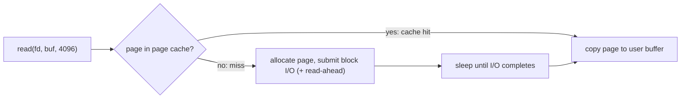

## Mental Model

The page cache is the kernel's **short-term memory of file contents**. Every file read goes through it: if the data is already there, the read is a memory copy (nanoseconds per byte); if not, the kernel reads from disk into the cache first. Every file write lands in the cache and is marked **dirty**; the kernel writes it back to disk later, in the background, in efficient batches.

Linux uses **all otherwise-unused RAM** for this cache. That's why a healthy server shows almost no "free" memory — and why that's good.

## Definition

- **Page cache**: kernel memory caching pages of files (and block devices), indexed by (inode, offset). Serves `read`, `write` and `mmap`.
- **Buffer cache** (historical): a separate cache of raw disk blocks. In modern Linux it's unified with the page cache ("Buffers" in `/proc/meminfo` is metadata-block caching); many textbooks still use the term.
- **Dirty page**: a cached page modified in memory but not yet written to storage.
- **Writeback**: the kernel flushing dirty pages to storage (by flusher threads, triggered by age and dirty thresholds, or explicitly by fsync/sync).
- **Read-ahead**: speculatively reading pages following a sequential access.
- **O_DIRECT**: an open flag that bypasses the page cache, transferring directly between user buffers and the device.

## Why It Exists

Disk access is 1,000–100,000× slower than RAM. Most workloads re-read the same data (code, configs, hot database pages, static assets) and write in small pieces that are better batched. Caching and write batching turn many slow device operations into a few fast ones.

## How It Works

### Read path



Sequential readers trigger **read-ahead**: the kernel notices the pattern and prefetches increasingly large windows (up to `read_ahead_kb`, default 128 KB per device, adjustable), so later reads hit the cache.

### Write path

1. `write()` copies data into page-cache pages, marks them dirty, returns immediately.
2. Flusher threads write dirty pages back when:
   - they're older than `dirty_expire_centisecs` (30 s by default), or
   - dirty memory exceeds `dirty_background_ratio` (e.g., 10% of available memory) — background writeback starts;
   - dirty memory exceeds `dirty_ratio` (e.g., 20%) — **writers are throttled** (blocked in `write()` until writeback catches up).
3. `fsync(fd)` forces the file's dirty pages (and metadata) out now and waits.

This is **write-back caching**: great for throughput, dangerous for durability if the application assumes `write()` means "saved" ([Journaling & fsync](lesson:os-journaling)).

### Eviction

Page-cache pages are reclaimed under memory pressure using the kernel's LRU approximations ([Page Replacement](lesson:os-page-replacement)). Clean pages are simply dropped; dirty pages must be written first. `MemAvailable` in `/proc/meminfo` estimates how much memory could be freed for applications — the right number to watch, not `MemFree`.

## Internal Mechanism

### The same pages serve read(), write() and mmap()

`mmap` maps page-cache pages directly into the process ([Copy-on-Write & mmap](lesson:os-cow-mmap)); `read()` copies from them; `sendfile()` sends them to a socket without a user-space copy. All three see one coherent cache, so a `write()` by one process is immediately visible to another process that has the file mmap'd.

### Double buffering and O_DIRECT

A database with its own buffer pool that reads through the page cache ends up with the same page cached **twice**: once in the DB's buffer pool and once in the page cache — wasting RAM and adding a memory copy. Options:

- **O_DIRECT** (InnoDB `innodb_flush_method=O_DIRECT`, most commercial databases): bypass the page cache; the DB's buffer pool is the only cache and gets most of the RAM. Requires aligned buffers and makes the DB responsible for read-ahead and write batching.
- **Buffered I/O** (PostgreSQL's traditional approach): a modest `shared_buffers` (often ~25% of RAM) plus the OS page cache as a second-level cache. Simpler, relies on the kernel's read-ahead and writeback; costs double buffering. (PostgreSQL has been adding asynchronous and direct I/O support in recent releases.)

:::depth{level=advanced}
### Writeback stalls and latency

When dirty data exceeds `dirty_ratio`, every writing thread is throttled — including latency-sensitive ones that just log a line. Large amounts of dirty data also mean a later `fsync` must flush much more than the caller wrote (ext4's ordered mode can make one file's fsync flush others' data). Tuning `dirty_background_bytes`/`dirty_bytes` to smaller absolute values smooths writeback on big-RAM machines; cgroup v2 attributes writeback to the cgroup that dirtied the pages, preventing one container's writes from stalling another.
:::

## Example

Observe the cache at work:

```bash
$ free -h
              total   used   free  shared  buff/cache  available
Mem:           62Gi   14Gi  1.2Gi   1.1Gi        47Gi       46Gi
$ time cat big.log > /dev/null     # first read: from disk
real 0m9.84s
$ time cat big.log > /dev/null     # second read: from page cache
real 0m0.61s
$ grep -E 'Dirty|Writeback:' /proc/meminfo
Dirty:            182340 kB
Writeback:           512 kB
$ fincore big.log                  # how much of a file is cached (util-linux)
```

`free` shows 1.2 GiB "free" but 46 GiB "available" — the page cache is reclaimable.

## Complexity & Performance

| Operation | Cost |
|---|---|
| Cached read (per 4 KB page) | ~1 µs (syscall + memory copy) |
| Uncached read | Device latency (~100 µs NVMe, ~10 ms HDD) |
| Buffered write | ~memory copy; durability deferred |
| fsync | Device flush latency; proportional to dirty data of the file |

## Trade-offs

- **Buffered I/O**: easy, benefits from kernel caching/read-ahead/write batching; double buffering for DBs; unpredictable flush timing.
- **O_DIRECT**: predictable, no double caching; application must implement caching, read-ahead and alignment; small unaligned I/O is slow.
- **Large dirty thresholds**: better write throughput; bigger data loss window and bigger stall risk.

## Failure Modes

- **Cache pollution** by one-off large scans (backups, log processing) evicting hot data — use `posix_fadvise(POSIX_FADV_DONTNEED)`, O_DIRECT, or cgroup limits.
- **Writeback storms** throttling unrelated writers.
- **Data loss** on crash for applications relying on `write()` without fsync.
- **Misreading free memory**: panicking over low `MemFree` and "fixing" it with `drop_caches`, which only makes the next reads slower.

## In Production

- Kafka deliberately relies on the page cache: producers write to the cache, consumers usually read recent data straight from it, and `sendfile` ships it to sockets — very high throughput with little JVM heap.
- Elasticsearch/Lucene recommends leaving ~50% of RAM for the page cache (index files are mmap'd).
- Container memory accounting includes page cache charged to the cgroup; a container that reads large files may approach its limit, but that cache is reclaimable before OOM (unlike anonymous memory).

## Deeper Connections

- Database buffer pools reimplement this cache with DB-specific knowledge ([Buffer Pool](lesson:db-buffer-pool)).
- The same "cache in front of slow storage, write back later" pattern appears in CPU caches, CDNs and application caches — with the same consistency and durability questions ([Caching Everywhere](lesson:x-caching-everywhere)).
- The durability boundary between page cache and disk is a key link in the [Durability Chain](lesson:x-durability-chain).

## Common Misconceptions

- **"Linux is using all my RAM — there's a memory leak."** Page cache fills free RAM on purpose and is released under pressure.
- **"Buffer cache and page cache are separate caches of the same data."** In modern Linux they're unified.
- **"O_DIRECT is always faster."** Only when the application manages caching and I/O better than the kernel for its workload.

## Interview Questions

### [L1 · conceptual] What is the page cache?

Kernel memory that caches the contents of files in page-sized units. Reads are served from it when possible; writes go into it and are flushed to disk later by writeback. It uses otherwise-free RAM and is reclaimed under memory pressure.

### [L2 · trace] What happens when a process calls write() on a regular file? When is the data on disk?

The kernel copies the data into page-cache pages, marks them dirty, updates the file size/metadata in memory, and returns — typically without any disk I/O. The data reaches disk later when flusher threads write back dirty pages (after ~30 s, or when dirty thresholds are exceeded), or immediately when the application calls fsync/fdatasync (or opened with O_SYNC/O_DSYNC).

### [L2 · why] Why might a database use O_DIRECT?

To avoid double buffering (the same pages cached in both the DB's buffer pool and the OS page cache), to give the buffer pool most of the RAM, and to control I/O timing, ordering and read-ahead itself — at the cost of implementing caching and prefetching in the database and requiring aligned I/O.

### [L3 · debugging] free shows 500 MB free on a 64 GB server and the team wants to add RAM. What do you check?

The `available` column/MemAvailable (page cache counts as reclaimable), PSI memory pressure, major page faults, swap activity, and cgroup OOM events. If available memory is high and there's no pressure, the "used" memory is mostly cache doing its job — no RAM needed. Add RAM only if the working set doesn't fit (sustained major faults, pressure, OOMs).

### [L3 · incident] A service writes 5 GB of logs per hour; periodically every thread in the service stalls for seconds, including request handlers that barely write. Explain.

Dirty page throttling: logs accumulate dirty data until it crosses `dirty_ratio`, at which point any thread calling write() (even a small log line) is blocked until writeback catches up. On large-RAM machines the ratio translates into many GB of dirty data and long stalls. Mitigations: lower `dirty_background_bytes`/`dirty_bytes` for smoother writeback, write logs asynchronously from a dedicated thread, reduce log volume, put logs on a separate device, or use cgroup v2 writeback isolation.

## Practice

### [mcq] Which /proc/meminfo field best indicates how much memory applications can still obtain without swapping?

- [ ] MemFree
- [x] MemAvailable
- [ ] Cached
- [ ] Buffers

MemAvailable estimates reclaimable cache plus free memory.

### [mcq] Two processes: one writes to a file with write(), the other has the same file mapped with MAP_SHARED. When does the second see the new data?

- [ ] After the writer calls fsync
- [ ] After writeback to disk
- [x] Immediately — both use the same page-cache pages
- [ ] Never, until it remaps

The page cache is the single coherent copy.

## Quick Revision

- Page cache = file pages in RAM (unified with the old buffer cache); uses free memory; reclaimable.
- Read: hit → copy; miss → disk read (+ read-ahead).
- Write: copy into cache, mark dirty, return; flushers write back (30 s age, background/dirty ratios → throttling); fsync forces it.
- `MemAvailable`, not `MemFree`.
- DBs: buffered I/O (double buffering) vs **O_DIRECT** (own cache).
- Pollution from big scans → `fadvise DONTNEED`/O_DIRECT; writeback stalls → tune dirty bytes.
