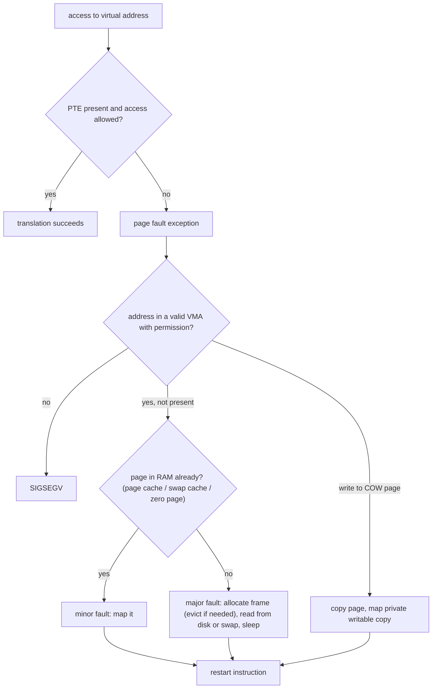

## Mental Model

Demand paging is a **library that keeps books in storage until someone asks for them.** Your program's address space is the catalog — every page is listed — but a page is only fetched into RAM (the reading room) when your program actually touches it. Touching a page that isn't in the reading room triggers a **page fault**: a hardware exception that pauses the program while the librarian (the kernel) fetches the page, then lets the program retry as if nothing happened.

Most faults are cheap (the book is already in the building — a **minor fault**). Some require a trip to the warehouse — a disk read (**major fault**) — and those are hundreds of thousands of times slower than a memory access.

## Definition

- **Demand paging**: loading a page into physical memory only when it is first accessed, rather than when the program starts.
- **Page fault**: an exception raised by the MMU when an access hits a page-table entry that is not present or doesn't permit the access.
- **Minor (soft) fault**: resolved without disk I/O — the page is already in RAM (page cache, shared library already loaded by another process, a zero page, a copy-on-write copy).
- **Major (hard) fault**: requires reading the page from storage (the executable/mapped file on disk, or swap).
- **Invalid fault**: the address isn't mapped at all or the access violates permissions → `SIGSEGV`.

## Why It Exists

- **Fast startup**: a program starts without reading its whole binary.
- **Memory efficiency**: pages never touched (error-handling code, unused features, reserved heap) never consume RAM.
- **Overcommitment**: the sum of virtual memory can exceed physical RAM; only the actively used pages (the working set) need to be resident.
- **Enables COW, mmap and swapping**: all built on "mark the PTE not-present or read-only, handle the fault lazily".

## How It Works

### Exactly what happens during a page fault

::::steps[A major page fault on a memory-mapped file page]
1. **The CPU executes a load** from virtual address V. The TLB misses; the hardware walks the page table and finds the PTE **not present**.
2. **The MMU raises a page-fault exception.** The CPU saves the faulting instruction's state, records the faulting address (CR2 on x86) and an error code (read/write, user/kernel, present/protection), switches to kernel mode and jumps to the page-fault handler.
3. **The kernel looks up the VMA** (virtual memory area) containing V. None → invalid access → send `SIGSEGV`. Permission mismatch (write to read-only, execute NX) → `SIGSEGV` — unless it's a copy-on-write page, handled separately.
4. **Valid but not present: find the data.** For a file-backed mapping, check the **page cache**. If the page is there → map it (**minor fault**, microseconds). If not → **major fault**: allocate a free physical frame (possibly evicting another page first — [Page Replacement](lesson:os-page-replacement)), and issue a block-device read.
5. **The faulting thread sleeps** (Blocked, state `D`) while the disk works; the scheduler runs other threads.
6. **The I/O completes** (interrupt); the page is now in the page cache. The kernel fills in the PTE (frame number, present bit, permissions) and wakes the thread.
7. **Return from the exception restarts the same instruction.** This time the translation succeeds (TLB filled), and the load completes. The program never knew.
::::

For **anonymous memory** (heap, stack) touched for the first time, step 4 allocates a zeroed frame (reads may initially map a shared read-only **zero page**) — a minor fault with no I/O. If that anonymous page was previously swapped out, it's a major fault reading from **swap**.



### Effective access time with page faults

Let `p` = page-fault rate, `m` = memory access time, `F` = page-fault service time.

```text
EAT = (1 − p) × m + p × F
```

With m = 100 ns and F = 8 ms (HDD-era textbook number):

- p = 1/1000 → EAT = 0.999 × 100 + 0.001 × 8,000,000 ≈ **8,100 ns** — memory is **~80× slower**.
- To keep slowdown under 10% (EAT ≤ 110 ns): 100 + p × 7,999,900 ≤ 110 → **p < 1.25 × 10⁻⁶**, i.e., fewer than one fault per ~800,000 accesses.

With NVMe (F ≈ 50–100 µs) the penalty is smaller but still ~1,000× a memory access. The lesson: **major faults must be extremely rare**; a system that's paging heavily is effectively running at disk speed.

## Internal Mechanism

### Restartable instructions

The CPU must be able to restart a faulting instruction precisely — or resume it. Instructions that modify several locations (x86 `rep movs`, block moves) are designed to be restartable (they update registers as they progress, so a restart continues correctly). This hardware support is a prerequisite for demand paging.

### Prefetching / read-ahead

Faulting one page at a time is slow for sequential access. The kernel's **read-ahead** fetches following pages of a file on a fault (fault-around maps several already-cached neighbor pages at once), and `madvise(MADV_SEQUENTIAL/WILLNEED)` gives hints. For random access, `MADV_RANDOM` disables read-ahead.

:::depth{level=advanced}
### Overcommit and the OOM killer

Because allocation is lazy, Linux normally lets processes allocate more virtual memory than RAM + swap (`vm.overcommit_memory` = 0 heuristic, 1 always, 2 strict). The bill comes at fault time: if a page must be allocated and no memory can be freed, the kernel invokes the **OOM killer**, which chooses a victim by `oom_score` (mostly resident size, adjusted by `oom_score_adj`) and sends `SIGKILL`. In containers, the cgroup's memory limit triggers a cgroup-local OOM kill. See [Thrashing & Working Sets](lesson:os-thrashing-working-set).
:::

## Example

Counting faults for a program:

```bash
$ /usr/bin/time -v python3 -c "import numpy"
    Major (requiring I/O) page faults: 142
    Minor (reclaiming a frame) page faults: 12,803
$ /usr/bin/time -v python3 -c "import numpy"     # run again
    Major (requiring I/O) page faults: 0          # files now in page cache
    Minor (reclaiming a frame) page faults: 12,797
```

The second run has no major faults: the library files are still in the page cache — a direct demonstration of cold vs warm starts.

## Visualization

::viz{id=address-translation}

## Complexity & Performance

| Fault type | Cost |
|---|---|
| Minor (map a cached page / zero page) | ~0.5–5 µs |
| COW copy | ~1–5 µs (copy 4 KB) |
| Major from NVMe | ~50–150 µs |
| Major from HDD | ~5–15 ms |
| Major under memory pressure (must evict first) | Adds reclaim cost, possibly writeback of a dirty page |

## Trade-offs

- **Demand paging vs prepaging**: lazy loading saves memory and startup time but spreads latency into runtime; prepaging (loading pages in advance, `MAP_POPULATE`, `mlock`) gives predictable latency at the cost of memory and startup.
- **Overcommit**: higher utilization vs the risk of OOM kills at inconvenient times.

## Failure Modes

- **Thrashing**: working set exceeds RAM, fault rate explodes, throughput collapses ([Thrashing](lesson:os-thrashing-working-set)).
- **Latency spikes** from major faults in latency-sensitive paths (first request touches cold code; memory-mapped data evicted by a backup job's reads).
- **OOM kills** when overcommitted memory is finally touched.
- **SIGBUS** when a memory-mapped file is truncated and a process touches a page beyond the new end.

## In Production

- Monitor `pgmajfault` in `/proc/vmstat` and per-process `majflt` (`ps -o min_flt,maj_flt`, `pidstat -r`). Sustained major faults on a server usually mean memory pressure.
- Latency-critical services pre-touch or lock memory (`mlockall(MCL_CURRENT|MCL_FUTURE)`, JVM `-XX:+AlwaysPreTouch`) to avoid faults at runtime.
- Databases that use `mmap` for data files (MongoDB's old MMAPv1, LMDB) rely on page faults for I/O — convenient, but they lose control over when I/O happens and how errors are reported ([Copy-on-Write & mmap](lesson:os-cow-mmap)).

## Deeper Connections

- The eviction choice during a major fault is [Page Replacement](lesson:os-page-replacement).
- COW faults power `fork` ([Process Creation](lesson:os-process-creation)).
- The page cache that turns major faults into minor ones: [Page Cache](lesson:os-page-cache).
- A database buffer-pool miss is the same event at a different layer ([Buffer Pool](lesson:db-buffer-pool)).

## Common Misconceptions

- **"A page fault is an error."** Most page faults are normal and expected; only invalid ones become SIGSEGV.
- **"Every page fault reads from disk."** Minor faults (the majority) don't.
- **"malloc(1 GB) uses 1 GB of RAM."** It reserves virtual memory; RAM is used only as pages are touched.

## Interview Questions

### [L1 · conceptual] What is a page fault?

An exception raised by the MMU when a program accesses a virtual page whose page-table entry is not present (or doesn't allow the access). The kernel handles it: if the access is valid, it loads or allocates the page, updates the page table and restarts the instruction; if invalid, it sends SIGSEGV.

### [L1 · compare] What's the difference between a minor and a major page fault?

A minor fault is resolved without disk I/O — the page is already in memory (page cache, shared library page, zero page) and just needs mapping. A major fault requires reading the page from disk (file or swap), costing tens of microseconds to milliseconds.

### [L2 · trace] Walk through exactly what happens when a process touches a heap page for the first time.

The load/store misses the TLB; the page walk finds no present PTE; the MMU raises a page fault. The kernel finds the address inside the heap's anonymous VMA with the right permissions, allocates a physical frame (zero-filled for security; reads may map the shared zero page), installs the PTE, and returns from the exception, restarting the instruction, which now succeeds. It's a minor fault — no disk I/O.

### [L2 · numerical] Memory access time is 100 ns, page-fault service time 8 ms. What page-fault rate keeps the slowdown under 10%?

EAT = (1−p)·100 + p·8,000,000 ≤ 110 → p·7,999,900 ≤ 10 → **p ≤ 1.25 × 10⁻⁶** (about one fault per 800,000 accesses).

### [L3 · what-if] What happens if a program writes to a page that's shared copy-on-write after fork?

The PTE is present but read-only; the write triggers a protection fault. The kernel sees the VMA is writable and the page is COW-shared, allocates a new frame, copies the 4 KB, maps the copy writable in the faulting process (decrementing the old page's reference count), and restarts the instruction. The other process keeps the original page.

### [L3 · debugging] A latency-sensitive service shows periodic p99 spikes of 50 ms that coincide with a nightly backup. What might be happening?

The backup reads large amounts of data through the page cache, evicting the service's file-backed pages (code, mmap'd indexes) and possibly pushing anonymous pages to swap. The service then takes major page faults re-reading them. Confirm with major-fault counters and PSI memory pressure. Fixes: backups with `O_DIRECT` or `posix_fadvise(DONTNEED)`, cgroup memory protection (`memory.low`/`memory.min`) for the service, `mlock` for critical memory, or disabling swap for the service.

### [L4 · design] You need a memory-mapped 500 GB read-only index served with predictable latency on a machine with 256 GB RAM. How do you reason about page faults?

Only ~half the index fits in RAM, so cold lookups incur major faults (~100 µs on NVMe) — acceptable only if the hot set fits. Measure access skew: if the hot set is < ~200 GB, pre-warm it (`MADV_WILLNEED`, touching pages at startup), use `MADV_RANDOM` to avoid useless read-ahead, and protect it from eviction (cgroup `memory.min`, avoiding page-cache pollution by other workloads). If access is uniform, the p99 will be disk latency; consider an explicit cache with a better eviction policy, compressing the index, sharding across machines, or accepting SSD latency with async I/O instead of blocking faults.

## Practice

### [numeric 8100 ±50] Memory access 100 ns, page-fault service 8 ms, fault rate 1 in 1,000 accesses. Effective access time in ns?

:::answer
0.999 × 100 + 0.001 × 8,000,000 = 99.9 + 8,000 ≈ **8,100 ns**.
:::

### [mcq] A process reads a page of a shared library that another process has already loaded. What kind of fault occurs (if any)?

- [ ] Major fault
- [x] Minor fault
- [ ] Segmentation fault
- [ ] No fault, ever

The page is in the page cache; the kernel just maps it into this process.

## Quick Revision

- Demand paging: pages load on first access. Page fault = MMU exception on not-present/forbidden PTE.
- Handler: find VMA → invalid? SIGSEGV → COW? copy → in RAM? minor → else major (allocate/evict, read disk, sleep) → fix PTE → **restart instruction**.
- Minor ~µs; major ~100 µs (NVMe) to ~10 ms (HDD).
- `EAT = (1−p)m + pF`; 10% slowdown with m=100 ns, F=8 ms needs p < 1.25 × 10⁻⁶.
- Overcommit + lazy allocation → OOM killer at fault time.
- Watch `majflt`, `pgmajfault`, PSI; pre-touch/mlock for latency-critical memory.
