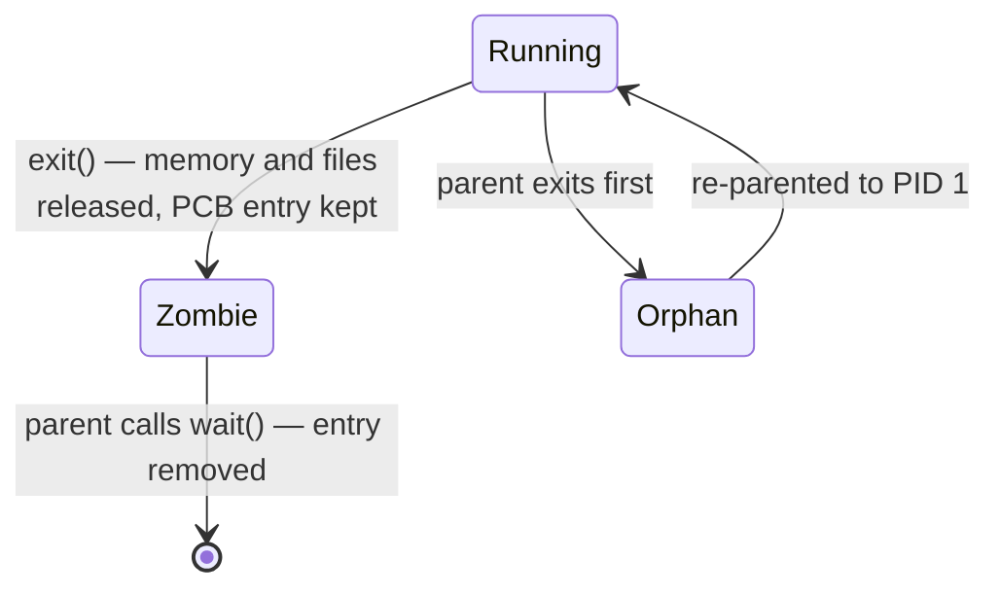

## Mental Model

Unix creates a process in two moves:

1. **`fork()` — clone yourself.** The kernel makes a child that is an (almost) exact copy of the parent: same code, same memory contents, same open files, continuing from the same instruction. The only difference is the return value: the parent gets the child's PID, the child gets `0`.
2. **`exec()` — become someone else.** The child replaces its program with a new one, keeping its PID and open files.

Between those two moves, the child can rearrange its environment — redirect file descriptors, change directory, drop privileges — using the ordinary system calls it already knows. That gap is why the shell can implement `ls > out.txt` and `a | b` so simply.

At the end of life, a process doesn't vanish immediately. It becomes a **zombie**: an entry holding its exit status until its parent collects it with `wait()`. If the parent dies first, the child becomes an **orphan** and is adopted by `init` (PID 1), which reaps it.

## Definition

- **`fork()`**: creates a new process (child) duplicating the calling process (parent). Returns child PID in parent, 0 in child, −1 on failure.
- **`exec` family** (`execve`, `execl`, `execvp`…): replaces the current process image with a new program. Returns only on failure.
- **`wait()` / `waitpid()`**: blocks the parent until a child changes state (usually exits) and retrieves its exit status, releasing the child's remaining kernel entry.
- **`exit(status)`**: terminates the calling process; the status is delivered to the parent.
- **Zombie (defunct) process**: a terminated process whose exit status has not yet been collected by its parent.
- **Orphan process**: a running process whose parent has terminated; it is re-parented to PID 1 (or a designated "subreaper").

## Why It Exists

**The problem.** Every process except the first must be created by another process — and the new one usually needs a slightly different setup: output redirected to a file, a different directory, fewer privileges.

**The design choice.** Why not a single `create_process("ls", args, redirects…)` call? (Windows does exactly that with `CreateProcess`.) The Unix designers chose composability:

- `fork` needs no parameters — the child inherits everything.
- Any setup the child needs is done with existing syscalls (`dup2`, `chdir`, `setuid`, `close`) in the child *before* `exec`, so no giant option struct is required.
- `fork` alone is useful: pre-fork servers (Apache prefork, PostgreSQL's postmaster) fork workers that run the *same* program.

**The idea.** Don't invent a new "create with options" interface; reuse the one you already have. Copy the process, let the copy configure *itself* with ordinary syscalls, then swap in the new program.

**Why zombies.** The zombie state exists because the parent may want the child's exit status *after* the child is gone — and the kernel must keep it somewhere until asked. Without it, `wait()` couldn't tell the shell whether `make` succeeded.

:::callout[That's all it is]{type=insight}
`fork` = copy me. `exec` = replace my program. `wait` = tell me how my child ended. Everything a shell does with processes is those three calls in a row.
:::

## How It Works

### A shell running `ls -l > out.txt`

```c
pid_t pid = fork();
if (pid < 0) {
    perror("fork");                     // e.g. EAGAIN: process limit reached
} else if (pid == 0) {                  // ---- child ----
    int fd = open("out.txt", O_WRONLY | O_CREAT | O_TRUNC, 0644);
    dup2(fd, STDOUT_FILENO);            // stdout now points to out.txt
    close(fd);
    execlp("ls", "ls", "-l", (char *)NULL);
    perror("exec");                     // only reached if exec failed
    _exit(127);
} else {                                // ---- parent ----
    int status;
    waitpid(pid, &status, 0);           // reap the child
    if (WIFEXITED(status))
        printf("exit code %d\n", WEXITSTATUS(status));
}
```

Note `_exit` (not `exit`) in the child after a failed exec: it avoids flushing stdio buffers that were copied from the parent (which would print the parent's pending output twice).

### How many processes does this create?

```c
fork();
fork();
fork();
printf("hi\n");
```

Each `fork` doubles the number of processes executing the following code: 1 → 2 → 4 → 8. **"hi" prints 8 times**; 7 new processes were created. In general, `n` sequential forks → `2ⁿ` processes.

### Termination and reaping



When a process exits, the kernel immediately releases almost everything (address space, open files) and sends **`SIGCHLD`** to the parent. What remains is a tiny record: PID, exit status, resource usage. It stays until the parent calls `wait*()`.

## Internal Mechanism

### Copy-on-write makes fork cheap

`fork` has an obvious cost problem, and copy-on-write is the answer. Naively, `fork` would copy the parent's entire memory — gigabytes for a large process — only for the child to discard it immediately in `exec`. Instead, the kernel:

1. copies the parent's **page tables**, not the pages;
2. marks every writable page **read-only in both** processes and increments a reference count;
3. when either process writes to a shared page, a page fault occurs; the kernel copies *just that page*, gives the writer a private copy, and makes it writable.

So `fork` costs proportional to the page-table size, and pages are copied only if written. Detailed in [Copy-on-Write & mmap](lesson:os-cow-mmap).

:::depth{level=advanced}
### vfork, posix_spawn and clone

- **`vfork()`** — the child borrows the parent's address space (no page-table copy) and the parent is suspended until the child calls `exec` or `_exit`. Very fast, but the child must do almost nothing.
- **`posix_spawn()`** — a single-call create-and-exec API (like `CreateProcess`); on Linux, glibc implements it with `clone(CLONE_VM | CLONE_VFORK)`, avoiding page-table copies. Recommended for spawning subprocesses from large programs (a JVM with a 30 GB heap forking is slow even with COW).
- **`clone()`** — Linux's general primitive. Flags choose what is shared (memory, file table, signal handlers, namespaces). `fork`, `pthread_create` and container runtimes are all built on it.
:::

### Why zombies are "harmless" — until they aren't

A zombie uses no CPU and no memory beyond its process-table entry. But it **holds a PID**. PIDs are finite (`/proc/sys/kernel/pid_max`, and cgroup `pids.max` in containers). A long-running parent that spawns children and never reaps them eventually makes `fork` fail with `EAGAIN` — for everyone sharing that limit.

You cannot kill a zombie — it is already dead. Fix the parent (reap properly), or kill the parent so the zombies are re-parented to PID 1, which reaps them.

### Reaping correctly

Ways a parent can reap:

- call `waitpid(pid, …)` for each child it knows about;
- handle `SIGCHLD` and call `waitpid(-1, &st, WNOHANG)` **in a loop** (signals coalesce: one SIGCHLD may represent several exited children);
- set `SIGCHLD` to `SIG_IGN` (POSIX: children are reaped automatically and never become zombies).

## Example

Create a zombie and an orphan on purpose:

```bash
# Zombie: the child exits, the parent (sleep-ing python) never waits
$ python3 -c 'import os,time
pid=os.fork()
if pid==0: os._exit(0)
time.sleep(60)' &
$ ps -o pid,ppid,stat,comm --ppid $!
  PID  PPID STAT COMMAND
 5122  5121 Z    python3 <defunct>

# Orphan: the parent exits immediately, the child lives on
$ python3 -c 'import os,time
if os.fork()==0: time.sleep(60)' ; sleep 1
$ ps -o pid,ppid,comm -C python3
  PID  PPID COMMAND
 5210     1 python3        <- adopted by PID 1 (or a subreaper like systemd --user)
```

## Visualization

::viz{id=process-lifecycle}

## Complexity & Performance

- `fork` time ∝ size of the parent's page tables (mapped memory), not its data — ~50 µs for a small process, tens of milliseconds for a process with tens of GB mapped.
- After fork, COW page faults add latency to the *first write* of each shared page — e.g., Redis's `BGSAVE` forks and then the parent's writes trigger copies, temporarily increasing memory usage (worst case doubling it).

## Trade-offs

| Approach | Pros | Cons |
|---|---|---|
| fork + exec | Composable, easy fd/env setup between the calls | Page-table copy cost for large parents; subtle thread-safety issues |
| posix_spawn / vfork | Fast even for huge parents | Less flexible setup |
| Pre-forked worker pool | No per-request creation cost, isolation | Idle memory usage; pool sizing |
| Threads instead of processes | Cheapest creation and switching | No isolation |

:::callout[fork() in a multithreaded program]{type=warning}
`fork` copies only the **calling thread**. If another thread held a lock (e.g., inside `malloc`) at that moment, the child inherits a locked mutex that no thread will ever unlock — a deadlock on the child's first `malloc`. Rule: in a multithreaded program, the child should call only async-signal-safe functions before `exec`.
:::

## Failure Modes

- **Fork bomb / PID exhaustion** → `fork: Resource temporarily unavailable`. Contain with `ulimit -u` and cgroup `pids.max`.
- **Zombie accumulation** from a buggy parent or a container whose PID 1 doesn't reap (use `tini` / `dumb-init` or `docker run --init`).
- **Forking a huge process** stalls it (page-table copy) and can trigger OOM from COW growth.
- **Duplicated output** from stdio buffers copied into the child (use `_exit`, or `fflush` before `fork`).

## In Production

- **PostgreSQL** forks a backend process per client connection from the postmaster — which is why connection storms are expensive and poolers like PgBouncer exist ([Connection Management](lesson:x-connection-management)).
- **Redis** forks for snapshots (RDB) and AOF rewrites, relying on COW; docs warn about memory overcommit and huge pages because of this.
- **Container PID 1** must reap zombies and forward signals.
- **Language runtimes**: Python's `multiprocessing` historically used `fork` on Linux; since Python 3.14 the default start method there changed to `forkserver` because fork-without-exec in threaded programs is unsafe.

## Deeper Connections

- COW is the same trick used by ZFS/Btrfs snapshots and by MVCC databases that never overwrite data in place ([MVCC](lesson:db-mvcc)).
- `wait`/exit status is a tiny example of **IPC**; richer IPC is in [IPC](lesson:os-ipc).
- `SIGCHLD` handling is a lesson in [signals](lesson:os-signals): signals don't queue.

## Common Misconceptions

- **"fork copies all the parent's memory."** It copies page tables; pages are shared copy-on-write.
- **"exec creates a new process."** It replaces the program in the same process.
- **"Zombies consume memory/CPU and should be killed."** They consume only a process-table slot and a PID, and can't be killed; reap them via the parent.
- **"Orphans are a problem."** Orphans are normal; daemons are often orphaned deliberately. Zombies are the problem.

## Interview Questions

### [L1 · compare] What is the difference between fork() and exec()?

`fork()` creates a new process by duplicating the caller; both continue from the same point, distinguished by the return value (0 in the child, child's PID in the parent). `exec()` doesn't create a process — it replaces the calling process's program (code, data, heap, stack) with a new one while keeping the PID and open file descriptors. Together they implement "run a new program as a child".

### [L1 · compare] What is a zombie process? What is an orphan process?

A zombie has finished executing but still has a process-table entry because its parent hasn't called `wait()` to read its exit status. An orphan is still running but its parent has exited; the kernel re-parents it to PID 1 (or a subreaper), which will reap it when it exits. Zombies are cleaned up by their parent waiting; orphans are cleaned up by init.

### [L2 · numerical] How many times is "hello" printed by: fork(); fork(); printf("hello\n");

4 times. After the first fork there are 2 processes; each executes the second fork, making 4; each of the 4 prints once.

### [L2 · why] Why does Unix separate process creation into fork and exec?

So that the child can configure its own environment between the two calls using ordinary system calls — redirect stdin/stdout with `dup2`, set up pipes, change directory, drop privileges, set resource limits — without a huge "create process" API with options for everything. It also lets `fork` alone serve pre-forking servers that run the same program.

### [L2 · how] How does copy-on-write make fork efficient?

Instead of copying memory, the kernel duplicates the page tables and marks shared writable pages read-only in both processes. Reads proceed normally. The first write to a page by either process triggers a page fault; the kernel allocates a new frame, copies that one page, maps it writable for the writer, and resumes. Only pages actually modified are copied, and after an immediate `exec` almost nothing is.

### [L3 · debugging] A long-running service accumulates thousands of <defunct> entries and eventually new subprocess launches fail. Diagnose and fix.

The service spawns children but never reaps them, so each exited child stays a zombie holding a PID. Eventually the PID limit (system or cgroup `pids.max`) is hit and `fork` fails with `EAGAIN`. Confirm with `ps -eo pid,ppid,stat | awk '$3 ~ /Z/'` — they share one PPID. Fix the parent: call `waitpid` for each child, or install a `SIGCHLD` handler that loops `waitpid(-1, …, WNOHANG)` until it returns 0. In containers, ensure PID 1 is an init that reaps (tini). Killing the parent clears existing zombies (they're adopted and reaped).

### [L3 · what-if] What can go wrong if a multithreaded program calls fork() and the child continues running without exec?

Only the forking thread exists in the child, but all memory — including locks — is copied. A mutex held by another thread at fork time (malloc arena lock, logging lock) stays locked forever in the child, so the child deadlocks when it tries to take it. Other threads' in-progress work is silently lost. Safe practice: exec immediately, use only async-signal-safe calls before exec, use `pthread_atfork` handlers, or use `posix_spawn`.

### [L4 · incident] Redis memory usage doubles during background saves and the kernel OOM-kills it. Explain and propose fixes.

`BGSAVE` forks a child to write the snapshot. Parent and child share pages copy-on-write. Under a write-heavy workload, the parent modifies many pages during the save, each triggering a private copy; in the worst case every page is copied, doubling resident memory. Transparent huge pages make it worse (a one-byte write copies 2 MB). Fixes: leave headroom (maxmemory well below RAM), disable THP, set `vm.overcommit_memory=1` as Redis recommends so fork isn't refused, schedule saves at low-write times, use replicas for persistence, or use AOF with less frequent rewrites.

## Practice

### [numeric 7] How many NEW processes (excluding the original) are created by a program that calls fork() three times in sequence, unconditionally?

:::answer
After 3 forks there are 2³ = 8 processes in total, so **7** are new.
:::

### [mcq] A parent process ignores SIGCHLD by setting its disposition to SIG_IGN. What happens when its children exit?

- [ ] They become zombies forever
- [x] They are reaped automatically and do not become zombies
- [ ] They are re-parented to init
- [ ] The parent is killed

POSIX specifies that explicitly ignoring SIGCHLD causes terminated children to be discarded immediately.

### [exercise] Write the sequence of system calls a shell uses to run `cat file.txt | wc -l`.

:::solution
1. `pipe(fds)` → `fds[0]` read end, `fds[1]` write end.
2. `fork()` child 1: `dup2(fds[1], STDOUT_FILENO)`; close both pipe fds; `execvp("cat", …)`.
3. `fork()` child 2: `dup2(fds[0], STDIN_FILENO)`; close both pipe fds; `execvp("wc", …)`.
4. Parent: close both pipe fds (otherwise `wc` never sees EOF, since a write end would remain open), then `waitpid` both children.

The easily forgotten step is closing unused pipe ends — a common source of hangs.
:::

## Quick Revision

- `fork()`: duplicate; returns child PID to parent, 0 to child. `exec()`: replace program, same PID. `wait()`: reap.
- `n` sequential forks → `2ⁿ` processes (`2ⁿ − 1` new).
- **COW**: copy page tables, share pages read-only, copy a page on first write.
- **Zombie** = exited, not reaped (holds a PID). **Orphan** = parent gone, adopted by PID 1.
- Reap in a loop on `SIGCHLD` (signals coalesce) or ignore `SIGCHLD`.
- Don't fork a multithreaded program without exec'ing immediately.
- Container PID 1 must reap and forward signals (use tini).
