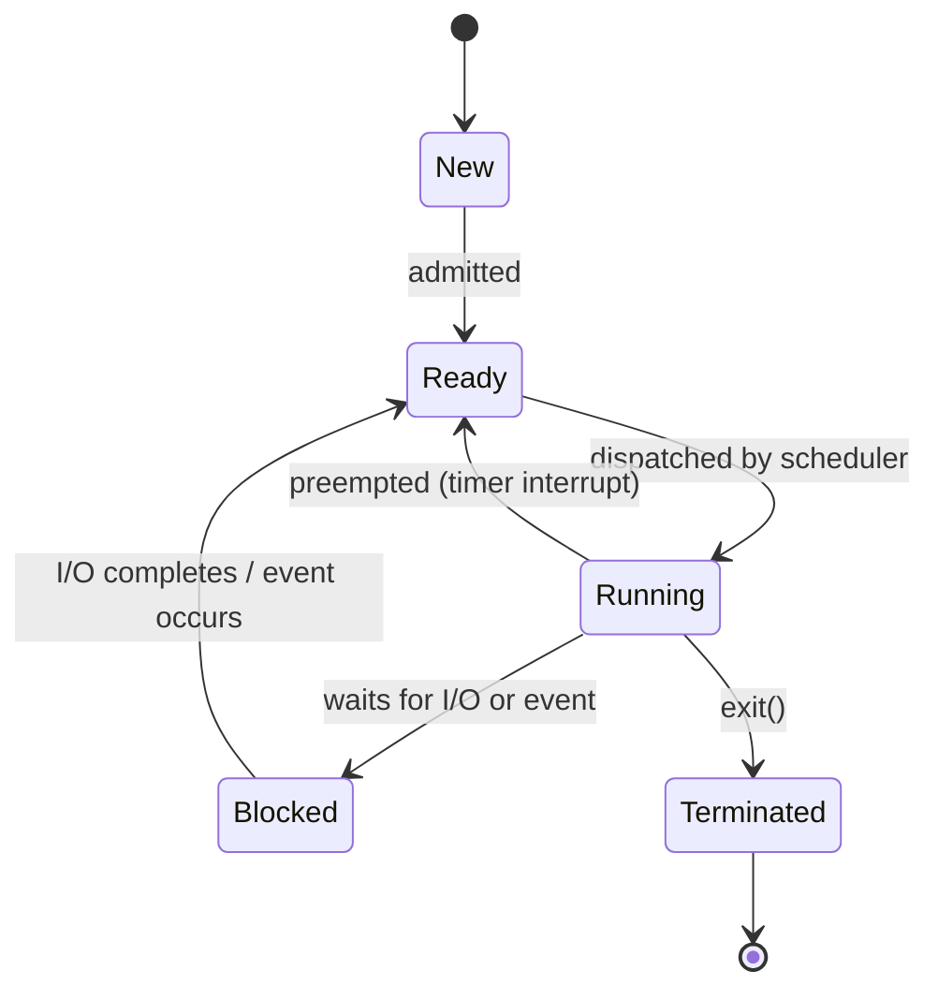

## Mental Model

A **program** is a recipe written down in a book: a file on disk containing instructions and some initial data. A **process** is a cook actually making the recipe in a kitchen: it has a position in the recipe (the program counter), ingredients laid out on the counter (memory), tools it has checked out (open files, sockets), and a name tag the manager uses to track it (the PID).

The operating system is the kitchen manager. It decides which cook gets the single stove (the CPU) right now, keeps every cook's counter space separate so they cannot steal each other's ingredients, and keeps a clipboard for each cook recording exactly where they left off — so a cook can be sent on a break mid-recipe and resume later as if nothing happened. That clipboard is the **Process Control Block (PCB)**.

Hold on to one idea above all: **a process is the unit of isolation and resource ownership.** Memory, open files and permissions belong to a process. Threads (next level) are the unit of *execution* inside it.

## Definition

A **process** is an instance of a program in execution, consisting of:

- an **address space** — the virtual memory the process can see: code, static data, heap, stack, memory-mapped regions;
- **execution state** — CPU registers, including the program counter and stack pointer, for each thread;
- **OS resources** — open file descriptors, sockets, signal handlers, current working directory;
- **identity and accounting** — PID, parent PID, user/group IDs, CPU time used, limits.

The kernel tracks all of this in a per-process data structure, the **Process Control Block** (on Linux, `struct task_struct`).

## Why It Exists

Early machines ran one job at a time: load a program, run it to completion, load the next. Two problems made that intolerable:

1. **Idle CPU during I/O.** A job waiting for a disk or tape wasted the CPU for milliseconds — millions of instructions. Running another job during the wait needs a way to *pause* one computation and *resume* it later, which means saving its complete state somewhere.
2. **Protection.** Once several jobs share one machine, a bug in one must not corrupt another or the OS itself.

The process abstraction solves both at once. It gives every running program the illusion of **a private CPU** (the OS multiplexes the real one by saving and restoring state) and **a private memory** (the OS and hardware enforce separate address spaces). Every higher-level concept — threads, containers, even the database server you connect to — is built on this illusion.

## How It Works

### The address space layout

When a program is loaded, the kernel builds a virtual address space with a conventional layout:

```text
high addresses
┌──────────────────────┐
│ kernel space         │  ← mapped but inaccessible from user mode
├──────────────────────┤
│ stack  ↓             │  function frames, locals, return addresses
│                      │
│ memory-mapped region │  shared libraries, mmap'd files
│                      │
│ heap   ↑             │  malloc/new; grows via brk/mmap
├──────────────────────┤
│ .bss                 │  zero-initialized globals
│ .data                │  initialized globals
│ .text                │  machine code (read-only, executable)
└──────────────────────┘
low addresses
```

Two processes running the *same* program each get their own copy of this layout. The code pages are usually physically shared (they are read-only), but stack, heap and data are private.

### The five-state model

A process moves through states as it runs:



- **New** — being created; the PCB is being set up.
- **Ready** — could run right now if given a CPU; sits in a run queue.
- **Running** — executing on a CPU. On a machine with N cores, at most N processes (threads, strictly) are running at any instant.
- **Blocked** (a.k.a. Waiting/Sleeping) — cannot run until some event happens: disk read completes, packet arrives, lock is released, timer expires.
- **Terminated** — finished executing but not yet fully cleaned up (see *zombies* in the next lesson).

The transitions carry real meaning:

- **Blocked → Running is impossible.** When the event arrives, the process becomes *eligible*, not *scheduled*. It must wait in the ready queue like everyone else.
- **Ready → Blocked is impossible.** A process can only block by *doing something* (making a blocking system call), and only running processes do things.
- **Running → Ready** happens involuntarily (preemption by the timer interrupt) — this is how a single CPU is shared fairly.

### The PCB: what the kernel remembers

| PCB field | Why the kernel needs it |
|---|---|
| PID, parent PID | Identity; parent/child relationships for `wait()` and signals |
| State | Which queue the process belongs in |
| Saved registers (PC, SP, general purpose, flags) | To resume execution exactly where it stopped |
| Memory management info (page-table root, e.g. CR3 on x86) | To switch address spaces on a context switch |
| Open file table (fd → open file) | So `read(3, …)` means something |
| Scheduling info (priority, nice value, virtual runtime) | So the scheduler can choose fairly |
| Credentials (UID, GID, capabilities) | Permission checks on every system call |
| Accounting (CPU time, start time) | `top`, `ps`, resource limits, billing |
| Signal state (pending, blocked, handlers) | Asynchronous notifications |

## Internal Mechanism

### How the kernel organizes processes

The kernel does not scan every PCB to find something to run. PCBs are linked into **queues** by state:

- a **run queue** per CPU (on Linux, a red-black tree ordered by virtual runtime for the CFS/EEVDF scheduler);
- **wait queues**, one per event source — each socket, each pipe, each disk request, each futex has its own list of processes blocked on it.

When a network packet arrives for a socket, the interrupt handler finds the socket's wait queue and moves the waiters to the run queue. That is what "becoming ready" physically means: a pointer moves from one list to another.

### Processes vs threads inside Linux

:::depth{level=advanced}
Linux does not have separate "process" and "thread" objects. Both are `task_struct`s created by the `clone()` system call. Flags decide what the new task *shares* with its creator:

- `fork()` ≈ `clone()` sharing nothing: new address space (copy-on-write), new file table copy.
- `pthread_create()` ≈ `clone(CLONE_VM | CLONE_FILES | CLONE_SIGHAND | CLONE_THREAD …)`: same address space, same file table.

So on Linux, a "process" is really a **group of tasks sharing an address space and resources**; the PID you see in `ps` is the thread-group ID. This is why `top -H` shows threads as separate entries with their own IDs.
:::

### Where does the PCB live?

In kernel memory, which is mapped into every process's address space but protected: user-mode code that touches it gets a fault. The kernel also keeps a small per-thread **kernel stack**; when a process makes a system call or is interrupted, the CPU switches to that kernel stack so kernel code never trusts the user's stack pointer.

## Example

Run the same program twice and observe that they are separate processes:

```bash
$ sleep 100 &
[1] 4121
$ sleep 100 &
[2] 4122
$ ps -o pid,ppid,stat,vsz,rss,comm -p 4121,4122
  PID  PPID STAT   VSZ   RSS COMMAND
 4121  3990 S     5476   932 sleep
 4122  3990 S     5476   928 sleep
```

- Same program (`/usr/bin/sleep`), two PIDs → two processes.
- `PPID 3990` is the shell that created both.
- `STAT S` means **interruptible sleep** — Blocked, waiting on a timer. Other codes: `R` running/runnable (Linux does not distinguish Ready from Running in `ps`), `D` uninterruptible sleep (usually disk I/O), `Z` zombie, `T` stopped.
- `VSZ` (virtual size) vs `RSS` (resident set size): the process has 5 MB of address space mapped but only ~1 MB actually in RAM. Most of the mapping is shared libraries not yet touched.

You can see the kernel's view directly:

```bash
$ cat /proc/4121/status | head -8
Name:   sleep
State:  S (sleeping)
Tgid:   4121
Pid:    4121
PPid:   3990
...
$ ls -l /proc/4121/fd      # the open file table
lrwx------ 0 -> /dev/pts/0
lrwx------ 1 -> /dev/pts/0
lrwx------ 2 -> /dev/pts/0
```

## Visualization

::viz{id=process-lifecycle}

## Complexity & Performance

- **Creating a process is expensive relative to a thread.** A new address space means new page tables, and even with copy-on-write, `fork()` of a process with a large heap copies page-table entries proportional to its mapped memory. Typical costs: tens to hundreds of microseconds, vs. roughly 10 µs for a thread.
- **Switching between processes costs more than switching between threads** of the same process: the address space changes, so the TLB is (at least partly) invalidated and caches go cold. See [Context Switching](lesson:os-context-switch).
- **Memory overhead**: each process has its own page tables, kernel structures and private heap. A server with 1,000 processes can burn gigabytes on duplicated heaps — one reason PostgreSQL (process-per-connection) needs a connection pooler at scale, while MySQL uses a thread per connection.

## Trade-offs

| | Separate processes | Threads in one process |
|---|---|---|
| Isolation | Strong — a crash or memory corruption is contained | None — one bad pointer kills every thread |
| Communication | Explicit IPC (pipes, sockets, shared memory) | Shared memory by default (fast, but racy) |
| Creation / switch cost | Higher | Lower |
| Security boundary | Yes (different UIDs, sandboxes) | No |
| Example | Chrome renderer per site, PostgreSQL backends, Nginx workers | Java app servers, MySQL connections |

Modern systems frequently combine both: Nginx runs a few worker **processes** (for isolation and to use all cores), each handling thousands of connections with an **event loop**; Chrome isolates sites in separate processes for security.

## Failure Modes

- **Fork bombs** — a process that forks repeatedly (`:(){ :|:& };:`) exhausts the PID table. Defense: per-user process limits (`ulimit -u`, cgroup `pids.max`).
- **Zombie accumulation** — children that exit but are never `wait()`ed for keep their PCB entries; eventually no new PIDs can be allocated. Covered in [Process Creation](lesson:os-process-creation).
- **Processes stuck in `D` state** — uninterruptible sleep waiting on I/O (classically a hung NFS mount). Even `kill -9` cannot remove them until the I/O completes, because the kernel cannot safely abandon a half-finished operation.
- **Memory exhaustion** — too many processes each with its own heap trigger the OOM killer, which picks a victim by its `oom_score`.

## In Production

- **Supervisors** (systemd, Kubernetes, supervisord) watch processes and restart them on exit. They work at the process level precisely because the process is the unit of failure.
- **Health checks and PID 1**: in a container, your app is often PID 1, which has special duties — it must reap orphaned children and handle signals, or zombies pile up and `SIGTERM` is ignored. This is why images use tiny init processes like `tini`.
- **Observability**: `ps`, `top`, `htop`, `/proc/<pid>/status`, `/proc/<pid>/fd` and `pidstat` all read the kernel's PCB data. When a service misbehaves, "what state is the process in?" is the first question.
- **Process-per-request vs pooling**: classic CGI forked a process per HTTP request; modern servers keep long-lived worker processes or threads because creation cost dominates short requests.

## Deeper Connections

- The PCB's saved registers are what a [context switch](lesson:os-context-switch) saves and restores.
- The "Ready" queue is exactly what the [CPU scheduler](lesson:os-scheduling-basics) chooses from.
- The "Blocked" state is where the [I/O models](lesson:os-io-models) of servers differ: blocking I/O parks a thread here; event loops avoid it.
- The page-table pointer in the PCB connects processes to [paging](lesson:os-paging): switching processes means switching page tables.
- A database connection in PostgreSQL *is* a process — so [connection management](lesson:x-connection-management) is really process management.

## Common Misconceptions

- **"A process is a program."** A program is passive bytes on disk; a process is an active execution with state. One program → many processes; one process can even `exec` a different program and remain the same process (same PID).
- **"Blocked processes consume CPU."** A blocked process consumes *no* CPU time — it is not in the run queue at all. (Busy-waiting is a different thing: that process is *running*, pointlessly.)
- **"When I/O completes, the process runs immediately."** It becomes *ready*. Whether it runs immediately depends on the scheduler (Linux may preempt the current task if the woken one has a strong claim, but that is a policy decision).
- **"High load average means high CPU usage."** On Linux, load average counts runnable tasks *and* tasks in uninterruptible sleep (`D`), so heavy disk I/O raises it with idle CPUs.

## Interview Questions

### [L1 · conceptual] What is the difference between a program and a process?

A **program** is a passive entity: an executable file containing code and initial data. A **process** is an active entity: a program in execution, with its own address space, register state (including program counter), open files and a PCB in the kernel. One program can be run as many processes simultaneously (two terminals running `python`), and a process can replace its program image via `exec()` while keeping its PID.

### [L1 · conceptual] What is a Process Control Block and what does it contain?

The PCB is the kernel data structure representing a process. It contains the process state, PID/PPID, saved CPU registers (program counter, stack pointer, general registers), memory-management information (page-table root), the open file table, scheduling information (priority, runtime), credentials and accounting data, and signal state. It is what allows the kernel to stop a process and later resume it exactly where it left off.

### [L1 · conceptual] Name the process states and the transitions between them.

New → Ready (admitted), Ready → Running (dispatched), Running → Ready (preempted), Running → Blocked (waits for I/O/event), Blocked → Ready (event occurs), Running → Terminated (exit). Key insight: a blocked process never goes straight to Running; it re-enters the ready queue.

### [L2 · why] Why can't a process go directly from Blocked to Running?

Because becoming unblocked only makes the process *eligible* to run. The CPU may be busy with another process, and choosing who runs is the scheduler's job. The interrupt handler that signals I/O completion moves the process to the ready queue; the scheduler later dispatches it. Allowing Blocked → Running would mean the event source (a disk interrupt) makes scheduling decisions, bypassing fairness and priority.

### [L2 · trace] A process calls read() on a socket with no data available. Trace its state transitions until it processes the data.

1. **Running** — executes the `read()` system call; traps into the kernel.
2. The kernel sees the receive buffer is empty; it puts the process on the socket's **wait queue** and marks it **Blocked** (interruptible sleep), then calls the scheduler, which runs something else.
3. A packet arrives; the NIC raises an interrupt; the network stack places data in the socket buffer and wakes the waiters → the process becomes **Ready** (moved to a run queue).
4. The scheduler eventually dispatches it → **Running**; it resumes inside the kernel's `read()`, copies data to the user buffer, and returns to user mode.

### [L2 · compare] Process vs thread — what is shared and what is not?

Threads of one process **share** the address space (code, heap, globals), open file descriptors, signal handlers and working directory. Each thread has its **own** registers (PC, SP), stack, thread-local storage and scheduling state. Processes share nothing by default. Consequences: threads communicate cheaply but must synchronize; a crash in one thread kills the whole process; processes are isolated but need IPC. (Deep dive in [Threads](lesson:os-threads).)

### [L3 · what-if] What happens if a process in the D state receives SIGKILL?

Nothing, until the uninterruptible operation finishes. `D` state means the kernel is in the middle of an operation it cannot safely abort (typically block I/O or certain NFS operations). The signal stays pending; when the I/O completes and the task returns toward user mode, the kill is delivered. This is why a hung NFS server can produce "unkillable" processes, and why load average climbs even when CPUs are idle.

### [L3 · debugging] A server shows load average 40 on an 8-core machine, but CPU utilization is 15%. What is going on?

On Linux, load average counts tasks that are runnable **or** in uninterruptible sleep. With low CPU utilization, the excess load is almost certainly tasks in `D` state — waiting on disk or network filesystem I/O. Check `ps -eo stat,pid,comm | grep '^D'`, `vmstat 1` (the `b` column and `wa`), and `iostat -x 1` for device saturation. The fix is in the storage path, not more CPU.

### [L4 · design] You are designing a service that runs untrusted user plugins. Would you run them as threads or processes, and why?

Processes (or stronger: containers/VMs). Threads share an address space, so a plugin could read secrets or corrupt the host's memory, and a crash in the plugin takes down the service. A separate process gives memory isolation, can run under a different UID with reduced privileges (seccomp, namespaces), can be resource-limited with cgroups, and can be killed and restarted independently. The cost is IPC (serialize requests over a pipe/socket) and higher per-plugin memory — acceptable for an isolation boundary. For stronger guarantees against kernel exploits, use a VM-based sandbox (e.g., Firecracker, gVisor).

## Practice

### [mcq] A process is waiting for a disk read to complete. The disk interrupt arrives. What state does the process enter?

- [ ] Running
- [x] Ready
- [ ] New
- [ ] Terminated

The interrupt handler makes the process eligible to run by moving it to a run queue (Ready). The scheduler decides when it actually runs.

### [mcq] Which of these is NOT typically stored in the PCB?

- [ ] Saved program counter
- [ ] Pointer to the page table
- [x] The contents of the process's heap
- [ ] List of open file descriptors

The PCB stores *metadata* and saved registers. Heap contents live in the process's own pages of memory; the PCB only points to the address space (via page tables).

### [exercise] Using ps, how would you find all processes currently in uninterruptible sleep and the kernel function they are blocked in?

:::solution
```bash
ps -eo state,pid,wchan:32,comm | awk '$1=="D"'
```
`state` shows `D` for uninterruptible sleep; `wchan` ("wait channel") shows the kernel function the task is sleeping in, which hints at the subsystem (e.g., `io_schedule`, `nfs_*`, `blk_mq_*`).
:::

## Quick Revision

- **Program** = passive file. **Process** = program in execution + address space + resources + PCB.
- **PCB** holds: state, PID/PPID, saved registers, page-table pointer, open files, scheduling info, credentials, signals.
- **States**: New → Ready ⇄ Running → Terminated; Running → Blocked → Ready. Never Blocked → Running; never Ready → Blocked.
- Blocked processes use **no CPU**; they sit on a wait queue for a specific event.
- Process = unit of **isolation and ownership**; thread = unit of **execution**.
- Linux: processes and threads are both `task_struct`s created by `clone()` with different sharing flags.
- `ps` STAT: R runnable, S sleeping, D uninterruptible, Z zombie, T stopped. Load average includes D-state tasks.
