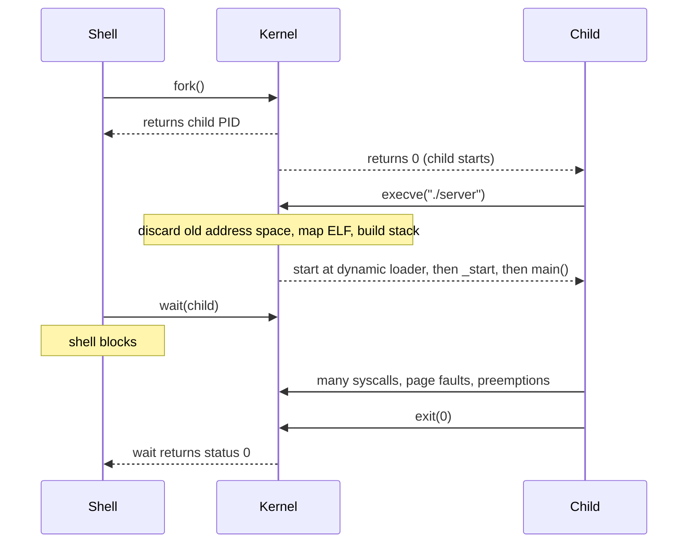

## Mental Model

Running a program is a **relay race between four runners**: the **shell** (asks for a new process), the **kernel** (creates it and loads the program), the **CPU** (executes instructions), and the **kernel again** every time the program needs something it isn't allowed to do itself — or every time the timer says "your turn is over".

The single most useful fact: **a running program is almost never "just running".** It is constantly interrupted, preempted, page-faulting, making system calls and being rescheduled — thousands of times per second — and the OS makes all of that invisible.

## Definition

**Program execution** is the sequence by which the OS turns an executable file into a running process: creating a process, mapping the executable and its libraries into a new address space, setting up the stack and registers, transferring control to the program's entry point, servicing its system calls and faults while it runs, and reclaiming its resources when it exits.

## Why It Exists

A file on disk is inert bytes. To execute it, *someone* must:

- give it memory and put its code there,
- resolve the shared libraries it depends on,
- give it a stack, arguments and environment,
- give it a CPU (and take it away fairly),
- give it controlled access to files, network and devices,
- clean up after it no matter how it ends.

Doing this per program would be chaos; the OS does it uniformly for all of them.

## How It Works

You type `./server --port 8080` in a shell:

::::steps[From command to running process]
1. **The shell parses** the command line, then calls `fork()`: the kernel creates a new child process that is a near-copy of the shell (copy-on-write, so nothing is actually copied yet).
2. **The child calls `execve("./server", argv, envp)`.** The kernel checks permissions, reads the file header (on Linux, **ELF**), and *throws away* the child's old address space.
3. **The kernel builds a new address space**: it maps the executable's `.text` (code, read+execute) and `.data` (read+write) segments, sets up a zero-filled `.bss`, an empty heap, and a stack.
4. **It places `argv`, `envp` and the auxiliary vector on the new stack**, sets the stack pointer, and — for a dynamically linked program — sets the program counter to the **dynamic loader** (`ld-linux.so`), not to your `main`.
5. **Return to user mode.** The dynamic loader maps shared libraries (`libc.so`, `libssl.so`…) with `mmap`, performs relocations, then jumps to the program's `_start`, which calls libc initialization and finally **`main()`**.
6. **The program runs.** The CPU fetches and executes instructions. Nothing is loaded from disk until touched: the first access to each code or data page causes a **page fault**, and the kernel reads that page in (**demand paging**).
7. **System calls** (`socket`, `bind`, `listen`, `accept`, `read`, `write`) trap into the kernel whenever the program needs I/O.
8. **The timer interrupt** fires every few milliseconds; the scheduler may switch to another process (a **context switch**) and later switch back. The program never notices.
9. **Exit.** `main` returns → libc calls `exit()` → the kernel closes file descriptors, frees memory, and leaves a small exit record (a **zombie**) until the parent (the shell) collects the status with `wait()`.
::::



## Internal Mechanism

### The executable file format

An ELF file contains headers describing **segments** to map (with permissions and file offsets), the **entry point** address, and for dynamically linked programs the path of the **interpreter** (dynamic loader) plus a list of needed libraries. `readelf -l ./server` shows the program headers.

### Static vs dynamic linking

| | Static | Dynamic |
|---|---|---|
| Libraries | Copied into the executable | Loaded at start from `.so` files |
| Startup | Faster (no symbol resolution) | Slower (loader resolves symbols; lazy binding helps) |
| Memory | Each program has its own copy | Shared library pages shared by all processes |
| Updates | Rebuild to patch a library bug | Patch the `.so` once |
| Deployment | One self-contained binary (Go default) | Needs compatible libraries installed |

### Demand paging at startup

`exec` does not read the whole program into RAM. It sets up **mappings**: "virtual pages 0x400000–0x480000 correspond to this file at these offsets". The first instruction fetch from `main`'s page faults; the kernel finds the page in the page cache (or reads it from disk), maps it, and restarts the instruction. This is why a 200 MB binary can start in milliseconds and why a program's first request is often slower than later ones ("cold start"). See [Page Faults](lesson:os-page-faults).

### The CPU is shared continuously

Even a program in a tight loop is interrupted by the timer (Linux typically uses a 1–4 ms tick or tickless scheduling with a comparable granularity). Each time, the kernel's scheduler decides whether to continue it or switch to another runnable thread. A program with 4 threads on a 2-core machine is multiplexed onto the cores constantly.

:::depth{level=advanced}
### Before any of this: booting

What runs the very first program? Firmware (**UEFI/BIOS**) initializes hardware and loads a **bootloader** (GRUB, systemd-boot) from disk. The bootloader loads the **kernel image** and an initial RAM filesystem (**initramfs**) into memory and jumps to the kernel. The kernel initializes memory management, interrupt handling, drivers and the scheduler, mounts the root filesystem, and starts **PID 1** (`systemd` or `init`) — the ancestor of every other user process. From then on, every process is created by `fork`/`exec` (or `clone`) from an existing one.
:::

## Example

See the loader and libraries a program uses, and the syscalls at startup:

```bash
$ ldd /usr/bin/curl | head -3
    linux-vdso.so.1 (0x00007ffd...)
    libcurl.so.4 => /lib/x86_64-linux-gnu/libcurl.so.4
    libssl.so.3 => /lib/x86_64-linux-gnu/libssl.so.3

$ strace -f -e trace=execve,openat,mmap curl -s https://example.com -o /dev/null 2>&1 | head -6
execve("/usr/bin/curl", ["curl", "-s", ...], ...) = 0
openat(AT_FDCWD, "/etc/ld.so.cache", O_RDONLY|O_CLOEXEC) = 3
mmap(NULL, 67408, PROT_READ, MAP_PRIVATE, 3, 0) = 0x7f...
openat(AT_FDCWD, "/lib/x86_64-linux-gnu/libcurl.so.4", O_RDONLY|O_CLOEXEC) = 3
...
```

`linux-vdso.so.1` is a tiny library the kernel maps into every process so that calls like `gettimeofday` can run **without** a real system call.

## Visualization

::viz{id=process-lifecycle}

## Complexity & Performance

- `fork`+`exec` of a small program: ~0.5–2 ms (dominated by page-table setup, dynamic loading and page faults). Interpreted runtimes add their own startup (JVM class loading, Python imports) — often 50 ms to seconds.
- The first execution of any code path triggers page faults and cold caches; this is why services use **warm-up** traffic before taking production load and why serverless platforms fight "cold starts".

## Trade-offs

- **Demand paging** makes startup fast and memory-efficient but moves cost into the first execution of each code path (latency spikes).
- **Dynamic linking** saves memory and eases patching but adds startup cost and "works on my machine" dependency problems — one reason containers and static Go binaries are popular.

## Failure Modes

- `exec format error` — wrong architecture or missing interpreter line.
- `error while loading shared libraries: libX.so: cannot open shared object file` — dynamic loader can't find a dependency.
- `Argument list too long` (`E2BIG`) — `argv`+`envp` exceed the kernel limit placed on the new stack.
- Out-of-memory during startup with overcommit disabled — mappings can be refused up front.

## In Production

- **Container entrypoints**: your binary is `exec`'d as PID 1 inside the container. If it doesn't handle `SIGTERM` or reap children, shutdowns hang and zombies accumulate.
- **Graceful restarts**: servers like Nginx re-`exec` a new binary while keeping listening sockets open (file descriptors survive `exec` unless marked close-on-exec).
- **Startup latency** matters for autoscaling and serverless: precompiled binaries, smaller images, snapshotting (Firecracker) and class-data sharing (JVM CDS) all attack the steps above.

## Deeper Connections

- Every step here is its own lesson: [process creation](lesson:os-process-creation), [address spaces](lesson:os-address-spaces), [page faults](lesson:os-page-faults), [system calls](lesson:os-syscalls-interrupts), [context switches](lesson:os-context-switch).
- The same pattern — create a context, lazily load what's needed, multiplex on shared resources, clean up at the end — appears in database sessions (connection → backend process → buffer pool pages loaded on demand).

## Common Misconceptions

- **"exec creates a new process."** `exec` *replaces* the program inside the existing process (same PID). `fork`/`clone` creates processes.
- **"The whole program is loaded into memory when it starts."** Only mappings are created; pages load on first touch.
- **"main() is the first code that runs."** The dynamic loader, `_start`, and libc initialization (plus C++ static constructors) run first.

## Interview Questions

### [L1 · trace] What happens when you run a program from the shell?

The shell forks a child process; the child calls `execve`, which replaces its address space with the new program: the kernel maps the executable's segments, sets up the stack with arguments and environment, and starts execution at the dynamic loader, which maps shared libraries and jumps to `_start` → `main`. Pages load lazily via page faults. While running, the program makes system calls for I/O and is periodically preempted by the scheduler. On exit, the kernel frees resources, and the shell, blocked in `wait`, collects the exit status.

### [L2 · compare] Static vs dynamic linking — trade-offs?

Static linking copies library code into the binary: self-contained, faster startup, no dependency issues, but larger binaries, no memory sharing between processes, and every library patch needs a rebuild. Dynamic linking loads shared libraries at runtime: smaller binaries, shared physical pages across processes, patch once for all programs, but slower startup and runtime dependency/version problems.

### [L2 · why] Why can a 500 MB executable start in a fraction of a second?

Because `exec` only creates memory mappings; it doesn't read the file. Pages are loaded on first access (demand paging), and many are probably already in the page cache from previous runs. Only the pages actually touched during startup are faulted in.

### [L3 · debugging] A service's first request after deploy takes 2 s while later ones take 20 ms. What's going on and how would you fix it?

Cold start: code and data pages are faulted in on first use, caches (CPU, page cache, application caches, connection pools, JIT compilation in JVM/.NET, DNS, TLS sessions) are empty. Fixes: warm-up requests before marking the instance ready (readiness probe), pre-establishing pools, ahead-of-time compilation or class-data sharing, and keeping minimum instances warm. Verify with page-fault counts (`perf stat -e page-faults`) and timing breakdowns.

### [L3 · what-if] What happens to open file descriptors across fork and exec?

`fork` duplicates the file descriptor table: parent and child share the same open-file entries (and offsets). `exec` keeps descriptors open by default — which is how the shell wires up stdin/stdout/stderr and pipes before exec'ing a program — except those flagged `FD_CLOEXEC` (`O_CLOEXEC`), which are closed automatically. Forgetting `O_CLOEXEC` leaks descriptors (and sometimes secrets or sockets) into child programs.

### [L4 · design] You need to cut service startup time from 30 s to under 2 s for autoscaling. How would you approach it?

Measure first: split startup into process exec/loading, runtime initialization (JVM, class loading, imports), dependency connections (DB pools, service discovery, TLS handshakes), cache warming and framework reflection. Then attack the biggest: lazy initialization for rarely-used components, ahead-of-time compilation/native images or CDS, smaller dependency graphs, parallelizing independent connections, snapshotting a warmed process (CRaC, Firecracker snapshots), and making readiness depend only on what's needed for the first requests. Accept trade-offs: lazy init moves latency to first use.

## Practice

### [mcq] After a successful execve(), which of these is the SAME as before the call?

- [ ] The program's code
- [ ] The heap contents
- [x] The process ID
- [ ] The stack contents

`exec` replaces the program image but the process — its PID, parent, and (non-CLOEXEC) file descriptors — remains.

### [exercise] Explain why `strace ./hello` for a dynamically linked C "hello world" shows several `openat` and `mmap` calls before the single `write`.

:::solution
The kernel starts the dynamic loader first. The loader opens `/etc/ld.so.cache` to find library paths, opens `libc.so.6`, and `mmap`s its segments (code read-exec, data read-write), then performs relocations. Only after libc is initialized does `main` run and call `printf`, which eventually issues one `write(1, "hello\n", 6)`. A statically linked build would skip almost all of this.
:::

## Quick Revision

- Shell → `fork()` (new process) → child `execve()` (replace program) → kernel maps ELF segments + stack → dynamic loader → `_start` → `main`.
- Pages load **lazily** via page faults (demand paging) → fast start, slower first requests.
- While running: **syscalls** for I/O, **timer interrupts** for preemption, **page faults** for memory.
- Exit → kernel frees resources → **zombie** until the parent `wait()`s.
- `exec` keeps the **PID** and open fds (unless `O_CLOEXEC`).
- Boot: firmware → bootloader → kernel → PID 1 → everything else via fork/exec.
