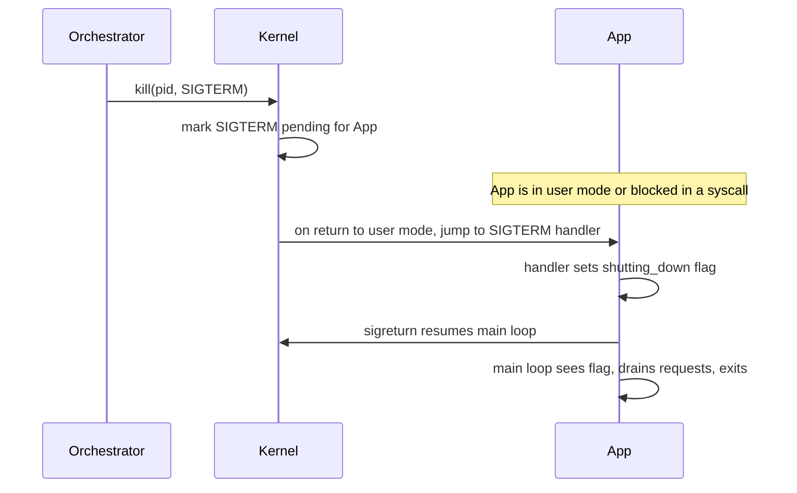

## Mental Model

A signal is a **tap on the shoulder** from the kernel. The process can be in the middle of anything; the kernel interrupts its normal flow and says: "someone pressed Ctrl+C", "your child died", "you touched invalid memory", "please shut down". The process chooses in advance how to react to each kind of tap: **ignore it, run a handler, or accept the default** (usually: die).

Two taps cannot be refused: **`SIGKILL`** and **`SIGSTOP`**. Everything else is negotiable — which is exactly why well-behaved services should treat **`SIGTERM`** as "finish what you're doing and exit cleanly".

## Definition

A **signal** is a small integer notification delivered asynchronously to a process (or specific thread) by the kernel, either because of an event (hardware fault, child exit, terminal input) or because another process requested it via `kill()`. Each signal has a **disposition**: default action, ignore, or a user-defined **handler** function.

## Why It Exists

**The problem.** A process runs its own code, top to bottom. But some things happen *to* it that its code never asked about. Processes need to be told about events that happen *outside their normal control flow*:

- **Faults they caused**: dividing by zero (`SIGFPE`), invalid memory access (`SIGSEGV`), illegal instruction (`SIGILL`).
- **Events from the terminal**: Ctrl+C (`SIGINT`), Ctrl+Z (`SIGTSTP`), terminal closed (`SIGHUP`).
- **Events from other processes**: "please terminate" (`SIGTERM`), "reload config" (`SIGHUP` by convention), user-defined (`SIGUSR1/2`).
- **Kernel bookkeeping**: child changed state (`SIGCHLD`), write to a pipe with no reader (`SIGPIPE`), timer expired (`SIGALRM`).

**Without it.** Each program would have to keep asking "did Ctrl+C get pressed? did my child die? should I shut down?" between every few instructions. Polling for all of these would be wasteful and slow — and for faults like `SIGSEGV` there's nothing to poll: the instruction simply can't continue.

**The idea.** Let the kernel interrupt the process's normal flow and say "this happened" — the same trick hardware interrupts play on the kernel, handed down to user programs. Signals are the Unix mechanism for **asynchronous, low-bandwidth notification**: they say *which* event, not much else.

**From idea to mechanism.** The kernel needs to remember a signal until the process can take it → the **pending** set. The process needs to decide in advance what each one means to it → **dispositions** and handlers. And because the tap can come between any two instructions, handlers must be tiny → **async-signal-safety**.

:::callout[That's all it is]{type=insight}
A signal is a numbered "something happened" that the kernel delivers by making the process jump to a function you registered (or by applying a default, usually death). It's an interrupt for processes.
:::

## How It Works

### Common signals

| Signal | Number (x86 Linux) | Default | Typical cause |
|---|---|---|---|
| `SIGHUP` | 1 | Terminate | Terminal hang-up; daemons use it for "reload config" |
| `SIGINT` | 2 | Terminate | Ctrl+C |
| `SIGQUIT` | 3 | Core dump | Ctrl+\ |
| `SIGKILL` | 9 | Terminate — **cannot be caught or ignored** | `kill -9`, OOM killer |
| `SIGSEGV` | 11 | Core dump | Invalid memory access |
| `SIGPIPE` | 13 | Terminate | Write to pipe/socket whose reader closed |
| `SIGALRM` | 14 | Terminate | `alarm()` timer |
| `SIGTERM` | 15 | Terminate | `kill` default; orchestrators' polite shutdown |
| `SIGCHLD` | 17 | Ignore | Child stopped or exited |
| `SIGSTOP` | 19 | Stop — **cannot be caught** | `kill -STOP`, debuggers |
| `SIGTSTP` | 20 | Stop | Ctrl+Z |

### Generation → pending → delivery

1. **Generation**: the kernel (fault, child exit, timer) or another process (`kill(pid, sig)`, subject to permission checks) raises a signal.
2. **Pending**: the kernel sets a bit in the target's pending set. If the signal is **blocked** (masked), it stays pending.
3. **Delivery**: the next time the target thread returns from kernel to user mode (after a syscall, interrupt, or when it's scheduled), the kernel checks for pending unblocked signals. For a handler, it builds a **signal frame** on the user stack and redirects execution to the handler; when the handler returns, a special `sigreturn` syscall restores the interrupted context.



### Standard signals don't queue

This is a consequence of how cheaply signals are stored: one bit per signal number, not a list. The pending set is a **bitmask**: if three `SIGCHLD`s arrive before the handler runs, the handler runs **once**. Code must handle "at least one event happened" (e.g., loop over `waitpid(-1, …, WNOHANG)`). POSIX **real-time signals** (`SIGRTMIN`…`SIGRTMAX`) do queue and carry a small payload.

### Interrupted system calls

The problem: the kernel can only run a handler on the way back to user mode — but a process blocked in `read` might stay in the kernel for hours. To deliver promptly, the kernel has to abandon the wait. If a signal arrives while a process is blocked in a slow syscall (`read` on a socket, `accept`, `sleep`), the syscall is interrupted: it either fails with **`EINTR`** or is automatically restarted if the handler was installed with `SA_RESTART`. Robust code retries on `EINTR`.

## Internal Mechanism

### What a handler may safely do

This restriction is the price of "interrupt between any two instructions". A handler can run **between any two instructions** of your program — including while your main code is inside `malloc` holding its lock, or halfway through updating a data structure. If the handler then calls `malloc` or `printf` (which may take the same locks or touch the same buffers), you get deadlock or corruption.

So handlers may call only **async-signal-safe** functions (`write`, `_exit`, `kill`, `waitpid`, …; *not* `printf`, `malloc`, most of libc) and should typically do nothing but **set a flag** of type `volatile sig_atomic_t` or write a byte to a pipe (the **self-pipe trick**), letting the main loop do the real work. Modern Linux alternative: `signalfd` turns signals into readable file descriptor events that fit into an `epoll` loop.

```c
static volatile sig_atomic_t stop = 0;
static void on_term(int sig) { (void)sig; stop = 1; }   // flag only

int main(void) {
    struct sigaction sa = { .sa_handler = on_term };
    sigemptyset(&sa.sa_mask);
    sigaction(SIGTERM, &sa, NULL);
    sigaction(SIGINT,  &sa, NULL);
    while (!stop) {
        serve_one_request();        // main loop checks the flag
    }
    drain_and_close();              // graceful shutdown outside the handler
}
```

:::depth{level=advanced}
### Signals and threads

Dispositions (handlers) are **per process**; masks are **per thread**. A process-directed signal (from `kill`) is delivered to *any one* thread that doesn't block it. Synchronous signals caused by a thread's own fault (`SIGSEGV`) go to that thread. A common pattern in multithreaded servers: block all signals in every thread and dedicate one thread to `sigwait()` for them, turning asynchronous delivery into ordinary synchronous handling.
:::

## Example

```bash
$ sleep 1000 &
[1] 7001
$ kill -TERM 7001       # polite: sleep's default is to die
$ kill -l | head -2     # list signal names
$ trap 'echo reloading' HUP   # a shell script handling SIGHUP
$ kill -0 7001          # signal 0: just checks the process exists and you may signal it
```

## Complexity & Performance

Signals are cheap to send (a syscall and a bit flip) but carry almost no data, may be coalesced, and interrupt execution at arbitrary points. They are for **notification**, not communication — use pipes, sockets or shared memory for data ([IPC](lesson:os-ipc)).

## Trade-offs

- **Asynchronous handlers** are immediate but dangerous (reentrancy). **Flag + main loop** or **`signalfd`/`sigwait`** are safer at the cost of latency until the loop checks.
- **`SA_RESTART`** simplifies code but can make timeouts implemented via signals ineffective (the restarted syscall keeps blocking).

## Failure Modes

- **Unsafe handlers** calling `printf`/`malloc` → rare deadlocks that are nearly impossible to reproduce.
- **Ignoring `SIGTERM`** → orchestrators wait for the grace period (Kubernetes default 30 s) and then `SIGKILL` — in-flight requests are dropped and deployments are slow.
- **PID 1 in a container**: the kernel does not apply default "terminate" actions to PID 1 for signals it hasn't installed handlers for. An app running as PID 1 that doesn't handle `SIGTERM` simply **ignores** it.
- **Unhandled `SIGPIPE`** kills network servers when a client disconnects mid-write; servers usually ignore `SIGPIPE` and handle the `EPIPE` error instead.
- **Lost `SIGCHLD`s** (coalescing) → zombies if the handler reaps only one child per signal.

## In Production

**Graceful shutdown in Kubernetes**: when a pod is deleted, the kubelet runs any `preStop` hook, sends **SIGTERM** to PID 1, waits `terminationGracePeriodSeconds`, then sends **SIGKILL**. Meanwhile the pod is removed from Service endpoints — asynchronously, so a well-behaved server should: stop accepting new connections (or keep accepting briefly while endpoints propagate), finish in-flight requests, close DB pools, flush logs, then exit 0.

Other conventions: Nginx uses `SIGHUP` to reload config and `SIGUSR2` for binary upgrade; PostgreSQL uses `SIGHUP` for config reload and `SIGINT` for "fast shutdown". The kernel's **OOM killer** uses `SIGKILL` — no cleanup possible.

## Deeper Connections

- Signals are delivered on the **return path from kernel to user mode** — the same checkpoint where the scheduler decides whether to preempt ([System Calls & Interrupts](lesson:os-syscalls-interrupts)).
- The "handler interrupts arbitrary code" hazard is the same reentrancy problem as interrupt handlers in the kernel and as race conditions in threads ([Race Conditions](lesson:os-race-conditions)).
- `SIGPIPE`/`EPIPE` connect to TCP connection teardown (writing after the peer sent RST) — see [TCP Termination](lesson:cn-tcp-termination).

## Common Misconceptions

- **"kill kills."** `kill` *sends a signal*; the default for most signals is termination, but `kill -HUP` usually reloads config and `kill -0` does nothing.
- **"kill -9 is the normal way to stop a service."** It prevents cleanup (flushing buffers, releasing locks, deregistering). Use `SIGTERM` first.
- **"Signals are queued like messages."** Standard signals coalesce.
- **"A signal handler runs in a separate thread."** It runs on the interrupted thread's stack, in the middle of whatever it was doing.

## Interview Questions

### [L1 · compare] What is the difference between SIGTERM and SIGKILL?

`SIGTERM` (15) is a request to terminate: the process can catch it, clean up (finish requests, flush data, release resources) and exit, or even ignore it. `SIGKILL` (9) cannot be caught, blocked or ignored; the kernel terminates the process immediately with no cleanup. Well-behaved shutdown sends SIGTERM, waits a grace period, then SIGKILL.

### [L1 · conceptual] What happens when you press Ctrl+C in a terminal running a program?

The terminal driver sends `SIGINT` to the foreground process group. Unless the program installed a handler or ignores SIGINT, the default action terminates it. Programs like shells and REPLs catch SIGINT to cancel the current line instead.

### [L2 · why] Why should signal handlers only set a flag instead of doing real work?

Handlers run asynchronously, between any two instructions, possibly while the main code holds a lock or is mid-update of a data structure. Calling non-async-signal-safe functions (malloc, printf, most of libc) from the handler can deadlock (re-taking a held lock) or corrupt state. Setting a `volatile sig_atomic_t` flag (or writing to a self-pipe/`signalfd`) defers the work to the main loop, where it's safe.

### [L2 · how] Your program receives three SIGCHLD signals in quick succession but the handler runs once. Why, and how do you handle it correctly?

Standard signals are tracked as a pending bit, not a queue, so multiple instances before delivery coalesce into one. The handler must reap all exited children: loop `while (waitpid(-1, &status, WNOHANG) > 0) {}`.

### [L3 · incident] Deployments of a service in Kubernetes take 30 seconds per pod and clients see connection errors during rollouts. What's likely wrong?

The app probably doesn't handle SIGTERM — often because it runs as PID 1 (where unhandled signals are ignored) or behind a shell wrapper (`sh -c`) that doesn't forward signals. The kubelet waits the full 30 s grace period, then SIGKILLs, dropping in-flight requests. Fix: run the binary directly (exec-form ENTRYPOINT) or use an init like tini, handle SIGTERM by draining in-flight requests and closing listeners, and add a short preStop sleep so load balancers stop routing to the pod before it closes.

### [L3 · what-if] What happens if a server writes to a TCP socket whose client already closed the connection?

The first write may succeed (buffered); the peer responds with RST. A subsequent write triggers `SIGPIPE`, whose default action kills the process. Servers set `SIGPIPE` to `SIG_IGN` (or use `MSG_NOSIGNAL`/`SO_NOSIGPIPE`), so the write returns `-1` with `errno = EPIPE`, which they handle by closing the connection.

### [L4 · design] Design graceful shutdown for an HTTP API server with a DB connection pool and a background job worker.

On SIGTERM (handled via flag or signalfd): mark unhealthy so readiness checks fail; keep serving briefly while load balancers deregister; stop accepting new connections; let in-flight HTTP requests finish with a deadline shorter than the grace period; signal the job worker to stop taking new jobs and either finish or checkpoint/requeue the current job (idempotently); flush logs and metrics; close the DB pool (returning connections cleanly); exit 0. If the deadline expires, exit non-zero — the orchestrator's SIGKILL is the last resort. Test it: deploy under load and verify zero 5xx.

## Practice

### [mcq] Which signal cannot be caught or ignored?

- [ ] SIGTERM
- [ ] SIGINT
- [x] SIGKILL
- [ ] SIGHUP

SIGKILL and SIGSTOP are the only two that a process cannot handle, block or ignore.

### [mcq] A container's app runs as PID 1 and has no SIGTERM handler. What happens on `docker stop`?

- [ ] It terminates immediately via the default action
- [x] SIGTERM is effectively ignored; after the timeout Docker sends SIGKILL
- [ ] The kernel converts SIGTERM to SIGKILL
- [ ] Docker restarts the container

The kernel doesn't apply default fatal actions to PID 1 for signals without handlers (protecting init). Docker waits (default 10 s) and then kills it.

## Quick Revision

- Signal = asynchronous kernel notification; disposition = default / ignore / handler.
- **SIGKILL** and **SIGSTOP** can't be caught. **SIGTERM** = polite stop; **SIGINT** = Ctrl+C; **SIGCHLD** = child changed state; **SIGSEGV** = bad memory access; **SIGPIPE** = write to closed pipe/socket.
- Delivered when returning to user mode; standard signals **coalesce** (bitmask).
- Handlers: only async-signal-safe calls → set a flag / self-pipe / `signalfd`.
- Blocked syscalls return **EINTR** (or restart with `SA_RESTART`).
- Graceful shutdown = handle SIGTERM, drain, exit before the grace period ends. PID 1 ignores unhandled signals.
