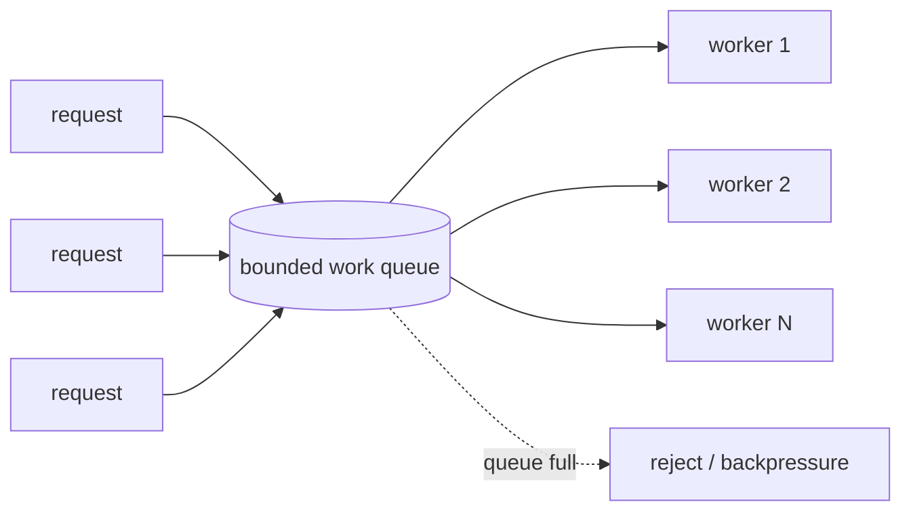

## Mental Model

A thread pool is a **restaurant kitchen with a fixed number of cooks and a ticket rail**. Orders (tasks) are clipped to the rail (the queue); free cooks (worker threads) take the next ticket. You don't hire a new cook for every order and fire them afterward — that would be absurd — and you don't let the rail grow forever: if tickets pile up beyond what the kitchen can cook in a reasonable time, the host must stop seating guests (**backpressure**) or turn them away (**load shedding**).

## Definition

A **thread pool** is a fixed or bounded set of long-lived worker threads that repeatedly take tasks from a shared **work queue** and execute them. An **executor** is the abstraction that accepts tasks and decides how they run (Java `ExecutorService`, Python `ThreadPoolExecutor`, Go's pattern of N goroutines reading a channel).

## Why It Exists

Creating a thread per task has three problems:

1. **Creation cost** — tens of microseconds per thread is significant for millisecond-scale tasks.
2. **Unbounded concurrency** — a traffic spike creates thousands of threads, exhausting memory and scheduler capacity ([Concurrency vs Parallelism](lesson:os-concurrency-vs-parallelism)).
3. **No control point** — you can't limit, prioritize, measure or reject work.

A pool amortizes creation, **bounds** concurrency, and gives a queue where overload becomes visible and manageable.

## How It Works



1. Submitters enqueue tasks (the queue is a blocking queue: mutex + condition variables inside).
2. Idle workers block on `take()`; when a task arrives, one wakes and runs it.
3. When the queue is full, the **rejection policy** decides: throw, run on the caller's thread (natural backpressure), drop, or drop oldest.

### Sizing the pool

- **CPU-bound tasks**: `threads ≈ number of cores` (maybe +1 to cover occasional stalls).
- **Blocking I/O tasks**: `threads ≈ cores × (1 + wait/compute)`, bounded by what downstream systems tolerate.
- **Little's Law** as a sanity check: `concurrency needed = arrival rate × time per task`. 500 req/s × 100 ms = 50 busy workers on average; add headroom for variance.

The pool size is a **concurrency limit on your downstream**: a pool of 200 threads that each hold a database connection means up to 200 concurrent queries. The database's capacity often decides the right number, not your CPU.

### The queue decides your latency

With a bounded pool, excess work waits in the queue. Queue wait adds directly to response time:

```text
response time = queue wait + service time
```

An unbounded queue hides overload: throughput stays constant, but latency grows without limit, memory grows, and clients time out while their requests are still queued — so the server does work nobody is waiting for. **Bound the queue** and decide explicitly what happens when it's full.

## Internal Mechanism

### Single shared queue vs work stealing

- A **single shared queue** is simple but its lock becomes contended with many workers and tiny tasks.
- **Work-stealing** pools (Java `ForkJoinPool`, Go's scheduler, Tokio, .NET) give each worker its own deque: it pushes/pops its own tasks at one end (LIFO, cache-warm) and idle workers **steal** from the other end of busy workers' deques. Great for recursive divide-and-conquer and many small tasks.

### Java's ThreadPoolExecutor semantics (a common trap)

`ThreadPoolExecutor(core, max, keepAlive, queue)` grows from `core` to `max` threads **only when the queue is full**. With an unbounded `LinkedBlockingQueue`, the queue is never full, so the pool **never grows beyond core size** and the queue grows forever. `Executors.newFixedThreadPool` uses an unbounded queue; `newCachedThreadPool` uses a hand-off queue with unbounded max threads — the opposite extreme.

:::depth{level=advanced}
### Bulkheads and pool isolation

If one slow dependency's calls share a pool with everything else, a slowdown there fills the pool and **all** endpoints stall — a cascading failure. The **bulkhead** pattern gives each dependency (or request class) its own bounded pool or semaphore, so one failing dependency exhausts only its own compartment. Combine with timeouts and circuit breakers so blocked threads are released quickly.

### Virtual threads change the calculus

With Java virtual threads or goroutines, threads are cheap enough to create one per task — the pool's role as a *reuse* mechanism disappears. Its role as a *concurrency limit* does not: you still need semaphores or bounded resources to protect databases and downstream services, otherwise a million virtual threads will happily open a million requests.
:::

## Example

A Java service calling a payment API with a p99 of 2 s:

```java
ExecutorService paymentPool = new ThreadPoolExecutor(
    32, 32, 0, TimeUnit.SECONDS,
    new ArrayBlockingQueue<>(100),                  // bounded: at most 100 waiting
    new ThreadPoolExecutor.AbortPolicy());          // reject when full → 503 upstream

Future<Receipt> f = paymentPool.submit(() -> paymentClient.charge(order));
Receipt r = f.get(3, TimeUnit.SECONDS);             // don't wait forever
```

Worst-case queue wait: 100 queued / (32 workers / 2 s) ≈ 6 s — longer than the 3 s caller timeout, so the queue should be smaller (≈ 32 × 3 s / 2 s ≈ 48 at most), or requests will time out while queued.

## Complexity & Performance

- **Utilization vs latency**: as a pool approaches 100% busy, queueing delay explodes non-linearly (for many workloads, wait time ∝ ρ / (1 − ρ)). Running at 70–80% leaves headroom for bursts.
- **Task granularity**: very small tasks spend more time in queue synchronization than executing; batch them or use work stealing.

## Trade-offs

| Choice | Benefit | Cost |
|---|---|---|
| Large pool | Tolerates slow I/O; high concurrency | Memory, context switches, overloads downstream |
| Small pool | Protects downstream; cache-friendly | Underutilization if tasks block |
| Unbounded queue | Never rejects | Unbounded latency and memory; hides overload |
| Bounded queue + rejection | Fast failure, stable latency | Some requests fail under overload (by design) |
| Caller-runs policy | Automatic backpressure | Slows the submitting thread (maybe an I/O thread!) |

## Failure Modes

- **Pool exhaustion**: all workers blocked on a slow dependency → every request waits → timeouts cascade. Fix with timeouts on every blocking call, bulkheads and circuit breakers.
- **Deadlock via pool starvation**: tasks in a pool submit subtasks to the *same* pool and wait for them; when all workers are waiting, the subtasks never run.
- **Unbounded queue OOM**: millions of queued tasks during an outage.
- **Lost exceptions**: exceptions inside submitted tasks disappear unless you inspect the `Future` or install handlers.
- **ThreadLocal leakage** between tasks on reused threads ([Threads](lesson:os-threads)).

## In Production

- Web servers (Tomcat's `maxThreads`, Jetty, Gunicorn workers), gRPC server executors, Kafka consumer thread pools, and DB connection pools (HikariCP) are all pools with the same trade-offs.
- **Connection pools** are thread pools' twins: bounded reusable resources with a wait queue and timeouts. The pool size should be small — HikariCP's guidance starts from `connections ≈ cores × 2 + effective spindles`, far smaller than most people expect ([Connection Management](lesson:x-connection-management)).
- Case study: [Connection Pool Exhaustion](case:pool-exhaustion).

## Deeper Connections

- Sizing is [Little's Law](lesson:os-performance-method); saturation behavior is queueing theory.
- Pools are the concurrency layer of [overloaded servers](lesson:x-overloaded-server): queues in the pool, the socket accept backlog, the TCP buffers and the DB connection pool all stack up.
- Event loops are the alternative when most tasks are I/O waits ([epoll & Event Loops](lesson:os-epoll-event-loops)).

## Common Misconceptions

- **"More threads in the pool = more throughput."** Only until the CPU or a downstream is saturated; then latency rises and throughput may drop.
- **"An unbounded queue is safer because nothing is rejected."** It converts overload into unbounded latency and memory growth — usually worse than fast rejection.
- **"Pool size should match expected concurrent users."** It should match the concurrency your CPU and dependencies can actually serve.

## Interview Questions

### [L1 · why] Why use a thread pool instead of creating a new thread per request?

To avoid per-task thread creation/destruction cost, to bound the number of concurrent threads (protecting memory, the scheduler and downstream systems), and to gain a control point — a queue — for measuring load, prioritizing and rejecting work under overload.

### [L2 · numerical] Requests arrive at 400/s and each takes 50 ms of a worker's time. How many busy workers are needed on average?

Little's Law: L = λ × W = 400 × 0.05 = **20** workers busy on average. Size above that for bursts (e.g., 30–40), but check CPU and downstream limits.

### [L2 · how] How would you size a thread pool for CPU-bound vs I/O-bound tasks?

CPU-bound: about the number of cores, since extra threads only add switching. I/O-bound: `cores × (1 + wait/compute)`, then cap by downstream capacity (DB connections, API rate limits) and validate with load tests measuring throughput and latency.

### [L3 · what-if] What happens to latency when a thread pool uses an unbounded queue and the arrival rate exceeds the service rate?

The queue grows without bound: throughput plateaus at the service rate while queue wait — and therefore latency — grows linearly with time, along with memory. Clients time out, but their queued requests still get processed later (wasted work), which delays fresh requests further. It can end in OOM. Bounded queues with rejection keep latency bounded.

### [L3 · debugging] All request threads in a service are stuck and every endpoint times out, though only one downstream dependency is slow. Explain and fix.

Pool exhaustion: all shared workers are blocked on calls to the slow dependency (often without timeouts), so no workers remain for requests that don't even need it — a cascading failure. Fixes: timeouts on every outbound call, bulkheads (a separate bounded pool or semaphore per dependency), circuit breakers to fail fast when the dependency is unhealthy, and load shedding when queues grow.

### [L3 · trace] A ForkJoin-style task in a fixed pool of 4 threads submits 4 subtasks to the same pool and blocks on all of them. With 4 such parent tasks running, what happens?

Deadlock by pool starvation: all 4 workers run parent tasks that block waiting for subtasks, and the subtasks sit in the queue with no free worker. Work-stealing pools avoid this by having a waiting worker execute pending subtasks itself (`join` helps), or use separate pools for parent and child work, or non-blocking composition (CompletableFuture chaining).

### [L4 · design] Design the concurrency model for an API gateway calling five backend services with different latencies and reliability.

Per-backend bulkheads (bounded concurrency via separate pools or semaphores sized by each backend's capacity and latency using Little's Law), strict timeouts shorter than the gateway's own SLO, retries with jittered backoff and a retry budget, circuit breakers that open on error spikes, and bounded queues with fast rejection (429/503) when saturated. Use async I/O or virtual threads so waiting doesn't cost kernel threads. Expose metrics per bulkhead: active, queued, rejected, latency percentiles.

## Practice

### [numeric 20] Arrival rate 200 req/s, average service time 100 ms. By Little's Law, how many requests are in service concurrently on average?

:::answer
L = λW = 200 × 0.1 = **20**.
:::

### [mcq] In Java's ThreadPoolExecutor with core=10, max=50 and an unbounded LinkedBlockingQueue, how many threads will the pool use under heavy load?

- [x] 10
- [ ] 50
- [ ] Unbounded
- [ ] It depends on keepAlive

It grows beyond core only when the queue rejects an offer, which an unbounded queue never does.

## Quick Revision

- Pool = bounded reusable workers + work queue + rejection policy.
- Size: CPU-bound ≈ cores; I/O-bound ≈ `cores × (1 + wait/compute)`, capped by downstream capacity. Check with **Little's Law** (L = λW).
- **Response time = queue wait + service time**; unbounded queues hide overload and explode latency.
- Bound queues, set timeouts, reject fast (backpressure/load shedding).
- **Bulkheads** isolate slow dependencies; **work stealing** for many small tasks.
- Traps: Java TPE never grows past core with an unbounded queue; pool-starvation deadlock; ThreadLocal leaks.
