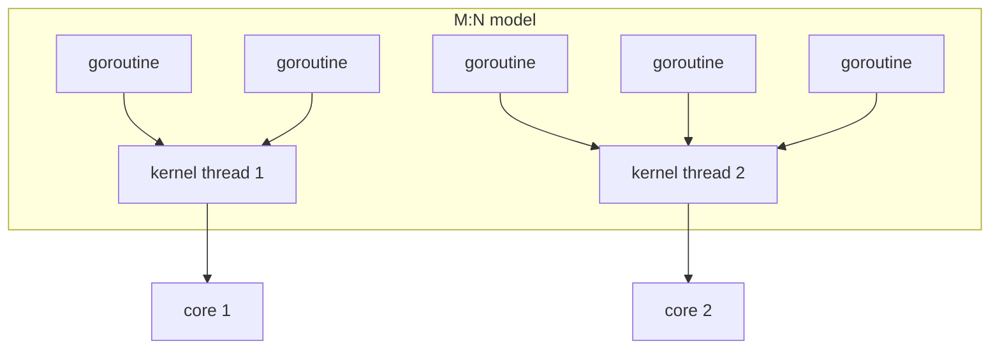

## Mental Model

If a process is a **house**, threads are **people living in it**. They share the kitchen, furniture and mailbox (the address space, heap, open files). Each person has their own notebook of what they're doing right now (registers, program counter) and their own to-do stack (call stack).

Sharing the house makes cooperation cheap — just leave something on the table — but also dangerous: two people can grab the same pan at the same time. That's the entire story of concurrency bugs.

## Definition

A **thread** is an independent flow of execution within a process. Each thread has its own:

- program counter and registers,
- stack (local variables, return addresses),
- thread-local storage,
- scheduling state and priority, signal mask, `errno`.

All threads in a process share:

- the address space: code, global variables, **heap**,
- open file descriptors and sockets,
- signal handlers, current directory, user/group IDs.

## Why It Exists

Processes give isolation, but two needs aren't served well by them:

1. **Concurrency within one task.** A server wants to handle many clients; a GUI wants to stay responsive while a download runs. Separate processes would need IPC to share state.
2. **Parallelism on multicore CPUs.** One process with one thread can use one core. Threads let one program use all cores on shared data.

Threads are cheaper than processes to create (~10–20 µs vs 100s of µs), switch between (no address-space change), and communicate between (shared memory, no IPC).

## How It Works

### Creating and joining threads

```c
#include <pthread.h>

void *worker(void *arg) {
    int id = *(int *)arg;
    printf("worker %d running\n", id);   // shares stdout with other threads
    return NULL;
}

int main(void) {
    pthread_t t[4];
    int ids[4];
    for (int i = 0; i < 4; i++) {
        ids[i] = i;
        pthread_create(&t[i], NULL, worker, &ids[i]);
    }
    for (int i = 0; i < 4; i++) pthread_join(t[i], NULL);   // wait for each
}
```

Equivalent in Java: `new Thread(runnable).start()` / `join()`; Python: `threading.Thread`; Go: `go f()` (a goroutine, see below).

### Thread lifecycle

Threads go through the same states as processes — new, ready, running, blocked, terminated — because on most systems the kernel schedules **threads**, not processes. A thread terminates by returning from its function or calling `pthread_exit`; another thread can **join** it (collect its result, like `wait` for processes) or it can be **detached** so its resources are freed automatically. Calling `exit()` from *any* thread ends the whole process.

### Memory layout with threads

```text
┌───────────────────────────┐
│ stack of thread 3         │  each thread: own stack (default 8 MB virtual on Linux)
│ stack of thread 2         │
│ stack of thread 1 (main)  │
│ ...                       │
│ heap  (shared)            │  objects created with malloc/new — visible to all threads
│ globals / static (shared) │
│ code  (shared)            │
└───────────────────────────┘
```

Local variables are private (on each thread's stack) **unless you pass a pointer to them to another thread**. Heap objects and globals are shared — every concurrency bug involves shared, mutable data.

## Internal Mechanism

### User threads vs kernel threads

| | Kernel threads | User-level threads |
|---|---|---|
| Who schedules | OS kernel | A runtime library in user space |
| Creation/switch cost | Syscall; ~µs | Function-call-like; ~100 ns |
| Blocking syscall | Blocks only that thread | Blocks the kernel thread carrying it (unless the runtime works around it) |
| Uses multiple cores | Yes | Only if multiplexed onto several kernel threads |
| Examples | pthreads on Linux, Java platform threads | Goroutines, Java virtual threads, Erlang processes, async/await tasks |

### Threading models

- **Many-to-one**: many user threads on one kernel thread. Cheap, but no parallelism and one blocking call blocks all. (Early green threads.)
- **One-to-one**: each user thread is a kernel thread. Parallelism and independent blocking; costs a kernel thread each. (Linux NPTL, Windows, Java platform threads.)
- **Many-to-many (M:N)**: M user threads multiplexed onto N kernel threads by a runtime scheduler. (Go, Java virtual threads since JDK 21, Erlang.)



The M:N runtime must handle blocking: Go parks the goroutine and uses its network poller (epoll) for sockets; for a blocking syscall it hands the other goroutines to another kernel thread. Java virtual threads **unmount** from their carrier thread when they block on supported I/O.

### Thread-local storage (TLS)

Sometimes each thread needs its *own* copy of a "global": `errno`, a per-thread random generator, a request ID for logging, a per-thread buffer. **Thread-local storage** (`__thread`/`thread_local` in C/C++, `ThreadLocal` in Java, `threading.local` in Python) gives each thread a separate instance, accessed without locks. On x86-64 Linux it's implemented by pointing the `fs` segment register at a per-thread block.

:::callout{type=warning}[ThreadLocal in thread pools]
Thread pools reuse threads. A value stored in a `ThreadLocal` during one request survives into the next request handled by that thread — a classic source of data leaks between users and memory leaks. Always clear thread-locals in a `finally` block (or use scoped values/context propagation).
:::

:::depth{level=advanced}
### How Linux implements threads

Linux has a single "task" abstraction. `pthread_create` calls `clone()` with flags like `CLONE_VM | CLONE_FS | CLONE_FILES | CLONE_SIGHAND | CLONE_THREAD`: the new task shares the address space, filesystem info, file table and signal handlers, and joins the creator's thread group. The **TGID** (thread group ID) is what user space calls the PID; each thread has its own TID (`gettid()`). `ps -eLf` or `top -H` shows threads individually. Thread stacks are ordinary `mmap`'d regions with a guard page to catch overflow.
:::

## Example

Why threads help an I/O-bound program (Python, where the GIL prevents CPU parallelism but I/O releases it):

```python
import concurrent.futures, urllib.request, time

urls = [f"https://example.com/?q={i}" for i in range(20)]

def fetch(u):
    with urllib.request.urlopen(u, timeout=10) as r:
        return len(r.read())

t = time.time()
with concurrent.futures.ThreadPoolExecutor(max_workers=10) as ex:
    sizes = list(ex.map(fetch, urls))
print(f"{time.time() - t:.1f}s")   # ~2 round trips of wall time instead of 20
```

Each thread spends most of its time **blocked** on the network; while blocked, others run. For CPU-bound Python work you'd use processes (or a free-threaded Python build).

## Visualization

The same switch, thread vs process — notice which steps disappear:

::viz{id=context-switch}

## Complexity & Performance

| | Process | Kernel thread | User thread (goroutine/virtual) |
|---|---|---|---|
| Creation | ~100 µs–ms | ~10–20 µs | ~1 µs or less |
| Memory | Own page tables + heap | Stack (virtual 8 MB, resident only as used) + kernel structures | ~2–8 KB initial stack that grows |
| Context switch | ~µs + TLB/cache effects | ~µs | ~100–200 ns |
| Practical count per machine | Hundreds–thousands | Thousands–tens of thousands | Millions |

## Trade-offs

- **Threads vs processes**: sharing and speed vs isolation and safety (compare in [Processes](lesson:os-processes)).
- **Kernel threads vs virtual threads**: kernel threads are simple and preemptive; virtual threads make "thread per request" scale to huge concurrency but have pitfalls (pinning when blocking inside synchronized blocks in older JDKs, CPU-bound tasks hogging carriers).
- **Threads vs event loops**: threads let you write straight-line blocking code; event loops avoid per-connection threads but require callback/async style ([epoll & Event Loops](lesson:os-epoll-event-loops)).

## Failure Modes

- **Data races** on shared heap objects ([Race Conditions](lesson:os-race-conditions)).
- **Deadlocks** between threads acquiring locks in different orders ([Deadlocks](lesson:os-deadlocks)).
- **One thread crashes the process**: a segfault or unhandled fatal error in any thread kills all.
- **Thread explosion**: creating a thread per task without bounds → memory exhaustion, scheduler overload.
- **Stack overflow**: deep recursion in a thread with a small stack.

## In Production

- Java servers (Tomcat) historically used a pool of ~200 platform threads per instance; with virtual threads, thread-per-request can scale to many thousands of concurrent requests.
- MySQL uses a thread per connection; PostgreSQL uses a process per connection — a design difference with visible operational consequences ([Connection Management](lesson:x-connection-management)).
- Thread dumps (`jstack`, `py-spy dump`, `gdb thread apply all bt`) are the first tool for diagnosing hangs: they show what every thread is blocked on.

## Deeper Connections

- Threads make [race conditions](lesson:os-race-conditions) possible and [synchronization primitives](lesson:os-sync-primitives) necessary.
- Thread count vs core count is the heart of [thread pool sizing](lesson:os-thread-pools) and [concurrency vs parallelism](lesson:os-concurrency-vs-parallelism).
- Database connections, transactions and their isolation are the same problem of concurrent access to shared state, at a different layer ([Concurrency Everywhere](lesson:x-concurrency-everywhere)).

## Common Misconceptions

- **"A thread is just a lightweight process."** Partly true in Linux internals, but semantically threads share almost everything (memory, fds, signal handlers) — and a crash in one kills all. The trap: treating threads as isolated.
- **"More threads = more speed."** Only up to the number of cores for CPU-bound work, and only if they don't contend on locks.
- **"Local variables are always thread-safe."** Only if no reference escapes to another thread.
- **"Python threads are useless."** They're useful for I/O-bound work; the GIL limits CPU-bound parallelism (and free-threaded CPython builds are removing it).

## Interview Questions

### [L1 · compare] What is the difference between a process and a thread?

A process is an instance of a program with its own address space and resources; a thread is an execution flow within a process. Threads of a process share code, heap, globals and open files, but each has its own stack, registers and program counter. Threads are cheaper to create and switch and communicate via shared memory, but offer no isolation: a bug in one thread can corrupt or crash the whole process.

### [L1 · conceptual] What does each thread have that is private?

Its registers (including program counter and stack pointer), its stack, thread-local storage, scheduling state/priority, signal mask and `errno`.

### [L2 · compare] User-level threads vs kernel-level threads?

Kernel threads are created and scheduled by the OS: they run in parallel on multiple cores and one blocking doesn't block the others, but creation and switching require the kernel. User-level threads are managed by a runtime in user space: very cheap to create and switch, but the kernel doesn't know about them, so a blocking syscall can block all threads on that kernel thread unless the runtime handles it, and they need to be multiplexed onto multiple kernel threads to use multiple cores. Modern M:N runtimes (Go, Java virtual threads) combine both.

### [L2 · why] Why is creating a thread cheaper than creating a process?

A thread reuses the process's existing address space, page tables, file table and signal handlers; the kernel only allocates a task structure, a kernel stack and a user stack. A process needs a new address space (page-table copy with COW), a copied file table and more kernel bookkeeping.

### [L3 · what-if] What happens if one thread in a process dereferences a null pointer?

The CPU raises a page fault on the invalid address; the kernel sends SIGSEGV to that thread. The default action terminates the entire process — all threads die, because they share the address space and the process is the unit of termination. That's why isolation-critical designs use processes.

### [L3 · debugging] A Java service leaks one user's data into another user's response occasionally. Where would you look first?

ThreadLocal (or similar per-thread context) that is set during a request but not cleared, combined with a thread pool reusing threads. The next request on the same thread sees stale context (user ID, auth, tenant). Also check for shared mutable singletons (e.g., a formatter or buffer) used without synchronization. Fix: clear thread-locals in finally blocks, use request-scoped context propagation, make shared objects immutable.

### [L4 · design] You're building a chat server for 1 million concurrent WebSocket connections. Thread per connection, thread pool, event loop, or virtual threads?

A kernel thread per connection is out: a million threads means gigabytes of stack/kernel memory and a scheduler under heavy load. Viable options: an event loop (epoll) with a small number of threads, each managing ~100k connections (Netty, Node.js clusters); or lightweight user threads (Go goroutines, Java virtual threads) that give straight-line code while the runtime multiplexes onto few kernel threads and uses epoll underneath. Either way, most connections are idle; the key costs are per-connection memory (buffers, TLS state), file descriptor limits, and heartbeats. Choose based on team language and the need for simple blocking-style code.

## Practice

### [mcq] Which of these is NOT shared between threads of the same process?

- [ ] Heap
- [ ] Open file descriptors
- [x] Stack
- [ ] Global variables

Each thread has its own stack.

### [mcq] In the many-to-one threading model, what happens if one user thread makes a blocking system call?

- [ ] Only that thread blocks
- [x] All user threads in the process block
- [ ] The kernel creates a new kernel thread automatically
- [ ] The call fails immediately

All user threads share one kernel thread; if it blocks in the kernel, none of them can run.

## Quick Revision

- Thread = flow of execution inside a process. **Private**: registers, PC, stack, TLS. **Shared**: heap, globals, code, fds, signal handlers.
- Cheaper than processes to create/switch; no isolation.
- Models: many-to-one (no parallelism), one-to-one (Linux/Java platform threads), **M:N** (Go, Java virtual threads).
- Linux: threads are tasks from `clone()` sharing VM/files/signals; PID = TGID.
- Thread-local storage + thread pools → clear it or leak data between requests.
- Any thread crashing kills the process.
