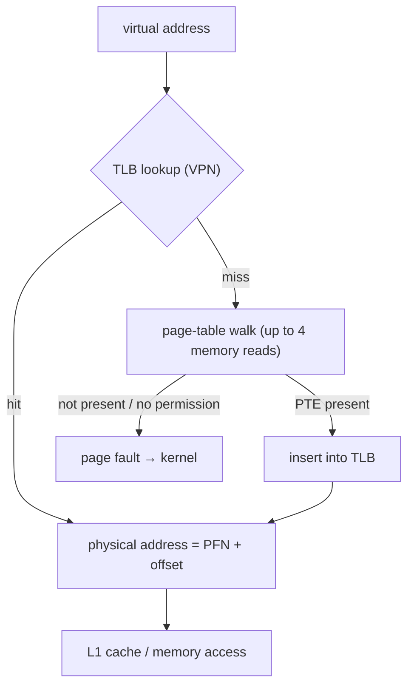

## Mental Model

A page-table walk is like looking up a word in a four-volume dictionary every time you read it. The **TLB** is the sticky note on your desk listing the last few dozen words you looked up. Because programs touch the same pages over and over (locality), the sticky note answers well over 99% of lookups, and the dictionary is rarely opened.

## Definition

The **Translation Lookaside Buffer (TLB)** is a small, fast, associative cache in the MMU that stores recent virtual-page-number → physical-frame-number translations (with permission bits). A **TLB hit** translates an address without accessing page tables; a **TLB miss** requires a page-table walk (by hardware on x86/ARM) and then inserts the translation.

## Why It Exists

With 4-level page tables, every memory access would need up to 4 extra memory reads just to translate its address — making memory effectively 5× slower. The TLB removes that overhead in the common case.

## How It Works



Typical sizes (modern x86 cores): an L1 data TLB with ~64–96 entries and a unified L2 TLB with ~1,500–3,000 entries, with separate structures for huge pages. Lookups are fully or highly associative and happen in parallel with the L1 cache index (virtually-indexed, physically-tagged caches).

### Effective access time (EAT)

Let `h` = TLB hit ratio, `m` = memory access time, `t` = TLB lookup time (often folded into 0), and a miss costs `k` page-table memory accesses.

```text
EAT = h × (t + m) + (1 − h) × (t + k·m + m)
```

**Classic textbook (single-level page table, k = 1):** m = 100 ns, t = 20 ns, h = 80%:

```text
EAT = 0.8 × (20 + 100) + 0.2 × (20 + 100 + 100) = 96 + 44 = 140 ns   (40% slowdown)
```

With h = 98%: `0.98 × 120 + 0.02 × 220 = 117.6 + 4.4 = 122 ns` (22% slowdown).

Modern variant (t ≈ 0, k = 4 levels, m = 100 ns, h = 99%): `0.99 × 100 + 0.01 × 500 = 104 ns`. Hit ratio dominates everything.

### TLB reach

**TLB reach = entries × page size.** 1,536 entries × 4 KB = 6 MB. A working set bigger than the TLB reach causes frequent misses even if all the data is in RAM and cache. With 2 MB huge pages, 1,536 entries cover 3 GB — the main reason databases and JVMs use huge pages ([Huge Pages & NUMA](lesson:os-hugepages-numa)).

## Internal Mechanism

### Context switches and the TLB

Translations belong to an address space. When the kernel switches to a different process (new CR3), old entries would be wrong for the new process. Two approaches:

- **Flush** all non-global TLB entries on every process switch (old x86 behavior). Kernel mappings are marked **global** so they survive. The new process starts with a cold TLB — part of the indirect cost of [context switches](lesson:os-context-switch).
- **Tag entries with an address-space ID** (ASID on ARM/MIPS, **PCID** on x86): entries from several processes coexist; a lookup only matches entries tagged with the current ID. No flush needed on switch.

Switching between threads of the same process doesn't change the address space, so the TLB stays valid.

### Keeping TLBs coherent: shootdowns

TLBs are per core and **not** kept coherent by hardware. When the kernel changes or removes a mapping that other cores might have cached (`munmap`, `mprotect`, page migration, COW break, page reclaim), it must:

1. update the PTE,
2. send an **inter-processor interrupt (IPI)** to every core that may cache the entry,
3. each core invalidates the entry (`invlpg`) and acknowledges,
4. the initiating core waits for all acknowledgements.

This **TLB shootdown** costs microseconds and interrupts other cores — one reason frequent `munmap` in a heavily multithreaded process (e.g., allocators returning memory, JVM heap resizing) can hurt performance.

:::depth{level=advanced}
### Multi-level TLBs and page-walk caches

CPUs have split L1 instruction/data TLBs, a larger shared L2 TLB (STLB), and **page-walk caches** that store upper-level page-table entries, so a miss often needs only the last-level lookup. Page-table entries themselves are cacheable in L1/L2/L3 — a "TLB miss" costs tens of cycles when page tables are cache-resident and hundreds when they must come from DRAM. Workloads with random access over huge memory (graph processing, hash joins, in-memory databases) suffer most; perf counters `dtlb_load_misses.walk_completed` reveal it.
:::

## Example

Measuring TLB impact with `perf`:

```bash
$ perf stat -e dTLB-loads,dTLB-load-misses,iTLB-load-misses ./random_lookup
  3,120,441,211  dTLB-loads
    412,339,002  dTLB-load-misses   # 13.2% of all dTLB loads — very high
```

Re-running with transparent huge pages enabled for the dataset often cuts misses by an order of magnitude and runtime by 10–30% for such workloads.

## Visualization

::viz{id=address-translation}

## Complexity & Performance

- TLB hit: effectively free (overlapped with cache access).
- TLB miss with page tables in cache: ~10–40 cycles; with page tables in DRAM: hundreds of cycles.
- Shootdown: µs per operation, scaling with the number of cores involved.

## Trade-offs

- **Bigger TLBs** improve hit rates but are slower and power-hungry — hence multi-level TLBs.
- **ASID/PCID tagging** avoids flushes but requires the OS to manage ID allocation and invalidation carefully.
- **Huge pages** multiply reach but bring fragmentation and allocation costs.

## Failure Modes

- **TLB thrashing**: random access over a working set far beyond TLB reach.
- **Shootdown storms**: frequent unmapping in processes with many threads spread across cores (visible as IPIs/`TLB shootdowns` in `/proc/interrupts`).
- **KPTI overhead**: Meltdown mitigation separates user and kernel page tables; without PCID support, every syscall flushed the TLB, costing up to ~30% on syscall-heavy workloads.

## In Production

- Databases (PostgreSQL shared buffers, Oracle SGA), JVMs with large heaps and in-memory analytics engines use huge pages to reduce TLB misses.
- Check `/proc/interrupts` for "TLB shootdowns" counts, and `perf` TLB counters when investigating unexplained CPU stalls on memory-heavy services.

## Deeper Connections

- The TLB is a cache with the same concepts as CPU caches (hit ratio, associativity, reach) and database buffer pools ([Caching Everywhere](lesson:x-caching-everywhere)).
- Its interaction with context switches explains why thread switches are cheaper than process switches ([Context Switching](lesson:os-context-switch)).

## Common Misconceptions

- **"The TLB caches data."** It caches *translations*; the data is cached in L1/L2/L3.
- **"A TLB miss means a page fault."** A miss means a page-table walk; a fault happens only if the PTE is not present or the access isn't permitted.
- **"Hardware keeps TLBs coherent automatically."** The OS must invalidate entries (shootdowns) when it changes mappings.

## Interview Questions

### [L1 · conceptual] What is a TLB and why is it needed?

A small, fast hardware cache of recent virtual-to-physical page translations in the MMU. Without it, every memory access would require one or more extra memory reads to walk the page table. With high hit ratios (> 99%), translation is effectively free.

### [L2 · numerical] Memory access takes 100 ns, TLB lookup 20 ns, hit ratio 80%, single-level page table. What is the effective access time?

Hit: 20 + 100 = 120 ns. Miss: 20 + 100 (page table) + 100 (data) = 220 ns. EAT = 0.8 × 120 + 0.2 × 220 = 96 + 44 = **140 ns**.

### [L2 · compare] What happens to the TLB on a context switch?

If switching to a different process, the old translations are invalid for the new address space: either the non-global TLB entries are flushed (cold TLB for the new process), or, with ASIDs/PCIDs, entries are tagged by address space and simply don't match, so no flush is needed. Switching between threads of the same process leaves the TLB valid.

### [L3 · how] What is a TLB shootdown and when does it occur?

When the kernel modifies or removes a page mapping that other CPUs might have cached in their TLBs (munmap, mprotect, page migration, reclaim, COW), it updates the PTE and sends inter-processor interrupts to those CPUs to invalidate the entry, waiting for acknowledgement. It's expensive and interrupts other cores, so frequent mapping changes in multithreaded processes can degrade performance.

### [L3 · numerical] A TLB has 64 entries and pages are 4 KB. What is the TLB reach, and what changes with 2 MB pages?

64 × 4 KB = **256 KB**. With 2 MB pages: 64 × 2 MB = **128 MB** — 512× more memory covered by the same entries.

### [L4 · debugging] An in-memory key-value service doing random lookups over 200 GB shows high CPU with low IPC, though cache miss rates look modest. What might you check?

TLB misses: random access over 200 GB with 4 KB pages vastly exceeds TLB reach, so most accesses incur page walks (page-table entries themselves may miss cache). Check `perf stat` dTLB-load-misses and page-walk cycles. Remedies: huge pages (THP or explicit hugetlbfs) for the data region, improving locality (grouping hot keys), and NUMA-local allocation.

## Practice

### [numeric 122 ±0.5] Memory access 100 ns, TLB lookup 20 ns, hit ratio 98%, single-level page table. Effective access time in ns?

:::answer
0.98 × (20 + 100) + 0.02 × (20 + 100 + 100) = 117.6 + 4.4 = **122 ns**.
:::

### [numeric 6] A TLB with 1,536 entries and 4 KB pages has a reach of how many MB?

:::answer
1,536 × 4 KB = 6,144 KB = **6 MB**.
:::

### [mcq] Which feature avoids flushing the TLB on every process switch?

- [ ] Multi-level page tables
- [x] Address-space identifiers (ASID/PCID)
- [ ] Demand paging
- [ ] Copy-on-write

Tagged entries let translations from multiple address spaces coexist.

## Quick Revision

- TLB = cache of VPN → PFN translations (+ permissions) in the MMU.
- Hit → no page-table access; miss → page walk (hardware) → maybe page fault.
- `EAT = h(t+m) + (1−h)(t + k·m + m)`; hit ratio dominates.
- **TLB reach** = entries × page size → huge pages boost reach.
- Process switch → flush or ASID/PCID tags; thread switch → TLB stays valid.
- **Shootdowns**: IPIs to invalidate stale entries on other cores after mapping changes.
