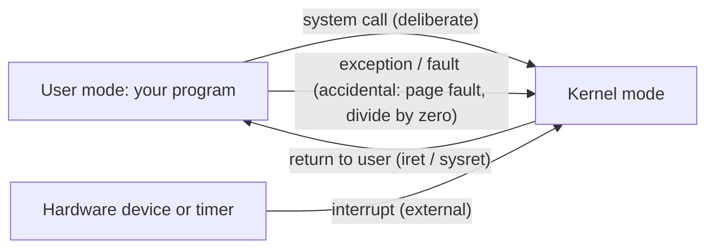

## Mental Model

Think of the operating system as three jobs held by one piece of software:

1. **Referee** — many programs want the same CPU, memory, disk and network card at the same time. The OS decides who gets what, for how long, and stops anyone from cheating.
2. **Illusionist** — it gives each program a simplified, private view of the machine: *its own* CPU (a process), *its own* huge contiguous memory (a virtual address space), *named, growable* storage (files), and *reliable pipes to other machines* (sockets). None of these exist in hardware.
3. **Glue** — it hides the mess of thousands of device models behind uniform interfaces, so `write()` works the same whether the bytes go to an SSD, a terminal or a network socket.

The part of the OS that does this with full hardware privileges is the **kernel**. Everything else — your code, the shell, even most "system" tools — runs in **user space** with restricted privileges and must *ask* the kernel to do anything powerful. That request is a **system call**.

## Definition

An **operating system** is the software layer that manages hardware resources and provides common services and abstractions to programs.

- The **kernel** is the core of the OS that runs in the CPU's privileged mode (**kernel mode**, ring 0 on x86). It can execute any instruction, access any memory and talk to devices.
- **User space** is where applications run, in **user mode**, where privileged instructions trap and memory access is limited to the process's own address space.
- A **system call** is the controlled entry point from user mode into the kernel (e.g., `read`, `write`, `open`, `fork`, `mmap`, `socket`).

## Why It Exists

**The problem.** One machine, many programs. They all want the CPU, all want memory, all want the disk — and none of them was written knowing the others exist.

**Without it.** Without an OS, every program would need to:

- contain drivers for every disk, network card and display it might meet;
- coordinate with every other program on the machine about which memory addresses it may use;
- trust every other program not to overwrite it, read its secrets, or hog the CPU forever.

That worked on single-purpose machines in the 1950s, when one program owned the whole machine. The moment machines were **shared** — first by batch jobs, then by timesharing users, now by hundreds of containers — three needs appeared that only a privileged referee can meet:

| Need | What the OS provides |
|---|---|
| **Protection** — programs must not harm each other or the system | Hardware-enforced privilege modes and per-process address spaces |
| **Multiplexing** — scarce hardware must be shared efficiently | CPU scheduling, memory allocation, I/O queuing |
| **Abstraction** — programmers must not deal with raw hardware | Processes, virtual memory, files, sockets |

**The idea.** You can't ask programs to behave — a buggy or hostile one simply won't. So the rules must be enforced by something programs *cannot* bypass: the hardware itself. The key insight is that **protection must be enforced by hardware, and only software running with special hardware privilege can configure that enforcement.** That software is the kernel.

**From idea to mechanism.** Everything in this lesson follows from that one decision:

- If only the kernel is privileged, programs need a way to *ask* it for things → **system calls**.
- If the kernel must stay in charge even when a program never asks → **timer interrupts** take the CPU back.
- If programs must not see each other's memory → **per-process address spaces**, configured by the kernel.
- If programs shouldn't each carry drivers → the kernel offers **abstractions** (files, sockets) once, for everyone.

:::callout[That's all it is]{type=insight}
The OS is the one program the hardware trusts. It uses that trust to share the machine fairly, keep programs from hurting each other, and replace raw devices with simple things like files and processes.
:::

## How It Works

### The privilege boundary

This is the hardware half of "protection must be enforced by hardware". Modern CPUs have at least two modes. In user mode, certain instructions are illegal (disabling interrupts, changing page tables, talking directly to I/O ports) and memory accesses are checked against page-table permissions. If a user program tries something illegal, the CPU raises an exception and jumps into the kernel, which usually kills the offender (`SIGSEGV`, `SIGILL`).

There are exactly three ways the CPU goes from user mode into the kernel:



Each entry jumps to a kernel-chosen address — the program cannot pick where in the kernel it lands. That single property is what makes the boundary safe. (If a program could jump to *any* kernel address, it could skip straight past the permission check inside `open()` — the privilege would be worthless.)

### The core abstractions

| Hardware reality | OS abstraction | Lesson |
|---|---|---|
| A few CPU cores | **Processes and threads** — each thinks it has a CPU | [Processes](lesson:os-processes), [Threads](lesson:os-threads) |
| Physical RAM, shared, fragmented | **Virtual address space** — private, contiguous, bigger than RAM | [Paging](lesson:os-paging) |
| Disk blocks | **Files and directories** — named, growable byte sequences | [Filesystems](lesson:os-filesystem-internals) |
| Network card sending frames | **Sockets** — reliable byte streams to other programs | [Sockets](lesson:cn-sockets) |
| Keyboards, disks, NICs, GPUs | **Uniform I/O via file descriptors** | [File descriptors](lesson:os-file-descriptors) |

### Resource management

The kernel continuously makes decisions:

- **CPU**: which runnable thread runs next and for how long ([scheduling](lesson:os-scheduling-basics)).
- **Memory**: which pages stay in RAM, which get evicted ([page replacement](lesson:os-page-replacement)).
- **I/O**: which disk request is serviced next, how much data to cache ([page cache](lesson:os-page-cache)).
- **Limits**: how many files a process may open, how much memory a container may use (rlimits, cgroups).

## Internal Mechanism

### What is "in the kernel"?

On Linux the kernel contains the scheduler, memory manager, virtual filesystem layer, filesystems (ext4, XFS), the full TCP/IP stack, device drivers, and security modules. All of it runs in one privileged address space.

### Kernel architectures

The question underneath this debate: *how much code should hold the master key?* Every line in kernel mode can crash or compromise the whole machine, so less is safer — but every boundary crossing between pieces costs time, so more is faster.

:::compare[Monolithic vs microkernel]
| | Monolithic (Linux, traditional Unix, Windows NT core is "hybrid") | Microkernel (seL4, QNX, MINIX 3) |
|---|---|---|
| What runs in kernel mode | Scheduler, memory, filesystems, drivers, network stack | Only IPC, scheduling, basic memory management |
| Drivers and filesystems | Kernel code | User-space server processes |
| Performance | Fast: subsystems call each other directly | Extra IPC and mode switches per operation |
| Fault isolation | A driver bug can crash the whole kernel | A crashed driver can be restarted |
| Where used | Servers, desktops, phones | Safety-critical and embedded (cars, avionics) |
:::

Linux mitigates the monolithic downside with **loadable kernel modules** (drivers loaded at runtime) and, increasingly, by moving logic out of the kernel (FUSE filesystems) or into sandboxed in-kernel programs (**eBPF**).

### The kernel is not a process

A common confusion: the kernel is not a separate program that runs "alongside" yours. It is code that is **mapped into every process's address space** (in the protected upper half) and runs **on behalf of** whichever process trapped into it, on that process's kernel stack. When your process calls `read()`, the CPU that was running your code simply switches to kernel mode and executes the kernel's `read` implementation. (Linux does also have **kernel threads** like `kswapd` for background work, which appear in `ps` in square brackets.)

## Example

Watch the user/kernel boundary with `strace`, which intercepts every system call a program makes:

```bash
$ strace -c ls > /dev/null
% time     seconds  usecs/call     calls    errors syscall
------ ----------- ----------- --------- --------- ----------------
 25.00    0.000040           4        10           mmap
 18.75    0.000030           3         9           openat
 12.50    0.000020           2         8           close
  9.38    0.000015          15         1           getdents64
  ...
100.00    0.000160                    58         3 total
```

Even `ls` makes ~58 system calls: mapping shared libraries (`mmap`), opening the directory (`openat`), reading entries (`getdents64`), writing the listing (`write`). Everything that touches the outside world goes through the kernel.

## Visualization

A single `write(fd, buf, n)` from Python, traced through the layers:

```text
 your code        f.write("hi")              user mode
 language runtime  → buffered io → write(3, "hi", 2)
 libc              → places syscall number in rax, args in rdi/rsi/rdx
 CPU               → `syscall` instruction: switch to kernel mode, jump to entry point
 ───────────────────────────────────────────────────── privilege boundary
 kernel            → sys_write: look up fd 3 in the process's file table
 VFS               → file is on ext4 → ext4_file_write_iter
 page cache        → copy "hi" into a cached page, mark it dirty
 kernel            → return 2 (bytes written)       kernel mode
 ─────────────────────────────────────────────────────
 CPU               → `sysret`: back to user mode       user mode
 (later)           writeback thread flushes dirty page to the SSD via the block layer + driver
```

## Complexity & Performance

- A system call costs roughly **50–200 ns** of pure overhead on modern x86 (mode switch, register save, security mitigations like KPTI can add more). That's cheap relative to disk or network I/O, but expensive relative to a function call (~1 ns). High-performance code **batches** syscalls (buffered I/O, `writev`, `io_uring`).
- The kernel itself is highly concurrent: it runs on all cores simultaneously, protected by fine-grained locks, per-CPU data and RCU.

## Trade-offs

- **Protection vs speed**: every boundary crossing costs time. Designs like kernel-bypass networking (DPDK) and `io_uring` exist precisely to cross the boundary less often.
- **Generality vs specialization**: the kernel's page cache and scheduler are tuned for typical workloads. Databases sometimes bypass them (`O_DIRECT`, their own buffer pool) because they know their access patterns better — see [Buffer Pool](lesson:db-buffer-pool).
- **Monolithic speed vs microkernel isolation**, as compared above.

## Failure Modes

- **Kernel panic** — a bug in kernel code (often a driver) has no one above it to catch the error; the whole machine stops.
- **Resource exhaustion** — file descriptors, PIDs, memory, or ephemeral ports run out. The OS enforces limits, and your program sees `EMFILE`, `EAGAIN`, `ENOMEM`.
- **Privilege escalation** — a kernel vulnerability lets user code run with kernel privileges; this is why kernel patches matter and why containers (which share one kernel) are a weaker boundary than VMs.

## In Production

- Every performance investigation eventually asks: is time spent in **user** code or in the **kernel** (`%usr` vs `%sys` in `top`/`mpstat`)? High `%sys` points at syscalls, page faults, network or lock contention in the kernel.
- Containers are *processes* with extra kernel features (namespaces, cgroups) — the kernel is shared. See [VMs & Containers](lesson:os-virtualization-containers).
- Tunables (`sysctl`) — e.g., `net.core.somaxconn`, `vm.swappiness`, `fs.file-max` — are knobs on the OS's resource-management decisions.

## Deeper Connections

- The privilege boundary reappears in networking (TLS termination, kernel TCP stack vs userspace QUIC) and databases (why PostgreSQL relies on the OS page cache while InnoDB manages its own buffer pool).
- The idea "give each client a private illusion, multiplex the real resource underneath" recurs everywhere: virtual memory, TCP connections over one link, database transactions over shared data (isolation), VMs over one host.

## Common Misconceptions

- **"The OS is the GUI."** The desktop is a user-space program. Servers run the same kernel with no GUI at all.
- **"The kernel is a process that runs in the background."** Kernel code runs in the context of whatever process trapped into it (plus some kernel threads).
- **"System calls are just function calls."** They cross a hardware privilege boundary, switch stacks, and are hundreds of times more expensive than a function call.
- **"Root runs in kernel mode."** Root is a *user-space* privilege level checked by the kernel; root processes still execute in user mode and still must use system calls.

## Interview Questions

### [L1 · conceptual] What is an operating system and what are its main responsibilities?

Software that manages hardware and provides services to programs. Main responsibilities: **process management** (creation, scheduling, termination), **memory management** (allocation, virtual memory, protection), **storage** (filesystems), **I/O and device management** (drivers, buffering), **networking**, and **protection/security** (isolation between programs and users). It acts as a resource manager (who gets what) and an extended machine (clean abstractions over raw hardware).

### [L1 · compare] What is the difference between kernel mode and user mode?

Kernel mode is the CPU's privileged mode: all instructions and all memory are accessible, including device I/O and page-table manipulation. User mode restricts privileged instructions and limits memory to the process's own mapped pages. Applications run in user mode and enter kernel mode only through system calls, exceptions or interrupts, each of which jumps to a kernel-defined entry point. The split lets the kernel enforce isolation: a buggy app can crash itself but not the machine.

### [L1 · conceptual] What is a system call? Give examples.

A controlled request from a user program to the kernel for a privileged service. The program places a syscall number and arguments in registers and executes a trap instruction (`syscall` on x86-64); the CPU switches to kernel mode and jumps to the kernel's syscall handler. Examples: `open`, `read`, `write`, `close`, `fork`, `execve`, `mmap`, `socket`, `connect`, `exit`.

### [L2 · compare] Compare monolithic kernels and microkernels.

A monolithic kernel runs most OS services — scheduler, memory manager, filesystems, drivers, networking — in one privileged address space: fast (direct function calls) but a bug anywhere can crash everything. A microkernel keeps only minimal mechanisms (IPC, scheduling, memory basics) in the kernel and runs drivers and filesystems as user-space servers: better isolation and verifiability, but more IPC and mode switches. Linux is monolithic with loadable modules; QNX and seL4 are microkernels; Windows NT and macOS XNU are hybrids.

### [L2 · why] Why can't a user program just disable interrupts to avoid being preempted?

Disabling interrupts is a privileged instruction (`cli` on x86). In user mode it causes a general-protection fault and the kernel kills the process. If users could disable interrupts, one program could monopolize the CPU forever — the timer interrupt is how the OS regains control for preemptive scheduling.

### [L3 · what-if] What happens if a user program tries to write to a kernel memory address?

The address is mapped in the page tables but marked supervisor-only. The MMU detects a user-mode access to a supervisor page and raises a page-fault exception. The kernel's fault handler sees an access violation (not a legitimate demand-paging fault) and sends `SIGSEGV` to the process, which by default terminates it. The kernel is untouched.

### [L3 · debugging] top shows 60% sys CPU time on a busy API server. What might be happening?

Time is being spent executing kernel code on behalf of processes. Candidates: very frequent small system calls (unbuffered logging, tiny reads/writes), heavy networking (packet processing, many short connections), lock contention in the kernel (e.g., on a shared file or mm), page faults from memory churn, or context-switch storms from too many threads. Next steps: `perf top` to see hot kernel functions, `strace -c -f -p <pid>` to count syscalls, `vmstat 1` for context switches and faults, `pidstat -w` for per-process switch rates.

### [L4 · design] Would you rather run untrusted tenant code in containers or VMs, and why?

VMs give a stronger boundary: each tenant has its own kernel, and escaping requires a hypervisor bug (small attack surface). Containers share the host kernel, so any kernel vulnerability reachable via syscalls can compromise the host and other tenants. For untrusted multi-tenant code, use VMs or sandboxed runtimes (gVisor intercepts syscalls in a user-space kernel; Firecracker microVMs give VM isolation with container-like startup). Containers remain great for trusted workloads where density and speed matter. The trade-off is isolation strength vs overhead and startup time.

## Practice

### [mcq] Which of these requires a system call?

- [ ] Adding two integers in a local variable
- [ ] Calling a function in the same program
- [x] Reading bytes from a file
- [ ] Allocating an object from a heap region that malloc already obtained

Anything that touches devices, other processes, or the kernel's resource tables needs the kernel. Note: `malloc` usually needs *no* syscall when it can satisfy a request from memory it already obtained with `brk`/`mmap`.

### [mcq] A process is killed with SIGSEGV. Which mechanism most directly caused the kernel to be involved?

- [ ] A system call
- [x] A CPU exception (page fault) on an invalid access
- [ ] A timer interrupt
- [ ] A signal handler

An invalid memory access makes the MMU raise an exception, trapping into the kernel, which decides the access is illegal and delivers SIGSEGV.

## Quick Revision

- OS = **referee** (sharing), **illusionist** (abstractions), **glue** (uniform device interfaces).
- **Kernel mode** = full privilege; **user mode** = restricted. Enforced by the CPU.
- Only three ways into the kernel: **system call**, **exception/fault**, **interrupt** — always to kernel-chosen entry points.
- Core abstractions: **process/thread** (CPU), **virtual address space** (memory), **file** (storage), **socket** (network), **file descriptor** (uniform I/O).
- Monolithic (Linux) = fast, less isolated; microkernel = isolated, more IPC.
- Syscall ≈ 50–200 ns overhead vs ~1 ns function call → batch them.
- Root ≠ kernel mode; containers share one kernel, VMs don't.
