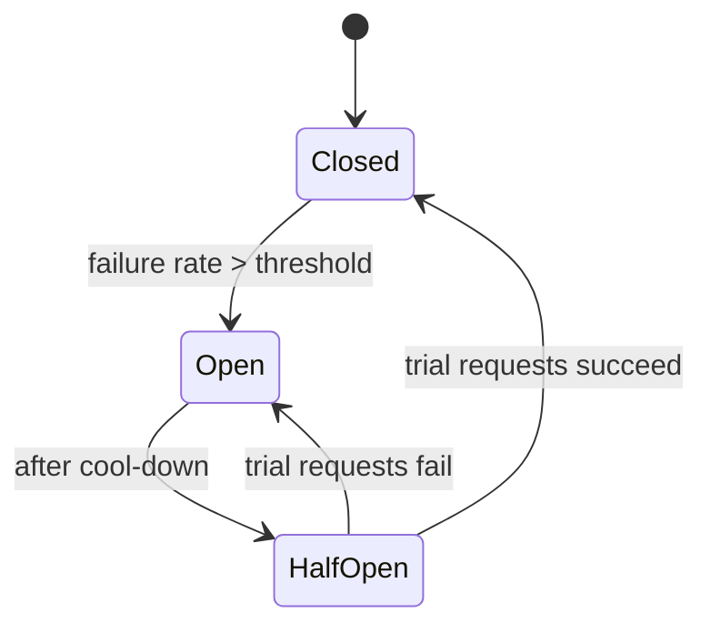

## Mental Model

Every server is a **queue in front of a limited set of workers** (threads, event-loop time, DB connections, CPU cores). While work arrives slower than it's completed, queues stay short and latency is just service time. As arrival rate approaches capacity, queues grow **non-linearly**: at 50% utilization a request waits about as long as it's served; at 90% it waits ~9× longer; at 99%, ~99× longer. Past 100%, the queue grows without bound — every request times out, and the work spent on them is wasted.

Overload is dangerous because it **feeds itself**: slow responses cause timeouts, timeouts cause retries, retries add load. The defenses are about keeping queues bounded and refusing work early.

## Definition

- **Utilization (ρ)**: fraction of time workers are busy = arrival rate × service time / workers.
- **Little's law**: items in the system = arrival rate × time in system (L = λW) — holds for any stable queue.
- **Backpressure**: a slow consumer signals producers to slow down (bounded buffers that block/reject, TCP flow control, reactive streams).
- **Load shedding / admission control**: rejecting excess work quickly (HTTP 503/429) instead of queueing it.
- **Retry storm**: retries multiplying load on an already overloaded service.
- **Circuit breaker**: stop calling a failing dependency for a while; fail fast.
- **Bulkhead**: isolate resources (pools, threads) per dependency/feature so one failure can't consume everything.
- **Cascading failure**: overload in one component propagating to others.

## Why It Exists

Capacity is always finite, and traffic spikes, slow dependencies, bad deploys and failovers regularly push some component past it. Systems that degrade gracefully (serve fewer requests, but serve them) stay up; systems that queue unboundedly and retry blindly collapse — often long after the original trigger is gone (metastable failure).

## How It Works

### The latency curve

For a single-server queue with random arrivals (M/M/1), average time in system = service time / (1 − ρ):

| Utilization ρ | Wait multiplier (time in system ÷ service time) |
|---|---|
| 50% | 2× |
| 80% | 5× |
| 90% | 10× |
| 95% | 20× |
| 99% | 100× |

Multi-worker systems are better but have the same knee. Practical rule: plan capacity so that normal peaks stay below ~70–80% of the bottleneck resource.

### Little's law in capacity planning

A service receiving 1,000 req/s with 50 ms latency has 50 requests in flight. If latency rises to 2 s (a slow dependency), in-flight requests rise to 2,000 — exceeding thread pools, connection pools and memory. **Latency increases are concurrency increases**, which is how a slow dependency exhausts resources upstream ([Connection Management](lesson:x-connection-management)).

### Bounded queues and backpressure

An unbounded queue converts overload into unbounded latency and memory growth (and, eventually, OOM). Bounded queues force a decision: block the producer (backpressure), or reject (shed load). Examples: thread pools with bounded task queues and a rejection policy ([Thread Pools](lesson:os-thread-pools)); TCP's receive window ([Flow Control](lesson:cn-tcp-flow-control)); the kernel's listen backlog; a pool's checkout timeout.

### Load shedding

Reject early and cheaply — at the edge, before doing expensive work:

- Return 503/429 when queue length or in-flight count exceeds a threshold (concurrency limits, adaptive limits that track latency).
- Prioritize: shed low-value traffic (analytics beacons, prefetches) before checkout requests.
- Drop requests whose client has already given up (deadline propagation: don't process a request whose 2 s client timeout already passed).

### Rate limiting: saying no precisely

Load shedding decides *how many* requests to drop; a rate limiter decides *whose* requests to drop, usually per API key, user or IP.

| Algorithm | How it works | Burst behavior | Cost |
|---|---|---|---|
| **Fixed window** | count requests per key per clock minute; reject above N | allows 2N across a window boundary | one counter + TTL |
| **Sliding window log** | store timestamps, count those within the last T | exact | memory ∝ requests |
| **Sliding window counter** | weight the previous window's count by overlap | close to exact | two counters |
| **Token bucket** | tokens refill at rate r up to capacity b; each request takes one | allows bursts up to b, long-run rate r | two numbers (tokens, last refill) |
| **Leaky bucket (queue)** | requests queue and drain at a constant rate | smooths bursts, adds latency | a bounded queue |

**Token bucket is the usual default**: it is cheap, allows short bursts (which real clients produce) and enforces an average rate. In Redis the state is one hash per key updated by a small Lua
script, so the check is atomic and ~0.2 ms ([Redis & Caching](lesson:db-redis-caching)).

Distributed rate limiting adds a choice: exact global limits need a shared store on every request (latency, a hard dependency), while per-instance limits of N/instances are cheaper but drift
when traffic is uneven. Many systems use local token buckets synchronized periodically — approximate, but never a single point of failure.

Tell clients what happened: **429 Too Many Requests** with `Retry-After`, and headers for the remaining quota. A limiter that drops silently turns into a retry storm.

### Timeouts and retries done right

- Every remote call needs a timeout ([Connection Management](lesson:x-connection-management)).
- Retries only for idempotent operations, with **exponential backoff and jitter**, a small max attempt count, and a **retry budget** (e.g., retries ≤ 10% of requests).
- Retry at one layer only: if 3 layers each retry 3 times, one user request becomes 27 calls to the bottom service.

### Circuit breakers and bulkheads

- **Circuit breaker**: while open, calls fail instantly (or use a fallback — cached data, default response), protecting both the caller's resources and the struggling dependency.
- **Bulkheads**: separate thread/connection pools per dependency, so the slow recommendations service can exhaust *its* pool but not the checkout path's.

## Internal Mechanism

:::depth{level=advanced}
### Anatomy of a cascading failure

1. The database slows (a bad query plan).
2. App request latency rises → in-flight requests rise (Little's law) → thread and connection pools exhaust.
3. Health checks time out → the load balancer marks instances unhealthy → remaining instances receive more traffic → they fail too.
4. Clients and upstream services retry → load multiplies.
5. Autoscaling adds instances → each opens new DB connections → the database gets *more* overloaded (connection storm).
6. Even after the bad query is fixed, the retry backlog and cold caches keep the system overloaded — a **metastable** state that needs load to be shed to recover.

Defenses map to each step: query timeouts (1), bounded pools + load shedding (2), health checks that test the instance itself not its dependencies (3), retry budgets + jitter (4), pooled DB access and scaling limits (5), and the ability to shed traffic to recover (6).

### Event loops under overload

A single-threaded event loop's "queue" is its backlog of ready events and pending callbacks; one CPU-heavy task delays all others (event-loop lag). Overload manifests as rising loop lag, not thread exhaustion — measure it and shed load when it grows ([epoll & Event Loops](lesson:os-epoll-event-loops)).

### Thundering herds

Many clients waking up at once — cache expiry of a hot key ([Redis & Caching](lesson:db-redis-caching)), reconnects after a failover ([Failover](lesson:db-failover)), cron jobs at :00, all threads woken for one accept — create short, severe overloads. Jitter and coalescing are the cure.
:::

## Example

A product API normally at 60% CPU; a marketing push doubles traffic:

| Without protection | With protection |
|---|---|
| CPU 100%, latency 50 ms → 4 s | concurrency limit rejects ~20% with 503 quickly |
| Client timeouts at 2 s → retries → effective load 3× | clients back off with jitter; retry budget caps retries |
| Health checks fail → instances removed → remaining ones die | health checks are cheap and local; instances stay in rotation |
| Autoscaler adds 3× pods → DB connections exhausted | pooler caps DB connections; scaling limited by DB capacity |
| Outage lasts an hour after the spike ends | recommendations endpoint shed first (bulkhead); checkout stays fast; recovers when load drops |

Serving 80% of requests fast beats serving 0% slowly.

## Complexity & Performance

Latency ≈ service time / (1 − ρ) near saturation; throughput plateaus at capacity and then *falls* (goodput collapse) when time is wasted on requests that time out.

## Trade-offs

- Rejecting requests (visible errors) vs queueing them (invisible until everything times out).
- Aggressive timeouts (fast failure, possible false failures) vs lenient ones (resource tie-up).
- Retries improve success for transient faults but amplify overload — budget them.
- Headroom costs money; running hot costs outages.

## Failure Modes

- Unbounded queues (thread pools, message buffers) → memory exhaustion.
- Missing timeouts → resources held by dead calls.
- Synchronized retries (no jitter) → periodic load spikes.
- Health checks that depend on downstream services → one DB blip removes all instances.
- Autoscaling the wrong tier (stateless apps) against a fixed bottleneck (the DB).

## In Production

- Load test to find the knee; set alerts on saturation signals (queue length, pool waits, loop lag, CPU run queue), not just errors.
- Implement: per-dependency timeouts, retry budgets, circuit breakers, bulkheads, concurrency limits at the edge, graceful degradation paths (serve cached/stale data — [Caching Everywhere](lesson:x-caching-everywhere)).
- Chaos drills: inject latency into a dependency and watch whether the system sheds load or collapses.

## Deeper Connections

- Scheduling and queueing are the same mathematics ([Scheduling Basics](lesson:os-scheduling-basics)); producer–consumer with bounded buffers is backpressure in miniature ([Classic Sync Problems](lesson:os-classic-sync-problems)).
- TCP congestion control is backpressure for networks: back off on loss, probe gently ([Congestion Control](lesson:cn-tcp-congestion-control)).

## Common Misconceptions

- **"We're at 85% CPU, so 15% headroom."** Near saturation, latency is already many times the service time, and bursts push you over.
- **"Retries make systems more reliable."** Uncontrolled retries make overload worse.
- **"Autoscaling solves overload."** It's slow (minutes), and it can't scale a shared bottleneck like the database.

## Interview Questions

### [L2 · why] Why does latency increase sharply as a server approaches full utilization?

Requests arrive randomly, so near capacity, bursts form queues that the server can't drain before more arrive. Waiting time grows roughly as 1/(1 − utilization): at 90% busy the average request waits several times its service time, and at 99% about a hundred times. Beyond 100%, queues grow without bound.

### [L2 · compare] Circuit breaker vs retry vs timeout — what does each do?

A timeout bounds how long a caller waits for one attempt, freeing resources. A retry re-attempts transient failures (for idempotent operations, with backoff and jitter). A circuit breaker tracks failures and, above a threshold, stops calling the dependency for a while, failing fast or using a fallback — protecting the caller's resources and giving the dependency room to recover.

### [L3 · incident] A slow recommendations service caused your whole storefront to go down. Explain the mechanism and the fixes.

Page handlers called recommendations synchronously while holding a worker thread (and maybe a DB connection). When its latency jumped, in-flight requests grew (Little's law), exhausting the shared thread/connection pools; all endpoints queued behind them, health checks failed, and retries added load. Fixes: tight timeouts, circuit breaker with a fallback (render without recommendations), a separate bulkhead pool for that dependency, making it asynchronous/optional, retry budgets, and load shedding at the edge.

### [L2 · design] Design a rate limiter for a public API: 100 requests per minute per API key.

:::answer
Token bucket per key: capacity 100, refill 100/60 tokens per second. State is two numbers (tokens, last refill timestamp) in Redis, updated by an atomic Lua script so concurrent requests
can't double-spend; the key expires after inactivity. Reject with 429 and `Retry-After` plus remaining-quota headers. The bucket allows a short burst (up to 100) while holding the long-run
average, which matches how clients actually behave; a fixed window would let 200 requests through across a window boundary.

Scaling: a shared Redis gives exact limits but adds a round trip and a dependency on every request — so put the limiter at the edge/gateway, and for very high rates use per-instance buckets
of 100/instances with periodic synchronization, accepting approximate limits. Mention tiers (per key, per IP, per endpoint cost) and that limiting must be cheaper than the work it protects.
:::

### [L3 · design] How would you design an API to degrade gracefully under 3× normal load?

Concurrency limits or adaptive admission control at the edge that reject excess requests quickly (429/503 with Retry-After); priority classes so critical paths (checkout, login) are protected and optional features are shed first; bounded queues and pools everywhere; per-dependency timeouts, circuit breakers and bulkheads; caching with stale-while-revalidate for read paths; client guidance to back off with jitter; and capacity headroom plus autoscaling for sustained growth.

## Practice

### [numeric 10] A single-worker queue with random arrivals runs at 90% utilization. Using time-in-system ≈ service time / (1 − ρ), how many times the service time does an average request spend in the system?

:::answer
1 / (1 − 0.9) = **10×** the service time: a 10 ms operation takes ~100 ms on average.
:::

### [numeric 27] Three layers each retry a failed call up to 2 extra times (3 attempts per layer). In the worst case, how many calls reach the bottom service for one user request?

:::answer
Attempts multiply across layers: 3 × 3 × 3 = **27** calls. Retry at one layer only, with budgets.
:::

## Quick Revision

- Latency ≈ service/(1 − ρ): the knee is real; keep peaks below ~70–80%.
- Little's law: latency ↑ ⇒ in-flight ↑ ⇒ pools exhaust. Slow dependencies take down callers.
- Bound every queue; backpressure or shed load early (429/503), by priority.
- Rate limit per key: token bucket (bursty, cheap) or sliding window; answer with 429 + Retry-After.
- Timeouts everywhere; retries only idempotent, with backoff + jitter + budgets, at one layer.
- Circuit breakers, bulkheads, graceful degradation; beware thundering herds, connection storms and metastable failures.
